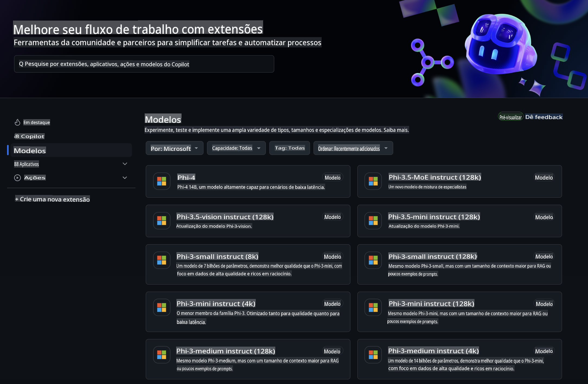
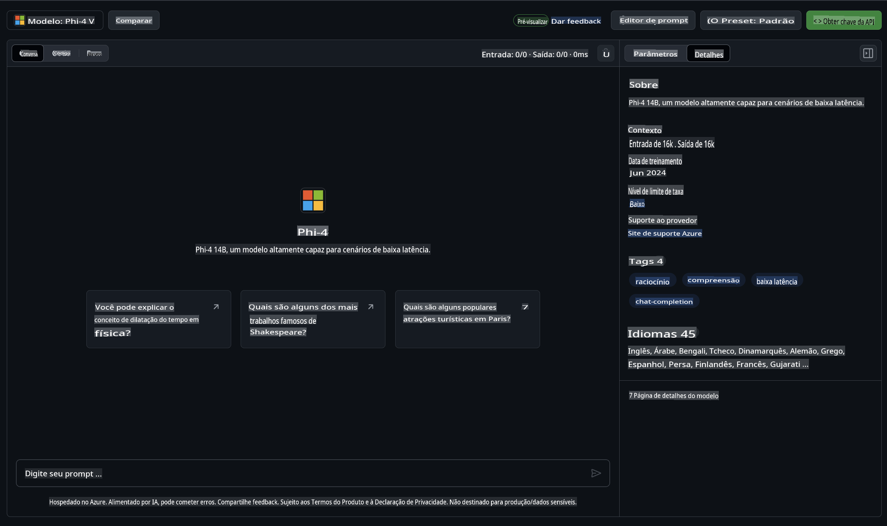
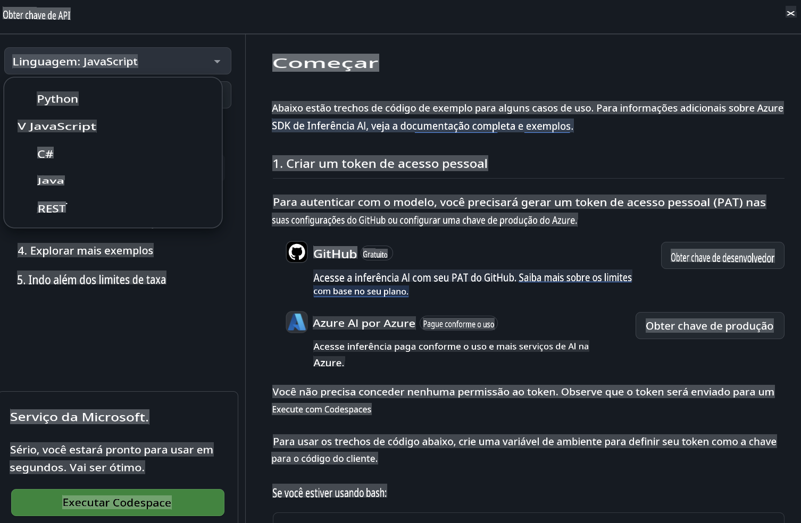
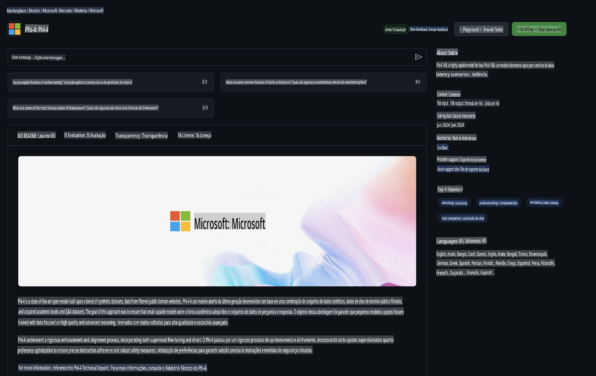

## Família Phi no GitHub Models

Bem-vindo ao [GitHub Models](https://github.com/marketplace/models)! Estamos prontos para você explorar os Modelos de IA hospedados no Azure AI.



Para mais informações sobre os Modelos disponíveis no GitHub Models, confira o [GitHub Model Marketplace](https://github.com/marketplace/models).

## Modelos Disponíveis

Cada modelo possui um playground dedicado e código de exemplo.



### Família Phi no Catálogo de Modelos do GitHub

- [Phi-4](https://github.com/marketplace/models/azureml/Phi-4)

- [Phi-3.5-MoE instruct (128k)](https://github.com/marketplace/models/azureml/Phi-3-5-MoE-instruct)

- [Phi-3.5-vision instruct (128k)](https://github.com/marketplace/models/azureml/Phi-3-5-vision-instruct)

- [Phi-3.5-mini instruct (128k)](https://github.com/marketplace/models/azureml/Phi-3-5-mini-instruct)

- [Phi-3-Medium-128k-Instruct](https://github.com/marketplace/models/azureml/Phi-3-medium-128k-instruct)

- [Phi-3-medium-4k-instruct](https://github.com/marketplace/models/azureml/Phi-3-medium-4k-instruct)

- [Phi-3-mini-128k-instruct](https://github.com/marketplace/models/azureml/Phi-3-mini-128k-instruct)

- [Phi-3-mini-4k-instruct](https://github.com/marketplace/models/azureml/Phi-3-mini-4k-instruct)

- [Phi-3-small-128k-instruct](https://github.com/marketplace/models/azureml/Phi-3-small-128k-instruct)

- [Phi-3-small-8k-instruct](https://github.com/marketplace/models/azureml/Phi-3-small-8k-instruct)

## Primeiros Passos

Há alguns exemplos básicos prontos para você executar. Você pode encontrá-los no diretório de exemplos. Se quiser ir direto para sua linguagem favorita, os exemplos estão disponíveis nos seguintes idiomas:

- Python
- JavaScript
- C#
- Java
- cURL

Também há um ambiente dedicado no Codespaces para executar os exemplos e modelos.



## Código de Exemplo

Abaixo estão trechos de código de exemplo para alguns casos de uso. Para mais informações sobre o Azure AI Inference SDK, consulte a documentação completa e os exemplos.

## Configuração

1. Crie um token de acesso pessoal  
   Você não precisa conceder permissões ao token. Observe que o token será enviado para um serviço da Microsoft.

Para usar os trechos de código abaixo, crie uma variável de ambiente para definir seu token como a chave para o código do cliente.

Se você estiver usando bash:  
```
export GITHUB_TOKEN="<your-github-token-goes-here>"
```  
Se estiver no PowerShell:  

```
$Env:GITHUB_TOKEN="<your-github-token-goes-here>"
```  

Se estiver usando o prompt de comando do Windows:  

```
set GITHUB_TOKEN=<your-github-token-goes-here>
```  

## Exemplo em Python

### Instalar dependências  
Instale o Azure AI Inference SDK usando pip (Requer: Python >=3.8):  

```
pip install azure-ai-inference
```  

### Executar um exemplo básico de código  

Este exemplo demonstra uma chamada básica à API de conclusão de chat. Ele utiliza o endpoint de inferência do modelo GitHub AI e seu token do GitHub. A chamada é síncrona.

```python
import os
from azure.ai.inference import ChatCompletionsClient
from azure.ai.inference.models import SystemMessage, UserMessage
from azure.core.credentials import AzureKeyCredential

endpoint = "https://models.inference.ai.azure.com"
model_name = "Phi-4"
token = os.environ["GITHUB_TOKEN"]

client = ChatCompletionsClient(
    endpoint=endpoint,
    credential=AzureKeyCredential(token),
)

response = client.complete(
    messages=[
        UserMessage(content="I have $20,000 in my savings account, where I receive a 4% profit per year and payments twice a year. Can you please tell me how long it will take for me to become a millionaire? Also, can you please explain the math step by step as if you were explaining it to an uneducated person?"),
    ],
    temperature=0.4,
    top_p=1.0,
    max_tokens=2048,
    model=model_name
)

print(response.choices[0].message.content)
```  

### Executar uma conversa de múltiplas interações  

Este exemplo demonstra uma conversa de múltiplas interações com a API de conclusão de chat. Ao usar o modelo em um aplicativo de chat, você precisará gerenciar o histórico dessa conversa e enviar as mensagens mais recentes ao modelo.

```
import os
from azure.ai.inference import ChatCompletionsClient
from azure.ai.inference.models import AssistantMessage, SystemMessage, UserMessage
from azure.core.credentials import AzureKeyCredential

token = os.environ["GITHUB_TOKEN"]
endpoint = "https://models.inference.ai.azure.com"
# Replace Model_Name
model_name = "Phi-4"

client = ChatCompletionsClient(
    endpoint=endpoint,
    credential=AzureKeyCredential(token),
)

messages = [
    SystemMessage(content="You are a helpful assistant."),
    UserMessage(content="What is the capital of France?"),
    AssistantMessage(content="The capital of France is Paris."),
    UserMessage(content="What about Spain?"),
]

response = client.complete(messages=messages, model=model_name)

print(response.choices[0].message.content)
```  

### Transmitir a saída  

Para uma melhor experiência do usuário, você vai querer transmitir a resposta do modelo para que o primeiro token apareça rapidamente, evitando longas esperas por respostas completas.

```
import os
from azure.ai.inference import ChatCompletionsClient
from azure.ai.inference.models import SystemMessage, UserMessage
from azure.core.credentials import AzureKeyCredential

token = os.environ["GITHUB_TOKEN"]
endpoint = "https://models.inference.ai.azure.com"
# Replace Model_Name
model_name = "Phi-4"

client = ChatCompletionsClient(
    endpoint=endpoint,
    credential=AzureKeyCredential(token),
)

response = client.complete(
    stream=True,
    messages=[
        SystemMessage(content="You are a helpful assistant."),
        UserMessage(content="Give me 5 good reasons why I should exercise every day."),
    ],
    model=model_name,
)

for update in response:
    if update.choices:
        print(update.choices[0].delta.content or "", end="")

client.close()
```  

## Uso GRATUITO e Limites de Taxa para GitHub Models



Os [limites de taxa para o playground e o uso gratuito da API](https://docs.github.com/en/github-models/prototyping-with-ai-models#rate-limits) foram projetados para ajudar você a experimentar modelos e prototipar seu aplicativo de IA. Para uso além desses limites, e para escalar seu aplicativo, você deve provisionar recursos de uma conta Azure e autenticar a partir dela em vez de usar seu token de acesso pessoal do GitHub. Não é necessário alterar nada no seu código. Use este link para descobrir como ir além dos limites da camada gratuita no Azure AI.

### Avisos

Lembre-se de que, ao interagir com um modelo, você está experimentando com IA, então erros de conteúdo são possíveis.

O recurso está sujeito a vários limites (incluindo solicitações por minuto, solicitações por dia, tokens por solicitação e solicitações simultâneas) e não foi projetado para casos de uso em produção.

O GitHub Models utiliza o Azure AI Content Safety. Esses filtros não podem ser desativados como parte da experiência do GitHub Models. Se você decidir empregar modelos por meio de um serviço pago, configure seus filtros de conteúdo para atender às suas necessidades.

Este serviço está sujeito aos Termos de Pré-lançamento do GitHub.

**Aviso Legal**:  
Este documento foi traduzido utilizando serviços de tradução baseados em IA. Embora nos esforcemos para alcançar precisão, esteja ciente de que traduções automatizadas podem conter erros ou imprecisões. O documento original em seu idioma nativo deve ser considerado a fonte oficial. Para informações críticas, recomenda-se a tradução profissional realizada por humanos. Não nos responsabilizamos por quaisquer mal-entendidos ou interpretações incorretas decorrentes do uso desta tradução.