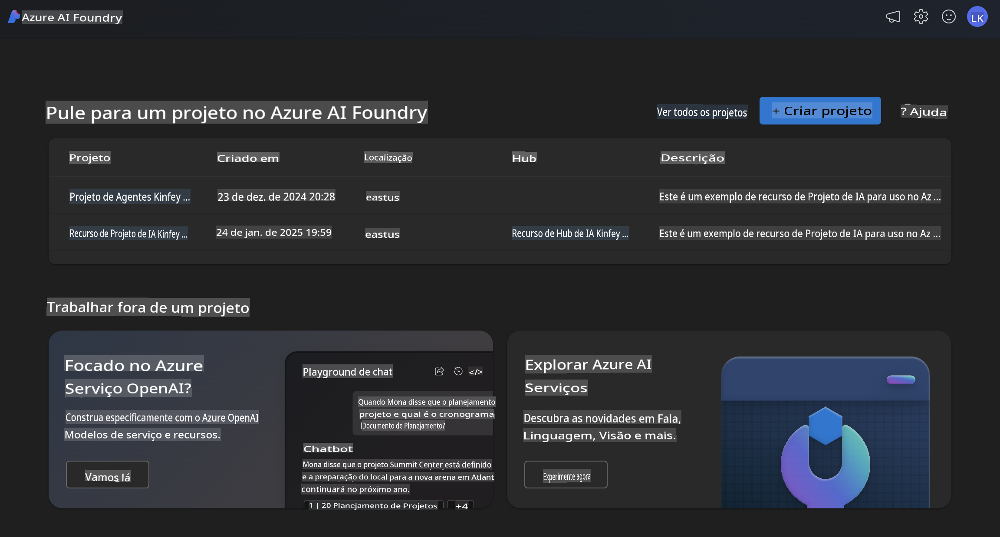
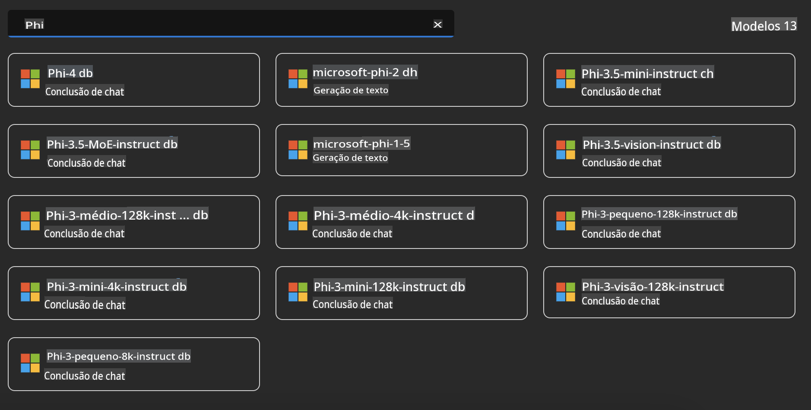
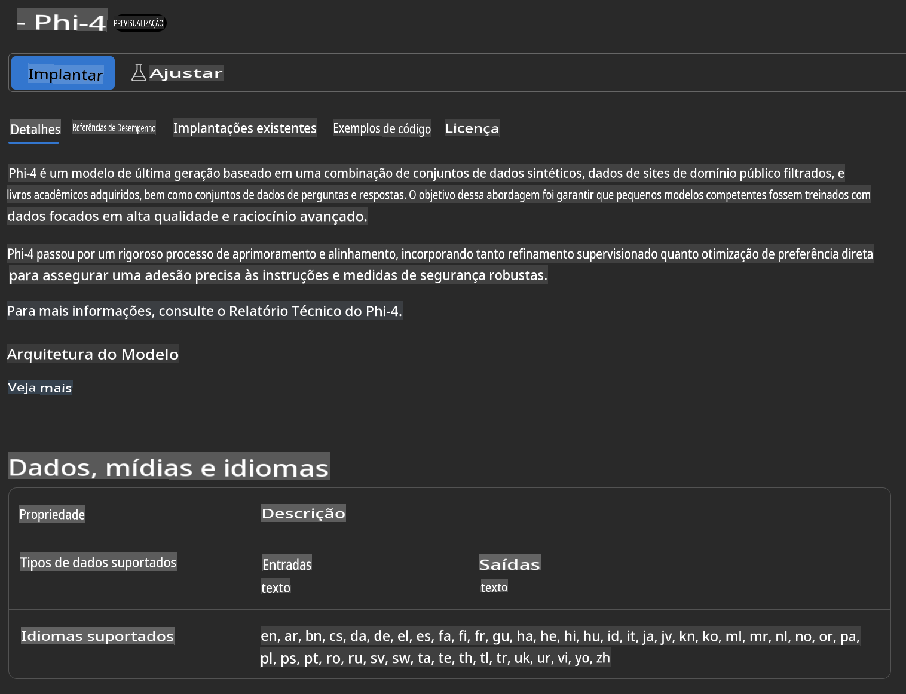
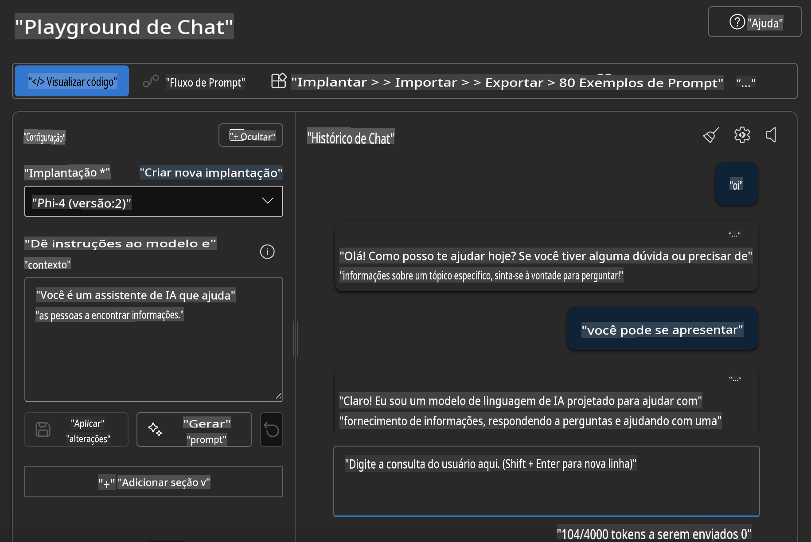

## Família Phi no Azure AI Foundry

[Azure AI Foundry](https://ai.azure.com) é uma plataforma confiável que capacita os desenvolvedores a impulsionarem a inovação e moldarem o futuro com IA de forma segura, protegida e responsável.

[Azure AI Foundry](https://ai.azure.com) foi projetado para que os desenvolvedores possam:

- Construir aplicações de IA generativa em uma plataforma de nível empresarial.
- Explorar, construir, testar e implantar utilizando ferramentas de IA avançadas e modelos de ML, baseados em práticas de IA responsável.
- Colaborar com uma equipe ao longo de todo o ciclo de vida do desenvolvimento de aplicações.

Com o Azure AI Foundry, você pode explorar uma ampla variedade de modelos, serviços e recursos, e começar a criar aplicações de IA que melhor atendam aos seus objetivos. A plataforma Azure AI Foundry facilita a escalabilidade para transformar provas de conceito em aplicações de produção completas com facilidade. O monitoramento contínuo e o refinamento suportam o sucesso a longo prazo.



Além de usar o Azure AOAI Service no Azure AI Foundry, você também pode utilizar modelos de terceiros no Catálogo de Modelos do Azure AI Foundry. Essa é uma boa opção caso você queira usar o Azure AI Foundry como sua plataforma de soluções de IA.

Podemos implantar rapidamente os Modelos da Família Phi por meio do Catálogo de Modelos no Azure AI Foundry.



### **Implantar o Phi-4 no Azure AI Foundry**



### **Testar o Phi-4 no Azure AI Foundry Playground**



### **Executando Código Python para chamar o Azure AI Foundry Phi-4**

```python

import os  
import base64
from openai import AzureOpenAI  
from azure.identity import DefaultAzureCredential, get_bearer_token_provider  
        
endpoint = os.getenv("ENDPOINT_URL", "Your Azure AOAI Service Endpoint")  
deployment = os.getenv("DEPLOYMENT_NAME", "Phi-4")  
      
token_provider = get_bearer_token_provider(  
    DefaultAzureCredential(),  
    "https://cognitiveservices.azure.com/.default"  
)  
  
client = AzureOpenAI(  
    azure_endpoint=endpoint,  
    azure_ad_token_provider=token_provider,  
    api_version="2024-05-01-preview",  
)  
  

chat_prompt = [
    {
        "role": "system",
        "content": "You are an AI assistant that helps people find information."
    },
    {
        "role": "user",
        "content": "can you introduce yourself"
    }
] 
    
# Include speech result if speech is enabled  
messages = chat_prompt 

completion = client.chat.completions.create(  
    model=deployment,  
    messages=messages,
    max_tokens=800,  
    temperature=0.7,  
    top_p=0.95,  
    frequency_penalty=0,  
    presence_penalty=0,
    stop=None,  
    stream=False  
)  
  
print(completion.to_json())  

```

**Aviso Legal**:  
Este documento foi traduzido utilizando serviços de tradução automática baseados em IA. Embora nos esforcemos para alcançar precisão, esteja ciente de que traduções automáticas podem conter erros ou imprecisões. O documento original em seu idioma nativo deve ser considerado a fonte oficial. Para informações críticas, recomenda-se uma tradução profissional realizada por humanos. Não nos responsabilizamos por quaisquer mal-entendidos ou interpretações equivocadas decorrentes do uso desta tradução.