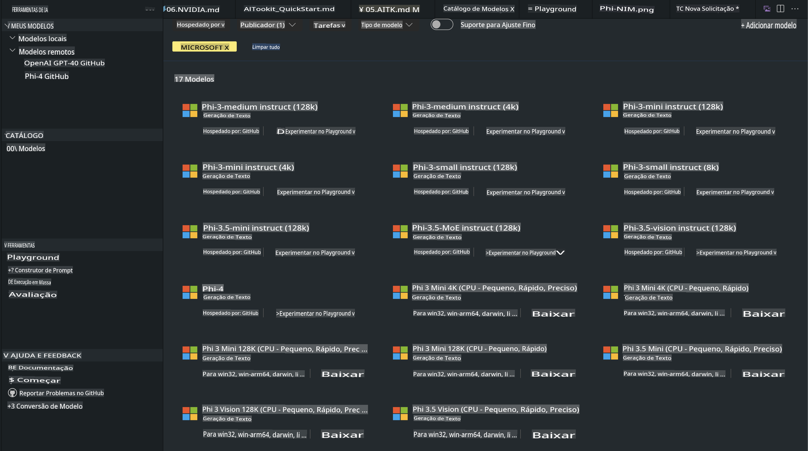
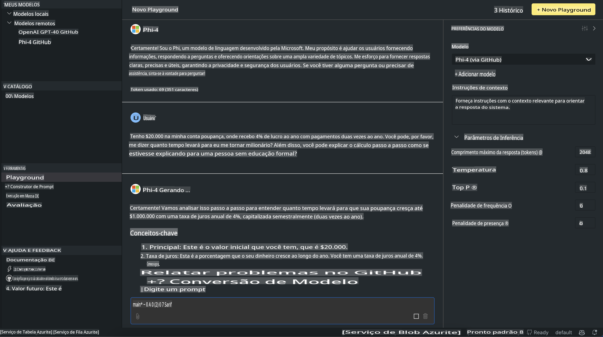

# Família Phi no AITK

[AI Toolkit for VS Code](https://marketplace.visualstudio.com/items?itemName=ms-windows-ai-studio.windows-ai-studio) simplifica o desenvolvimento de aplicativos de IA generativa ao reunir ferramentas avançadas de desenvolvimento de IA e modelos do Catálogo Azure AI Foundry e outros catálogos como Hugging Face. Você poderá navegar pelo catálogo de modelos de IA, alimentado pelos Modelos do GitHub e Catálogos de Modelos do Azure AI Foundry, baixá-los localmente ou remotamente, ajustá-los, testá-los e utilizá-los em seu aplicativo.

O AI Toolkit Preview será executado localmente. Inferência ou ajuste fino local, dependendo do modelo selecionado, pode exigir uma GPU, como a NVIDIA CUDA GPU. Você também pode executar Modelos do GitHub diretamente com o AITK.

## Primeiros Passos

[Saiba mais sobre como instalar o Subsistema do Windows para Linux](https://learn.microsoft.com/windows/wsl/install?WT.mc_id=aiml-137032-kinfeylo)

e [como alterar a distribuição padrão](https://learn.microsoft.com/windows/wsl/install#change-the-default-linux-distribution-installed).

[Repositório GitHub do AI Toolkit](https://github.com/microsoft/vscode-ai-toolkit/)

- Windows, Linux, macOS
  
- Para ajuste fino em Windows e Linux, será necessário uma GPU Nvidia. Além disso, o **Windows** requer o subsistema para Linux com a distribuição Ubuntu 18.4 ou superior. [Saiba mais sobre como instalar o Subsistema do Windows para Linux](https://learn.microsoft.com/windows/wsl/install) e [como alterar a distribuição padrão](https://learn.microsoft.com/windows/wsl/install#change-the-default-linux-distribution-installed).

### Instalar o AI Toolkit

O AI Toolkit é fornecido como uma [Extensão do Visual Studio Code](https://code.visualstudio.com/docs/setup/additional-components#_vs-code-extensions), então você precisará instalar primeiro o [VS Code](https://code.visualstudio.com/docs/setup/windows?WT.mc_id=aiml-137032-kinfeylo) e baixar o AI Toolkit no [VS Marketplace](https://marketplace.visualstudio.com/items?itemName=ms-windows-ai-studio.windows-ai-studio).
O [AI Toolkit está disponível no Visual Studio Marketplace](https://marketplace.visualstudio.com/items?itemName=ms-windows-ai-studio.windows-ai-studio) e pode ser instalado como qualquer outra extensão do VS Code. 

Se você não estiver familiarizado com a instalação de extensões do VS Code, siga estes passos:

### Fazer Login

1. Na Barra de Atividades do VS Code, selecione **Extensões**.
2. Na barra de busca de Extensões, digite "AI Toolkit".
3. Selecione "AI Toolkit for Visual Studio Code".
4. Selecione **Instalar**.

Agora, você está pronto para usar a extensão!

Será solicitado que você faça login no GitHub, então clique em "Permitir" para continuar. Você será redirecionado para a página de login do GitHub.

Faça o login e siga os passos do processo. Após a conclusão bem-sucedida, você será redirecionado para o VS Code.

Depois que a extensão for instalada, você verá o ícone do AI Toolkit aparecer na sua Barra de Atividades.

Vamos explorar as ações disponíveis!

### Ações Disponíveis

A barra lateral principal do AI Toolkit está organizada em  

- **Modelos**
- **Recursos**
- **Playground**  
- **Ajuste Fino**
- **Avaliação**

Essas opções estão disponíveis na seção Recursos. Para começar, selecione **Catálogo de Modelos**.

### Baixar um modelo do catálogo

Ao iniciar o AI Toolkit na barra lateral do VS Code, você pode selecionar entre as seguintes opções:



- Encontre um modelo compatível no **Catálogo de Modelos** e baixe localmente.
- Teste a inferência do modelo no **Playground de Modelos**.
- Ajuste fino do modelo localmente ou remotamente em **Ajuste Fino de Modelo**.
- Implante modelos ajustados na nuvem através do comando paleta do AI Toolkit.
- Avaliação de modelos.

> [!NOTE]
>
> **GPU Vs CPU**
>
> Você notará que os cartões dos modelos mostram o tamanho do modelo, a plataforma e o tipo de acelerador (CPU, GPU). Para desempenho otimizado em **dispositivos Windows que possuem pelo menos uma GPU**, selecione versões de modelos que tenham como alvo apenas o Windows.
>
> Isso garante que você tenha um modelo otimizado para o acelerador DirectML.
>
> Os nomes dos modelos estão no formato:
>
> - `{model_name}-{accelerator}-{quantization}-{format}`.
>
>Para verificar se você tem uma GPU no seu dispositivo Windows, abra o **Gerenciador de Tarefas** e selecione a aba **Desempenho**. Se você tiver GPU(s), elas serão listadas com nomes como "GPU 0" ou "GPU 1".

### Executar o modelo no playground

Depois de configurar todos os parâmetros, clique em **Gerar Projeto**.

Quando o modelo for baixado, selecione **Carregar no Playground** no cartão do modelo no catálogo:

- Inicie o download do modelo.
- Instale todos os pré-requisitos e dependências.
- Crie o workspace no VS Code.



### Usar a API REST no seu aplicativo 

O AI Toolkit vem com um servidor web local de API REST **na porta 5272** que utiliza o formato [OpenAI chat completions](https://platform.openai.com/docs/api-reference/chat/create). 

Isso permite testar seu aplicativo localmente sem depender de um serviço de modelo de IA na nuvem. Por exemplo, o seguinte arquivo JSON mostra como configurar o corpo da solicitação:

```json
{
    "model": "Phi-4",
    "messages": [
        {
            "role": "user",
            "content": "what is the golden ratio?"
        }
    ],
    "temperature": 0.7,
    "top_p": 1,
    "top_k": 10,
    "max_tokens": 100,
    "stream": true
}
```

Você pode testar a API REST usando (por exemplo) o [Postman](https://www.postman.com/) ou a ferramenta CURL (Client URL):

```bash
curl -vX POST http://127.0.0.1:5272/v1/chat/completions -H 'Content-Type: application/json' -d @body.json
```

### Usando a biblioteca cliente OpenAI para Python

```python
from openai import OpenAI

client = OpenAI(
    base_url="http://127.0.0.1:5272/v1/", 
    api_key="x" # required for the API but not used
)

chat_completion = client.chat.completions.create(
    messages=[
        {
            "role": "user",
            "content": "what is the golden ratio?",
        }
    ],
    model="Phi-4",
)

print(chat_completion.choices[0].message.content)
```

### Usando a biblioteca cliente Azure OpenAI para .NET

Adicione a [biblioteca cliente Azure OpenAI para .NET](https://www.nuget.org/packages/Azure.AI.OpenAI/) ao seu projeto usando o NuGet:

```bash
dotnet add {project_name} package Azure.AI.OpenAI --version 1.0.0-beta.17
```

Adicione um arquivo C# chamado **OverridePolicy.cs** ao seu projeto e cole o seguinte código:

```csharp
// OverridePolicy.cs
using Azure.Core.Pipeline;
using Azure.Core;

internal partial class OverrideRequestUriPolicy(Uri overrideUri)
    : HttpPipelineSynchronousPolicy
{
    private readonly Uri _overrideUri = overrideUri;

    public override void OnSendingRequest(HttpMessage message)
    {
        message.Request.Uri.Reset(_overrideUri);
    }
}
```

Em seguida, cole o seguinte código no seu arquivo **Program.cs**:

```csharp
// Program.cs
using Azure.AI.OpenAI;

Uri localhostUri = new("http://localhost:5272/v1/chat/completions");

OpenAIClientOptions clientOptions = new();
clientOptions.AddPolicy(
    new OverrideRequestUriPolicy(localhostUri),
    Azure.Core.HttpPipelinePosition.BeforeTransport);
OpenAIClient client = new(openAIApiKey: "unused", clientOptions);

ChatCompletionsOptions options = new()
{
    DeploymentName = "Phi-4",
    Messages =
    {
        new ChatRequestSystemMessage("You are a helpful assistant. Be brief and succinct."),
        new ChatRequestUserMessage("What is the golden ratio?"),
    }
};

StreamingResponse<StreamingChatCompletionsUpdate> streamingChatResponse
    = await client.GetChatCompletionsStreamingAsync(options);

await foreach (StreamingChatCompletionsUpdate chatChunk in streamingChatResponse)
{
    Console.Write(chatChunk.ContentUpdate);
}
```


## Ajuste Fino com AI Toolkit

- Comece com a descoberta de modelos e playground.
- Ajuste fino e inferência de modelos usando recursos de computação local.
- Ajuste fino e inferência remotos usando recursos do Azure.

[Ajuste Fino com AI Toolkit](../../03.FineTuning/Finetuning_VSCodeaitoolkit.md)

## Recursos de Perguntas e Respostas do AI Toolkit

Consulte nossa [página de Perguntas e Respostas](https://github.com/microsoft/vscode-ai-toolkit/blob/main/archive/QA.md) para os problemas mais comuns e suas soluções.

**Aviso Legal**:  
Este documento foi traduzido utilizando serviços de tradução baseados em IA. Embora nos esforcemos para garantir a precisão, esteja ciente de que traduções automáticas podem conter erros ou imprecisões. O documento original em seu idioma nativo deve ser considerado a fonte autoritativa. Para informações críticas, recomenda-se a tradução profissional humana. Não nos responsabilizamos por quaisquer mal-entendidos ou interpretações equivocadas decorrentes do uso desta tradução.