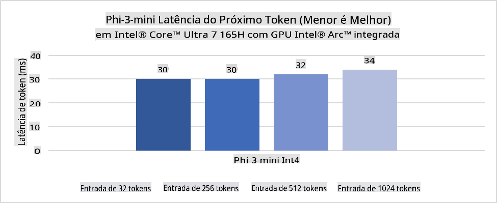
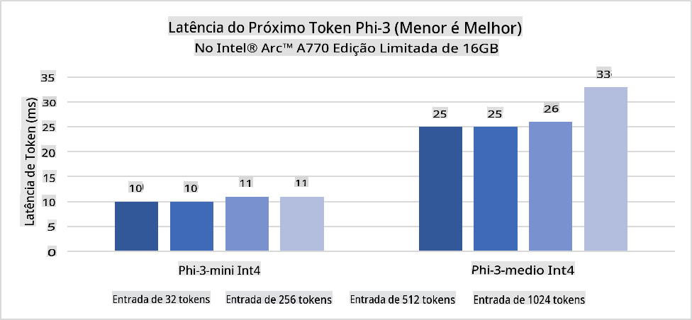
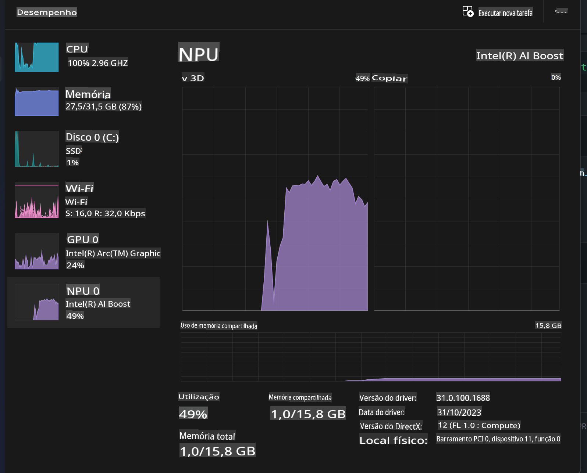
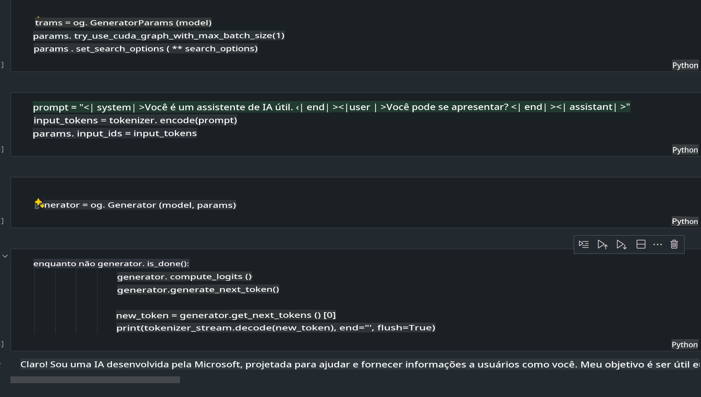
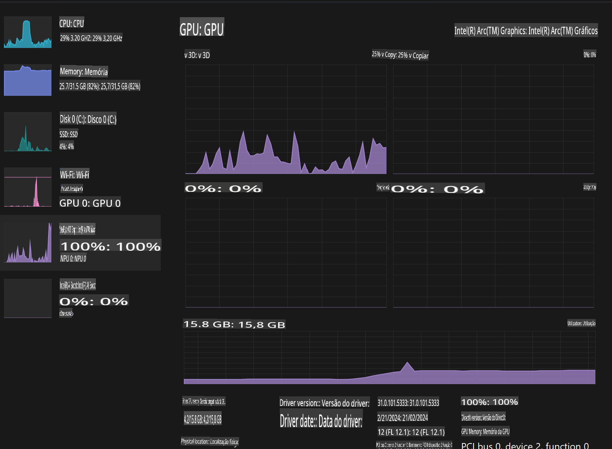

# **Inferência Phi-3 em PCs com IA**

Com o avanço da IA generativa e a melhoria nas capacidades de hardware dos dispositivos de ponta, um número crescente de modelos de IA generativa pode agora ser integrado aos dispositivos BYOD (Bring Your Own Device) dos usuários. Os PCs com IA estão entre esses modelos. A partir de 2024, Intel, AMD e Qualcomm colaboraram com fabricantes de PCs para introduzir PCs com IA que permitem a execução de modelos de IA generativa localmente por meio de modificações no hardware. Nesta discussão, focaremos nos PCs com IA da Intel e exploraremos como implantar o Phi-3 em um PC com IA da Intel.

### O que é um NPU

Um NPU (Unidade de Processamento Neural) é um processador dedicado ou uma unidade de processamento em um SoC maior, projetado especificamente para acelerar operações de redes neurais e tarefas de IA. Diferentemente de CPUs e GPUs de uso geral, os NPUs são otimizados para computação paralela orientada por dados, tornando-os altamente eficientes no processamento de grandes volumes de dados multimídia, como vídeos e imagens, além de dados para redes neurais. Eles são particularmente habilidosos em lidar com tarefas relacionadas à IA, como reconhecimento de voz, desfoque de fundo em videochamadas e processos de edição de fotos ou vídeos, como detecção de objetos.

## NPU vs GPU

Embora muitas cargas de trabalho de IA e aprendizado de máquina sejam executadas em GPUs, há uma distinção crucial entre GPUs e NPUs.  
As GPUs são conhecidas por suas capacidades de computação paralela, mas nem todas as GPUs são igualmente eficientes além do processamento gráfico. Os NPUs, por outro lado, são projetados especificamente para cálculos complexos envolvidos nas operações de redes neurais, tornando-os altamente eficazes para tarefas de IA.

Em resumo, os NPUs são os "gênios da matemática" que aceleram os cálculos de IA e desempenham um papel fundamental na emergente era dos PCs com IA!

***Este exemplo é baseado no mais recente Processador Intel Core Ultra***

## **1. Usar NPU para executar o modelo Phi-3**

O dispositivo Intel® NPU é um acelerador de inferência de IA integrado aos CPUs cliente da Intel, começando pela geração Intel® Core™ Ultra (anteriormente conhecida como Meteor Lake). Ele permite a execução eficiente em termos de energia de tarefas de redes neurais artificiais.





**Biblioteca de Aceleração Intel NPU**

A Biblioteca de Aceleração Intel NPU [https://github.com/intel/intel-npu-acceleration-library](https://github.com/intel/intel-npu-acceleration-library) é uma biblioteca Python projetada para aumentar a eficiência de suas aplicações, aproveitando o poder da Unidade de Processamento Neural (NPU) da Intel para realizar cálculos em alta velocidade em hardware compatível.

Exemplo de Phi-3-mini em um PC com IA equipado com processadores Intel® Core™ Ultra.


Instale a biblioteca Python com pip:

```bash

   pip install intel-npu-acceleration-library

```

***Nota*** O projeto ainda está em desenvolvimento, mas o modelo de referência já está bastante completo.

### **Executando Phi-3 com a Biblioteca de Aceleração Intel NPU**

Ao usar a aceleração Intel NPU, esta biblioteca não afeta o processo de codificação tradicional. Basta usá-la para quantizar o modelo original Phi-3, como FP16, INT8, INT4, por exemplo:

```python
from transformers import AutoTokenizer, pipeline,TextStreamer
from intel_npu_acceleration_library import NPUModelForCausalLM, int4
from intel_npu_acceleration_library.compiler import CompilerConfig
import warnings

model_id = "microsoft/Phi-3-mini-4k-instruct"

compiler_conf = CompilerConfig(dtype=int4)
model = NPUModelForCausalLM.from_pretrained(
    model_id, use_cache=True, config=compiler_conf, attn_implementation="sdpa"
).eval()

tokenizer = AutoTokenizer.from_pretrained(model_id)

text_streamer = TextStreamer(tokenizer, skip_prompt=True)
```

Após a quantização ser bem-sucedida, continue a execução para chamar o NPU e rodar o modelo Phi-3.

```python
generation_args = {
   "max_new_tokens": 1024,
   "return_full_text": False,
   "temperature": 0.3,
   "do_sample": False,
   "streamer": text_streamer,
}

pipe = pipeline(
   "text-generation",
   model=model,
   tokenizer=tokenizer,
)

query = "<|system|>You are a helpful AI assistant.<|end|><|user|>Can you introduce yourself?<|end|><|assistant|>"

with warnings.catch_warnings():
    warnings.simplefilter("ignore")
    pipe(query, **generation_args)
```

Ao executar o código, podemos visualizar o status de execução do NPU através do Gerenciador de Tarefas.



***Exemplos***: [AIPC_NPU_DEMO.ipynb](../../../../../code/03.Inference/AIPC/AIPC_NPU_DEMO.ipynb)

## **2. Usar DirectML + ONNX Runtime para executar o modelo Phi-3**

### **O que é DirectML**

[DirectML](https://github.com/microsoft/DirectML) é uma biblioteca de aprendizado de máquina de alto desempenho e acelerada por hardware DirectX 12. O DirectML oferece aceleração por GPU para tarefas comuns de aprendizado de máquina em uma ampla gama de hardware e drivers suportados, incluindo todas as GPUs compatíveis com DirectX 12 de fornecedores como AMD, Intel, NVIDIA e Qualcomm.

Quando usado de forma independente, a API DirectML é uma biblioteca de baixo nível baseada no DirectX 12, adequada para aplicações de alto desempenho e baixa latência, como frameworks, jogos e outras aplicações em tempo real. A interoperabilidade perfeita do DirectML com o Direct3D 12, bem como sua baixa sobrecarga e conformidade entre hardwares, torna-o ideal para acelerar aprendizado de máquina, especialmente quando alto desempenho e confiabilidade dos resultados são essenciais.

***Nota***: O DirectML mais recente já suporta NPU (https://devblogs.microsoft.com/directx/introducing-neural-processor-unit-npu-support-in-directml-developer-preview/)

### DirectML e CUDA em termos de capacidades e desempenho:

**DirectML** é uma biblioteca de aprendizado de máquina desenvolvida pela Microsoft. Ela é projetada para acelerar cargas de trabalho de aprendizado de máquina em dispositivos Windows, incluindo desktops, laptops e dispositivos de ponta.
- Baseado em DX12: DirectML é construído sobre o DirectX 12 (DX12), oferecendo suporte a uma ampla gama de hardwares de GPUs, incluindo NVIDIA e AMD.
- Suporte Amplo: Por utilizar DX12, DirectML pode trabalhar com qualquer GPU que suporte DX12, incluindo GPUs integradas.
- Processamento de Imagens: DirectML processa imagens e outros dados usando redes neurais, sendo adequado para tarefas como reconhecimento de imagens, detecção de objetos, entre outras.
- Facilidade de Configuração: Configurar o DirectML é simples e não exige SDKs ou bibliotecas específicas de fabricantes de GPUs.
- Desempenho: Em alguns casos, o DirectML apresenta bom desempenho e pode ser mais rápido que o CUDA, especialmente para determinadas cargas de trabalho.
- Limitações: No entanto, há situações em que o DirectML pode ser mais lento, particularmente em tamanhos de lote grandes com float16.

**CUDA** é a plataforma de computação paralela e modelo de programação da NVIDIA. Ela permite que desenvolvedores aproveitem o poder das GPUs NVIDIA para computação de propósito geral, incluindo aprendizado de máquina e simulações científicas.
- Específico para NVIDIA: CUDA é integrado exclusivamente às GPUs NVIDIA e foi projetado especificamente para elas.
- Altamente Otimizado: Oferece excelente desempenho para tarefas aceleradas por GPU, especialmente ao usar GPUs NVIDIA.
- Amplamente Utilizado: Muitos frameworks e bibliotecas de aprendizado de máquina (como TensorFlow e PyTorch) possuem suporte ao CUDA.
- Personalização: Desenvolvedores podem ajustar as configurações do CUDA para tarefas específicas, alcançando desempenho ideal.
- Limitações: No entanto, a dependência do CUDA no hardware NVIDIA pode ser um limitador caso seja necessário suporte mais amplo a diferentes GPUs.

### Escolhendo Entre DirectML e CUDA

A escolha entre DirectML e CUDA depende do caso de uso específico, disponibilidade de hardware e preferências.  
Se você busca compatibilidade mais ampla e facilidade de configuração, o DirectML pode ser uma boa escolha. No entanto, se você possui GPUs NVIDIA e precisa de desempenho altamente otimizado, o CUDA continua sendo uma forte opção. Em resumo, ambos têm suas vantagens e desvantagens, então considere suas necessidades e o hardware disponível ao tomar uma decisão.

### **IA Generativa com ONNX Runtime**

Na era da IA, a portabilidade dos modelos de IA é muito importante. O ONNX Runtime permite implantar facilmente modelos treinados em diferentes dispositivos. Os desenvolvedores não precisam se preocupar com o framework de inferência, utilizando uma API unificada para realizar a inferência do modelo. Na era da IA generativa, o ONNX Runtime também realizou otimizações de código (https://onnxruntime.ai/docs/genai/). Por meio do ONNX Runtime otimizado, o modelo de IA generativa quantizado pode ser inferido em diferentes terminais. Com o ONNX Runtime, você pode inferir modelos de IA por meio de APIs em Python, C#, C/C++. Claro, a implantação no iPhone pode aproveitar a API do ONNX Runtime em C++ para IA generativa.

[Código de Exemplo](https://github.com/Azure-Samples/Phi-3MiniSamples/tree/main/onnx)

***Compile a biblioteca de IA generativa com ONNX Runtime***

```bash

winget install --id=Kitware.CMake  -e

git clone https://github.com/microsoft/onnxruntime.git

cd .\onnxruntime\

./build.bat --build_shared_lib --skip_tests --parallel --use_dml --config Release

cd ../

git clone https://github.com/microsoft/onnxruntime-genai.git

cd .\onnxruntime-genai\

mkdir ort

cd ort

mkdir include

mkdir lib

copy ..\onnxruntime\include\onnxruntime\core\providers\dml\dml_provider_factory.h ort\include

copy ..\onnxruntime\include\onnxruntime\core\session\onnxruntime_c_api.h ort\include

copy ..\onnxruntime\build\Windows\Release\Release\*.dll ort\lib

copy ..\onnxruntime\build\Windows\Release\Release\onnxruntime.lib ort\lib

python build.py --use_dml


```

**Instale a biblioteca**

```bash

pip install .\onnxruntime_genai_directml-0.3.0.dev0-cp310-cp310-win_amd64.whl

```

Este é o resultado da execução:



***Exemplos***: [AIPC_DirectML_DEMO.ipynb](../../../../../code/03.Inference/AIPC/AIPC_DirectML_DEMO.ipynb)

## **3. Usar Intel OpenVino para executar o modelo Phi-3**

### **O que é OpenVINO**

[OpenVINO](https://github.com/openvinotoolkit/openvino) é um kit de ferramentas de código aberto para otimização e implantação de modelos de aprendizado profundo. Ele oferece desempenho aprimorado para modelos de visão, áudio e linguagem de frameworks populares como TensorFlow, PyTorch e outros. Comece a usar o OpenVINO. Ele também pode ser usado em combinação com CPU e GPU para executar o modelo Phi-3.

***Nota***: Atualmente, o OpenVINO não suporta NPU.

### **Instalar a Biblioteca OpenVINO**

```bash

 pip install git+https://github.com/huggingface/optimum-intel.git

 pip install git+https://github.com/openvinotoolkit/nncf.git

 pip install openvino-nightly

```

### **Executando Phi-3 com OpenVINO**

Assim como o NPU, o OpenVINO realiza a chamada de modelos de IA generativa executando modelos quantizados. Primeiro, precisamos quantizar o modelo Phi-3 e realizar a quantização do modelo na linha de comando através do optimum-cli.

**INT4**

```bash

optimum-cli export openvino --model "microsoft/Phi-3-mini-4k-instruct" --task text-generation-with-past --weight-format int4 --group-size 128 --ratio 0.6  --sym  --trust-remote-code ./openvinomodel/phi3/int4

```

**FP16**

```bash

optimum-cli export openvino --model "microsoft/Phi-3-mini-4k-instruct" --task text-generation-with-past --weight-format fp16 --trust-remote-code ./openvinomodel/phi3/fp16

```

O formato convertido será algo assim:


Carregue os caminhos do modelo (model_dir), configurações relacionadas (ov_config = {"PERFORMANCE_HINT": "LATENCY", "NUM_STREAMS": "1", "CACHE_DIR": ""}) e dispositivos acelerados por hardware (GPU.0) através do OVModelForCausalLM.

```python

ov_model = OVModelForCausalLM.from_pretrained(
     model_dir,
     device='GPU.0',
     ov_config=ov_config,
     config=AutoConfig.from_pretrained(model_dir, trust_remote_code=True),
     trust_remote_code=True,
)

```

Ao executar o código, podemos visualizar o status de execução da GPU através do Gerenciador de Tarefas.



***Exemplos***: [AIPC_OpenVino_Demo.ipynb](../../../../../code/03.Inference/AIPC/AIPC_OpenVino_Demo.ipynb)

### ***Nota***: Os três métodos acima possuem suas próprias vantagens, mas recomenda-se o uso de aceleração NPU para inferência em PCs com IA.

**Aviso Legal**:  
Este documento foi traduzido utilizando serviços de tradução baseados em IA. Embora nos esforcemos para garantir a precisão, esteja ciente de que traduções automáticas podem conter erros ou imprecisões. O documento original em seu idioma nativo deve ser considerado a fonte oficial. Para informações críticas, recomenda-se a tradução profissional feita por humanos. Não nos responsabilizamos por quaisquer mal-entendidos ou interpretações incorretas decorrentes do uso desta tradução.