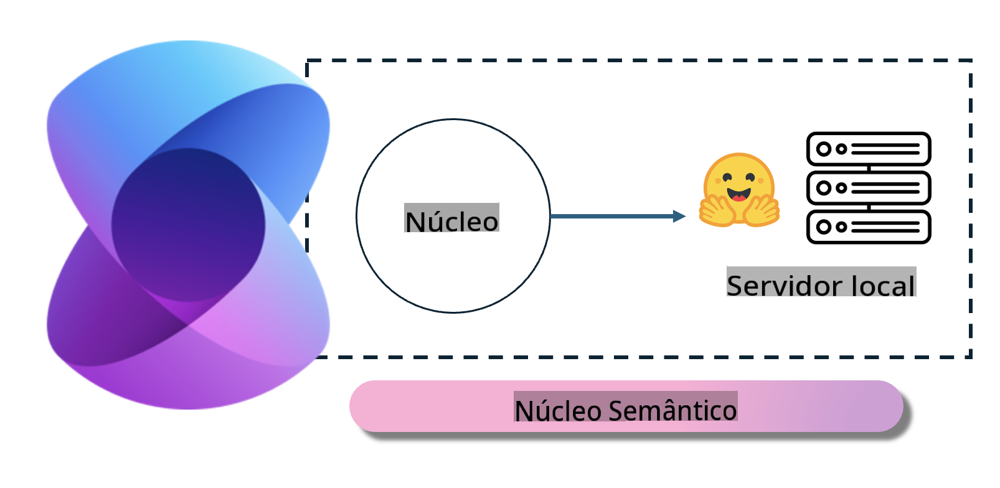
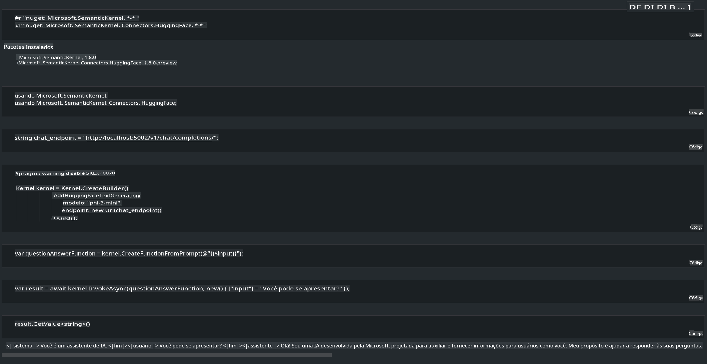

# **Inferência do Phi-3 em Servidor Local**

Podemos implantar o Phi-3 em um servidor local. Os usuários podem escolher as soluções [Ollama](https://ollama.com) ou [LM Studio](https://llamaedge.com), ou podem escrever seu próprio código. Você pode conectar os serviços locais do Phi-3 através do [Semantic Kernel](https://github.com/microsoft/semantic-kernel?WT.mc_id=aiml-138114-kinfeylo) ou [Langchain](https://www.langchain.com/) para construir aplicações Copilot.

## **Usar o Semantic Kernel para acessar o Phi-3-mini**

Na aplicação Copilot, criamos aplicações através do Semantic Kernel / LangChain. Este tipo de estrutura de aplicação é geralmente compatível com Azure OpenAI Service / modelos OpenAI, e também pode oferecer suporte a modelos de código aberto no Hugging Face e modelos locais. O que devemos fazer se quisermos usar o Semantic Kernel para acessar o Phi-3-mini? Usando .NET como exemplo, podemos combiná-lo com o Conector Hugging Face no Semantic Kernel. Por padrão, ele pode corresponder ao id do modelo no Hugging Face (na primeira vez que você o utiliza, o modelo será baixado do Hugging Face, o que pode levar algum tempo). Você também pode se conectar ao serviço local configurado. Comparando as duas opções, recomendamos usar a última, pois oferece maior autonomia, especialmente em aplicações empresariais.

Na figura, acessar serviços locais através do Semantic Kernel permite conectar facilmente ao servidor de modelo Phi-3-mini autoconstruído. Aqui está o resultado da execução:

***Código de Exemplo*** https://github.com/kinfey/Phi3MiniSamples/tree/main/semantickernel

**Aviso Legal**:  
Este documento foi traduzido utilizando serviços de tradução automática por IA. Embora nos esforcemos para garantir a precisão, esteja ciente de que traduções automáticas podem conter erros ou imprecisões. O documento original em seu idioma nativo deve ser considerado a fonte autoritativa. Para informações críticas, recomenda-se a tradução profissional feita por humanos. Não nos responsabilizamos por mal-entendidos ou interpretações incorretas decorrentes do uso desta tradução.