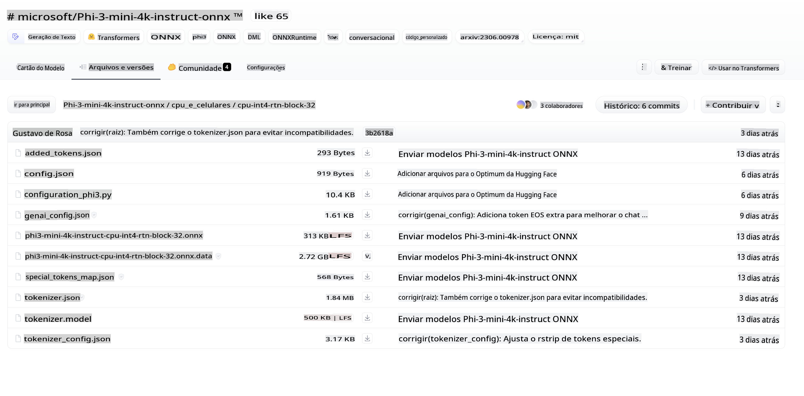
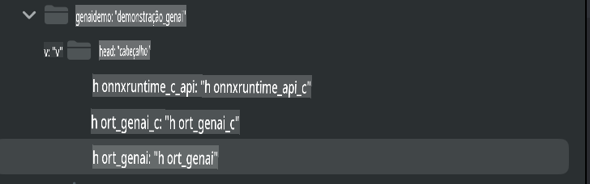
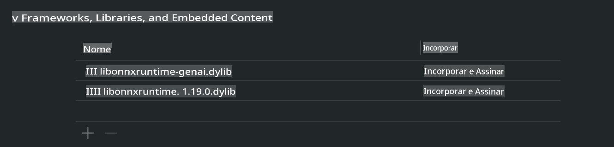
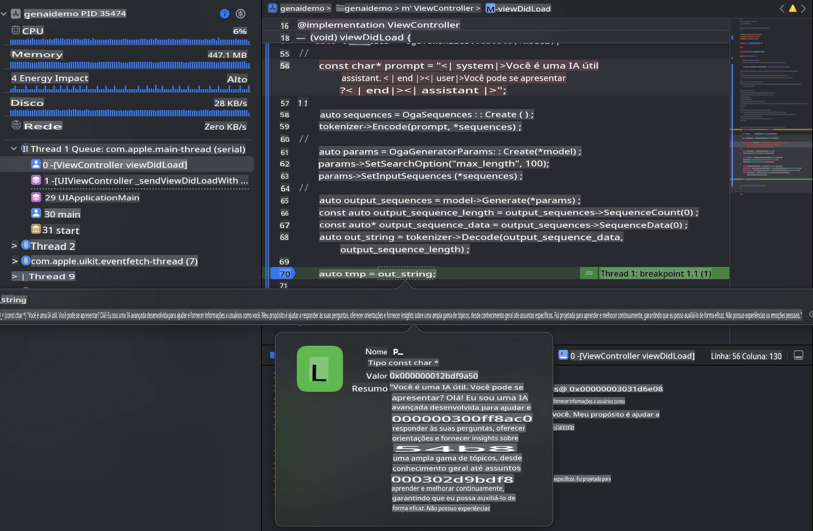

# **Inferência Phi-3 no iOS**

Phi-3-mini é uma nova série de modelos da Microsoft que permite a implantação de Modelos de Linguagem de Grande Escala (LLMs) em dispositivos de borda e dispositivos IoT. O Phi-3-mini está disponível para implantações em iOS, Android e dispositivos de borda, possibilitando o uso de IA generativa em ambientes BYOD. O exemplo a seguir demonstra como implantar o Phi-3-mini no iOS.

## **1. Preparação**

- **a.** macOS 14+
- **b.** Xcode 15+
- **c.** iOS SDK 17.x (iPhone 14 A16 ou superior)
- **d.** Instale o Python 3.10+ (Conda é recomendado)
- **e.** Instale a biblioteca Python: `python-flatbuffers`
- **f.** Instale o CMake

### Semantic Kernel e Inferência

Semantic Kernel é uma estrutura de aplicação que permite criar aplicativos compatíveis com o Azure OpenAI Service, modelos OpenAI e até modelos locais. Acessar serviços locais através do Semantic Kernel facilita a integração com o servidor do modelo Phi-3-mini auto-hospedado.

### Chamando Modelos Quantizados com Ollama ou LlamaEdge

Muitos usuários preferem usar modelos quantizados para executar os modelos localmente. [Ollama](https://ollama.com) e [LlamaEdge](https://llamaedge.com) permitem que os usuários utilizem diferentes modelos quantizados:

#### **Ollama**

Você pode executar `ollama run phi3` diretamente ou configurá-lo offline. Crie um Modelfile com o caminho para o seu arquivo `gguf`. Código de exemplo para executar o modelo quantizado Phi-3-mini:

```gguf
FROM {Add your gguf file path}
TEMPLATE \"\"\"<|user|> .Prompt<|end|> <|assistant|>\"\"\"
PARAMETER stop <|end|>
PARAMETER num_ctx 4096
```

#### **LlamaEdge**

Se você deseja usar `gguf` tanto em dispositivos na nuvem quanto na borda simultaneamente, o LlamaEdge é uma ótima opção.

## **2. Compilando o ONNX Runtime para iOS**

```bash

git clone https://github.com/microsoft/onnxruntime.git

cd onnxruntime

./build.sh --build_shared_lib --ios --skip_tests --parallel --build_dir ./build_ios --ios --apple_sysroot iphoneos --osx_arch arm64 --apple_deploy_target 17.5 --cmake_generator Xcode --config Release

cd ../

```

### **Aviso**

- **a.** Antes de compilar, certifique-se de que o Xcode está configurado corretamente e defina-o como o diretório ativo do desenvolvedor no terminal:

    ```bash
    sudo xcode-select -switch /Applications/Xcode.app/Contents/Developer
    ```

- **b.** O ONNX Runtime precisa ser compilado para diferentes plataformas. Para iOS, você pode compilar para `arm64` or `x86_64`.

- **c.** Recomenda-se usar o SDK mais recente do iOS para a compilação. No entanto, você também pode usar uma versão mais antiga se precisar de compatibilidade com SDKs anteriores.

## **3. Compilando IA Generativa com ONNX Runtime para iOS**

> **Nota:** Como a IA Generativa com ONNX Runtime está em pré-visualização, esteja ciente de possíveis alterações.

```bash

git clone https://github.com/microsoft/onnxruntime-genai
 
cd onnxruntime-genai
 
mkdir ort
 
cd ort
 
mkdir include
 
mkdir lib
 
cd ../
 
cp ../onnxruntime/include/onnxruntime/core/session/onnxruntime_c_api.h ort/include
 
cp ../onnxruntime/build_ios/Release/Release-iphoneos/libonnxruntime*.dylib* ort/lib
 
export OPENCV_SKIP_XCODEBUILD_FORCE_TRYCOMPILE_DEBUG=1
 
python3 build.py --parallel --build_dir ./build_ios --ios --ios_sysroot iphoneos --ios_arch arm64 --ios_deployment_target 17.5 --cmake_generator Xcode --cmake_extra_defines CMAKE_XCODE_ATTRIBUTE_CODE_SIGNING_ALLOWED=NO

```

## **4. Criar um aplicativo no Xcode**

Escolhi Objective-C como o método de desenvolvimento do aplicativo, pois ao usar IA Generativa com a API C++ do ONNX Runtime, o Objective-C apresenta melhor compatibilidade. Claro, você também pode realizar chamadas relacionadas através da ponte Swift.


## **5. Copiar o modelo ONNX quantizado INT4 para o projeto do aplicativo**

Precisamos importar o modelo de quantização INT4 no formato ONNX, que precisa ser baixado primeiro.



Após o download, é necessário adicioná-lo ao diretório Resources do projeto no Xcode.


## **6. Adicionando a API C++ nos ViewControllers**

> **Aviso:**

- **a.** Adicione os arquivos de cabeçalho C++ correspondentes ao projeto.

  

- **b.** Inclua `onnxruntime-genai` dynamic library in Xcode.

  

- **c.** Use the C Samples code for testing. You can also add additional features like ChatUI for more functionality.

- **d.** Since you need to use C++ in your project, rename `ViewController.m` to `ViewController.mm` para habilitar o suporte a Objective-C++.

```objc

    NSString *llmPath = [[NSBundle mainBundle] resourcePath];
    char const *modelPath = llmPath.cString;

    auto model =  OgaModel::Create(modelPath);

    auto tokenizer = OgaTokenizer::Create(*model);

    const char* prompt = "<|system|>You are a helpful AI assistant.<|end|><|user|>Can you introduce yourself?<|end|><|assistant|>";

    auto sequences = OgaSequences::Create();
    tokenizer->Encode(prompt, *sequences);

    auto params = OgaGeneratorParams::Create(*model);
    params->SetSearchOption("max_length", 100);
    params->SetInputSequences(*sequences);

    auto output_sequences = model->Generate(*params);
    const auto output_sequence_length = output_sequences->SequenceCount(0);
    const auto* output_sequence_data = output_sequences->SequenceData(0);
    auto out_string = tokenizer->Decode(output_sequence_data, output_sequence_length);
    
    auto tmp = out_string;

```

## **7. Executando o Aplicativo**

Depois de concluir a configuração, você pode executar o aplicativo para ver os resultados da inferência do modelo Phi-3-mini.



Para mais códigos de exemplo e instruções detalhadas, visite o [repositório de Exemplos do Phi-3 Mini](https://github.com/Azure-Samples/Phi-3MiniSamples/tree/main/ios).

**Aviso Legal**:  
Este documento foi traduzido utilizando serviços de tradução automática baseados em IA. Embora nos esforcemos para garantir a precisão, esteja ciente de que traduções automatizadas podem conter erros ou imprecisões. O documento original em seu idioma nativo deve ser considerado a fonte oficial. Para informações críticas, recomenda-se a tradução profissional feita por humanos. Não nos responsabilizamos por quaisquer mal-entendidos ou interpretações equivocadas decorrentes do uso desta tradução.