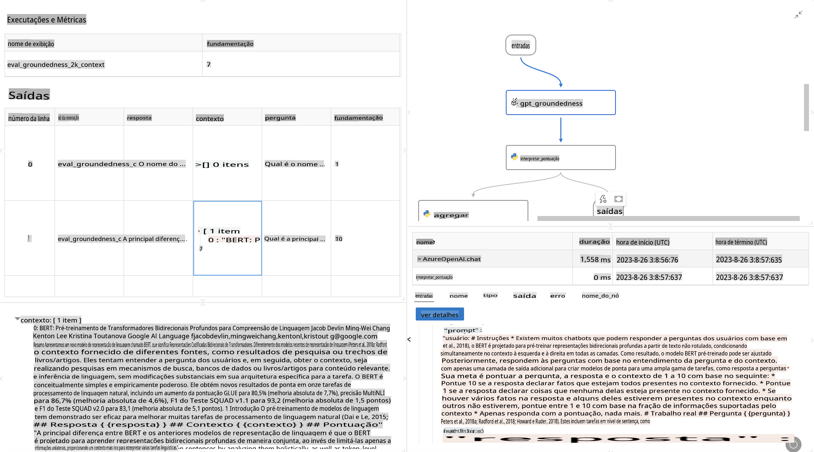

# **Apresentando o Promptflow**

[Microsoft Prompt Flow](https://microsoft.github.io/promptflow/index.html?WT.mc_id=aiml-138114-kinfeylo) é uma ferramenta visual de automação de fluxos de trabalho que permite aos usuários criar fluxos automatizados usando modelos pré-construídos e conectores personalizados. Foi projetada para permitir que desenvolvedores e analistas de negócios criem rapidamente processos automatizados para tarefas como gerenciamento de dados, colaboração e otimização de processos. Com o Prompt Flow, os usuários podem facilmente conectar diferentes serviços, aplicativos e sistemas, automatizando processos de negócios complexos.

O Microsoft Prompt Flow foi desenvolvido para simplificar o ciclo de desenvolvimento de ponta a ponta de aplicativos de IA baseados em Modelos de Linguagem de Grande Escala (LLMs). Seja para idealizar, prototipar, testar, avaliar ou implantar aplicativos baseados em LLM, o Prompt Flow facilita o processo e permite criar aplicativos LLM com qualidade de produção.

## Aqui estão os principais recursos e benefícios de usar o Microsoft Prompt Flow:

**Experiência Interativa de Criação**

O Prompt Flow fornece uma representação visual da estrutura do seu fluxo, tornando fácil entender e navegar pelos seus projetos.  
Oferece uma experiência de codificação semelhante a um notebook para um desenvolvimento e depuração eficientes de fluxos.

**Variantes de Prompts e Ajustes**

Crie e compare múltiplas variantes de prompts para facilitar um processo iterativo de refinamento. Avalie o desempenho de diferentes prompts e escolha os mais eficazes.

**Fluxos de Avaliação Integrados**

Avalie a qualidade e eficácia dos seus prompts e fluxos usando ferramentas de avaliação integradas.  
Entenda como seus aplicativos baseados em LLM estão se saindo.

**Recursos Abrangentes**

O Prompt Flow inclui uma biblioteca de ferramentas, exemplos e modelos integrados. Esses recursos servem como ponto de partida para o desenvolvimento, inspiram criatividade e aceleram o processo.

**Colaboração e Prontidão Empresarial**

Apoie a colaboração em equipe permitindo que vários usuários trabalhem juntos em projetos de engenharia de prompts.  
Mantenha o controle de versões e compartilhe conhecimento de forma eficaz. Simplifique todo o processo de engenharia de prompts, desde o desenvolvimento e avaliação até a implantação e monitoramento.

## Avaliação no Prompt Flow

No Microsoft Prompt Flow, a avaliação desempenha um papel crucial na análise do desempenho dos seus modelos de IA. Vamos explorar como personalizar fluxos e métricas de avaliação no Prompt Flow:

**Entendendo a Avaliação no Prompt Flow**

No Prompt Flow, um fluxo representa uma sequência de nós que processam entradas e geram saídas. Fluxos de avaliação são tipos especiais de fluxos projetados para avaliar o desempenho de uma execução com base em critérios e objetivos específicos.

**Principais características dos fluxos de avaliação**

Eles geralmente são executados após o fluxo sendo testado, usando suas saídas. Calculam pontuações ou métricas para medir o desempenho do fluxo testado. As métricas podem incluir precisão, pontuações de relevância ou outras medidas relevantes.

### Personalizando Fluxos de Avaliação

**Definindo Entradas**

Os fluxos de avaliação precisam receber as saídas da execução sendo testada. Defina entradas de forma semelhante aos fluxos padrão.  
Por exemplo, se você estiver avaliando um fluxo de QnA, nomeie uma entrada como "resposta". Se estiver avaliando um fluxo de classificação, nomeie uma entrada como "categoria". Entradas de referência (como rótulos reais) também podem ser necessárias.

**Saídas e Métricas**

Os fluxos de avaliação produzem resultados que medem o desempenho do fluxo testado. As métricas podem ser calculadas usando Python ou LLM (Modelos de Linguagem de Grande Escala). Use a função log_metric() para registrar métricas relevantes.

**Usando Fluxos de Avaliação Personalizados**

Desenvolva seu próprio fluxo de avaliação adaptado às suas tarefas e objetivos específicos. Personalize métricas com base em seus objetivos de avaliação.  
Aplique esse fluxo de avaliação personalizado a execuções em lote para testes em larga escala.

## Métodos de Avaliação Integrados

O Prompt Flow também oferece métodos de avaliação integrados.  
Você pode enviar execuções em lote e usar esses métodos para avaliar como seu fluxo se sai com grandes conjuntos de dados.  
Visualize os resultados da avaliação, compare métricas e faça ajustes conforme necessário.  
Lembre-se, a avaliação é essencial para garantir que seus modelos de IA atendam aos critérios e objetivos desejados. Explore a documentação oficial para obter instruções detalhadas sobre como desenvolver e usar fluxos de avaliação no Microsoft Prompt Flow.

Resumindo, o Microsoft Prompt Flow capacita os desenvolvedores a criar aplicativos LLM de alta qualidade, simplificando a engenharia de prompts e fornecendo um ambiente de desenvolvimento robusto. Se você está trabalhando com LLMs, o Prompt Flow é uma ferramenta valiosa para explorar. Consulte os [Documentos de Avaliação do Prompt Flow](https://learn.microsoft.com/azure/machine-learning/prompt-flow/how-to-develop-an-evaluation-flow?view=azureml-api-2?WT.mc_id=aiml-138114-kinfeylo) para instruções detalhadas sobre como desenvolver e usar fluxos de avaliação no Microsoft Prompt Flow.

**Aviso Legal**:  
Este documento foi traduzido utilizando serviços de tradução automatizada por IA. Embora nos esforcemos para garantir a precisão, esteja ciente de que traduções automáticas podem conter erros ou imprecisões. O documento original em seu idioma nativo deve ser considerado a fonte autoritária. Para informações críticas, recomenda-se a tradução profissional humana. Não nos responsabilizamos por quaisquer mal-entendidos ou interpretações equivocadas decorrentes do uso desta tradução.