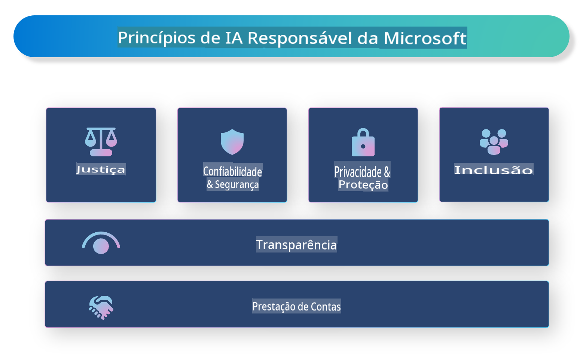

# **Introdução à IA Responsável**

[Microsoft Responsible AI](https://www.microsoft.com/ai/responsible-ai?WT.mc_id=aiml-138114-kinfeylo) é uma iniciativa que visa ajudar desenvolvedores e organizações a criar sistemas de IA que sejam transparentes, confiáveis e responsáveis. A iniciativa oferece orientações e recursos para o desenvolvimento de soluções de IA responsável que estejam alinhadas com princípios éticos, como privacidade, justiça e transparência. Também exploraremos alguns dos desafios e melhores práticas associados à construção de sistemas de IA responsável.

## Visão geral da IA Responsável da Microsoft

**Princípios éticos**

A IA Responsável da Microsoft é guiada por um conjunto de princípios éticos, como privacidade, justiça, transparência, responsabilidade e segurança. Esses princípios foram desenvolvidos para garantir que os sistemas de IA sejam criados de forma ética e responsável.

**IA transparente**

A IA Responsável da Microsoft destaca a importância da transparência nos sistemas de IA. Isso inclui fornecer explicações claras sobre como os modelos de IA funcionam, bem como garantir que as fontes de dados e os algoritmos estejam disponíveis publicamente.

**IA responsável**

[Microsoft Responsible AI](https://www.microsoft.com/ai/responsible-ai?WT.mc_id=aiml-138114-kinfeylo) promove o desenvolvimento de sistemas de IA responsáveis, que podem oferecer insights sobre como os modelos de IA tomam decisões. Isso ajuda os usuários a entender e confiar nos resultados gerados pelos sistemas de IA.

**Inclusividade**

Os sistemas de IA devem ser projetados para beneficiar a todos. A Microsoft busca criar uma IA inclusiva que considere perspectivas diversas e evite preconceitos ou discriminação.

**Confiabilidade e segurança**

Garantir que os sistemas de IA sejam confiáveis e seguros é fundamental. A Microsoft foca na construção de modelos robustos que funcionem de maneira consistente e evitem resultados prejudiciais.

**Justiça na IA**

A IA Responsável da Microsoft reconhece que os sistemas de IA podem perpetuar preconceitos se forem treinados com dados ou algoritmos tendenciosos. A iniciativa oferece orientações para o desenvolvimento de sistemas de IA justos que não discriminem com base em fatores como raça, gênero ou idade.

**Privacidade e segurança**

A IA Responsável da Microsoft enfatiza a importância de proteger a privacidade dos usuários e a segurança dos dados nos sistemas de IA. Isso inclui a implementação de criptografia forte e controles de acesso, bem como auditorias regulares para identificar vulnerabilidades.

**Responsabilidade e prestação de contas**

A IA Responsável da Microsoft promove a responsabilidade e a prestação de contas no desenvolvimento e implantação de IA. Isso inclui garantir que desenvolvedores e organizações estejam cientes dos riscos potenciais associados aos sistemas de IA e tomem medidas para mitigá-los.

## Melhores práticas para construir sistemas de IA responsável

**Desenvolver modelos de IA usando conjuntos de dados diversos**

Para evitar preconceitos nos sistemas de IA, é importante usar conjuntos de dados diversos que representem uma ampla gama de perspectivas e experiências.

**Utilizar técnicas de IA explicável**

Técnicas de IA explicável podem ajudar os usuários a entender como os modelos de IA tomam decisões, aumentando a confiança no sistema.

**Auditar regularmente os sistemas de IA para vulnerabilidades**

Auditorias regulares podem ajudar a identificar riscos e vulnerabilidades que precisam ser resolvidos.

**Implementar criptografia forte e controles de acesso**

A criptografia de dados e os controles de acesso ajudam a proteger a privacidade e a segurança dos usuários nos sistemas de IA.

**Seguir princípios éticos no desenvolvimento de IA**

Seguir princípios éticos, como justiça, transparência e responsabilidade, pode ajudar a construir confiança nos sistemas de IA e garantir que eles sejam desenvolvidos de maneira responsável.

## Usando o AI Foundry para IA Responsável

[Azure AI Foundry](https://ai.azure.com?WT.mc_id=aiml-138114-kinfeylo) é uma plataforma poderosa que permite a desenvolvedores e organizações criar rapidamente aplicativos inteligentes, inovadores, prontos para o mercado e responsáveis. Aqui estão algumas características e capacidades principais do Azure AI Foundry:

**APIs e modelos prontos para uso**

O Azure AI Foundry oferece APIs e modelos pré-construídos e personalizáveis. Eles abrangem uma ampla variedade de tarefas de IA, incluindo IA generativa, processamento de linguagem natural para conversas, busca, monitoramento, tradução, fala, visão e tomada de decisões.

**Prompt Flow**

O Prompt Flow no Azure AI Foundry permite criar experiências de IA conversacional. Ele possibilita o design e a gestão de fluxos conversacionais, facilitando a criação de chatbots, assistentes virtuais e outros aplicativos interativos.

**Geração aumentada por recuperação (RAG)**

O RAG é uma técnica que combina abordagens baseadas em recuperação e geração. Ela melhora a qualidade das respostas geradas ao utilizar tanto conhecimento pré-existente (recuperação) quanto geração criativa (geração).

**Métricas de avaliação e monitoramento para IA generativa**

O Azure AI Foundry fornece ferramentas para avaliar e monitorar modelos de IA generativa. É possível analisar desempenho, justiça e outras métricas importantes para garantir uma implantação responsável. Além disso, se você criou um painel, pode usar a interface sem código no Azure Machine Learning Studio para personalizar e gerar um Painel de IA Responsável e um placar associado com base nas bibliotecas Python do [Responsible AI Toolbox](https://responsibleaitoolbox.ai/?WT.mc_id=aiml-138114-kinfeylo). Esse placar ajuda a compartilhar insights importantes relacionados à justiça, importância de características e outras considerações de implantação responsável com partes interessadas técnicas e não técnicas.

Para usar o AI Foundry com IA responsável, você pode seguir estas melhores práticas:

**Defina o problema e os objetivos do seu sistema de IA**

Antes de iniciar o processo de desenvolvimento, é importante definir claramente o problema ou objetivo que seu sistema de IA pretende resolver. Isso ajudará a identificar os dados, algoritmos e recursos necessários para construir um modelo eficaz.

**Coletar e pré-processar dados relevantes**

A qualidade e a quantidade de dados usados no treinamento de um sistema de IA têm impacto significativo no seu desempenho. Por isso, é essencial coletar dados relevantes, limpá-los, pré-processá-los e garantir que representem a população ou o problema que você está tentando resolver.

**Escolha uma avaliação apropriada**

Existem diversos algoritmos de avaliação disponíveis. É importante escolher o mais adequado com base nos seus dados e no problema.

**Avaliar e interpretar o modelo**

Depois de construir um modelo de IA, é essencial avaliar seu desempenho usando métricas apropriadas e interpretar os resultados de maneira transparente. Isso ajudará a identificar quaisquer preconceitos ou limitações no modelo e fazer melhorias quando necessário.

**Garantir transparência e explicabilidade**

Os sistemas de IA devem ser transparentes e explicáveis para que os usuários possam entender como funcionam e como as decisões são tomadas. Isso é especialmente importante para aplicações que têm impactos significativos na vida humana, como saúde, finanças e sistemas legais.

**Monitorar e atualizar o modelo**

Os sistemas de IA devem ser continuamente monitorados e atualizados para garantir que permaneçam precisos e eficazes ao longo do tempo. Isso requer manutenção contínua, testes e re-treinamento do modelo.

Em conclusão, a IA Responsável da Microsoft é uma iniciativa que visa ajudar desenvolvedores e organizações a criar sistemas de IA que sejam transparentes, confiáveis e responsáveis. Lembre-se de que a implementação de IA responsável é essencial, e o Azure AI Foundry busca torná-la prática para as organizações. Seguindo princípios éticos e melhores práticas, podemos garantir que os sistemas de IA sejam desenvolvidos e implantados de maneira responsável, beneficiando a sociedade como um todo.

**Aviso Legal**:  
Este documento foi traduzido utilizando serviços de tradução automática baseados em IA. Embora nos esforcemos para garantir a precisão, esteja ciente de que traduções automáticas podem conter erros ou imprecisões. O documento original em seu idioma nativo deve ser considerado a fonte autoritativa. Para informações críticas, recomenda-se a tradução profissional feita por humanos. Não nos responsabilizamos por quaisquer mal-entendidos ou interpretações incorretas decorrentes do uso desta tradução.