# Ajuste fino e Integração de modelos personalizados Phi-3 com Prompt flow

Este exemplo de ponta a ponta (E2E) é baseado no guia "[Ajuste Fino e Integração de Modelos Personalizados Phi-3 com Prompt Flow: Guia Passo a Passo](https://techcommunity.microsoft.com/t5/educator-developer-blog/fine-tune-and-integrate-custom-phi-3-models-with-prompt-flow/ba-p/4178612?WT.mc_id=aiml-137032-kinfeylo)" da Microsoft Tech Community. Ele apresenta os processos de ajuste fino, implantação e integração de modelos personalizados Phi-3 com o Prompt flow.

## Visão Geral

Neste exemplo E2E, você aprenderá como ajustar o modelo Phi-3 e integrá-lo com o Prompt flow. Utilizando o Azure Machine Learning e o Prompt flow, você estabelecerá um fluxo de trabalho para implantar e utilizar modelos de IA personalizados. Este exemplo E2E está dividido em três cenários:

**Cenário 1: Configurar os recursos do Azure e Preparar para o ajuste fino**

**Cenário 2: Ajustar o modelo Phi-3 e Implantar no Azure Machine Learning Studio**

**Cenário 3: Integrar com Prompt flow e Conversar com seu modelo personalizado**

Aqui está uma visão geral deste exemplo E2E.

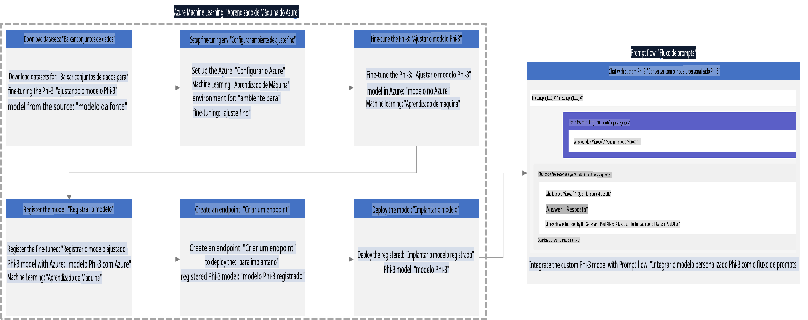

### Tabela de Conteúdo

1. **[Cenário 1: Configurar os recursos do Azure e Preparar para o ajuste fino](../../../../../../md/02.Application/01.TextAndChat/Phi3)**
    - [Criar um Workspace do Azure Machine Learning](../../../../../../md/02.Application/01.TextAndChat/Phi3)
    - [Solicitar cotas de GPU na Assinatura do Azure](../../../../../../md/02.Application/01.TextAndChat/Phi3)
    - [Adicionar atribuição de função](../../../../../../md/02.Application/01.TextAndChat/Phi3)
    - [Configurar o projeto](../../../../../../md/02.Application/01.TextAndChat/Phi3)
    - [Preparar o conjunto de dados para ajuste fino](../../../../../../md/02.Application/01.TextAndChat/Phi3)

1. **[Cenário 2: Ajustar o modelo Phi-3 e Implantar no Azure Machine Learning Studio](../../../../../../md/02.Application/01.TextAndChat/Phi3)**
    - [Configurar o Azure CLI](../../../../../../md/02.Application/01.TextAndChat/Phi3)
    - [Ajustar o modelo Phi-3](../../../../../../md/02.Application/01.TextAndChat/Phi3)
    - [Implantar o modelo ajustado](../../../../../../md/02.Application/01.TextAndChat/Phi3)

1. **[Cenário 3: Integrar com Prompt flow e Conversar com seu modelo personalizado](../../../../../../md/02.Application/01.TextAndChat/Phi3)**
    - [Integrar o modelo Phi-3 personalizado com o Prompt flow](../../../../../../md/02.Application/01.TextAndChat/Phi3)
    - [Conversar com seu modelo personalizado](../../../../../../md/02.Application/01.TextAndChat/Phi3)

## Cenário 1: Configurar os recursos do Azure e Preparar para o ajuste fino

### Criar um Workspace do Azure Machine Learning

1. Digite *azure machine learning* na **barra de pesquisa** no topo da página do portal e selecione **Azure Machine Learning** nas opções exibidas.

    

1. Selecione **+ Criar** no menu de navegação.

1. Selecione **Novo workspace** no menu de navegação.

    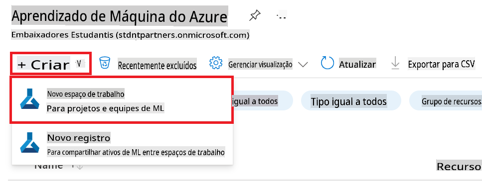

1. Realize as seguintes tarefas:

    - Selecione sua **Assinatura do Azure**.
    - Selecione o **Grupo de Recursos** a ser usado (crie um novo, se necessário).
    - Insira o **Nome do Workspace**. Ele deve ser um valor único.
    - Selecione a **Região** que deseja usar.
    - Selecione a **Conta de Armazenamento** a ser usada (crie uma nova, se necessário).
    - Selecione o **Cofre de Chaves** a ser usado (crie um novo, se necessário).
    - Selecione o **Application Insights** a ser usado (crie um novo, se necessário).
    - Selecione o **Registro de Contêiner** a ser usado (crie um novo, se necessário).

    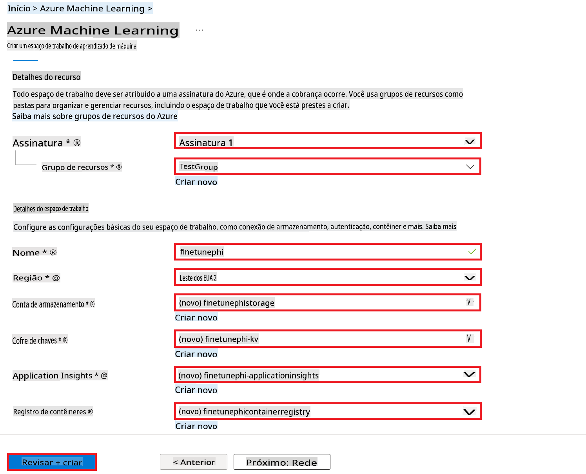

1. Selecione **Revisar + Criar**.

1. Selecione **Criar**.

### Solicitar cotas de GPU na Assinatura do Azure

Neste exemplo E2E, você usará a GPU *Standard_NC24ads_A100_v4* para ajuste fino, que requer uma solicitação de cota, e a CPU *Standard_E4s_v3* para implantação, que não requer solicitação de cota.

> [!NOTE]
>
> Apenas assinaturas Pay-As-You-Go (o tipo de assinatura padrão) são elegíveis para alocação de GPU; assinaturas de benefício não são atualmente suportadas.
>
> Para aqueles usando assinaturas de benefício (como a Assinatura do Visual Studio Enterprise) ou para aqueles que desejam testar rapidamente o processo de ajuste fino e implantação, este tutorial também fornece orientações para ajuste fino com um conjunto de dados mínimo usando uma CPU. No entanto, é importante notar que os resultados do ajuste fino são significativamente melhores ao usar uma GPU com conjuntos de dados maiores.

1. Acesse [Azure ML Studio](https://ml.azure.com/home?wt.mc_id=studentamb_279723).

1. Realize as seguintes tarefas para solicitar cota da *Família Standard NCADSA100v4*:

    - Selecione **Cota** na aba lateral esquerda.
    - Selecione a **Família de máquinas virtuais** a ser usada. Por exemplo, selecione **Standard NCADSA100v4 Family Cluster Dedicated vCPUs**, que inclui a GPU *Standard_NC24ads_A100_v4*.
    - Selecione **Solicitar cota** no menu de navegação.

        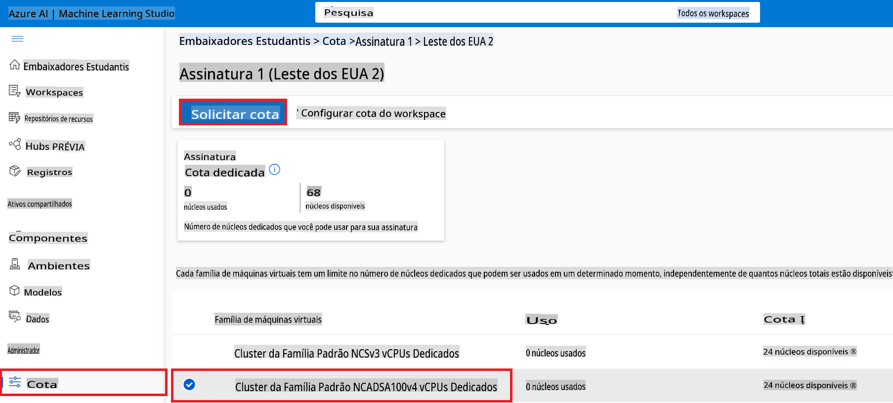

    - Na página de Solicitação de cota, insira o **Novo limite de núcleos** que deseja usar. Por exemplo, 24.
    - Na página de Solicitação de cota, selecione **Enviar** para solicitar a cota de GPU.

> [!NOTE]
> Você pode selecionar a GPU ou CPU apropriada para suas necessidades consultando o documento [Tamanhos de Máquinas Virtuais no Azure](https://learn.microsoft.com/azure/virtual-machines/sizes/overview?tabs=breakdownseries%2Cgeneralsizelist%2Ccomputesizelist%2Cmemorysizelist%2Cstoragesizelist%2Cgpusizelist%2Cfpgasizelist%2Chpcsizelist).

### Adicionar atribuição de função

Para ajustar e implantar seus modelos, primeiro você deve criar uma Identidade Gerenciada Atribuída pelo Usuário (UAI) e atribuir as permissões apropriadas. Esta UAI será usada para autenticação durante a implantação.

#### Criar Identidade Gerenciada Atribuída pelo Usuário (UAI)

1. Digite *identidades gerenciadas* na **barra de pesquisa** no topo da página do portal e selecione **Identidades Gerenciadas** nas opções exibidas.

    

1. Selecione **+ Criar**.

    

1. Realize as seguintes tarefas:

    - Selecione sua **Assinatura do Azure**.
    - Selecione o **Grupo de Recursos** a ser usado (crie um novo, se necessário).
    - Selecione a **Região** que deseja usar.
    - Insira o **Nome**. Ele deve ser um valor único.

1. Selecione **Revisar + criar**.

1. Selecione **+ Criar**.

#### Adicionar função de Contribuidor à Identidade Gerenciada

1. Navegue até o recurso de Identidade Gerenciada que você criou.

1. Selecione **Atribuições de função do Azure** na aba lateral esquerda.

1. Selecione **+Adicionar atribuição de função** no menu de navegação.

1. Na página Adicionar atribuição de função, realize as seguintes tarefas:
    - Selecione o **Escopo** como **Grupo de Recursos**.
    - Selecione sua **Assinatura do Azure**.
    - Selecione o **Grupo de Recursos** a ser usado.
    - Selecione a **Função** como **Contribuidor**.

    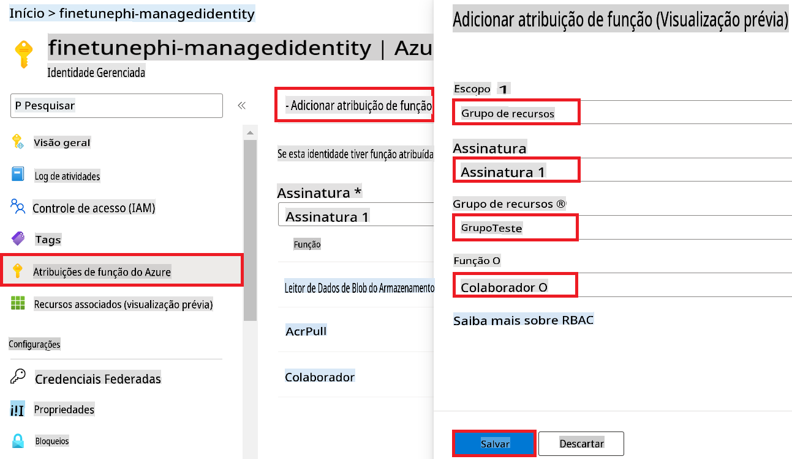

1. Selecione **Salvar**.

#### Adicionar função de Leitor de Dados de Blob do Armazenamento à Identidade Gerenciada

1. Digite *contas de armazenamento* na **barra de pesquisa** no topo da página do portal e selecione **Contas de armazenamento** nas opções exibidas.

    

1. Selecione a conta de armazenamento associada ao workspace do Azure Machine Learning que você criou. Por exemplo, *finetunephistorage*.

1. Realize as seguintes tarefas para navegar até a página Adicionar atribuição de função:

    - Navegue até a conta de armazenamento do Azure que você criou.
    - Selecione **Controle de Acesso (IAM)** na aba lateral esquerda.
    - Selecione **+ Adicionar** no menu de navegação.
    - Selecione **Adicionar atribuição de função** no menu de navegação.

    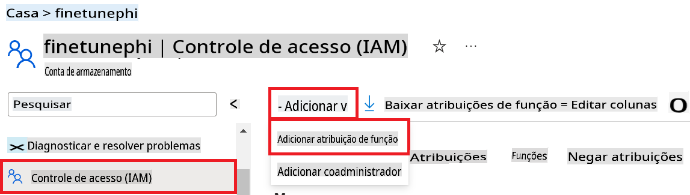

1. Na página Adicionar atribuição de função, realize as seguintes tarefas:

    - Na página Função, digite *Leitor de Dados de Blob do Armazenamento* na **barra de pesquisa** e selecione **Leitor de Dados de Blob do Armazenamento** nas opções exibidas.
    - Na página Função, selecione **Avançar**.
    - Na página Membros, selecione **Atribuir acesso a** **Identidade Gerenciada**.
    - Na página Membros, selecione **+ Selecionar membros**.
    - Na página Selecionar identidades gerenciadas, selecione sua **Assinatura do Azure**.
    - Na página Selecionar identidades gerenciadas, selecione a **Identidade Gerenciada** como **Identidade Gerenciada**.
    - Na página Selecionar identidades gerenciadas, selecione a Identidade Gerenciada que você criou. Por exemplo, *finetunephi-managedidentity*.
    - Na página Selecionar identidades gerenciadas, selecione **Selecionar**.

    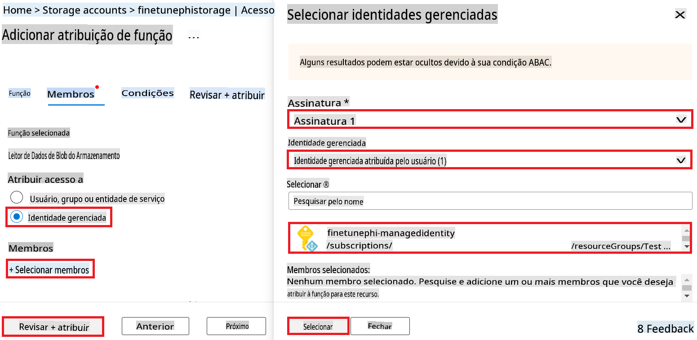

1. Selecione **Revisar + atribuir**.

#### Adicionar função AcrPull à Identidade Gerenciada

1. Digite *registros de contêiner* na **barra de pesquisa** no topo da página do portal e selecione **Registros de contêiner** nas opções exibidas.

    

1. Selecione o registro de contêiner associado ao workspace do Azure Machine Learning. Por exemplo, *finetunephicontainerregistries*.

1. Realize as seguintes tarefas para navegar até a página Adicionar atribuição de função:

    - Selecione **Controle de Acesso (IAM)** na aba lateral esquerda.
    - Selecione **+ Adicionar** no menu de navegação.
    - Selecione **Adicionar atribuição de função** no menu de navegação.

1. Na página Adicionar atribuição de função, realize as seguintes tarefas:

    - Na página Função, digite *AcrPull* na **barra de pesquisa** e selecione **AcrPull** nas opções exibidas.
    - Na página Função, selecione **Avançar**.
    - Na página Membros, selecione **Atribuir acesso a** **Identidade Gerenciada**.
    - Na página Membros, selecione **+ Selecionar membros**.
    - Na página Selecionar identidades gerenciadas, selecione sua **Assinatura do Azure**.
    - Na página Selecionar identidades gerenciadas, selecione a **Identidade Gerenciada** como **Identidade Gerenciada**.
    - Na página Selecionar identidades gerenciadas, selecione a Identidade Gerenciada que você criou. Por exemplo, *finetunephi-managedidentity*.
    - Na página Selecionar identidades gerenciadas, selecione **Selecionar**.
    - Selecione **Revisar + atribuir**.

### Configurar o projeto

Agora, você criará uma pasta para trabalhar e configurará um ambiente virtual para desenvolver um programa que interaja com os usuários e use o histórico de conversas armazenado no Azure Cosmos DB para informar suas respostas.

#### Criar uma pasta para trabalhar

1. Abra uma janela de terminal e digite o seguinte comando para criar uma pasta chamada *finetune-phi* no caminho padrão.

    ```console
    mkdir finetune-phi
    ```

1. Digite o seguinte comando no terminal para navegar até a pasta *finetune-phi* que você criou.

    ```console
    cd finetune-phi
    ```

#### Criar um ambiente virtual

1. Digite o seguinte comando no terminal para criar um ambiente virtual chamado *.venv*.

    ```console
    python -m venv .venv
    ```

1. Digite o seguinte comando no terminal para ativar o ambiente virtual.

    ```console
    .venv\Scripts\activate.bat
    ```

> [!NOTE]
>
> Se funcionar, você verá *(.venv)* antes do prompt de comando.

#### Instalar os pacotes necessários

1. Digite os seguintes comandos no terminal para instalar os pacotes necessários.

    ```console
    pip install datasets==2.19.1
    pip install transformers==4.41.1
    pip install azure-ai-ml==1.16.0
    pip install torch==2.3.1
    pip install trl==0.9.4
    pip install promptflow==1.12.0
    ```

#### Criar arquivos do projeto

Neste exercício, você criará os arquivos essenciais para o nosso projeto. Esses arquivos incluem scripts para baixar o conjunto de dados, configurar o ambiente do Azure Machine Learning, ajustar o modelo Phi-3 e implantar o modelo ajustado. Você também criará um arquivo *conda.yml* para configurar o ambiente de ajuste fino.

Neste exercício, você irá:

- Criar um arquivo *download_dataset.py* para baixar o conjunto de dados.
- Criar um arquivo *setup_ml.py* para configurar o ambiente do Azure Machine Learning.
- Criar um arquivo *fine_tune.py* na pasta *finetuning_dir* para ajustar o modelo Phi-3 usando o conjunto de dados.
- Criar um arquivo *conda.yml* para configurar o ambiente de ajuste fino.
- Criar um arquivo *deploy_model.py* para implantar o modelo ajustado.
- Criar um arquivo *integrate_with_promptflow.py* para integrar o modelo ajustado e executá-lo usando o Prompt flow.
- Criar um arquivo flow.dag.yml para configurar a estrutura de fluxo de trabalho do Prompt flow.
- Criar um arquivo *config.py* para inserir informações do Azure.

> [!NOTE]
>
> Estrutura completa da pasta:
>
> ```text
> └── YourUserName
> .    └── finetune-phi
> .        ├── finetuning_dir
> .        │      └── fine_tune.py
> .        ├── conda.yml
> .        ├── config.py
> .        ├── deploy_model.py
> .        ├── download_dataset.py
> .        ├── flow.dag.yml
> .        ├── integrate_with_promptflow.py
> .        └── setup_ml.py
> ```

1. Abra o **Visual Studio Code**.

1. Selecione **Arquivo** na barra de menu.

1. Selecione **Abrir Pasta**.

1. Selecione a pasta *finetune-phi* que você criou, localizada em *C:\Users\seuNomeDeUsuário\finetune-phi*.

    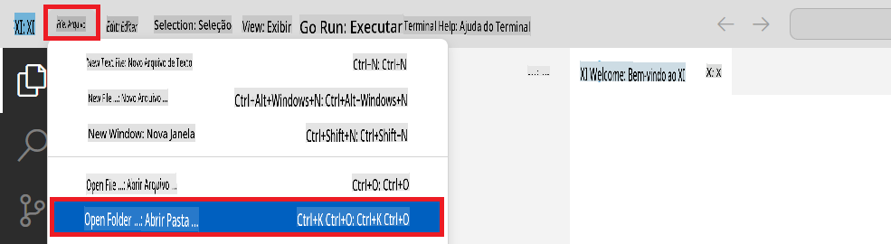

1. No painel esquerdo do Visual Studio Code, clique com o botão direito e selecione **Novo Arquivo** para criar um novo arquivo chamado *download_dataset.py*.

1. No painel esquerdo do Visual Studio Code, clique com o botão direito e selecione **Novo Arquivo** para criar um novo arquivo chamado *setup_ml.py*.

1. No painel esquerdo do Visual Studio Code, clique com o botão direito e selecione **Novo Arquivo** para criar um novo arquivo chamado *deploy_model.py*.

    

1. No painel esquerdo do Visual Studio Code, clique com o botão direito e selecione **Nova Pasta** para criar uma nova pasta chamada *finetuning_dir*.

1. Na pasta *finetuning_dir*, crie um novo arquivo chamado *fine_tune.py*.

#### Criar e Configurar o arquivo *conda.yml*

1. No painel esquerdo do Visual Studio Code, clique com o botão direito e selecione **Novo Arquivo** para criar um novo arquivo chamado *conda.yml*.

1. Adicione o seguinte código ao arquivo *conda.yml* para configurar o ambiente de ajuste fino para o modelo Phi-3.

    ```yml
    name: phi-3-training-env
    channels:
      - defaults
      - conda-forge
    dependencies:
      - python=3.10
      - pip
      - numpy<2.0
      - pip:
          - torch==2.4.0
          - torchvision==0.19.0
          - trl==0.8.6
          - transformers==4.41
          - datasets==2.21.0
          - azureml-core==1.57.0
          - azure-storage-blob==12.19.0
          - azure-ai-ml==1.16
          - azure-identity==1.17.1
          - accelerate==0.33.0
          - mlflow==2.15.1
          - azureml-mlflow==1.57.0
    ```

#### Criar e Configurar o arquivo *config.py*

1. No painel esquerdo do Visual Studio Code, clique com o botão direito e selecione **Novo Arquivo** para criar um novo arquivo chamado *config.py*.

1. Adicione o seguinte código ao arquivo *config.py* para incluir suas informações do Azure.

    ```python
    # Azure settings
    AZURE_SUBSCRIPTION_ID = "your_subscription_id"
    AZURE_RESOURCE_GROUP_NAME = "your_resource_group_name" # "TestGroup"

    # Azure Machine Learning settings
    AZURE_ML_WORKSPACE_NAME = "your_workspace_name" # "finetunephi-workspace"

    # Azure Managed Identity settings
    AZURE_MANAGED_IDENTITY_CLIENT_ID = "your_azure_managed_identity_client_id"
    AZURE_MANAGED_IDENTITY_NAME = "your_azure_managed_identity_name" # "finetunephi-mangedidentity"
    AZURE_MANAGED_IDENTITY_RESOURCE_ID = f"/subscriptions/{AZURE_SUBSCRIPTION_ID}/resourceGroups/{AZURE_RESOURCE_GROUP_NAME}/providers/Microsoft.ManagedIdentity/userAssignedIdentities/{AZURE_MANAGED_IDENTITY_NAME}"

    # Dataset file paths
    TRAIN_DATA_PATH = "data/train_data.jsonl"
    TEST_DATA_PATH = "data/test_data.jsonl"

    # Fine-tuned model settings
    AZURE_MODEL_NAME = "your_fine_tuned_model_name" # "finetune-phi-model"
    AZURE_ENDPOINT_NAME = "your_fine_tuned_model_endpoint_name" # "finetune-phi-endpoint"
    AZURE_DEPLOYMENT_NAME = "your_fine_tuned_model_deployment_name" # "finetune-phi-deployment"

    AZURE_ML_API_KEY = "your_fine_tuned_model_api_key"
    AZURE_ML_ENDPOINT = "your_fine_tuned_model_endpoint_uri" # "https://{your-endpoint-name}.{your-region}.inference.ml.azure.com/score"
    ```

#### Adicionar variáveis de ambiente do Azure

1. Realize as seguintes tarefas para adicionar o ID da Assinatura do Azure:

    - Digite *assinaturas* na **barra de pesquisa** no topo da página do portal e selecione **Assinaturas** nas opções exibidas.
    - Selecione a Assinatura do Azure que você está utilizando.
    - Copie e cole o ID da sua Assinatura no arquivo *config.py*.
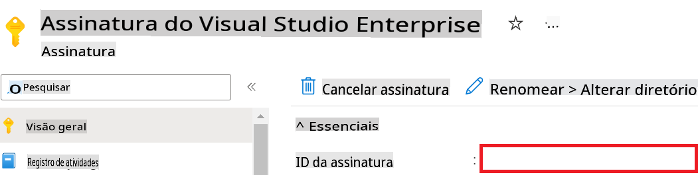

1. Realize as seguintes tarefas para adicionar o Nome do Workspace do Azure:

    - Navegue até o recurso Azure Machine Learning que você criou.
    - Copie e cole o nome da sua conta no arquivo *config.py*.

    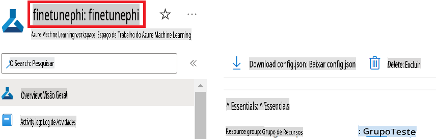

1. Realize as seguintes tarefas para adicionar o Nome do Grupo de Recursos do Azure:

    - Navegue até o recurso Azure Machine Learning que você criou.
    - Copie e cole o Nome do Grupo de Recursos do Azure no arquivo *config.py*.

    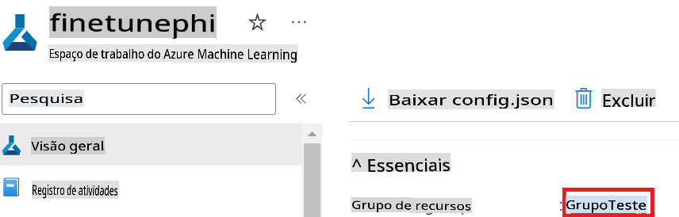

2. Realize as seguintes tarefas para adicionar o nome da Identidade Gerenciada do Azure:

    - Navegue até o recurso de Identidades Gerenciadas que você criou.
    - Copie e cole o nome da sua Identidade Gerenciada do Azure no arquivo *config.py*.

    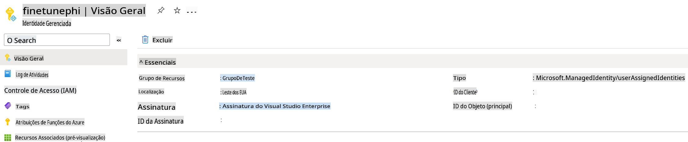

### Preparar o conjunto de dados para ajuste fino

Neste exercício, você executará o arquivo *download_dataset.py* para baixar os conjuntos de dados *ULTRACHAT_200k* para o seu ambiente local. Em seguida, você usará esses conjuntos de dados para ajustar o modelo Phi-3 no Azure Machine Learning.

#### Baixar seu conjunto de dados usando *download_dataset.py*

1. Abra o arquivo *download_dataset.py* no Visual Studio Code.

1. Adicione o seguinte código no arquivo *download_dataset.py*.

    ```python
    import json
    import os
    from datasets import load_dataset
    from config import (
        TRAIN_DATA_PATH,
        TEST_DATA_PATH)

    def load_and_split_dataset(dataset_name, config_name, split_ratio):
        """
        Load and split a dataset.
        """
        # Load the dataset with the specified name, configuration, and split ratio
        dataset = load_dataset(dataset_name, config_name, split=split_ratio)
        print(f"Original dataset size: {len(dataset)}")
        
        # Split the dataset into train and test sets (80% train, 20% test)
        split_dataset = dataset.train_test_split(test_size=0.2)
        print(f"Train dataset size: {len(split_dataset['train'])}")
        print(f"Test dataset size: {len(split_dataset['test'])}")
        
        return split_dataset

    def save_dataset_to_jsonl(dataset, filepath):
        """
        Save a dataset to a JSONL file.
        """
        # Create the directory if it does not exist
        os.makedirs(os.path.dirname(filepath), exist_ok=True)
        
        # Open the file in write mode
        with open(filepath, 'w', encoding='utf-8') as f:
            # Iterate over each record in the dataset
            for record in dataset:
                # Dump the record as a JSON object and write it to the file
                json.dump(record, f)
                # Write a newline character to separate records
                f.write('\n')
        
        print(f"Dataset saved to {filepath}")

    def main():
        """
        Main function to load, split, and save the dataset.
        """
        # Load and split the ULTRACHAT_200k dataset with a specific configuration and split ratio
        dataset = load_and_split_dataset("HuggingFaceH4/ultrachat_200k", 'default', 'train_sft[:1%]')
        
        # Extract the train and test datasets from the split
        train_dataset = dataset['train']
        test_dataset = dataset['test']

        # Save the train dataset to a JSONL file
        save_dataset_to_jsonl(train_dataset, TRAIN_DATA_PATH)
        
        # Save the test dataset to a separate JSONL file
        save_dataset_to_jsonl(test_dataset, TEST_DATA_PATH)

    if __name__ == "__main__":
        main()

    ```

> [!TIP]
>
> **Orientação para ajuste fino com um conjunto de dados mínimo usando uma CPU**
>
> Se você deseja usar uma CPU para ajuste fino, essa abordagem é ideal para quem possui assinaturas com benefícios (como a Assinatura do Visual Studio Enterprise) ou para testar rapidamente o processo de ajuste fino e implantação.
>
> Substitua `dataset = load_and_split_dataset("HuggingFaceH4/ultrachat_200k", 'default', 'train_sft[:1%]')` with `dataset = load_and_split_dataset("HuggingFaceH4/ultrachat_200k", 'default', 'train_sft[:10]')`
>

1. Digite o seguinte comando no seu terminal para executar o script e baixar o conjunto de dados para o seu ambiente local.

    ```console
    python download_data.py
    ```

1. Verifique se os conjuntos de dados foram salvos com sucesso no diretório local *finetune-phi/data*.

> [!NOTE]
>
> **Tamanho do conjunto de dados e tempo de ajuste fino**
>
> Neste exemplo E2E, você usa apenas 1% do conjunto de dados (`train_sft[:1%]`). Isso reduz significativamente a quantidade de dados, acelerando os processos de upload e ajuste fino. Você pode ajustar a porcentagem para encontrar o equilíbrio certo entre o tempo de treinamento e o desempenho do modelo. Usar um subconjunto menor do conjunto de dados reduz o tempo necessário para o ajuste fino, tornando o processo mais gerenciável para um exemplo E2E.

## Cenário 2: Ajustar o modelo Phi-3 e Implantar no Azure Machine Learning Studio

### Configurar o Azure CLI

Você precisa configurar o Azure CLI para autenticar seu ambiente. O Azure CLI permite gerenciar recursos do Azure diretamente pela linha de comando e fornece as credenciais necessárias para o Azure Machine Learning acessar esses recursos. Para começar, instale o [Azure CLI](https://learn.microsoft.com/cli/azure/install-azure-cli).

1. Abra uma janela do terminal e digite o seguinte comando para fazer login na sua conta do Azure.

    ```console
    az login
    ```

1. Selecione a conta do Azure que deseja usar.

1. Selecione a assinatura do Azure que deseja usar.

    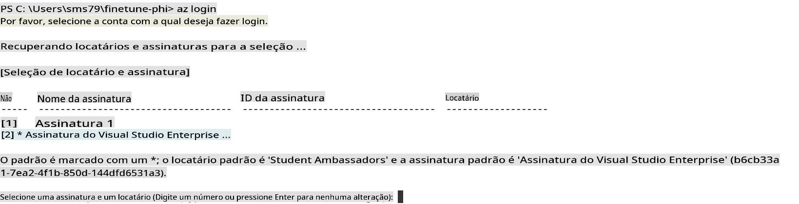

> [!TIP]
>
> Se você estiver tendo problemas para fazer login no Azure, tente usar um código de dispositivo. Abra uma janela do terminal e digite o seguinte comando para fazer login na sua conta do Azure:
>
> ```console
> az login --use-device-code
> ```
>

### Ajustar o modelo Phi-3

Neste exercício, você ajustará o modelo Phi-3 usando o conjunto de dados fornecido. Primeiro, você definirá o processo de ajuste fino no arquivo *fine_tune.py*. Em seguida, configurará o ambiente do Azure Machine Learning e iniciará o processo de ajuste fino executando o arquivo *setup_ml.py*. Este script garante que o ajuste fino ocorra dentro do ambiente do Azure Machine Learning.

Ao executar o *setup_ml.py*, você iniciará o processo de ajuste fino no ambiente do Azure Machine Learning.

#### Adicionar código ao arquivo *fine_tune.py*

1. Navegue até a pasta *finetuning_dir* e abra o arquivo *fine_tune.py* no Visual Studio Code.

1. Adicione o seguinte código no arquivo *fine_tune.py*.

    ```python
    import argparse
    import sys
    import logging
    import os
    from datasets import load_dataset
    import torch
    import mlflow
    from transformers import AutoModelForCausalLM, AutoTokenizer, TrainingArguments
    from trl import SFTTrainer

    # To avoid the INVALID_PARAMETER_VALUE error in MLflow, disable MLflow integration
    os.environ["DISABLE_MLFLOW_INTEGRATION"] = "True"

    # Logging setup
    logging.basicConfig(
        format="%(asctime)s - %(levelname)s - %(name)s - %(message)s",
        datefmt="%Y-%m-%d %H:%M:%S",
        handlers=[logging.StreamHandler(sys.stdout)],
        level=logging.WARNING
    )
    logger = logging.getLogger(__name__)

    def initialize_model_and_tokenizer(model_name, model_kwargs):
        """
        Initialize the model and tokenizer with the given pretrained model name and arguments.
        """
        model = AutoModelForCausalLM.from_pretrained(model_name, **model_kwargs)
        tokenizer = AutoTokenizer.from_pretrained(model_name)
        tokenizer.model_max_length = 2048
        tokenizer.pad_token = tokenizer.unk_token
        tokenizer.pad_token_id = tokenizer.convert_tokens_to_ids(tokenizer.pad_token)
        tokenizer.padding_side = 'right'
        return model, tokenizer

    def apply_chat_template(example, tokenizer):
        """
        Apply a chat template to tokenize messages in the example.
        """
        messages = example["messages"]
        if messages[0]["role"] != "system":
            messages.insert(0, {"role": "system", "content": ""})
        example["text"] = tokenizer.apply_chat_template(
            messages, tokenize=False, add_generation_prompt=False
        )
        return example

    def load_and_preprocess_data(train_filepath, test_filepath, tokenizer):
        """
        Load and preprocess the dataset.
        """
        train_dataset = load_dataset('json', data_files=train_filepath, split='train')
        test_dataset = load_dataset('json', data_files=test_filepath, split='train')
        column_names = list(train_dataset.features)

        train_dataset = train_dataset.map(
            apply_chat_template,
            fn_kwargs={"tokenizer": tokenizer},
            num_proc=10,
            remove_columns=column_names,
            desc="Applying chat template to train dataset",
        )

        test_dataset = test_dataset.map(
            apply_chat_template,
            fn_kwargs={"tokenizer": tokenizer},
            num_proc=10,
            remove_columns=column_names,
            desc="Applying chat template to test dataset",
        )

        return train_dataset, test_dataset

    def train_and_evaluate_model(train_dataset, test_dataset, model, tokenizer, output_dir):
        """
        Train and evaluate the model.
        """
        training_args = TrainingArguments(
            bf16=True,
            do_eval=True,
            output_dir=output_dir,
            eval_strategy="epoch",
            learning_rate=5.0e-06,
            logging_steps=20,
            lr_scheduler_type="cosine",
            num_train_epochs=3,
            overwrite_output_dir=True,
            per_device_eval_batch_size=4,
            per_device_train_batch_size=4,
            remove_unused_columns=True,
            save_steps=500,
            seed=0,
            gradient_checkpointing=True,
            gradient_accumulation_steps=1,
            warmup_ratio=0.2,
        )

        trainer = SFTTrainer(
            model=model,
            args=training_args,
            train_dataset=train_dataset,
            eval_dataset=test_dataset,
            max_seq_length=2048,
            dataset_text_field="text",
            tokenizer=tokenizer,
            packing=True
        )

        train_result = trainer.train()
        trainer.log_metrics("train", train_result.metrics)

        mlflow.transformers.log_model(
            transformers_model={"model": trainer.model, "tokenizer": tokenizer},
            artifact_path=output_dir,
        )

        tokenizer.padding_side = 'left'
        eval_metrics = trainer.evaluate()
        eval_metrics["eval_samples"] = len(test_dataset)
        trainer.log_metrics("eval", eval_metrics)

    def main(train_file, eval_file, model_output_dir):
        """
        Main function to fine-tune the model.
        """
        model_kwargs = {
            "use_cache": False,
            "trust_remote_code": True,
            "torch_dtype": torch.bfloat16,
            "device_map": None,
            "attn_implementation": "eager"
        }

        # pretrained_model_name = "microsoft/Phi-3-mini-4k-instruct"
        pretrained_model_name = "microsoft/Phi-3.5-mini-instruct"

        with mlflow.start_run():
            model, tokenizer = initialize_model_and_tokenizer(pretrained_model_name, model_kwargs)
            train_dataset, test_dataset = load_and_preprocess_data(train_file, eval_file, tokenizer)
            train_and_evaluate_model(train_dataset, test_dataset, model, tokenizer, model_output_dir)

    if __name__ == "__main__":
        parser = argparse.ArgumentParser()
        parser.add_argument("--train-file", type=str, required=True, help="Path to the training data")
        parser.add_argument("--eval-file", type=str, required=True, help="Path to the evaluation data")
        parser.add_argument("--model_output_dir", type=str, required=True, help="Directory to save the fine-tuned model")
        args = parser.parse_args()
        main(args.train_file, args.eval_file, args.model_output_dir)

    ```

1. Salve e feche o arquivo *fine_tune.py*.

> [!TIP]
> **Você pode ajustar o modelo Phi-3.5**
>
> No arquivo *fine_tune.py*, você pode alterar o campo `pretrained_model_name` from `"microsoft/Phi-3-mini-4k-instruct"` to any model you want to fine-tune. For example, if you change it to `"microsoft/Phi-3.5-mini-instruct"`, you'll be using the Phi-3.5-mini-instruct model for fine-tuning. To find and use the model name you prefer, visit [Hugging Face](https://huggingface.co/), search for the model you're interested in, and then copy and paste its name into the `pretrained_model_name` no seu script.
>
> :::image type="content" source="../../imgs/03/FineTuning-PromptFlow/finetunephi3.5.png" alt-text="Ajustar Phi-3.5.":::
>

#### Adicionar código ao arquivo *setup_ml.py*

1. Abra o arquivo *setup_ml.py* no Visual Studio Code.

1. Adicione o seguinte código no arquivo *setup_ml.py*.

    ```python
    import logging
    from azure.ai.ml import MLClient, command, Input
    from azure.ai.ml.entities import Environment, AmlCompute
    from azure.identity import AzureCliCredential
    from config import (
        AZURE_SUBSCRIPTION_ID,
        AZURE_RESOURCE_GROUP_NAME,
        AZURE_ML_WORKSPACE_NAME,
        TRAIN_DATA_PATH,
        TEST_DATA_PATH
    )

    # Constants

    # Uncomment the following lines to use a CPU instance for training
    # COMPUTE_INSTANCE_TYPE = "Standard_E16s_v3" # cpu
    # COMPUTE_NAME = "cpu-e16s-v3"
    # DOCKER_IMAGE_NAME = "mcr.microsoft.com/azureml/openmpi4.1.0-ubuntu20.04:latest"

    # Uncomment the following lines to use a GPU instance for training
    COMPUTE_INSTANCE_TYPE = "Standard_NC24ads_A100_v4"
    COMPUTE_NAME = "gpu-nc24s-a100-v4"
    DOCKER_IMAGE_NAME = "mcr.microsoft.com/azureml/curated/acft-hf-nlp-gpu:59"

    CONDA_FILE = "conda.yml"
    LOCATION = "eastus2" # Replace with the location of your compute cluster
    FINETUNING_DIR = "./finetuning_dir" # Path to the fine-tuning script
    TRAINING_ENV_NAME = "phi-3-training-environment" # Name of the training environment
    MODEL_OUTPUT_DIR = "./model_output" # Path to the model output directory in azure ml

    # Logging setup to track the process
    logger = logging.getLogger(__name__)
    logging.basicConfig(
        format="%(asctime)s - %(levelname)s - %(name)s - %(message)s",
        datefmt="%Y-%m-%d %H:%M:%S",
        level=logging.WARNING
    )

    def get_ml_client():
        """
        Initialize the ML Client using Azure CLI credentials.
        """
        credential = AzureCliCredential()
        return MLClient(credential, AZURE_SUBSCRIPTION_ID, AZURE_RESOURCE_GROUP_NAME, AZURE_ML_WORKSPACE_NAME)

    def create_or_get_environment(ml_client):
        """
        Create or update the training environment in Azure ML.
        """
        env = Environment(
            image=DOCKER_IMAGE_NAME,  # Docker image for the environment
            conda_file=CONDA_FILE,  # Conda environment file
            name=TRAINING_ENV_NAME,  # Name of the environment
        )
        return ml_client.environments.create_or_update(env)

    def create_or_get_compute_cluster(ml_client, compute_name, COMPUTE_INSTANCE_TYPE, location):
        """
        Create or update the compute cluster in Azure ML.
        """
        try:
            compute_cluster = ml_client.compute.get(compute_name)
            logger.info(f"Compute cluster '{compute_name}' already exists. Reusing it for the current run.")
        except Exception:
            logger.info(f"Compute cluster '{compute_name}' does not exist. Creating a new one with size {COMPUTE_INSTANCE_TYPE}.")
            compute_cluster = AmlCompute(
                name=compute_name,
                size=COMPUTE_INSTANCE_TYPE,
                location=location,
                tier="Dedicated",  # Tier of the compute cluster
                min_instances=0,  # Minimum number of instances
                max_instances=1  # Maximum number of instances
            )
            ml_client.compute.begin_create_or_update(compute_cluster).wait()  # Wait for the cluster to be created
        return compute_cluster

    def create_fine_tuning_job(env, compute_name):
        """
        Set up the fine-tuning job in Azure ML.
        """
        return command(
            code=FINETUNING_DIR,  # Path to fine_tune.py
            command=(
                "python fine_tune.py "
                "--train-file ${{inputs.train_file}} "
                "--eval-file ${{inputs.eval_file}} "
                "--model_output_dir ${{inputs.model_output}}"
            ),
            environment=env,  # Training environment
            compute=compute_name,  # Compute cluster to use
            inputs={
                "train_file": Input(type="uri_file", path=TRAIN_DATA_PATH),  # Path to the training data file
                "eval_file": Input(type="uri_file", path=TEST_DATA_PATH),  # Path to the evaluation data file
                "model_output": MODEL_OUTPUT_DIR
            }
        )

    def main():
        """
        Main function to set up and run the fine-tuning job in Azure ML.
        """
        # Initialize ML Client
        ml_client = get_ml_client()

        # Create Environment
        env = create_or_get_environment(ml_client)
        
        # Create or get existing compute cluster
        create_or_get_compute_cluster(ml_client, COMPUTE_NAME, COMPUTE_INSTANCE_TYPE, LOCATION)

        # Create and Submit Fine-Tuning Job
        job = create_fine_tuning_job(env, COMPUTE_NAME)
        returned_job = ml_client.jobs.create_or_update(job)  # Submit the job
        ml_client.jobs.stream(returned_job.name)  # Stream the job logs
        
        # Capture the job name
        job_name = returned_job.name
        print(f"Job name: {job_name}")

    if __name__ == "__main__":
        main()

    ```

1. Substitua `COMPUTE_INSTANCE_TYPE`, `COMPUTE_NAME`, and `LOCATION` pelos seus detalhes específicos.

    ```python
   # Uncomment the following lines to use a GPU instance for training
    COMPUTE_INSTANCE_TYPE = "Standard_NC24ads_A100_v4"
    COMPUTE_NAME = "gpu-nc24s-a100-v4"
    ...
    LOCATION = "eastus2" # Replace with the location of your compute cluster
    ```

> [!TIP]
>
> **Orientação para ajuste fino com um conjunto de dados mínimo usando uma CPU**
>
> Se você deseja usar uma CPU para ajuste fino, essa abordagem é ideal para quem possui assinaturas com benefícios (como a Assinatura do Visual Studio Enterprise) ou para testar rapidamente o processo de ajuste fino e implantação.
>
> 1. Abra o arquivo *setup_ml*.
> 1. Substitua `COMPUTE_INSTANCE_TYPE`, `COMPUTE_NAME`, and `DOCKER_IMAGE_NAME` with the following. If you do not have access to *Standard_E16s_v3*, you can use an equivalent CPU instance or request a new quota.
> 1. Replace `LOCATION` pelos seus detalhes específicos.
>
>    ```python
>    # Uncomment the following lines to use a CPU instance for training
>    COMPUTE_INSTANCE_TYPE = "Standard_E16s_v3" # cpu
>    COMPUTE_NAME = "cpu-e16s-v3"
>    DOCKER_IMAGE_NAME = "mcr.microsoft.com/azureml/openmpi4.1.0-ubuntu20.04:latest"
>    LOCATION = "eastus2" # Replace with the location of your compute cluster
>    ```
>

1. Digite o seguinte comando para executar o script *setup_ml.py* e iniciar o processo de ajuste fino no Azure Machine Learning.

    ```python
    python setup_ml.py
    ```

1. Neste exercício, você ajustou com sucesso o modelo Phi-3 usando o Azure Machine Learning. Ao executar o script *setup_ml.py*, você configurou o ambiente do Azure Machine Learning e iniciou o processo de ajuste fino definido no arquivo *fine_tune.py*. Observe que o processo de ajuste fino pode levar um tempo considerável. Após executar o `python setup_ml.py` command, you need to wait for the process to complete. You can monitor the status of the fine-tuning job by following the link provided in the terminal to the Azure Machine Learning portal.

    

### Deploy the fine-tuned model

To integrate the fine-tuned Phi-3 model with Prompt Flow, you need to deploy the model to make it accessible for real-time inference. This process involves registering the model, creating an online endpoint, and deploying the model.

#### Set the model name, endpoint name, and deployment name for deployment

1. Open *config.py* file.

1. Replace `AZURE_MODEL_NAME = "your_fine_tuned_model_name"` with the desired name for your model.

1. Replace `AZURE_ENDPOINT_NAME = "your_fine_tuned_model_endpoint_name"` with the desired name for your endpoint.

1. Replace `AZURE_DEPLOYMENT_NAME = "your_fine_tuned_model_deployment_name"` com o nome desejado para sua implantação.

#### Adicionar código ao arquivo *deploy_model.py*

Executar o arquivo *deploy_model.py* automatiza todo o processo de implantação. Ele registra o modelo, cria um endpoint e executa a implantação com base nas configurações especificadas no arquivo config.py, que inclui o nome do modelo, o nome do endpoint e o nome da implantação.

1. Abra o arquivo *deploy_model.py* no Visual Studio Code.

1. Adicione o seguinte código no arquivo *deploy_model.py*.

    ```python
    import logging
    from azure.identity import AzureCliCredential
    from azure.ai.ml import MLClient
    from azure.ai.ml.entities import Model, ProbeSettings, ManagedOnlineEndpoint, ManagedOnlineDeployment, IdentityConfiguration, ManagedIdentityConfiguration, OnlineRequestSettings
    from azure.ai.ml.constants import AssetTypes

    # Configuration imports
    from config import (
        AZURE_SUBSCRIPTION_ID,
        AZURE_RESOURCE_GROUP_NAME,
        AZURE_ML_WORKSPACE_NAME,
        AZURE_MANAGED_IDENTITY_RESOURCE_ID,
        AZURE_MANAGED_IDENTITY_CLIENT_ID,
        AZURE_MODEL_NAME,
        AZURE_ENDPOINT_NAME,
        AZURE_DEPLOYMENT_NAME
    )

    # Constants
    JOB_NAME = "your-job-name"
    COMPUTE_INSTANCE_TYPE = "Standard_E4s_v3"

    deployment_env_vars = {
        "SUBSCRIPTION_ID": AZURE_SUBSCRIPTION_ID,
        "RESOURCE_GROUP_NAME": AZURE_RESOURCE_GROUP_NAME,
        "UAI_CLIENT_ID": AZURE_MANAGED_IDENTITY_CLIENT_ID,
    }

    # Logging setup
    logging.basicConfig(
        format="%(asctime)s - %(levelname)s - %(name)s - %(message)s",
        datefmt="%Y-%m-%d %H:%M:%S",
        level=logging.DEBUG
    )
    logger = logging.getLogger(__name__)

    def get_ml_client():
        """Initialize and return the ML Client."""
        credential = AzureCliCredential()
        return MLClient(credential, AZURE_SUBSCRIPTION_ID, AZURE_RESOURCE_GROUP_NAME, AZURE_ML_WORKSPACE_NAME)

    def register_model(ml_client, model_name, job_name):
        """Register a new model."""
        model_path = f"azureml://jobs/{job_name}/outputs/artifacts/paths/model_output"
        logger.info(f"Registering model {model_name} from job {job_name} at path {model_path}.")
        run_model = Model(
            path=model_path,
            name=model_name,
            description="Model created from run.",
            type=AssetTypes.MLFLOW_MODEL,
        )
        model = ml_client.models.create_or_update(run_model)
        logger.info(f"Registered model ID: {model.id}")
        return model

    def delete_existing_endpoint(ml_client, endpoint_name):
        """Delete existing endpoint if it exists."""
        try:
            endpoint_result = ml_client.online_endpoints.get(name=endpoint_name)
            logger.info(f"Deleting existing endpoint {endpoint_name}.")
            ml_client.online_endpoints.begin_delete(name=endpoint_name).result()
            logger.info(f"Deleted existing endpoint {endpoint_name}.")
        except Exception as e:
            logger.info(f"No existing endpoint {endpoint_name} found to delete: {e}")

    def create_or_update_endpoint(ml_client, endpoint_name, description=""):
        """Create or update an endpoint."""
        delete_existing_endpoint(ml_client, endpoint_name)
        logger.info(f"Creating new endpoint {endpoint_name}.")
        endpoint = ManagedOnlineEndpoint(
            name=endpoint_name,
            description=description,
            identity=IdentityConfiguration(
                type="user_assigned",
                user_assigned_identities=[ManagedIdentityConfiguration(resource_id=AZURE_MANAGED_IDENTITY_RESOURCE_ID)]
            )
        )
        endpoint_result = ml_client.online_endpoints.begin_create_or_update(endpoint).result()
        logger.info(f"Created new endpoint {endpoint_name}.")
        return endpoint_result

    def create_or_update_deployment(ml_client, endpoint_name, deployment_name, model):
        """Create or update a deployment."""

        logger.info(f"Creating deployment {deployment_name} for endpoint {endpoint_name}.")
        deployment = ManagedOnlineDeployment(
            name=deployment_name,
            endpoint_name=endpoint_name,
            model=model.id,
            instance_type=COMPUTE_INSTANCE_TYPE,
            instance_count=1,
            environment_variables=deployment_env_vars,
            request_settings=OnlineRequestSettings(
                max_concurrent_requests_per_instance=3,
                request_timeout_ms=180000,
                max_queue_wait_ms=120000
            ),
            liveness_probe=ProbeSettings(
                failure_threshold=30,
                success_threshold=1,
                period=100,
                initial_delay=500,
            ),
            readiness_probe=ProbeSettings(
                failure_threshold=30,
                success_threshold=1,
                period=100,
                initial_delay=500,
            ),
        )
        deployment_result = ml_client.online_deployments.begin_create_or_update(deployment).result()
        logger.info(f"Created deployment {deployment.name} for endpoint {endpoint_name}.")
        return deployment_result

    def set_traffic_to_deployment(ml_client, endpoint_name, deployment_name):
        """Set traffic to the specified deployment."""
        try:
            # Fetch the current endpoint details
            endpoint = ml_client.online_endpoints.get(name=endpoint_name)
            
            # Log the current traffic allocation for debugging
            logger.info(f"Current traffic allocation: {endpoint.traffic}")
            
            # Set the traffic allocation for the deployment
            endpoint.traffic = {deployment_name: 100}
            
            # Update the endpoint with the new traffic allocation
            endpoint_poller = ml_client.online_endpoints.begin_create_or_update(endpoint)
            updated_endpoint = endpoint_poller.result()
            
            # Log the updated traffic allocation for debugging
            logger.info(f"Updated traffic allocation: {updated_endpoint.traffic}")
            logger.info(f"Set traffic to deployment {deployment_name} at endpoint {endpoint_name}.")
            return updated_endpoint
        except Exception as e:
            # Log any errors that occur during the process
            logger.error(f"Failed to set traffic to deployment: {e}")
            raise


    def main():
        ml_client = get_ml_client()

        registered_model = register_model(ml_client, AZURE_MODEL_NAME, JOB_NAME)
        logger.info(f"Registered model ID: {registered_model.id}")

        endpoint = create_or_update_endpoint(ml_client, AZURE_ENDPOINT_NAME, "Endpoint for finetuned Phi-3 model")
        logger.info(f"Endpoint {AZURE_ENDPOINT_NAME} is ready.")

        try:
            deployment = create_or_update_deployment(ml_client, AZURE_ENDPOINT_NAME, AZURE_DEPLOYMENT_NAME, registered_model)
            logger.info(f"Deployment {AZURE_DEPLOYMENT_NAME} is created for endpoint {AZURE_ENDPOINT_NAME}.")

            set_traffic_to_deployment(ml_client, AZURE_ENDPOINT_NAME, AZURE_DEPLOYMENT_NAME)
            logger.info(f"Traffic is set to deployment {AZURE_DEPLOYMENT_NAME} at endpoint {AZURE_ENDPOINT_NAME}.")
        except Exception as e:
            logger.error(f"Failed to create or update deployment: {e}")

    if __name__ == "__main__":
        main()

    ```

1. Realize as seguintes tarefas para obter o `JOB_NAME`:

    - Navigate to Azure Machine Learning resource that you created.
    - Select **Studio web URL** to open the Azure Machine Learning workspace.
    - Select **Jobs** from the left side tab.
    - Select the experiment for fine-tuning. For example, *finetunephi*.
    - Select the job that you created.
    - Copy and paste your job Name into the `JOB_NAME = "your-job-name"` in *deploy_model.py* file.

1. Replace `COMPUTE_INSTANCE_TYPE` com seus detalhes específicos.

1. Digite o seguinte comando para executar o script *deploy_model.py* e iniciar o processo de implantação no Azure Machine Learning.

    ```python
    python deploy_model.py
    ```

> [!WARNING]
> Para evitar cobranças adicionais na sua conta, certifique-se de excluir o endpoint criado no workspace do Azure Machine Learning.
>

#### Verificar status da implantação no workspace do Azure Machine Learning

1. Visite [Azure ML Studio](https://ml.azure.com/home?wt.mc_id=studentamb_279723).

1. Navegue até o workspace do Azure Machine Learning que você criou.

1. Selecione **Studio web URL** para abrir o workspace do Azure Machine Learning.

1. Selecione **Endpoints** na aba do lado esquerdo.

    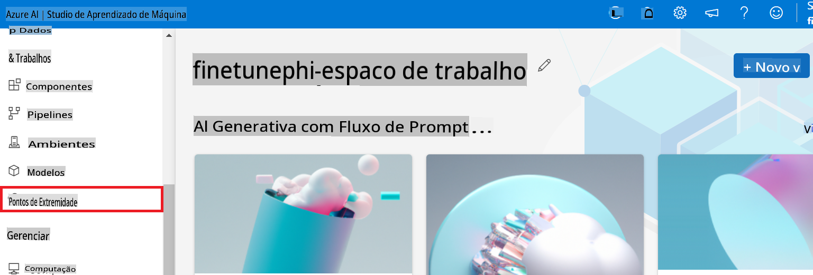

2. Selecione o endpoint que você criou.

    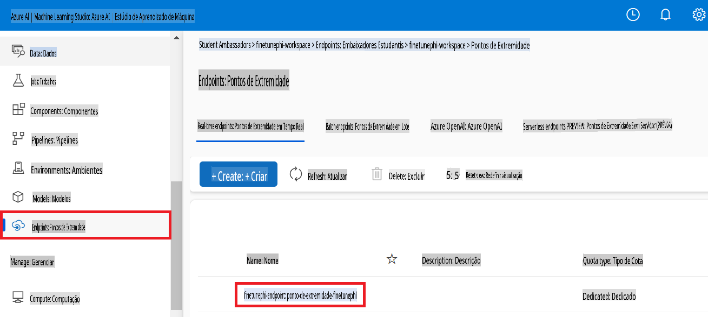

3. Nesta página, você pode gerenciar os endpoints criados durante o processo de implantação.

## Cenário 3: Integrar com Prompt flow e conversar com seu modelo personalizado

### Integrar o modelo Phi-3 personalizado com o Prompt flow

Após implantar com sucesso seu modelo ajustado, você pode agora integrá-lo com o Prompt flow para usar seu modelo em aplicações em tempo real, permitindo uma variedade de tarefas interativas com seu modelo Phi-3 personalizado.

#### Configurar chave de API e URI do endpoint do modelo Phi-3 ajustado

1. Navegue até o workspace do Azure Machine Learning que você criou.
1. Selecione **Endpoints** na aba do lado esquerdo.
1. Selecione o endpoint que você criou.
1. Selecione **Consume** no menu de navegação.
1. Copie e cole seu **REST endpoint** no arquivo *config.py*, substituindo `AZURE_ML_ENDPOINT = "your_fine_tuned_model_endpoint_uri"` with your **REST endpoint**.
1. Copy and paste your **Primary key** into the *config.py* file, replacing `AZURE_ML_API_KEY = "your_fine_tuned_model_api_key"` pela sua **Chave primária**.

    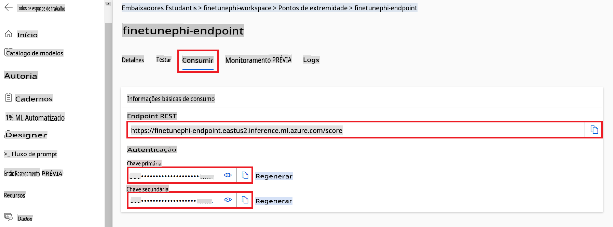

#### Adicionar código ao arquivo *flow.dag.yml*

1. Abra o arquivo *flow.dag.yml* no Visual Studio Code.

1. Adicione o seguinte código no arquivo *flow.dag.yml*.

    ```yml
    inputs:
      input_data:
        type: string
        default: "Who founded Microsoft?"

    outputs:
      answer:
        type: string
        reference: ${integrate_with_promptflow.output}

    nodes:
    - name: integrate_with_promptflow
      type: python
      source:
        type: code
        path: integrate_with_promptflow.py
      inputs:
        input_data: ${inputs.input_data}
    ```

#### Adicionar código ao arquivo *integrate_with_promptflow.py*

1. Abra o arquivo *integrate_with_promptflow.py* no Visual Studio Code.

1. Adicione o seguinte código no arquivo *integrate_with_promptflow.py*.

    ```python
    import logging
    import requests
    from promptflow.core import tool
    import asyncio
    import platform
    from config import (
        AZURE_ML_ENDPOINT,
        AZURE_ML_API_KEY
    )

    # Logging setup
    logging.basicConfig(
        format="%(asctime)s - %(levelname)s - %(name)s - %(message)s",
        datefmt="%Y-%m-%d %H:%M:%S",
        level=logging.DEBUG
    )
    logger = logging.getLogger(__name__)

    def query_azml_endpoint(input_data: list, endpoint_url: str, api_key: str) -> str:
        """
        Send a request to the Azure ML endpoint with the given input data.
        """
        headers = {
            "Content-Type": "application/json",
            "Authorization": f"Bearer {api_key}"
        }
        data = {
            "input_data": [input_data],
            "params": {
                "temperature": 0.7,
                "max_new_tokens": 128,
                "do_sample": True,
                "return_full_text": True
            }
        }
        try:
            response = requests.post(endpoint_url, json=data, headers=headers)
            response.raise_for_status()
            result = response.json()[0]
            logger.info("Successfully received response from Azure ML Endpoint.")
            return result
        except requests.exceptions.RequestException as e:
            logger.error(f"Error querying Azure ML Endpoint: {e}")
            raise

    def setup_asyncio_policy():
        """
        Setup asyncio event loop policy for Windows.
        """
        if platform.system() == 'Windows':
            asyncio.set_event_loop_policy(asyncio.WindowsSelectorEventLoopPolicy())
            logger.info("Set Windows asyncio event loop policy.")

    @tool
    def my_python_tool(input_data: str) -> str:
        """
        Tool function to process input data and query the Azure ML endpoint.
        """
        setup_asyncio_policy()
        return query_azml_endpoint(input_data, AZURE_ML_ENDPOINT, AZURE_ML_API_KEY)

    ```

### Conversar com seu modelo personalizado

1. Digite o seguinte comando para executar o script *deploy_model.py* e iniciar o processo de implantação no Azure Machine Learning.

    ```python
    pf flow serve --source ./ --port 8080 --host localhost
    ```

1. Aqui está um exemplo dos resultados: Agora você pode conversar com seu modelo Phi-3 personalizado. Recomenda-se fazer perguntas baseadas nos dados usados para o ajuste fino.

    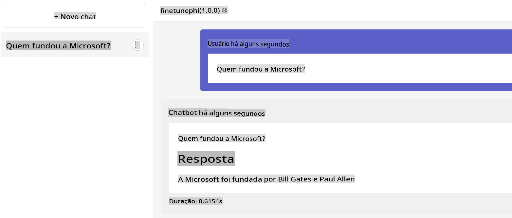

**Aviso Legal**:  
Este documento foi traduzido utilizando serviços de tradução baseados em IA. Embora nos esforcemos para garantir a precisão, esteja ciente de que traduções automáticas podem conter erros ou imprecisões. O documento original em seu idioma nativo deve ser considerado a fonte oficial. Para informações críticas, recomenda-se a tradução profissional feita por humanos. Não nos responsabilizamos por quaisquer mal-entendidos ou interpretações equivocadas decorrentes do uso desta tradução.