# Ajustar e Integrar Modelos Personalizados Phi-3 com Prompt Flow no Azure AI Foundry

Este exemplo de ponta a ponta (E2E) é baseado no guia "[Ajustar e Integrar Modelos Personalizados Phi-3 com Prompt Flow no Azure AI Foundry](https://techcommunity.microsoft.com/t5/educator-developer-blog/fine-tune-and-integrate-custom-phi-3-models-with-prompt-flow-in/ba-p/4191726?WT.mc_id=aiml-137032-kinfeylo)" da Comunidade Técnica da Microsoft. Ele apresenta os processos de ajuste fino, implantação e integração de modelos personalizados Phi-3 com Prompt Flow no Azure AI Foundry.  
Diferentemente do exemplo E2E "[Ajustar e Integrar Modelos Personalizados Phi-3 com Prompt Flow](./E2E_Phi-3-FineTuning_PromptFlow_Integration.md)", que envolvia a execução de código localmente, este tutorial foca inteiramente no ajuste fino e na integração do modelo dentro do Azure AI / ML Studio.

## Visão Geral

Neste exemplo E2E, você aprenderá como ajustar o modelo Phi-3 e integrá-lo com o Prompt Flow no Azure AI Foundry. Aproveitando o Azure AI / ML Studio, você estabelecerá um fluxo de trabalho para implantar e utilizar modelos de IA personalizados. Este exemplo E2E está dividido em três cenários:

**Cenário 1: Configurar os recursos do Azure e Preparar para o ajuste fino**

**Cenário 2: Ajustar o modelo Phi-3 e Implantar no Azure Machine Learning Studio**

**Cenário 3: Integrar com Prompt Flow e Conversar com seu modelo personalizado no Azure AI Foundry**

Aqui está uma visão geral deste exemplo E2E.


### Índice

1. **[Cenário 1: Configurar os recursos do Azure e Preparar para o ajuste fino](../../../../../../md/02.Application/01.TextAndChat/Phi3)**  
    - [Criar um Workspace no Azure Machine Learning](../../../../../../md/02.Application/01.TextAndChat/Phi3)  
    - [Solicitar quotas de GPU na Assinatura do Azure](../../../../../../md/02.Application/01.TextAndChat/Phi3)  
    - [Adicionar atribuição de função](../../../../../../md/02.Application/01.TextAndChat/Phi3)  
    - [Configurar o projeto](../../../../../../md/02.Application/01.TextAndChat/Phi3)  
    - [Preparar o conjunto de dados para ajuste fino](../../../../../../md/02.Application/01.TextAndChat/Phi3)  

2. **[Cenário 2: Ajustar o modelo Phi-3 e Implantar no Azure Machine Learning Studio](../../../../../../md/02.Application/01.TextAndChat/Phi3)**  
    - [Ajustar o modelo Phi-3](../../../../../../md/02.Application/01.TextAndChat/Phi3)  
    - [Implantar o modelo Phi-3 ajustado](../../../../../../md/02.Application/01.TextAndChat/Phi3)  

3. **[Cenário 3: Integrar com Prompt Flow e Conversar com seu modelo personalizado no Azure AI Foundry](../../../../../../md/02.Application/01.TextAndChat/Phi3)**  
    - [Integrar o modelo Phi-3 personalizado com Prompt Flow](../../../../../../md/02.Application/01.TextAndChat/Phi3)  
    - [Conversar com seu modelo personalizado Phi-3](../../../../../../md/02.Application/01.TextAndChat/Phi3)  

## Cenário 1: Configurar os recursos do Azure e Preparar para o ajuste fino

### Criar um Workspace no Azure Machine Learning

1. Digite *azure machine learning* na **barra de pesquisa** no topo da página do portal e selecione **Azure Machine Learning** entre as opções exibidas.

    

2. Selecione **+ Criar** no menu de navegação.

3. Selecione **Novo workspace** no menu de navegação.

    

4. Realize as seguintes tarefas:

    - Selecione sua **Assinatura** do Azure.  
    - Escolha o **Grupo de Recursos** a ser usado (crie um novo, se necessário).  
    - Insira o **Nome do Workspace**. Deve ser um valor único.  
    - Escolha a **Região** que deseja usar.  
    - Escolha a **Conta de Armazenamento** a ser usada (crie uma nova, se necessário).  
    - Escolha o **Key Vault** a ser usado (crie um novo, se necessário).  
    - Escolha o **Application Insights** a ser usado (crie um novo, se necessário).  
    - Escolha o **Container Registry** a ser usado (crie um novo, se necessário).  

    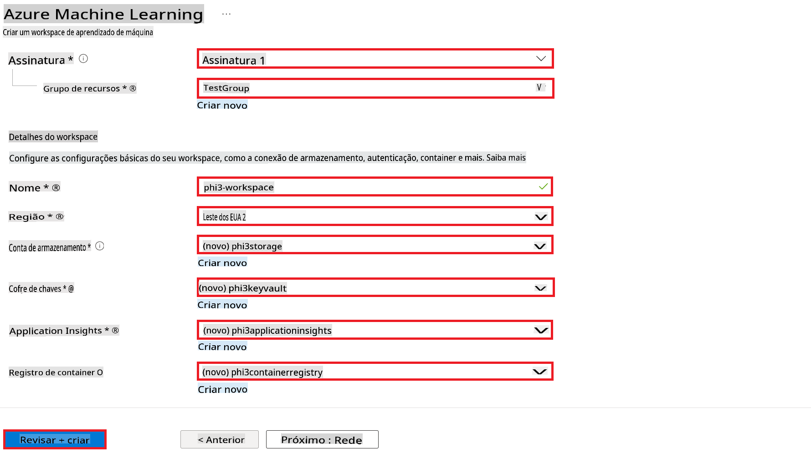

5. Selecione **Revisar + Criar**.

6. Clique em **Criar**.

### Solicitar quotas de GPU na Assinatura do Azure

Neste tutorial, você aprenderá como ajustar e implantar um modelo Phi-3 usando GPUs. Para o ajuste fino, será usada a GPU *Standard_NC24ads_A100_v4*, que requer uma solicitação de quota. Para a implantação, será usada a GPU *Standard_NC6s_v3*, que também exige uma solicitação de quota.

> [!NOTE]
>
> Apenas assinaturas Pay-As-You-Go (o tipo de assinatura padrão) são elegíveis para alocação de GPU; assinaturas de benefícios atualmente não são suportadas.
>

1. Acesse [Azure ML Studio](https://ml.azure.com/home?wt.mc_id=studentamb_279723).

1. Realize as seguintes tarefas para solicitar a quota *Standard NCADSA100v4 Family*:

    - Selecione **Quota** no menu lateral esquerdo.  
    - Escolha a **Família de Máquinas Virtuais** a ser usada. Por exemplo, selecione **Standard NCADSA100v4 Family Cluster Dedicated vCPUs**, que inclui a GPU *Standard_NC24ads_A100_v4*.  
    - Clique em **Solicitar quota** no menu de navegação.

        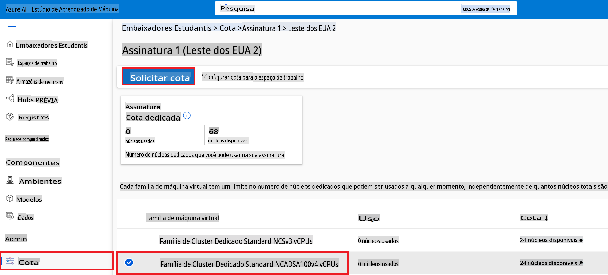

    - Na página de Solicitação de Quota, insira o **Novo limite de núcleos** que deseja usar. Por exemplo, 24.  
    - Na página de Solicitação de Quota, clique em **Enviar** para solicitar a quota de GPU.  

1. Realize as seguintes tarefas para solicitar a quota *Standard NCSv3 Family*:

    - Selecione **Quota** no menu lateral esquerdo.  
    - Escolha a **Família de Máquinas Virtuais** a ser usada. Por exemplo, selecione **Standard NCSv3 Family Cluster Dedicated vCPUs**, que inclui a GPU *Standard_NC6s_v3*.  
    - Clique em **Solicitar quota** no menu de navegação.  
    - Na página de Solicitação de Quota, insira o **Novo limite de núcleos** que deseja usar. Por exemplo, 24.  
    - Na página de Solicitação de Quota, clique em **Enviar** para solicitar a quota de GPU.  

### Adicionar atribuição de função

Para ajustar e implantar seus modelos, você deve primeiro criar uma Identidade Gerenciada Atribuída ao Usuário (UAI) e atribuir as permissões apropriadas. Essa UAI será usada para autenticação durante a implantação.

#### Criar Identidade Gerenciada Atribuída ao Usuário (UAI)

1. Digite *identidades gerenciadas* na **barra de pesquisa** no topo da página do portal e selecione **Identidades Gerenciadas** entre as opções exibidas.

    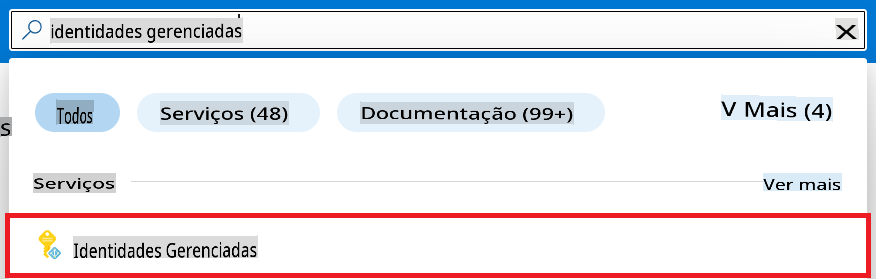

1. Selecione **+ Criar**.

    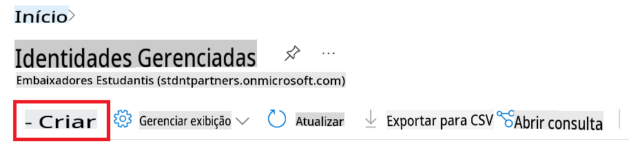

1. Realize as seguintes tarefas:

    - Escolha sua **Assinatura** do Azure.  
    - Escolha o **Grupo de Recursos** a ser usado (crie um novo, se necessário).  
    - Escolha a **Região** que deseja usar.  
    - Insira o **Nome**. Deve ser um valor único.  

    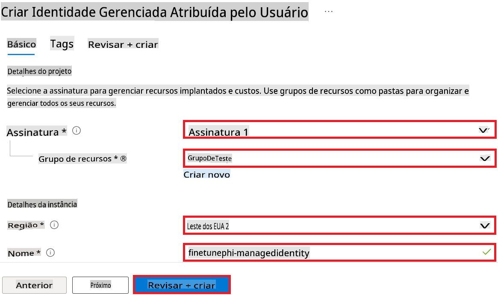

1. Clique em **Revisar + criar**.

1. Clique em **Criar**.

#### Adicionar função de Contribuidor à Identidade Gerenciada

1. Navegue até o recurso de Identidade Gerenciada que você criou.

1. Selecione **Atribuições de função do Azure** no menu lateral esquerdo.

1. Clique em **+Adicionar atribuição de função** no menu de navegação.

1. Na página de Adicionar Atribuição de Função, realize as seguintes tarefas:
    - Escolha o **Escopo** como **Grupo de Recursos**.  
    - Escolha sua **Assinatura** do Azure.  
    - Escolha o **Grupo de Recursos** a ser usado.  
    - Escolha a **Função** como **Contribuidor**.  

    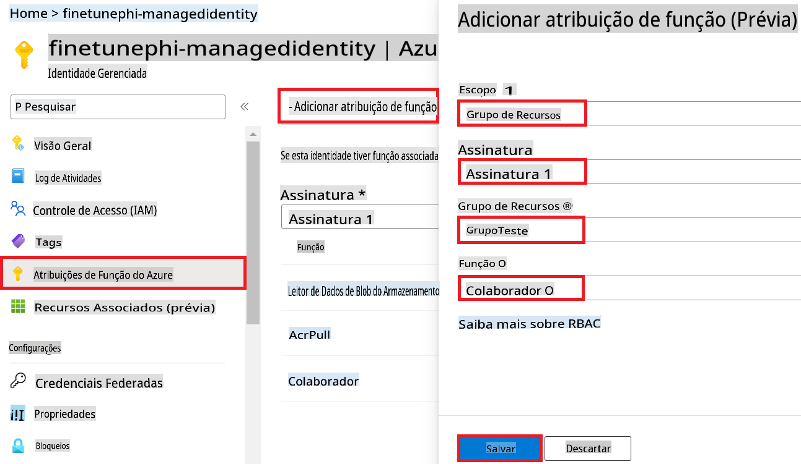

2. Clique em **Salvar**.

#### Adicionar função de Leitor de Dados do Blob de Armazenamento à Identidade Gerenciada

1. Digite *contas de armazenamento* na **barra de pesquisa** no topo da página do portal e selecione **Contas de Armazenamento** entre as opções exibidas.

    

1. Selecione a conta de armazenamento associada ao workspace do Azure Machine Learning que você criou. Por exemplo, *finetunephistorage*.  

1. Realize as seguintes tarefas para navegar até a página de Adicionar Atribuição de Função:

    - Navegue até a conta de armazenamento do Azure que você criou.  
    - Selecione **Controle de Acesso (IAM)** no menu lateral esquerdo.  
    - Clique em **+ Adicionar** no menu de navegação.  
    - Selecione **Adicionar atribuição de função** no menu de navegação.  

    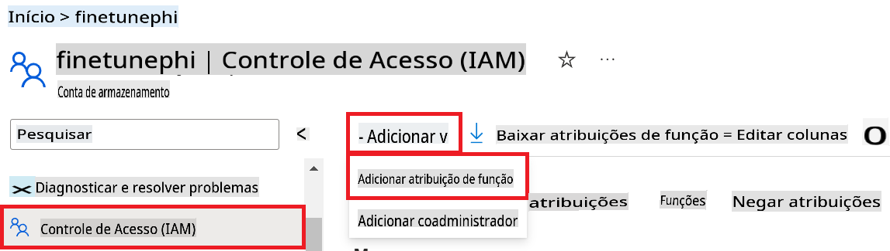

1. Na página de Adicionar Atribuição de Função, realize as seguintes tarefas:

    - Na página de Função, digite *Leitor de Dados do Blob de Armazenamento* na **barra de pesquisa** e selecione **Leitor de Dados do Blob de Armazenamento** entre as opções exibidas.  
    - Na página de Função, clique em **Próximo**.  
    - Na página de Membros, escolha **Atribuir acesso a** **Identidade Gerenciada**.  
    - Na página de Membros, clique em **+ Selecionar membros**.  
    - Na página Selecionar Identidades Gerenciadas, escolha sua **Assinatura** do Azure.  
    - Na página Selecionar Identidades Gerenciadas, selecione a **Identidade Gerenciada** que você criou. Por exemplo, *finetunephi-managedidentity*.  
    - Na página Selecionar Identidades Gerenciadas, clique em **Selecionar**.  

    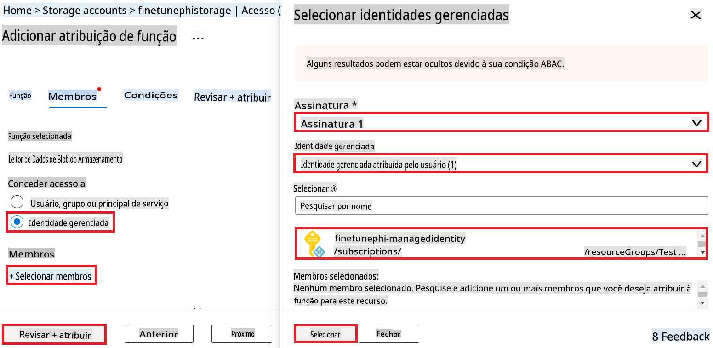

1. Clique em **Revisar + atribuir**.

#### Adicionar função AcrPull à Identidade Gerenciada

1. Digite *registros de contêineres* na **barra de pesquisa** no topo da página do portal e selecione **Registros de Contêineres** entre as opções exibidas.

    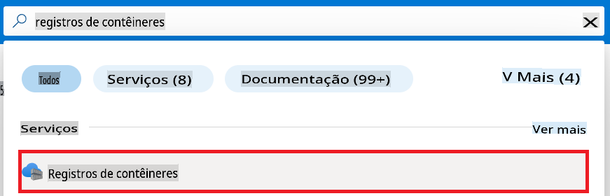

1. Selecione o registro de contêiner associado ao workspace do Azure Machine Learning. Por exemplo, *finetunephicontainerregistry*.  

1. Realize as seguintes tarefas para navegar até a página de Adicionar Atribuição de Função:

    - Selecione **Controle de Acesso (IAM)** no menu lateral esquerdo.  
    - Clique em **+ Adicionar** no menu de navegação.  
    - Selecione **Adicionar atribuição de função** no menu de navegação.  

1. Na página de Adicionar Atribuição de Função, realize as seguintes tarefas:

    - Na página de Função, digite *AcrPull* na **barra de pesquisa** e selecione **AcrPull** entre as opções exibidas.  
    - Na página de Função, clique em **Próximo**.  
    - Na página de Membros, escolha **Atribuir acesso a** **Identidade Gerenciada**.  
    - Na página de Membros, clique em **+ Selecionar membros**.  
    - Na página Selecionar Identidades Gerenciadas, escolha sua **Assinatura** do Azure.  
    - Na página Selecionar Identidades Gerenciadas, selecione a **Identidade Gerenciada** que você criou. Por exemplo, *finetunephi-managedidentity*.  
    - Na página Selecionar Identidades Gerenciadas, clique em **Selecionar**.  
    - Clique em **Revisar + atribuir**.

### Configurar o projeto

Para baixar os conjuntos de dados necessários para o ajuste fino, você configurará um ambiente local.

Neste exercício, você irá:

- Criar uma pasta para trabalhar dentro dela.  
- Criar um ambiente virtual.  
- Instalar os pacotes necessários.  
- Criar um arquivo *download_dataset.py* para baixar o conjunto de dados.  

#### Criar uma pasta para trabalhar dentro dela

1. Abra uma janela do terminal e digite o seguinte comando para criar uma pasta chamada *finetune-phi* no caminho padrão.

    ```console
    mkdir finetune-phi
    ```

2. Digite o seguinte comando no terminal para navegar até a pasta *finetune-phi* que você criou.

    ```console
    cd finetune-phi
    ```

#### Criar um ambiente virtual

1. Digite o seguinte comando no terminal para criar um ambiente virtual chamado *.venv*.

    ```console
    python -m venv .venv
    ```

2. Digite o seguinte comando no terminal para ativar o ambiente virtual.

    ```console
    .venv\Scripts\activate.bat
    ```

> [!NOTE]
> Se funcionar, você verá *(.venv)* antes do prompt de comando.

#### Instalar os pacotes necessários

1. Digite os seguintes comandos no terminal para instalar os pacotes necessários.

    ```console
    pip install datasets==2.19.1
    ```

#### Criar `download_dataset.py`

> [!NOTE]
> Estrutura completa da pasta:
>
> ```text
> └── YourUserName
> .    └── finetune-phi
> .        └── download_dataset.py
> ```

1. Abra o **Visual Studio Code**.

1. Selecione **Arquivo** na barra de menu.

1. Escolha **Abrir Pasta**.

1. Selecione a pasta *finetune-phi* que você criou, localizada em *C:\Users\seuNomeDeUsuario\finetune-phi*.

    

1. No painel esquerdo do Visual Studio Code, clique com o botão direito e selecione **Novo Arquivo** para criar um novo arquivo chamado *download_dataset.py*.

    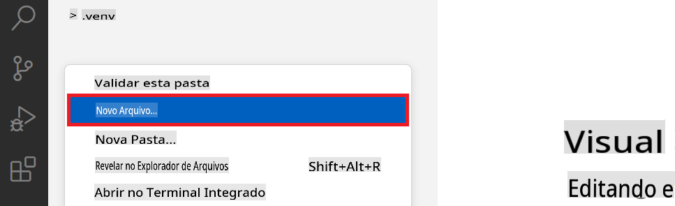

### Preparar o conjunto de dados para ajuste fino

Neste exercício, você executará o arquivo *download_dataset.py* para baixar o conjunto de dados *ultrachat_200k* para seu ambiente local. Você usará esses dados para ajustar o modelo Phi-3 no Azure Machine Learning.

Neste exercício, você irá:

- Adicionar código ao arquivo *download_dataset.py* para baixar os conjuntos de dados.  
- Executar o arquivo *download_dataset.py* para baixar os conjuntos de dados para o ambiente local.  

#### Baixar seu conjunto de dados usando *download_dataset.py*

1. Abra o arquivo *download_dataset.py* no Visual Studio Code.

1. Adicione o seguinte código ao arquivo *download_dataset.py*.

    ```python
    import json
    import os
    from datasets import load_dataset

    def load_and_split_dataset(dataset_name, config_name, split_ratio):
        """
        Load and split a dataset.
        """
        # Load the dataset with the specified name, configuration, and split ratio
        dataset = load_dataset(dataset_name, config_name, split=split_ratio)
        print(f"Original dataset size: {len(dataset)}")
        
        # Split the dataset into train and test sets (80% train, 20% test)
        split_dataset = dataset.train_test_split(test_size=0.2)
        print(f"Train dataset size: {len(split_dataset['train'])}")
        print(f"Test dataset size: {len(split_dataset['test'])}")
        
        return split_dataset

    def save_dataset_to_jsonl(dataset, filepath):
        """
        Save a dataset to a JSONL file.
        """
        # Create the directory if it does not exist
        os.makedirs(os.path.dirname(filepath), exist_ok=True)
        
        # Open the file in write mode
        with open(filepath, 'w', encoding='utf-8') as f:
            # Iterate over each record in the dataset
            for record in dataset:
                # Dump the record as a JSON object and write it to the file
                json.dump(record, f)
                # Write a newline character to separate records
                f.write('\n')
        
        print(f"Dataset saved to {filepath}")

    def main():
        """
        Main function to load, split, and save the dataset.
        """
        # Load and split the ULTRACHAT_200k dataset with a specific configuration and split ratio
        dataset = load_and_split_dataset("HuggingFaceH4/ultrachat_200k", 'default', 'train_sft[:1%]')
        
        # Extract the train and test datasets from the split
        train_dataset = dataset['train']
        test_dataset = dataset['test']

        # Save the train dataset to a JSONL file
        save_dataset_to_jsonl(train_dataset, "data/train_data.jsonl")
        
        # Save the test dataset to a separate JSONL file
        save_dataset_to_jsonl(test_dataset, "data/test_data.jsonl")

    if __name__ == "__main__":
        main()

    ```

1. Digite o seguinte comando no terminal para executar o script e baixar o conjunto de dados para seu ambiente local.

    ```console
    python download_dataset.py
    ```

1. Verifique se os conjuntos de dados foram salvos com sucesso no diretório local *finetune-phi/data*.

> [!NOTE]
>
> #### Nota sobre o tamanho do conjunto de dados e o tempo de ajuste fino
>
> Neste tutorial, você usará apenas 1% do conjunto de dados (`split='train[:1%]'`). Isso reduz significativamente a quantidade de dados, acelerando tanto o processo de upload quanto o de ajuste fino. Você pode ajustar a porcentagem para encontrar o equilíbrio certo entre o tempo de treinamento e o desempenho do modelo. Usar um subconjunto menor do conjunto de dados reduz o tempo necessário para o ajuste fino, tornando o processo mais gerenciável para um tutorial.

## Cenário 2: Ajustar o modelo Phi-3 e Implantar no Azure Machine Learning Studio

### Ajustar o modelo Phi-3

Neste exercício, você ajustará o modelo Phi-3 no Azure Machine Learning Studio.

Neste exercício, você irá:

- Criar um cluster de computação para ajuste fino.  
- Ajustar o modelo Phi-3 no Azure Machine Learning Studio.  

#### Criar um cluster de computação para ajuste fino
1. Visite [Azure ML Studio](https://ml.azure.com/home?wt.mc_id=studentamb_279723).

1. Selecione **Compute** na aba lateral esquerda.

1. Selecione **Compute clusters** no menu de navegação.

1. Selecione **+ New**.

    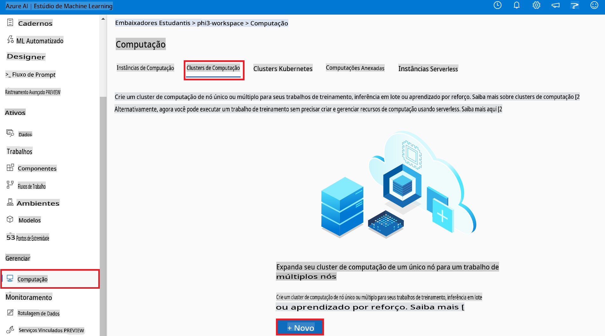

1. Realize as seguintes tarefas:

    - Selecione a **Região** que deseja usar.
    - Altere o **Virtual machine tier** para **Dedicated**.
    - Altere o **Virtual machine type** para **GPU**.
    - Ajuste o filtro de **Virtual machine size** para **Select from all options**.
    - Escolha o **Virtual machine size** como **Standard_NC24ads_A100_v4**.

    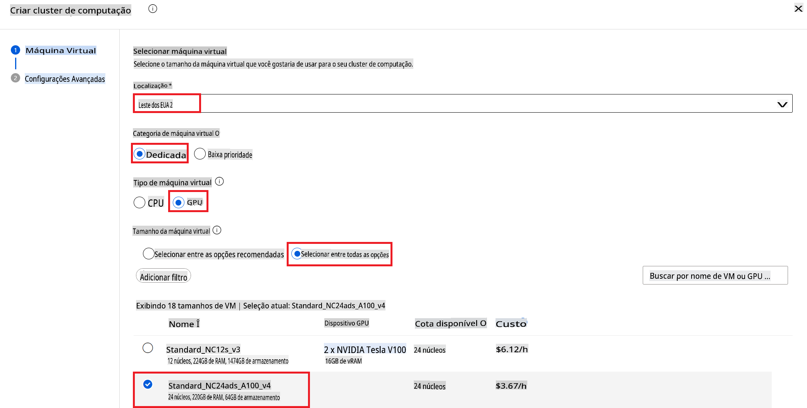

1. Selecione **Next**.

1. Realize as seguintes tarefas:

    - Insira um **Compute name**. Deve ser um valor único.
    - Ajuste o **Minimum number of nodes** para **0**.
    - Ajuste o **Maximum number of nodes** para **1**.
    - Ajuste o **Idle seconds before scale down** para **120**.

    

1. Selecione **Create**.

#### Ajustar o modelo Phi-3

1. Visite [Azure ML Studio](https://ml.azure.com/home?wt.mc_id=studentamb_279723).

1. Selecione o workspace do Azure Machine Learning que você criou.

    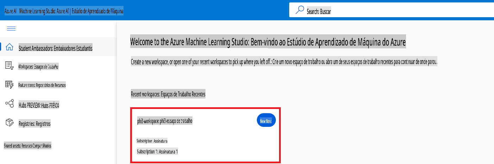

1. Realize as seguintes tarefas:

    - Selecione **Model catalog** na aba lateral esquerda.
    - Digite *phi-3-mini-4k* na **barra de busca** e selecione **Phi-3-mini-4k-instruct** entre as opções exibidas.

    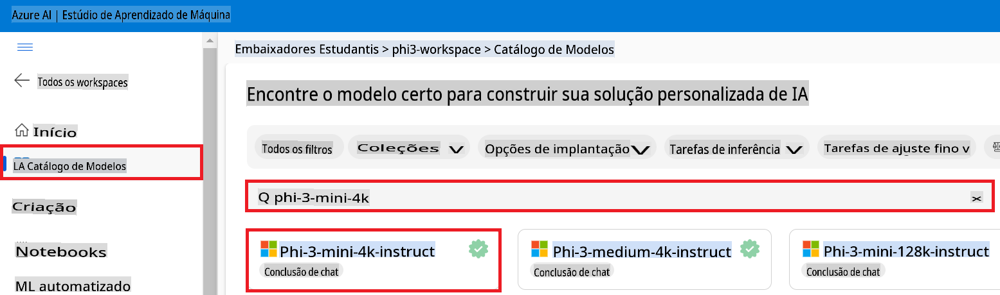

1. Selecione **Fine-tune** no menu de navegação.

    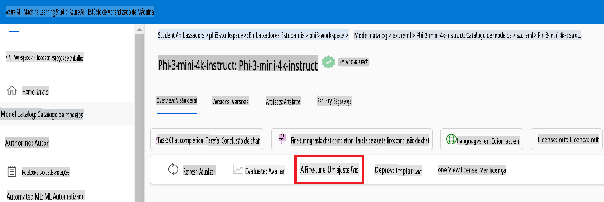

1. Realize as seguintes tarefas:

    - Altere **Select task type** para **Chat completion**.
    - Selecione **+ Select data** para fazer upload dos **Dados de treinamento**.
    - Ajuste o tipo de upload de dados de validação para **Provide different validation data**.
    - Selecione **+ Select data** para fazer upload dos **Dados de validação**.

    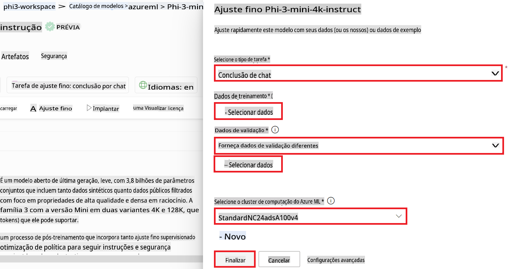

    > [!TIP]
    >
    > Você pode selecionar **Advanced settings** para personalizar configurações como **learning_rate** e **lr_scheduler_type**, otimizando o processo de ajuste para suas necessidades específicas.

1. Selecione **Finish**.

1. Neste exercício, você ajustou com sucesso o modelo Phi-3 usando o Azure Machine Learning. Observe que o processo de ajuste pode levar um tempo considerável. Após iniciar o trabalho de ajuste, será necessário aguardar sua conclusão. Você pode monitorar o status do trabalho de ajuste acessando a aba Jobs no lado esquerdo do seu Workspace no Azure Machine Learning. Na próxima etapa, você implantará o modelo ajustado e o integrará ao Prompt flow.

    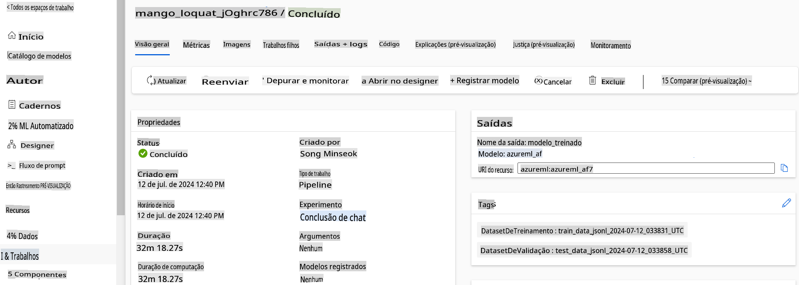

### Implantar o modelo Phi-3 ajustado

Para integrar o modelo Phi-3 ajustado ao Prompt flow, você precisa implantá-lo para torná-lo acessível para inferência em tempo real. Esse processo envolve registrar o modelo, criar um endpoint online e implantar o modelo.

Neste exercício, você irá:

- Registrar o modelo ajustado no workspace do Azure Machine Learning.
- Criar um endpoint online.
- Implantar o modelo ajustado Phi-3 registrado.

#### Registrar o modelo ajustado

1. Visite [Azure ML Studio](https://ml.azure.com/home?wt.mc_id=studentamb_279723).

1. Selecione o workspace do Azure Machine Learning que você criou.

    

1. Selecione **Models** na aba lateral esquerda.
1. Selecione **+ Register**.
1. Selecione **From a job output**.

    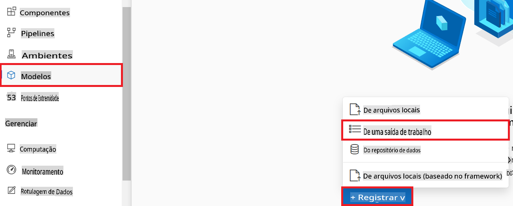

1. Selecione o trabalho que você criou.

    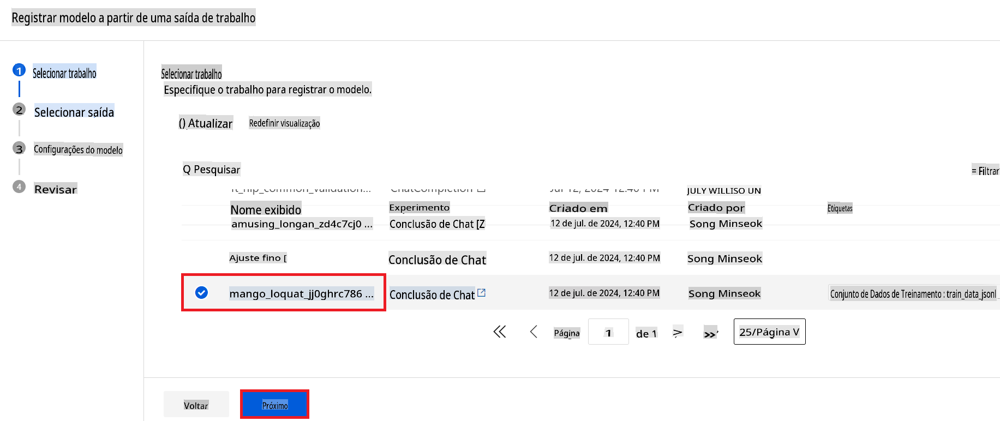

1. Selecione **Next**.

1. Altere **Model type** para **MLflow**.

1. Certifique-se de que **Job output** está selecionado; isso deve ocorrer automaticamente.

    

2. Selecione **Next**.

3. Selecione **Register**.

    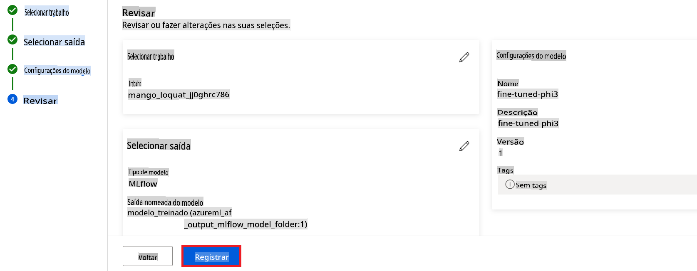

4. Você pode visualizar seu modelo registrado acessando o menu **Models** na aba lateral esquerda.

    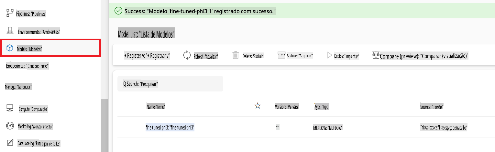

#### Implantar o modelo ajustado

1. Acesse o workspace do Azure Machine Learning que você criou.

1. Selecione **Endpoints** na aba lateral esquerda.

1. Selecione **Real-time endpoints** no menu de navegação.

    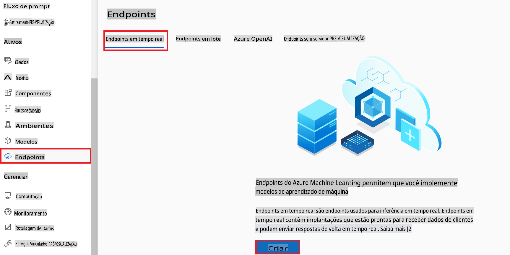

1. Selecione **Create**.

1. Escolha o modelo registrado que você criou.

    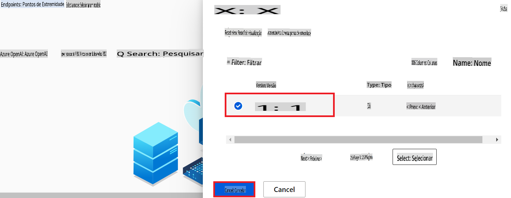

1. Selecione **Select**.

1. Realize as seguintes tarefas:

    - Altere **Virtual machine** para *Standard_NC6s_v3*.
    - Escolha o número de **Instance count** que deseja usar. Por exemplo, *1*.
    - Ajuste o **Endpoint** para **New** para criar um novo endpoint.
    - Insira um **Endpoint name**. Deve ser um valor único.
    - Insira um **Deployment name**. Deve ser um valor único.

    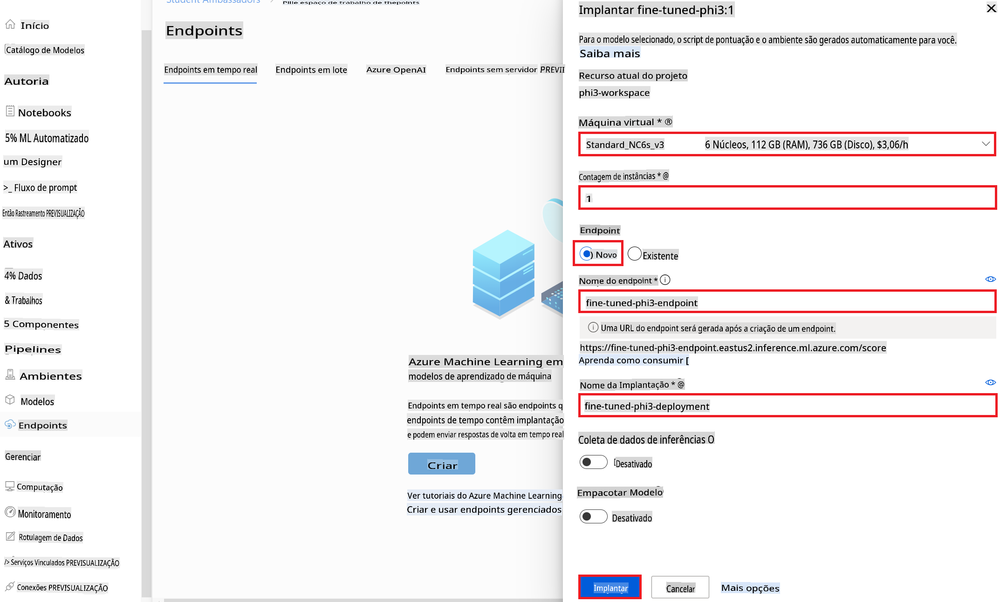

1. Selecione **Deploy**.

> [!WARNING]
> Para evitar cobranças adicionais em sua conta, certifique-se de excluir o endpoint criado no workspace do Azure Machine Learning.
>

#### Verificar status da implantação no Azure Machine Learning Workspace

1. Acesse o workspace do Azure Machine Learning que você criou.

1. Selecione **Endpoints** na aba lateral esquerda.

1. Selecione o endpoint que você criou.

    

1. Nesta página, você pode gerenciar os endpoints durante o processo de implantação.

> [!NOTE]
> Após a conclusão da implantação, certifique-se de que o **Live traffic** está configurado para **100%**. Caso contrário, selecione **Update traffic** para ajustar as configurações de tráfego. Observe que você não poderá testar o modelo se o tráfego estiver configurado como 0%.
>
> 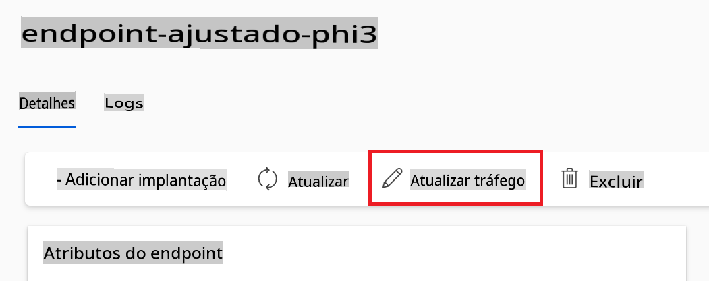
>

## Cenário 3: Integrar ao Prompt flow e conversar com seu modelo personalizado no Azure AI Foundry

### Integrar o modelo personalizado Phi-3 ao Prompt flow

Depois de implantar com sucesso seu modelo ajustado, você pode integrá-lo ao Prompt Flow para utilizá-lo em aplicações em tempo real, permitindo uma variedade de tarefas interativas com seu modelo personalizado Phi-3.

Neste exercício, você irá:

- Criar um Hub no Azure AI Foundry.
- Criar um Projeto no Azure AI Foundry.
- Criar um Prompt flow.
- Adicionar uma conexão personalizada para o modelo ajustado Phi-3.
- Configurar o Prompt flow para conversar com seu modelo personalizado Phi-3.

> [!NOTE]
> Você também pode integrar ao Prompt flow usando o Azure ML Studio. O mesmo processo de integração pode ser aplicado ao Azure ML Studio.

#### Criar um Hub no Azure AI Foundry

É necessário criar um Hub antes de criar o Projeto. Um Hub funciona como um Grupo de Recursos, permitindo organizar e gerenciar vários Projetos no Azure AI Foundry.

1. Visite [Azure AI Foundry](https://ai.azure.com/?WT.mc_id=aiml-137032-kinfeylo).

1. Selecione **All hubs** na aba lateral esquerda.

1. Selecione **+ New hub** no menu de navegação.

    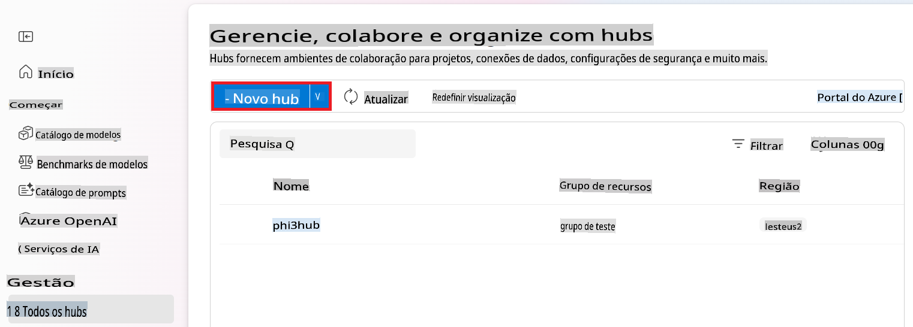

1. Realize as seguintes tarefas:

    - Insira um **Hub name**. Deve ser um valor único.
    - Escolha sua **Subscription** no Azure.
    - Selecione o **Resource group** que deseja usar (crie um novo, se necessário).
    - Escolha a **Location** que deseja usar.
    - Selecione o **Connect Azure AI Services** que deseja usar (crie um novo, se necessário).
    - Ajuste **Connect Azure AI Search** para **Skip connecting**.

    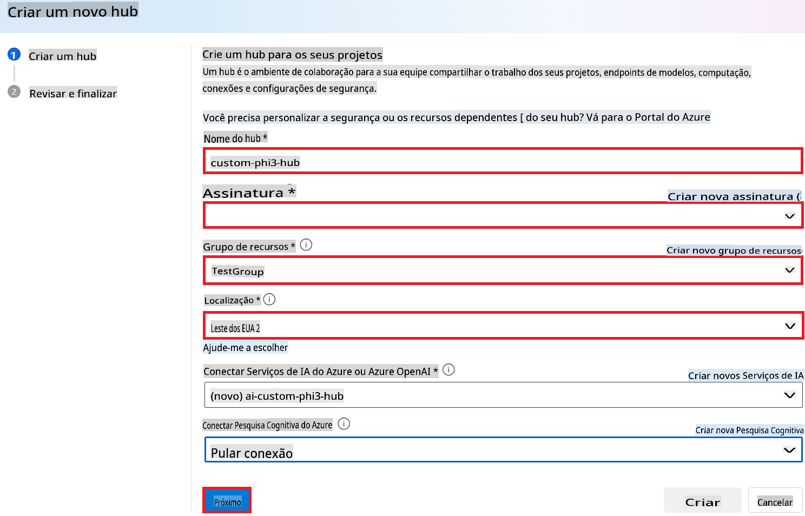

1. Selecione **Next**.

#### Criar um Projeto no Azure AI Foundry

1. No Hub que você criou, selecione **All projects** na aba lateral esquerda.

1. Selecione **+ New project** no menu de navegação.

    

1. Insira um **Project name**. Deve ser um valor único.

    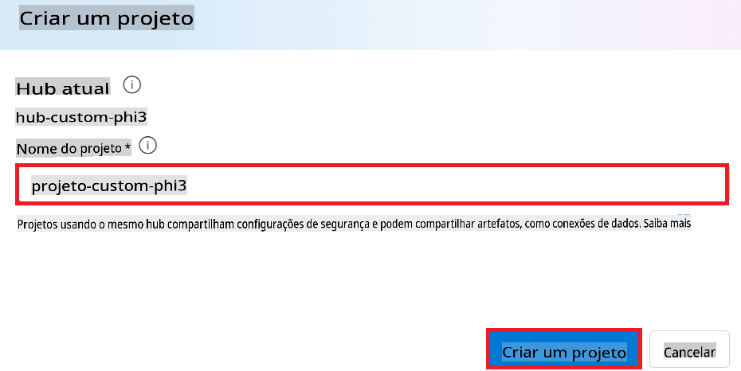

1. Selecione **Create a project**.

#### Adicionar uma conexão personalizada para o modelo ajustado Phi-3

Para integrar seu modelo personalizado Phi-3 ao Prompt flow, é necessário salvar o endpoint e a chave do modelo em uma conexão personalizada. Essa configuração garante acesso ao seu modelo no Prompt flow.

#### Definir chave de API e URI do endpoint do modelo ajustado Phi-3

1. Visite [Azure ML Studio](https://ml.azure.com/home?WT.mc_id=aiml-137032-kinfeylo).

1. Navegue até o workspace do Azure Machine Learning que você criou.

1. Selecione **Endpoints** na aba lateral esquerda.

    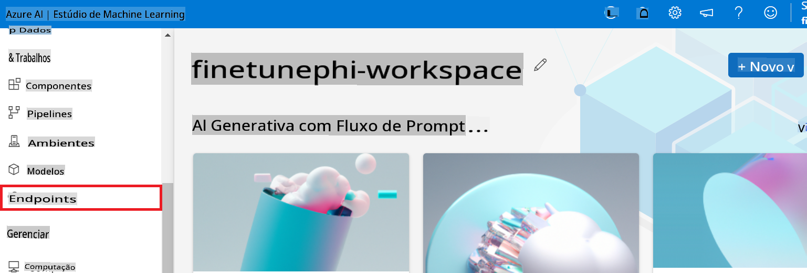

1. Selecione o endpoint que você criou.

    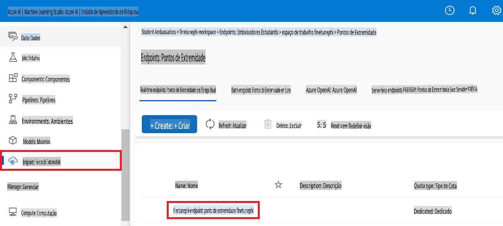

1. Selecione **Consume** no menu de navegação.

1. Copie seu **REST endpoint** e **Primary key**.
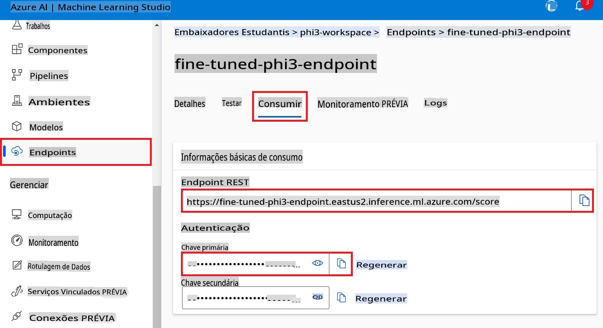

#### Adicionar a Conexão Personalizada

1. Acesse [Azure AI Foundry](https://ai.azure.com/?WT.mc_id=aiml-137032-kinfeylo).

1. Navegue até o projeto Azure AI Foundry que você criou.

1. No projeto que você criou, selecione **Configurações** na aba lateral esquerda.

1. Selecione **+ Nova conexão**.

    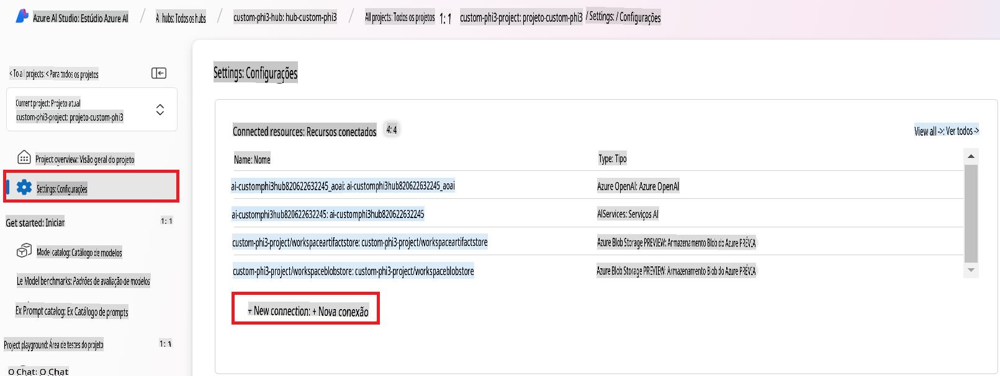

1. Selecione **Chaves personalizadas** no menu de navegação.

    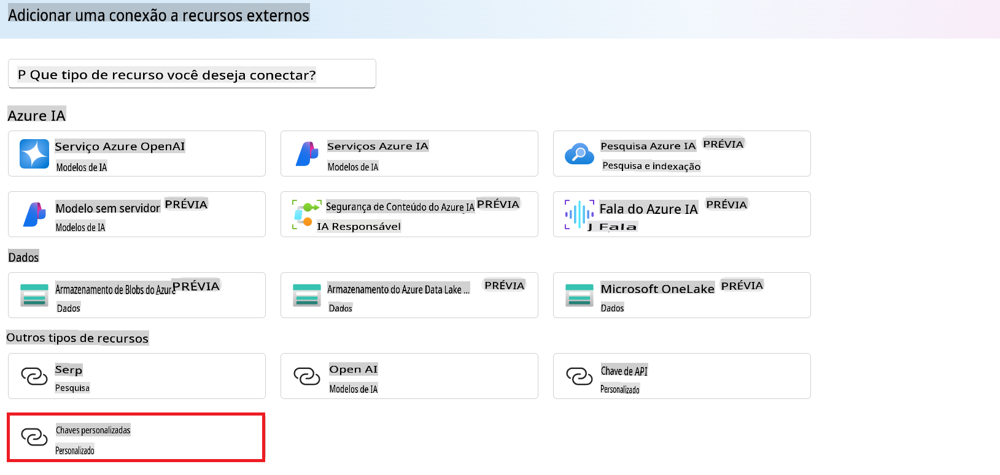

1. Realize as seguintes tarefas:

    - Selecione **+ Adicionar pares de chave-valor**.
    - Para o nome da chave, insira **endpoint** e cole o endpoint que você copiou do Azure ML Studio no campo de valor.
    - Selecione **+ Adicionar pares de chave-valor** novamente.
    - Para o nome da chave, insira **key** e cole a chave que você copiou do Azure ML Studio no campo de valor.
    - Após adicionar as chaves, selecione **é segredo** para evitar que a chave seja exposta.

    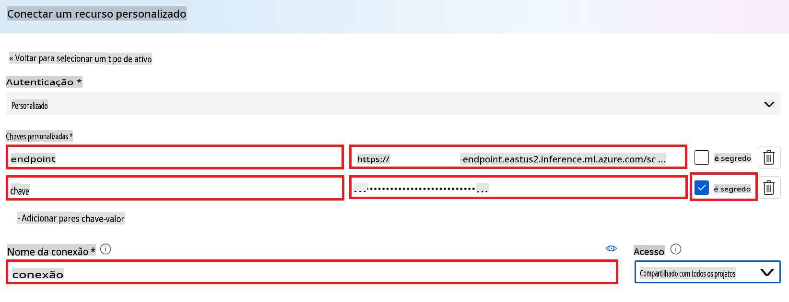

1. Selecione **Adicionar conexão**.

#### Criar um Prompt flow

Você adicionou uma conexão personalizada no Azure AI Foundry. Agora, vamos criar um Prompt flow usando os passos abaixo. Depois, você conectará esse Prompt flow à conexão personalizada para usar o modelo ajustado no Prompt flow.

1. Navegue até o projeto Azure AI Foundry que você criou.

1. Selecione **Prompt flow** na aba lateral esquerda.

1. Selecione **+ Criar** no menu de navegação.

    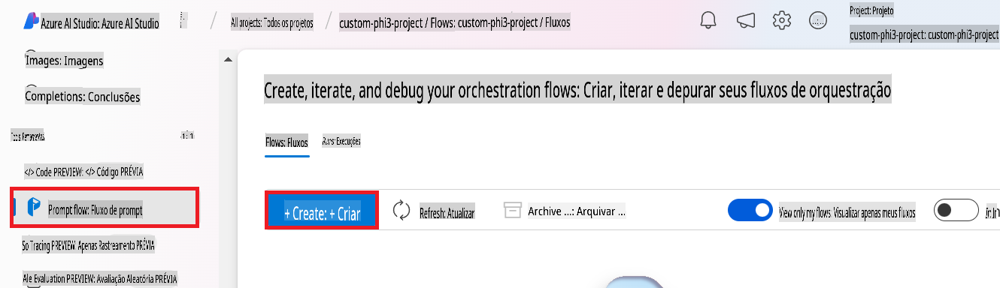

1. Selecione **Chat flow** no menu de navegação.

    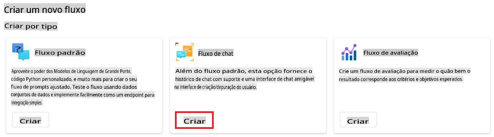

1. Insira o **Nome da pasta** a ser usado.

    

2. Selecione **Criar**.

#### Configurar o Prompt flow para conversar com seu modelo personalizado Phi-3

Você precisa integrar o modelo ajustado Phi-3 em um Prompt flow. No entanto, o Prompt flow existente não foi projetado para esse propósito. Portanto, será necessário redesenhar o Prompt flow para permitir a integração do modelo personalizado.

1. No Prompt flow, realize as seguintes tarefas para reconstruir o fluxo existente:

    - Selecione **Modo de arquivo bruto**.
    - Exclua todo o código existente no arquivo *flow.dag.yml*.
    - Adicione o seguinte código ao arquivo *flow.dag.yml*.

        ```yml
        inputs:
          input_data:
            type: string
            default: "Who founded Microsoft?"

        outputs:
          answer:
            type: string
            reference: ${integrate_with_promptflow.output}

        nodes:
        - name: integrate_with_promptflow
          type: python
          source:
            type: code
            path: integrate_with_promptflow.py
          inputs:
            input_data: ${inputs.input_data}
        ```

    - Selecione **Salvar**.

    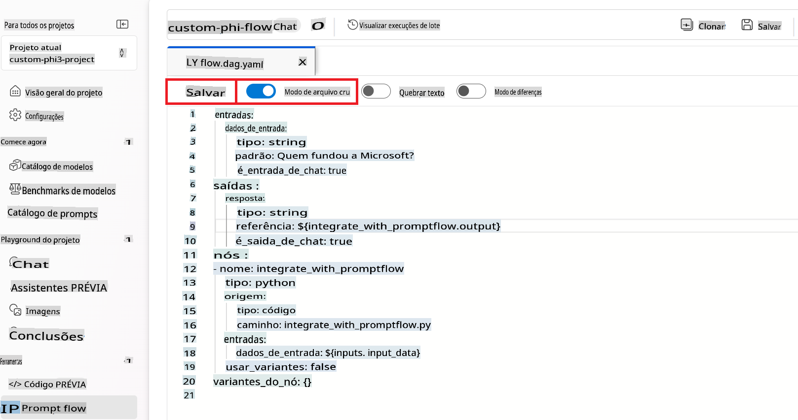

1. Adicione o seguinte código ao arquivo *integrate_with_promptflow.py* para usar o modelo personalizado Phi-3 no Prompt flow.

    ```python
    import logging
    import requests
    from promptflow import tool
    from promptflow.connections import CustomConnection

    # Logging setup
    logging.basicConfig(
        format="%(asctime)s - %(levelname)s - %(name)s - %(message)s",
        datefmt="%Y-%m-%d %H:%M:%S",
        level=logging.DEBUG
    )
    logger = logging.getLogger(__name__)

    def query_phi3_model(input_data: str, connection: CustomConnection) -> str:
        """
        Send a request to the Phi-3 model endpoint with the given input data using Custom Connection.
        """

        # "connection" is the name of the Custom Connection, "endpoint", "key" are the keys in the Custom Connection
        endpoint_url = connection.endpoint
        api_key = connection.key

        headers = {
            "Content-Type": "application/json",
            "Authorization": f"Bearer {api_key}"
        }
        data = {
            "input_data": {
                "input_string": [
                    {"role": "user", "content": input_data}
                ],
                "parameters": {
                    "temperature": 0.7,
                    "max_new_tokens": 128
                }
            }
        }
        try:
            response = requests.post(endpoint_url, json=data, headers=headers)
            response.raise_for_status()
            
            # Log the full JSON response
            logger.debug(f"Full JSON response: {response.json()}")

            result = response.json()["output"]
            logger.info("Successfully received response from Azure ML Endpoint.")
            return result
        except requests.exceptions.RequestException as e:
            logger.error(f"Error querying Azure ML Endpoint: {e}")
            raise

    @tool
    def my_python_tool(input_data: str, connection: CustomConnection) -> str:
        """
        Tool function to process input data and query the Phi-3 model.
        """
        return query_phi3_model(input_data, connection)

    ```

    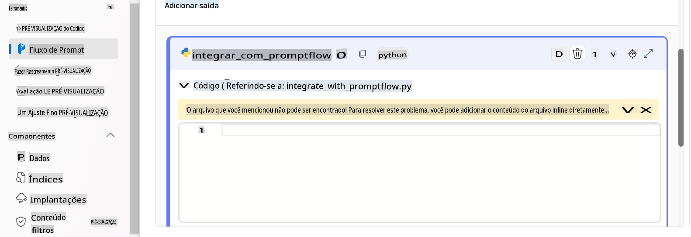

> [!NOTE]
> Para mais informações detalhadas sobre o uso do Prompt flow no Azure AI Foundry, consulte [Prompt flow no Azure AI Foundry](https://learn.microsoft.com/azure/ai-studio/how-to/prompt-flow).

1. Selecione **Entrada do chat**, **Saída do chat** para habilitar o chat com seu modelo.

    

1. Agora você está pronto para conversar com seu modelo personalizado Phi-3. No próximo exercício, você aprenderá como iniciar o Prompt flow e utilizá-lo para interagir com seu modelo ajustado Phi-3.

> [!NOTE]
>
> O fluxo reconstruído deve se parecer com a imagem abaixo:
>
> 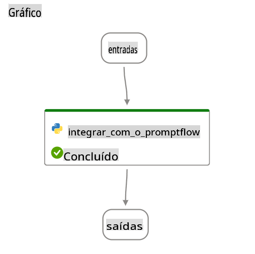
>

### Conversar com seu modelo personalizado Phi-3

Agora que você ajustou e integrou seu modelo personalizado Phi-3 ao Prompt flow, está pronto para começar a interagir com ele. Este exercício irá guiá-lo no processo de configuração e início de uma conversa com seu modelo usando o Prompt flow. Ao seguir esses passos, você poderá aproveitar totalmente as capacidades do seu modelo ajustado Phi-3 para diversas tarefas e conversas.

- Converse com seu modelo personalizado Phi-3 usando o Prompt flow.

#### Iniciar o Prompt flow

1. Selecione **Iniciar sessões de computação** para iniciar o Prompt flow.

    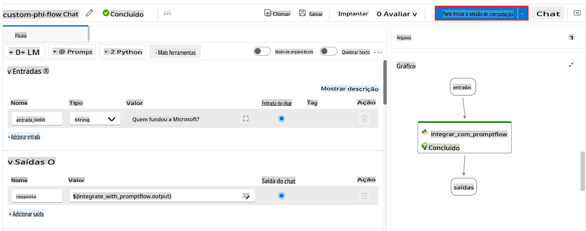

1. Selecione **Validar e analisar entrada** para renovar os parâmetros.

    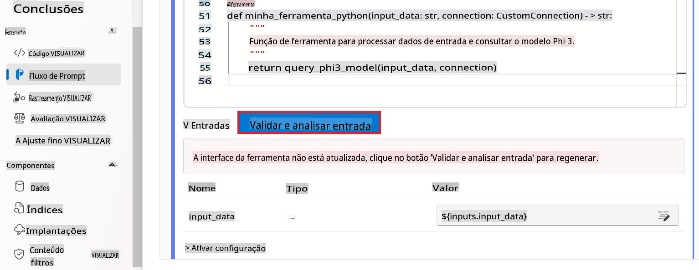

1. Selecione o **Valor** da **conexão** para a conexão personalizada que você criou. Por exemplo, *connection*.

    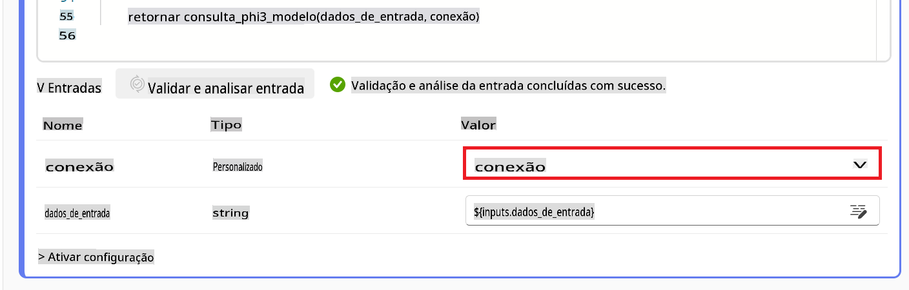

#### Conversar com seu modelo personalizado

1. Selecione **Chat**.

    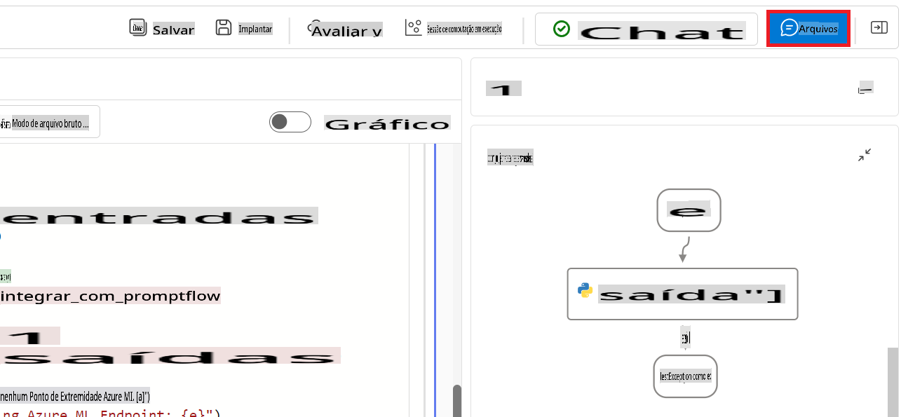

1. Aqui está um exemplo dos resultados: Agora você pode conversar com seu modelo personalizado Phi-3. Recomenda-se fazer perguntas com base nos dados usados para o ajuste.

    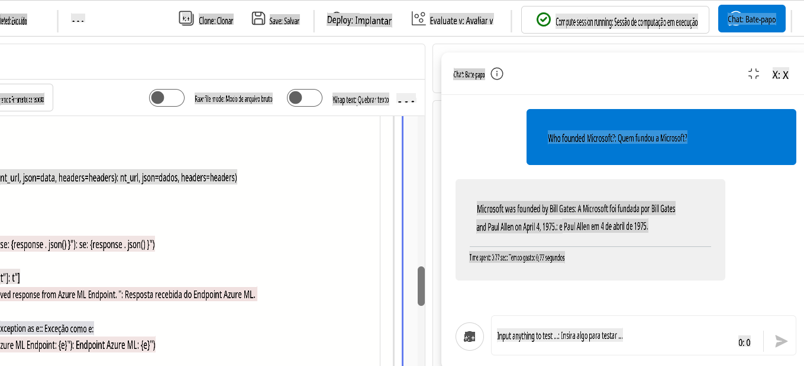

**Aviso Legal**:  
Este documento foi traduzido utilizando serviços de tradução baseados em IA. Embora nos esforcemos para garantir a precisão, esteja ciente de que traduções automáticas podem conter erros ou imprecisões. O documento original em seu idioma nativo deve ser considerado a fonte oficial. Para informações críticas, recomenda-se uma tradução profissional realizada por humanos. Não nos responsabilizamos por quaisquer mal-entendidos ou interpretações equivocadas decorrentes do uso desta tradução.