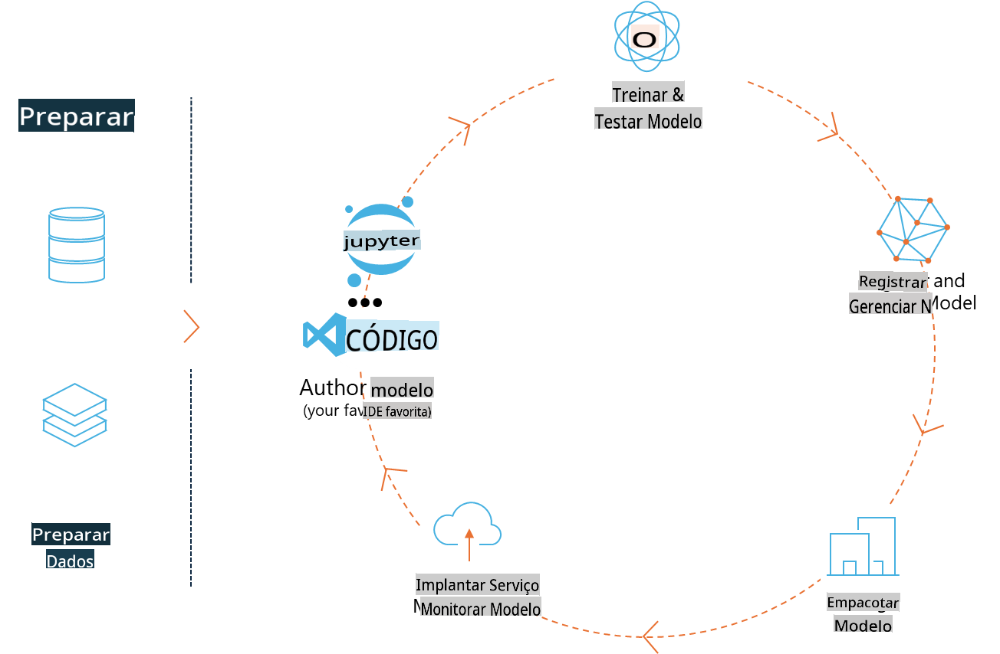
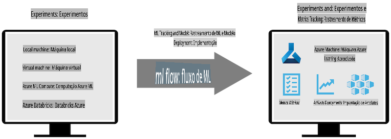
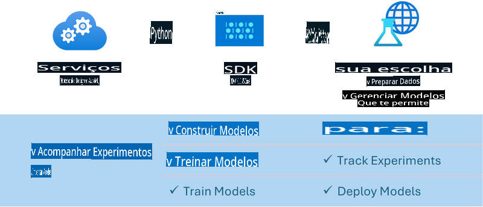

# MLflow

[MLflow](https://mlflow.org/) é uma plataforma de código aberto projetada para gerenciar o ciclo de vida completo de aprendizado de máquina.



O MLFlow é usado para gerenciar o ciclo de vida do aprendizado de máquina, incluindo experimentação, reprodutibilidade, implantação e um repositório central de modelos. Atualmente, o MLFlow oferece quatro componentes principais:

- **MLflow Tracking:** Registra e consulta experimentos, código, configurações de dados e resultados.
- **MLflow Projects:** Empacota o código de ciência de dados em um formato que permite reproduzir execuções em qualquer plataforma.
- **Mlflow Models:** Implanta modelos de aprendizado de máquina em diversos ambientes de serviço.
- **Model Registry:** Armazena, anota e gerencia modelos em um repositório central.

Inclui funcionalidades para rastrear experimentos, empacotar código em execuções reproduzíveis e compartilhar e implantar modelos. O MLFlow está integrado ao Databricks e suporta diversas bibliotecas de aprendizado de máquina, tornando-o independente de bibliotecas específicas. Pode ser usado com qualquer biblioteca de aprendizado de máquina e em qualquer linguagem de programação, pois oferece uma API REST e CLI para conveniência.



Principais recursos do MLFlow incluem:

- **Rastreamento de Experimentos:** Registra e compara parâmetros e resultados.
- **Gerenciamento de Modelos:** Implanta modelos em várias plataformas de serviço e inferência.
- **Model Registry:** Gerencia colaborativamente o ciclo de vida dos modelos MLFlow, incluindo versionamento e anotações.
- **Projetos:** Empacota código de aprendizado de máquina para compartilhamento ou uso em produção.

O MLFlow também suporta o ciclo de MLOps, que inclui preparar dados, registrar e gerenciar modelos, empacotar modelos para execução, implantar serviços e monitorar modelos. Ele visa simplificar o processo de transição de um protótipo para um fluxo de trabalho de produção, especialmente em ambientes de nuvem e de borda.

## Cenário E2E - Construindo um wrapper e usando o Phi-3 como modelo MLFlow

Neste exemplo E2E, demonstraremos duas abordagens diferentes para construir um wrapper em torno do modelo de linguagem pequeno (SLM) Phi-3 e, em seguida, executá-lo como um modelo MLFlow localmente ou na nuvem, por exemplo, em um workspace do Azure Machine Learning.



| Projeto | Descrição | Localização |
| ------------ | ----------- | -------- |
| Transformer Pipeline | Transformer Pipeline é a opção mais simples para construir um wrapper se você deseja usar um modelo do HuggingFace com o flavour experimental de transformers do MLFlow. | [**TransformerPipeline.ipynb**](../../../../../../code/06.E2E/E2E_Phi-3-MLflow_TransformerPipeline.ipynb) |
| Custom Python Wrapper | No momento da escrita, o pipeline de transformers não suportava a geração de wrappers MLFlow para modelos HuggingFace no formato ONNX, mesmo com o pacote experimental optimum do Python. Para casos como este, você pode construir seu próprio wrapper Python personalizado para o modo MLFlow. | [**CustomPythonWrapper.ipynb**](../../../../../../code/06.E2E/E2E_Phi-3-MLflow_CustomPythonWrapper.ipynb) |

## Projeto: Transformer Pipeline

1. Você precisará dos pacotes Python relevantes do MLFlow e do HuggingFace:

    ``` Python
    import mlflow
    import transformers
    ```

2. Em seguida, você deve iniciar um pipeline de transformers referindo-se ao modelo alvo Phi-3 no registro do HuggingFace. Como pode ser visto no cartão do modelo _Phi-3-mini-4k-instruct_, sua tarefa é do tipo "Geração de Texto":

    ``` Python
    pipeline = transformers.pipeline(
        task = "text-generation",
        model = "microsoft/Phi-3-mini-4k-instruct"
    )
    ```

3. Agora você pode salvar o pipeline de transformers do modelo Phi-3 no formato MLFlow e fornecer detalhes adicionais, como o caminho dos artefatos alvo, configurações específicas do modelo e o tipo de API de inferência:

    ``` Python
    model_info = mlflow.transformers.log_model(
        transformers_model = pipeline,
        artifact_path = "phi3-mlflow-model",
        model_config = model_config,
        task = "llm/v1/chat"
    )
    ```

## Projeto: Custom Python Wrapper

1. Aqui podemos utilizar a [API generate() do ONNX Runtime da Microsoft](https://github.com/microsoft/onnxruntime-genai) para a inferência do modelo ONNX e codificação/decodificação de tokens. Você deve escolher o pacote _onnxruntime_genai_ para o seu ambiente de computação alvo, com o exemplo abaixo direcionado para CPU:

    ``` Python
    import mlflow
    from mlflow.models import infer_signature
    import onnxruntime_genai as og
    ```

1. Nossa classe personalizada implementa dois métodos: _load_context()_ para inicializar o **modelo ONNX** do Phi-3 Mini 4K Instruct, **parâmetros do gerador** e **tokenizer**; e _predict()_ para gerar tokens de saída para o prompt fornecido:

    ``` Python
    class Phi3Model(mlflow.pyfunc.PythonModel):
        def load_context(self, context):
            # Retrieving model from the artifacts
            model_path = context.artifacts["phi3-mini-onnx"]
            model_options = {
                 "max_length": 300,
                 "temperature": 0.2,         
            }
        
            # Defining the model
            self.phi3_model = og.Model(model_path)
            self.params = og.GeneratorParams(self.phi3_model)
            self.params.set_search_options(**model_options)
            
            # Defining the tokenizer
            self.tokenizer = og.Tokenizer(self.phi3_model)
    
        def predict(self, context, model_input):
            # Retrieving prompt from the input
            prompt = model_input["prompt"][0]
            self.params.input_ids = self.tokenizer.encode(prompt)
    
            # Generating the model's response
            response = self.phi3_model.generate(self.params)
    
            return self.tokenizer.decode(response[0][len(self.params.input_ids):])
    ```

1. Agora você pode usar a função _mlflow.pyfunc.log_model()_ para gerar um wrapper Python personalizado (em formato pickle) para o modelo Phi-3, junto com o modelo ONNX original e as dependências necessárias:

    ``` Python
    model_info = mlflow.pyfunc.log_model(
        artifact_path = artifact_path,
        python_model = Phi3Model(),
        artifacts = {
            "phi3-mini-onnx": "cpu_and_mobile/cpu-int4-rtn-block-32-acc-level-4",
        },
        input_example = input_example,
        signature = infer_signature(input_example, ["Run"]),
        extra_pip_requirements = ["torch", "onnxruntime_genai", "numpy"],
    )
    ```

## Assinaturas dos modelos MLFlow gerados

1. No passo 3 do projeto Transformer Pipeline acima, definimos a tarefa do modelo MLFlow como "_llm/v1/chat_". Essa instrução gera um wrapper de API do modelo, compatível com a API de Chat da OpenAI, conforme mostrado abaixo:

    ``` Python
    {inputs: 
      ['messages': Array({content: string (required), name: string (optional), role: string (required)}) (required), 'temperature': double (optional), 'max_tokens': long (optional), 'stop': Array(string) (optional), 'n': long (optional), 'stream': boolean (optional)],
    outputs: 
      ['id': string (required), 'object': string (required), 'created': long (required), 'model': string (required), 'choices': Array({finish_reason: string (required), index: long (required), message: {content: string (required), name: string (optional), role: string (required)} (required)}) (required), 'usage': {completion_tokens: long (required), prompt_tokens: long (required), total_tokens: long (required)} (required)],
    params: 
      None}
    ```

1. Como resultado, você pode enviar seu prompt no seguinte formato:

    ``` Python
    messages = [{"role": "user", "content": "What is the capital of Spain?"}]
    ```

1. Em seguida, use o pós-processamento compatível com a API OpenAI, por exemplo, _response[0][‘choices’][0][‘message’][‘content’]_, para formatar a saída de maneira mais apresentável, como:

    ``` JSON
    Question: What is the capital of Spain?
    
    Answer: The capital of Spain is Madrid. It is the largest city in Spain and serves as the political, economic, and cultural center of the country. Madrid is located in the center of the Iberian Peninsula and is known for its rich history, art, and architecture, including the Royal Palace, the Prado Museum, and the Plaza Mayor.
    
    Usage: {'prompt_tokens': 11, 'completion_tokens': 73, 'total_tokens': 84}
    ```

1. No passo 3 do projeto Custom Python Wrapper acima, permitimos que o pacote MLFlow gere a assinatura do modelo a partir de um exemplo de entrada fornecido. A assinatura do wrapper MLFlow será semelhante a esta:

    ``` Python
    {inputs: 
      ['prompt': string (required)],
    outputs: 
      [string (required)],
    params: 
      None}
    ```

1. Portanto, nosso prompt precisará conter a chave de dicionário "prompt", semelhante a este exemplo:

    ``` Python
    {"prompt": "<|system|>You are a stand-up comedian.<|end|><|user|>Tell me a joke about atom<|end|><|assistant|>",}
    ```

1. A saída do modelo será fornecida então no formato de string:

    ``` JSON
    Alright, here's a little atom-related joke for you!
    
    Why don't electrons ever play hide and seek with protons?
    
    Because good luck finding them when they're always "sharing" their electrons!
    
    Remember, this is all in good fun, and we're just having a little atomic-level humor!
    ```

**Aviso Legal**:  
Este documento foi traduzido utilizando serviços de tradução automática baseados em IA. Embora nos esforcemos para garantir a precisão, esteja ciente de que traduções automatizadas podem conter erros ou imprecisões. O documento original em seu idioma nativo deve ser considerado a fonte oficial. Para informações críticas, recomenda-se a tradução humana profissional. Não nos responsabilizamos por quaisquer mal-entendidos ou interpretações equivocadas decorrentes do uso desta tradução.