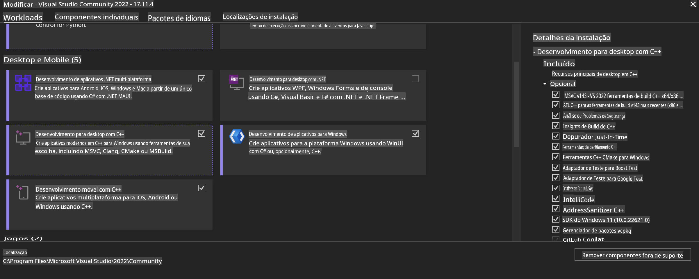
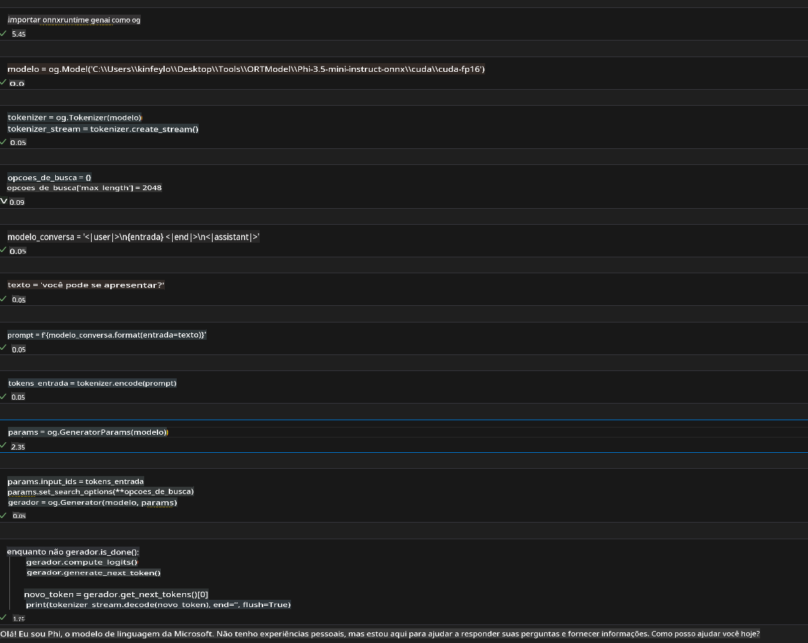
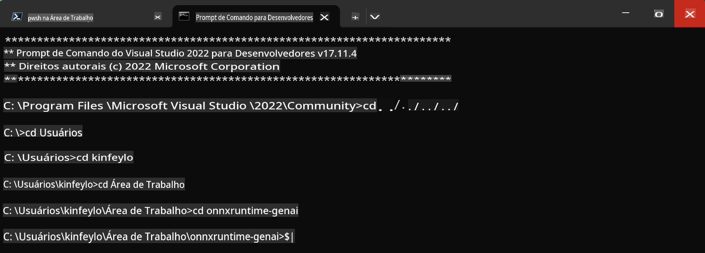

# **Guia para OnnxRuntime GenAI no Windows GPU**

Este guia fornece os passos para configurar e usar o ONNX Runtime (ORT) com GPUs no Windows. Ele foi desenvolvido para ajudá-lo a aproveitar a aceleração da GPU em seus modelos, melhorando o desempenho e a eficiência.

O documento oferece orientações sobre:

- Configuração do Ambiente: Instruções para instalar as dependências necessárias, como CUDA, cuDNN e ONNX Runtime.
- Configuração: Como configurar o ambiente e o ONNX Runtime para utilizar os recursos da GPU de forma eficaz.
- Dicas de Otimização: Conselhos sobre como ajustar as configurações da GPU para obter o melhor desempenho.

### **1. Python 3.10.x /3.11.8**

   ***Nota*** Recomenda-se usar [miniforge](https://github.com/conda-forge/miniforge/releases/latest/download/Miniforge3-Windows-x86_64.exe) como seu ambiente Python.

   ```bash

   conda create -n pydev python==3.11.8

   conda activate pydev

   ```

   ***Lembrete*** Se você já instalou alguma biblioteca ONNX para Python, desinstale-a.

### **2. Instale o CMake com winget**

   ```bash

   winget install -e --id Kitware.CMake

   ```

### **3. Instale o Visual Studio 2022 - Desenvolvimento para Desktop com C++**

   ***Nota*** Se você não pretende compilar, pode pular esta etapa.



### **4. Instale o Driver NVIDIA**

1. **Driver da GPU NVIDIA** [https://www.nvidia.com/en-us/drivers/](https://www.nvidia.com/en-us/drivers/)

2. **NVIDIA CUDA 12.4** [https://developer.nvidia.com/cuda-12-4-0-download-archive](https://developer.nvidia.com/cuda-12-4-0-download-archive)

3. **NVIDIA CUDNN 9.4** [https://developer.nvidia.com/cudnn-downloads](https://developer.nvidia.com/cudnn-downloads)

***Lembrete*** Utilize as configurações padrão durante o processo de instalação.

### **5. Configure o Ambiente NVIDIA**

Copie os arquivos lib, bin e include do NVIDIA CUDNN 9.4 para as pastas correspondentes do NVIDIA CUDA 12.4.

- copie os arquivos de *'C:\Program Files\NVIDIA\CUDNN\v9.4\bin\12.6'* para *'C:\Program Files\NVIDIA GPU Computing Toolkit\CUDA\v12.4\bin'*

- copie os arquivos de *'C:\Program Files\NVIDIA\CUDNN\v9.4\include\12.6'* para *'C:\Program Files\NVIDIA GPU Computing Toolkit\CUDA\v12.4\include'*

- copie os arquivos de *'C:\Program Files\NVIDIA\CUDNN\v9.4\lib\12.6'* para *'C:\Program Files\NVIDIA GPU Computing Toolkit\CUDA\v12.4\lib\x64'*

### **6. Baixe o Phi-3.5-mini-instruct-onnx**

   ```bash

   winget install -e --id Git.Git

   winget install -e --id GitHub.GitLFS

   git lfs install

   git clone https://huggingface.co/microsoft/Phi-3.5-mini-instruct-onnx

   ```

### **7. Execute o InferencePhi35Instruct.ipynb**

   Abra o [Notebook](../../../../../../code/09.UpdateSamples/Aug/ortgpu-phi35-instruct.ipynb) e execute-o.



### **8. Compile o ORT GenAI GPU**

   ***Nota*** 
   
   1. Primeiro, desinstale todas as bibliotecas relacionadas a onnx, onnxruntime e onnxruntime-genai.

   ```bash

   pip list 
   
   ```

   Depois, desinstale todas as bibliotecas onnxruntime, por exemplo:

   ```bash

   pip uninstall onnxruntime

   pip uninstall onnxruntime-genai

   pip uninstall onnxruntume-genai-cuda
   
   ```

   2. Verifique o suporte à Extensão do Visual Studio.

   Verifique se o diretório C:\Program Files\NVIDIA GPU Computing Toolkit\CUDA\v12.4\extras contém o subdiretório visual_studio_integration. 

   Caso não encontre, procure em outras pastas do driver do toolkit CUDA e copie o diretório visual_studio_integration e seu conteúdo para C:\Program Files\NVIDIA GPU Computing Toolkit\CUDA\v12.4\extras\visual_studio_integration.

   - Se você não pretende compilar, pode pular esta etapa.

   ```bash

   git clone https://github.com/microsoft/onnxruntime-genai

   ```

   - Baixe [https://github.com/microsoft/onnxruntime/releases/download/v1.19.2/onnxruntime-win-x64-gpu-1.19.2.zip](https://github.com/microsoft/onnxruntime/releases/download/v1.19.2/onnxruntime-win-x64-gpu-1.19.2.zip)

   - Extraia o arquivo onnxruntime-win-x64-gpu-1.19.2.zip, renomeie-o para **ort** e copie a pasta ort para onnxruntime-genai.

   - Usando o Terminal do Windows, acesse o Developer Command Prompt for VS 2022 e vá para a pasta onnxruntime-genai.



   - Compile-o no seu ambiente Python.

   ```bash

   cd onnxruntime-genai

   python build.py --use_cuda  --cuda_home "C:\Program Files\NVIDIA GPU Computing Toolkit\CUDA\v12.4" --config Release
 

   cd build/Windows/Release/Wheel

   pip install .whl

   ```

**Aviso Legal**:  
Este documento foi traduzido utilizando serviços de tradução baseados em IA. Embora nos esforcemos para garantir a precisão, esteja ciente de que traduções automatizadas podem conter erros ou imprecisões. O documento original em seu idioma nativo deve ser considerado a fonte oficial. Para informações críticas, recomenda-se a tradução profissional humana. Não nos responsabilizamos por quaisquer mal-entendidos ou interpretações equivocadas decorrentes do uso desta tradução.