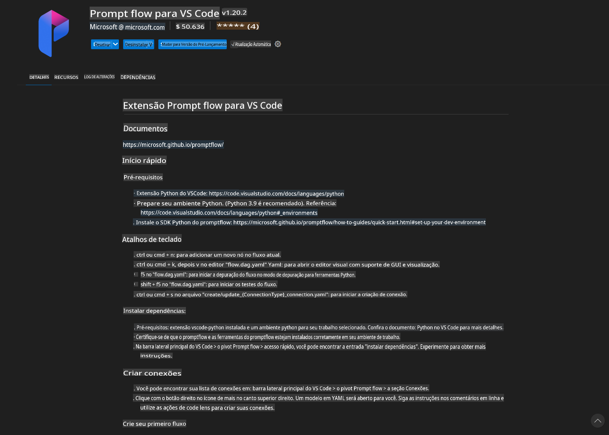
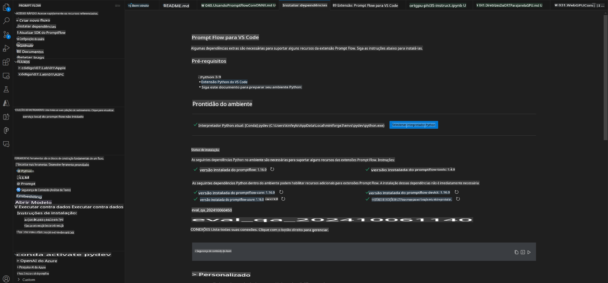
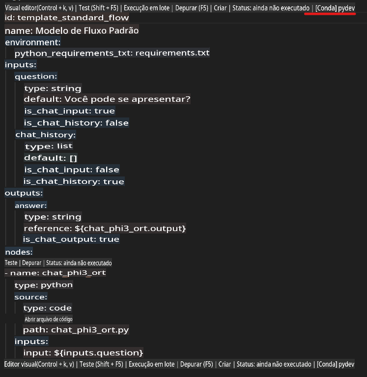
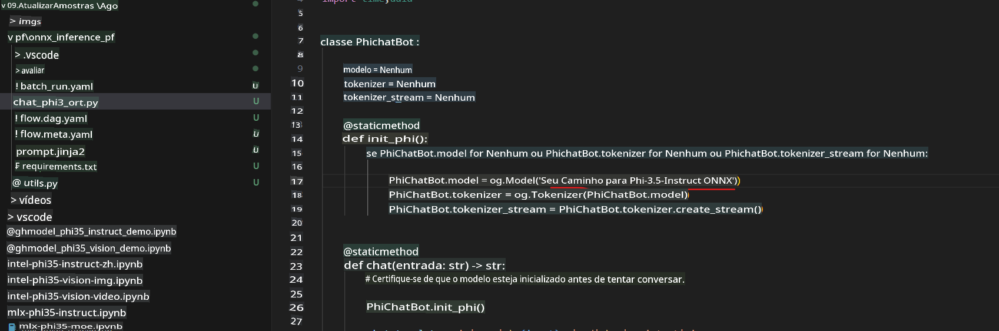
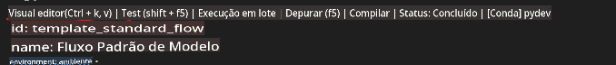
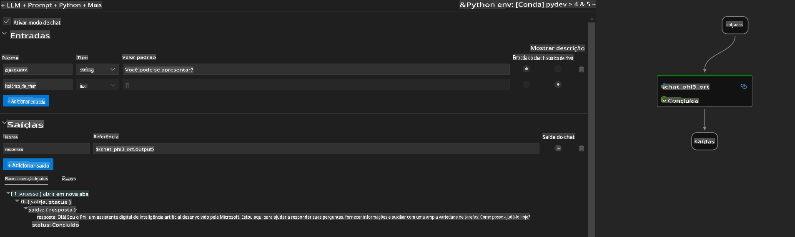
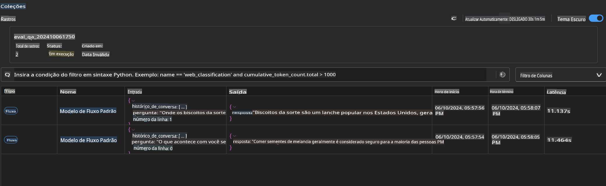

# Usando GPU do Windows para criar uma solução Prompt flow com Phi-3.5-Instruct ONNX

O documento a seguir é um exemplo de como usar o PromptFlow com ONNX (Open Neural Network Exchange) para desenvolver aplicações de IA baseadas nos modelos Phi-3.

O PromptFlow é um conjunto de ferramentas de desenvolvimento projetado para simplificar o ciclo de desenvolvimento de ponta a ponta de aplicações de IA baseadas em LLMs (Large Language Models), desde a concepção e prototipagem até os testes e avaliação.

Ao integrar o PromptFlow com ONNX, os desenvolvedores podem:

- **Otimizar o desempenho do modelo**: Usar o ONNX para inferência e implantação eficientes do modelo.
- **Simplificar o desenvolvimento**: Utilizar o PromptFlow para gerenciar o fluxo de trabalho e automatizar tarefas repetitivas.
- **Melhorar a colaboração**: Facilitar a colaboração entre os membros da equipe, fornecendo um ambiente de desenvolvimento unificado.

**Prompt flow** é um conjunto de ferramentas de desenvolvimento projetado para simplificar o ciclo de desenvolvimento de ponta a ponta de aplicações de IA baseadas em LLM, desde a concepção, prototipagem, testes, avaliação até a implantação e monitoramento em produção. Ele torna a engenharia de prompts muito mais fácil e permite que você construa aplicações LLM com qualidade de produção.

O Prompt flow pode se conectar ao OpenAI, Azure OpenAI Service e modelos personalizáveis (Huggingface, LLM/SLM locais). Nosso objetivo é implantar o modelo ONNX quantizado do Phi-3.5 em aplicações locais. O Prompt flow pode nos ajudar a planejar melhor nossos negócios e a criar soluções locais baseadas no Phi-3.5. Neste exemplo, combinaremos a biblioteca GenAI do ONNX Runtime para concluir a solução Prompt flow baseada na GPU do Windows.

## **Instalação**

### **ONNX Runtime GenAI para GPU do Windows**

Leia este guia para configurar o ONNX Runtime GenAI para GPU do Windows [clique aqui](./ORTWindowGPUGuideline.md)

### **Configurar o Prompt flow no VSCode**

1. Instale a extensão Prompt flow para o VS Code



2. Após instalar a extensão Prompt flow para o VS Code, clique na extensão e escolha **Installation dependencies**. Siga este guia para instalar o SDK do Prompt flow no seu ambiente.



3. Baixe o [Código de Exemplo](../../../../../../code/09.UpdateSamples/Aug/pf/onnx_inference_pf) e use o VS Code para abrir este exemplo.


4. Abra o arquivo **flow.dag.yaml** para escolher o ambiente Python.



   Abra o arquivo **chat_phi3_ort.py** para alterar a localização do modelo Phi-3.5-instruct ONNX.



5. Execute seu Prompt flow para testar.

Abra o arquivo **flow.dag.yaml** e clique no editor visual.



Depois de clicar, execute-o para testar.



1. Você pode executar em lote no terminal para verificar mais resultados.

```bash

pf run create --file batch_run.yaml --stream --name 'Your eval qa name'    

```

Você pode verificar os resultados no seu navegador padrão.



**Aviso Legal**:  
Este documento foi traduzido utilizando serviços de tradução automática baseados em IA. Embora nos esforcemos para garantir a precisão, esteja ciente de que traduções automatizadas podem conter erros ou imprecisões. O documento original em seu idioma nativo deve ser considerado a fonte autoritativa. Para informações críticas, recomenda-se uma tradução profissional realizada por humanos. Não nos responsabilizamos por quaisquer mal-entendidos ou interpretações incorretas decorrentes do uso desta tradução.