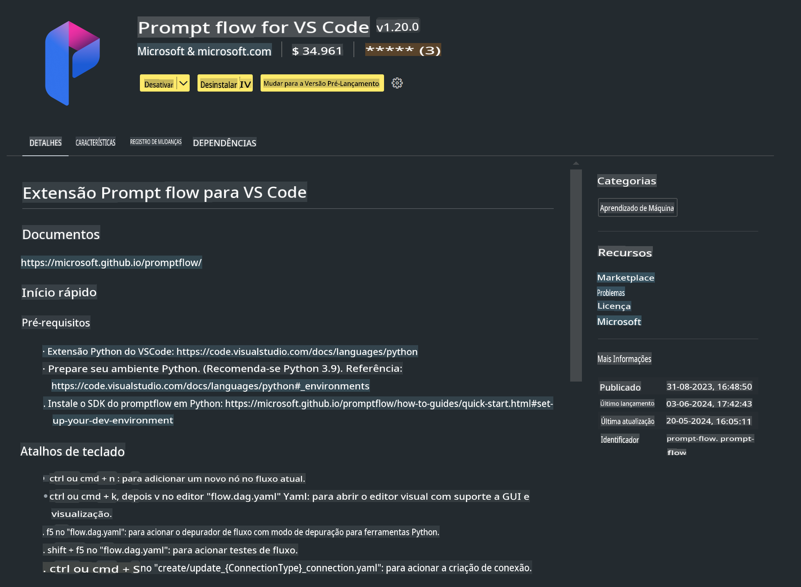

# **Lab 0 - Instalação**

Ao entrarmos no Lab, precisamos configurar o ambiente relevante:

### **1. Python 3.11+**

Recomenda-se usar o miniforge para configurar seu ambiente Python.

Para configurar o miniforge, consulte [https://github.com/conda-forge/miniforge](https://github.com/conda-forge/miniforge).

Após configurar o miniforge, execute o seguinte comando no PowerShell:

```bash

conda create -n pyenv python==3.11.8 -y

conda activate pyenv

```

### **2. Instalar o SDK do Prompt flow**

No Lab 1, utilizaremos o Prompt flow, então é necessário configurar o SDK do Prompt flow.

```bash

pip install promptflow --upgrade

```

Você pode verificar o SDK do promptflow com este comando:

```bash

pf --version

```

### **3. Instalar a Extensão do Prompt flow para o Visual Studio Code**



### **4. Biblioteca de Aceleração NPU da Intel**

Os processadores da nova geração da Intel suportam NPU. Se você deseja usar a NPU para executar LLMs/SLMs localmente, pode utilizar a ***Biblioteca de Aceleração NPU da Intel***. Para saber mais, consulte [https://github.com/microsoft/PhiCookBook/blob/main/md/01.Introduction/03/AIPC_Inference.md](https://github.com/microsoft/PhiCookBook/blob/main/md/01.Introduction/03/AIPC_Inference.md).

Instale a Biblioteca de Aceleração NPU da Intel no bash:

```bash

pip install intel-npu-acceleration-library

```

***Nota***: Observe que esta biblioteca suporta a versão ***4.40.2*** do transformers. Por favor, confirme a versão.

### **5. Outras Bibliotecas Python**

Crie um arquivo requirements.txt e adicione o seguinte conteúdo:

```txt

notebook
numpy 
scipy 
scikit-learn 
matplotlib 
pandas 
pillow 
graphviz

```

### **6. Instalar NVM**

Instale o nvm no PowerShell:

```bash

winget install -e --id CoreyButler.NVMforWindows

```

Instale o Node.js 18.20:

```bash

nvm install 18.20.0

nvm use 18.20.0

```

### **7. Instalar Suporte ao Desenvolvimento no Visual Studio Code**

```bash

npm install --global yo generator-code

```

Parabéns! Você configurou o SDK com sucesso. Agora, prossiga para os passos práticos.

**Aviso Legal**:  
Este documento foi traduzido utilizando serviços de tradução automatizada por IA. Embora nos esforcemos para garantir a precisão, esteja ciente de que traduções automáticas podem conter erros ou imprecisões. O documento original em seu idioma nativo deve ser considerado a fonte autoritativa. Para informações críticas, recomenda-se a tradução profissional humana. Não nos responsabilizamos por quaisquer mal-entendidos ou interpretações equivocadas decorrentes do uso desta tradução.