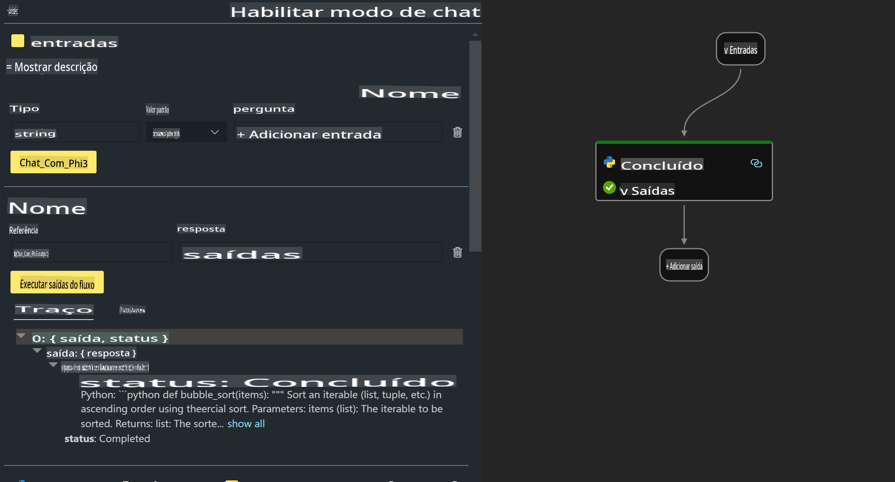

# **Lab 2 - Executar o Prompt flow com Phi-3-mini no AIPC**

## **O que é Prompt flow**

Prompt flow é um conjunto de ferramentas de desenvolvimento projetado para simplificar o ciclo completo de desenvolvimento de aplicações de IA baseadas em LLM, desde a ideação, prototipagem, teste, avaliação até a implantação em produção e monitoramento. Ele facilita a engenharia de prompts e permite que você construa aplicativos LLM com qualidade de produção.

Com o Prompt flow, você poderá:

- Criar fluxos que conectam LLMs, prompts, código Python e outras ferramentas em um fluxo de trabalho executável.

- Depurar e iterar seus fluxos, especialmente a interação com LLMs, de forma simples.

- Avaliar seus fluxos, calcular métricas de qualidade e desempenho com conjuntos de dados maiores.

- Integrar o teste e a avaliação no seu sistema CI/CD para garantir a qualidade do fluxo.

- Implantar seus fluxos na plataforma de serviço escolhida ou integrá-los facilmente na base de código do seu aplicativo.

- (Opcional, mas altamente recomendado) Colaborar com sua equipe utilizando a versão em nuvem do Prompt flow no Azure AI.


## **Construindo fluxos de geração de código no Apple Silicon**

***Nota***: Se você ainda não completou a instalação do ambiente, visite [Lab 0 - Instalações](./01.Installations.md)

1. Abra a extensão Prompt flow no Visual Studio Code e crie um projeto de fluxo vazio.


2. Adicione parâmetros de entrada e saída e insira código Python como um novo fluxo.



Você pode consultar esta estrutura (flow.dag.yaml) para construir seu fluxo:

```yaml

inputs:
  prompt:
    type: string
    default: Write python code for Fibonacci serie. Please use markdown as output
outputs:
  result:
    type: string
    reference: ${gen_code_by_phi3.output}
nodes:
- name: gen_code_by_phi3
  type: python
  source:
    type: code
    path: gen_code_by_phi3.py
  inputs:
    prompt: ${inputs.prompt}


```

3. Quantificar o phi-3-mini

Queremos rodar o SLM de forma mais eficiente em dispositivos locais. Geralmente, quantificamos o modelo (INT4, FP16, FP32).

```bash

python -m mlx_lm.convert --hf-path microsoft/Phi-3-mini-4k-instruct

```

**Nota:** a pasta padrão é mlx_model.

4. Adicione o código no arquivo ***Chat_With_Phi3.py***.

```python


from promptflow import tool

from mlx_lm import load, generate


# The inputs section will change based on the arguments of the tool function, after you save the code
# Adding type to arguments and return value will help the system show the types properly
# Please update the function name/signature per need
@tool
def my_python_tool(prompt: str) -> str:

    model_id = './mlx_model_phi3_mini'

    model, tokenizer = load(model_id)

    # <|user|>\nWrite python code for Fibonacci serie. Please use markdown as output<|end|>\n<|assistant|>

    response = generate(model, tokenizer, prompt="<|user|>\n" + prompt  + "<|end|>\n<|assistant|>", max_tokens=2048, verbose=True)

    return response


```

4. Você pode testar o fluxo usando Debug ou Run para verificar se o código gerado está funcionando corretamente.


5. Execute o fluxo como uma API de desenvolvimento no terminal.

```

pf flow serve --source ./ --port 8080 --host localhost   

```

Você pode testá-lo no Postman / Thunder Client.


### **Nota**

1. A primeira execução leva bastante tempo. Recomenda-se baixar o modelo phi-3 através do CLI do Hugging Face.

2. Considerando o poder de computação limitado do Intel NPU, recomenda-se usar o Phi-3-mini-4k-instruct.

3. Usamos a aceleração Intel NPU para a conversão quantizada em INT4, mas, se você reiniciar o serviço, será necessário excluir as pastas cache e nc_workshop.


## **Recursos**

1. Aprenda sobre Promptflow [https://microsoft.github.io/promptflow/](https://microsoft.github.io/promptflow/)

2. Aprenda sobre Intel NPU Acceleration [https://github.com/intel/intel-npu-acceleration-library](https://github.com/intel/intel-npu-acceleration-library)

3. Código de exemplo, baixe [Local NPU Agent Sample Code](../../../../../../../../../code/07.Lab/01/AIPC/local-npu-agent)

**Aviso Legal**:  
Este documento foi traduzido utilizando serviços de tradução automática baseados em IA. Embora nos esforcemos para garantir a precisão, esteja ciente de que traduções automatizadas podem conter erros ou imprecisões. O documento original em seu idioma nativo deve ser considerado a fonte autoritativa. Para informações críticas, recomenda-se uma tradução profissional feita por humanos. Não nos responsabilizamos por quaisquer mal-entendidos ou interpretações equivocadas decorrentes do uso desta tradução.