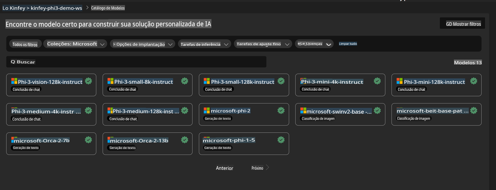
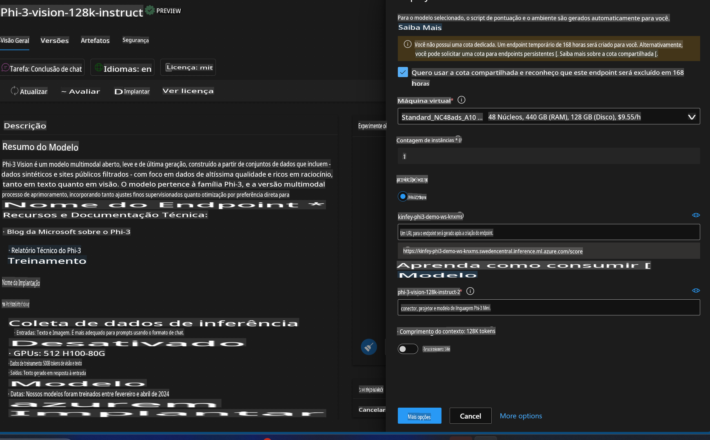
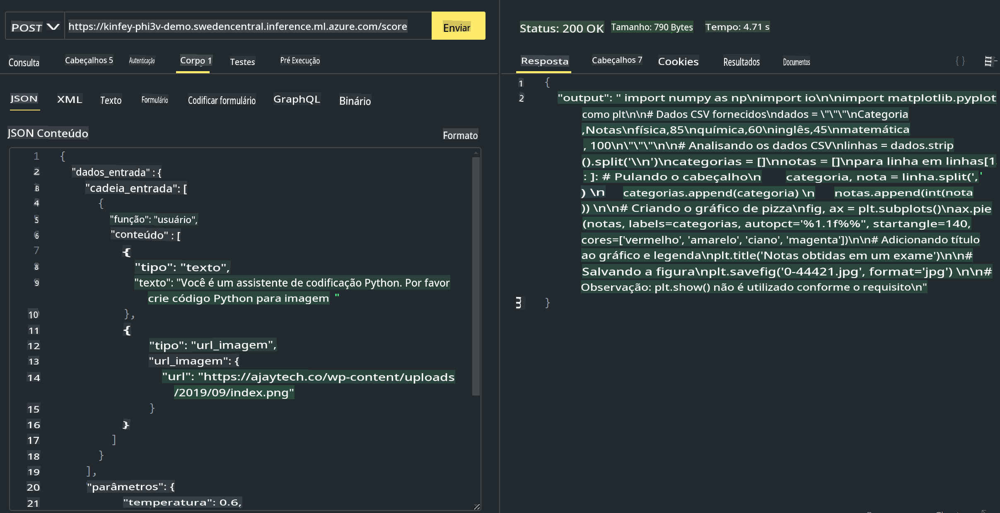

# **Lab 3 - Implantar Phi-3-Vision no Azure Machine Learning Service**

Usamos NPU para concluir a implantação de código local em produção e, em seguida, queremos introduzir a capacidade de usar o PHI-3-VISION para converter imagens em código.

Nesta introdução, podemos construir rapidamente um serviço Modelo Como Serviço (Model As Service) Phi-3 Vision no Azure Machine Learning Service.

***Nota***: Phi-3 Vision requer poder computacional para gerar conteúdo em uma velocidade mais rápida. Precisamos de computação em nuvem para nos ajudar a alcançar isso.


### **1. Criar o Azure Machine Learning Service**

Precisamos criar um Azure Machine Learning Service no Portal do Azure. Se você quiser aprender como fazer isso, visite este link [https://learn.microsoft.com/azure/machine-learning/quickstart-create-resources?view=azureml-api-2](https://learn.microsoft.com/azure/machine-learning/quickstart-create-resources?view=azureml-api-2)


### **2. Escolher Phi-3 Vision no Azure Machine Learning Service**




### **3. Implantar Phi-3-Vision no Azure**




### **4. Testar Endpoint no Postman**




***Nota***

1. Os parâmetros a serem transmitidos devem incluir Authorization, azureml-model-deployment e Content-Type. Você precisará verificar as informações de implantação para obtê-los.

2. Para transmitir parâmetros, Phi-3-Vision precisa de um link de imagem. Consulte o método GPT-4-Vision para transmitir parâmetros, como

```json

{
  "input_data":{
    "input_string":[
      {
        "role":"user",
        "content":[ 
          {
            "type": "text",
            "text": "You are a Python coding assistant.Please create Python code for image "
          },
          {
              "type": "image_url",
              "image_url": {
                "url": "https://ajaytech.co/wp-content/uploads/2019/09/index.png"
              }
          }
        ]
      }
    ],
    "parameters":{
          "temperature": 0.6,
          "top_p": 0.9,
          "do_sample": false,
          "max_new_tokens": 2048
    }
  }
}

```

3. Chame **/score** usando o método Post.

**Parabéns**! Você concluiu a implantação rápida do PHI-3-VISION e experimentou como usar imagens para gerar código. A seguir, podemos construir aplicações combinando NPUs e nuvens.

**Aviso Legal**:  
Este documento foi traduzido utilizando serviços de tradução automática baseados em IA. Embora nos esforcemos para garantir a precisão, esteja ciente de que traduções automatizadas podem conter erros ou imprecisões. O documento original em seu idioma nativo deve ser considerado a fonte oficial. Para informações críticas, recomenda-se a tradução profissional feita por humanos. Não nos responsabilizamos por quaisquer mal-entendidos ou interpretações equivocadas decorrentes do uso desta tradução.