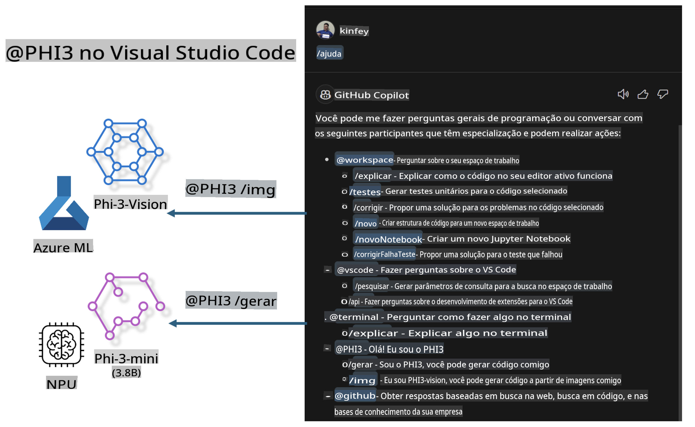

# **Crie seu próprio Visual Studio Code GitHub Copilot Chat com a Família Microsoft Phi-3**

Você já usou o agente de workspace no GitHub Copilot Chat? Gostaria de criar o agente de código da sua equipe? Este laboratório prático visa combinar o modelo de código aberto para construir um agente empresarial de negócios de código.

## **Fundamentos**

### **Por que escolher o Microsoft Phi-3**

Phi-3 é uma família de modelos, incluindo phi-3-mini, phi-3-small e phi-3-medium, baseados em diferentes parâmetros de treinamento para geração de texto, conclusão de diálogos e geração de código. Também há o phi-3-vision baseado em visão computacional. Ele é ideal para empresas ou equipes que desejam criar soluções de IA generativa offline.

Recomendamos a leitura deste link [https://github.com/microsoft/PhiCookBook/blob/main/md/01.Introduction/01/01.PhiFamily.md](https://github.com/microsoft/PhiCookBook/blob/main/md/01.Introduction/01/01.PhiFamily.md)

### **Microsoft GitHub Copilot Chat**

A extensão GitHub Copilot Chat oferece uma interface de chat que permite interagir com o GitHub Copilot e receber respostas a perguntas relacionadas à programação diretamente no VS Code, sem precisar consultar documentações ou buscar em fóruns online.

O Copilot Chat pode usar realce de sintaxe, indentação e outros recursos de formatação para dar clareza às respostas geradas. Dependendo do tipo de pergunta do usuário, o resultado pode incluir links para o contexto usado pelo Copilot para gerar uma resposta, como arquivos de código-fonte ou documentação, ou botões para acessar funcionalidades do VS Code.

- O Copilot Chat se integra ao fluxo do desenvolvedor e oferece assistência onde você precisa:

- Inicie uma conversa de chat diretamente do editor ou do terminal para obter ajuda enquanto você programa.

- Use a visualização de Chat para ter um assistente de IA ao lado, pronto para ajudar a qualquer momento.

- Inicie o Quick Chat para fazer uma pergunta rápida e voltar ao que estava fazendo.

Você pode usar o GitHub Copilot Chat em diversos cenários, como:

- Responder perguntas sobre como resolver um problema de programação.

- Explicar o código de outra pessoa e sugerir melhorias.

- Propor correções de código.

- Gerar casos de teste unitário.

- Gerar documentação de código.

Recomendamos a leitura deste link [https://code.visualstudio.com/docs/copilot/copilot-chat](https://code.visualstudio.com/docs/copilot/copilot-chat?WT.mc_id=aiml-137032-kinfeylo)

### **Microsoft GitHub Copilot Chat @workspace**

Ao referenciar **@workspace** no Copilot Chat, você pode fazer perguntas sobre todo o seu código. Com base na pergunta, o Copilot recupera de forma inteligente arquivos e símbolos relevantes, que ele então referencia em sua resposta como links e exemplos de código.

Para responder à sua pergunta, **@workspace** pesquisa nas mesmas fontes que um desenvolvedor usaria ao navegar por um código no VS Code:

- Todos os arquivos no workspace, exceto os que são ignorados por um arquivo .gitignore.

- Estrutura de diretórios com pastas aninhadas e nomes de arquivos.

- Índice de pesquisa de código do GitHub, se o workspace for um repositório do GitHub e estiver indexado pela pesquisa de código.

- Símbolos e definições no workspace.

- Texto atualmente selecionado ou visível no editor ativo.

Nota: o .gitignore é ignorado se você tiver um arquivo aberto ou texto selecionado dentro de um arquivo ignorado.

Recomendamos a leitura deste link [[https://code.visualstudio.com/docs/copilot/copilot-chat](https://code.visualstudio.com/docs/copilot/workspace-context?WT.mc_id=aiml-137032-kinfeylo)]

## **Saiba mais sobre este laboratório**

O GitHub Copilot melhorou muito a eficiência de programação nas empresas, e cada organização deseja personalizar as funções relacionadas ao GitHub Copilot. Muitas empresas já criaram extensões semelhantes ao GitHub Copilot com base em seus próprios cenários de negócios e modelos de código aberto. Para as empresas, extensões personalizadas são mais fáceis de controlar, mas isso pode afetar a experiência do usuário. Afinal, o GitHub Copilot é mais robusto para lidar com cenários gerais e profissionais. Se a experiência puder ser mantida consistente, será ainda melhor personalizar a extensão da empresa. O GitHub Copilot Chat oferece APIs relevantes para que as empresas expandam a experiência de chat. Manter uma experiência consistente e ter funções personalizadas proporciona uma experiência de usuário superior.

Este laboratório utiliza principalmente o modelo Phi-3 combinado com o NPU local e o Azure híbrido para construir um agente personalizado no GitHub Copilot Chat ***@PHI3*** para auxiliar os desenvolvedores empresariais na geração de código ***(@PHI3 /gen)*** e na geração de código com base em imagens ***(@PHI3 /img)***.

### ***Nota:*** 

Este laboratório foi implementado atualmente no AIPC de CPUs Intel e no Apple Silicon. Continuaremos a atualizar a versão para NPU Qualcomm.

## **Laboratório**

| Nome | Descrição | AIPC | Apple |
| ------------ | ----------- | -------- |-------- |
| Lab0 - Instalações(✅) | Configurar e instalar os ambientes e ferramentas necessários | [Ir](./HOL/AIPC/01.Installations.md) |[Ir](./HOL/Apple/01.Installations.md) |
| Lab1 - Executar Prompt flow com Phi-3-mini (✅) | Combinado com AIPC / Apple Silicon, usando o NPU local para criar geração de código com o Phi-3-mini | [Ir](./HOL/AIPC/02.PromptflowWithNPU.md) |  [Ir](./HOL/Apple/02.PromptflowWithMLX.md) |
| Lab2 - Implantar Phi-3-vision no Azure Machine Learning Service(✅) | Gerar código implantando o Phi-3-vision no Catálogo de Modelos do Azure Machine Learning Service | [Ir](./HOL/AIPC/03.DeployPhi3VisionOnAzure.md) |[Ir](./HOL/Apple/03.DeployPhi3VisionOnAzure.md) |
| Lab3 - Criar um agente @phi-3 no GitHub Copilot Chat(✅)  | Criar um agente personalizado Phi-3 no GitHub Copilot Chat para realizar geração de código, geração de gráficos, RAG, etc. | [Ir](./HOL/AIPC/04.CreatePhi3AgentInVSCode.md) | [Ir](./HOL/Apple/04.CreatePhi3AgentInVSCode.md) |
| Código de Exemplo (✅)  | Baixar código de exemplo | [Ir](../../../../../../../code/07.Lab/01/AIPC) | [Ir](../../../../../../../code/07.Lab/01/Apple) |

## **Recursos**

1. Phi-3 Cookbook [https://github.com/microsoft/Phi-3CookBook](https://github.com/microsoft/Phi-3CookBook)

2. Saiba mais sobre o GitHub Copilot [https://learn.microsoft.com/training/paths/copilot/](https://learn.microsoft.com/training/paths/copilot/?WT.mc_id=aiml-137032-kinfeylo)

3. Saiba mais sobre o GitHub Copilot Chat [https://learn.microsoft.com/training/paths/accelerate-app-development-using-github-copilot/](https://learn.microsoft.com/training/paths/accelerate-app-development-using-github-copilot/?WT.mc_id=aiml-137032-kinfeylo)

4. Saiba mais sobre a API do GitHub Copilot Chat [https://code.visualstudio.com/api/extension-guides/chat](https://code.visualstudio.com/api/extension-guides/chat?WT.mc_id=aiml-137032-kinfeylo)

5. Saiba mais sobre o Azure AI Foundry [https://learn.microsoft.com/training/paths/create-custom-copilots-ai-studio/](https://learn.microsoft.com/training/paths/create-custom-copilots-ai-studio/?WT.mc_id=aiml-137032-kinfeylo)

6. Saiba mais sobre o Catálogo de Modelos do Azure AI Foundry [https://learn.microsoft.com/azure/ai-studio/how-to/model-catalog-overview](https://learn.microsoft.com/azure/ai-studio/how-to/model-catalog-overview)

**Aviso Legal**:  
Este documento foi traduzido usando serviços de tradução baseados em IA. Embora nos esforcemos para garantir a precisão, esteja ciente de que traduções automatizadas podem conter erros ou imprecisões. O documento original em seu idioma nativo deve ser considerado a fonte oficial. Para informações críticas, recomenda-se a tradução profissional feita por humanos. Não nos responsabilizamos por quaisquer mal-entendidos ou interpretações incorretas decorrentes do uso desta tradução.