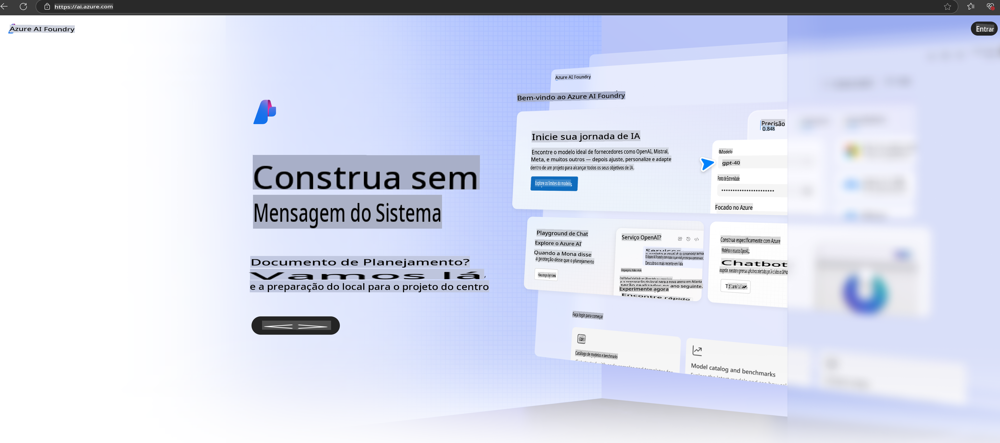

# **Usando o Phi-3 no Azure AI Foundry**

Com o avanço da IA Generativa, buscamos usar uma plataforma unificada para gerenciar diferentes LLM e SLM, integração de dados empresariais, operações de ajuste fino/RAG, avaliação de diferentes negócios empresariais após a integração de LLM e SLM, entre outros, para que as aplicações inteligentes de IA generativa sejam melhor implementadas. O [Azure AI Foundry](https://ai.azure.com) é uma plataforma de aplicação de IA generativa em nível empresarial.

Com o Azure AI Foundry, você pode avaliar as respostas de modelos de linguagem ampla (LLM) e orquestrar componentes de aplicação de prompts com o prompt flow para obter melhor desempenho. A plataforma facilita a escalabilidade para transformar provas de conceito em produções completas com facilidade. O monitoramento contínuo e o refinamento garantem o sucesso a longo prazo.

Podemos implantar rapidamente o modelo Phi-3 no Azure AI Foundry por meio de etapas simples e, em seguida, usar o Azure AI Foundry para concluir trabalhos relacionados ao Phi-3, como Playground/Chat, ajuste fino, avaliação e outros.

## **1. Preparação**

Se você já tem o [Azure Developer CLI](https://learn.microsoft.com/azure/developer/azure-developer-cli/overview?WT.mc_id=aiml-138114-kinfeylo) instalado em sua máquina, usar este template é tão simples quanto executar este comando em um novo diretório.

## Criação Manual

Criar um projeto e um hub no Microsoft Azure AI Foundry é uma ótima maneira de organizar e gerenciar seu trabalho com IA. Aqui está um guia passo a passo para começar:

### Criando um Projeto no Azure AI Foundry

1. **Acesse o Azure AI Foundry**: Faça login no portal do Azure AI Foundry.
2. **Crie um Projeto**:
   - Se você já estiver em um projeto, selecione "Azure AI Foundry" no canto superior esquerdo da página para ir à página inicial.
   - Selecione "+ Criar projeto".
   - Insira um nome para o projeto.
   - Se você já tiver um hub, ele será selecionado por padrão. Se tiver acesso a mais de um hub, poderá selecionar outro no menu suspenso. Se quiser criar um novo hub, selecione "Criar novo hub" e forneça um nome.
   - Selecione "Criar".

### Criando um Hub no Azure AI Foundry

1. **Acesse o Azure AI Foundry**: Faça login com sua conta Azure.
2. **Crie um Hub**:
   - Selecione o Centro de Gerenciamento no menu à esquerda.
   - Selecione "Todos os recursos", depois a seta ao lado de "+ Novo projeto" e selecione "+ Novo hub".
   - Na janela "Criar um novo hub", insira um nome para seu hub (por exemplo, contoso-hub) e modifique os outros campos conforme necessário.
   - Selecione "Próximo", revise as informações e, em seguida, selecione "Criar".

Para instruções mais detalhadas, você pode consultar a [documentação oficial da Microsoft](https://learn.microsoft.com/azure/ai-studio/how-to/create-projects).

Após a criação bem-sucedida, você pode acessar o estúdio criado por meio do [ai.azure.com](https://ai.azure.com/)

Podem existir vários projetos em um AI Foundry. Crie um projeto no AI Foundry para preparar.

Consulte os [QuickStarts do Azure AI Foundry](https://learn.microsoft.com/azure/ai-studio/quickstarts/get-started-code).

## **2. Implantar um modelo Phi no Azure AI Foundry**

Clique na opção Explorar do projeto para acessar o Catálogo de Modelos e selecione Phi-3.

Selecione Phi-3-mini-4k-instruct.

Clique em 'Implantar' para implantar o modelo Phi-3-mini-4k-instruct.

> [!NOTE]
>
> Você pode selecionar a capacidade computacional ao implantar.

## **3. Playground Chat Phi no Azure AI Foundry**

Acesse a página de implantação, selecione Playground e interaja com o Phi-3 do Azure AI Foundry.

## **4. Implantando o Modelo a partir do Azure AI Foundry**

Para implantar um modelo do Catálogo de Modelos do Azure, siga estas etapas:

- Faça login no Azure AI Foundry.
- Escolha o modelo que deseja implantar no catálogo de modelos do Azure AI Foundry.
- Na página de Detalhes do modelo, selecione Implantar e, em seguida, selecione API Serverless com Azure AI Content Safety.
- Escolha o projeto no qual deseja implantar seus modelos. Para usar a oferta de API Serverless, seu workspace deve pertencer à região East US 2 ou Sweden Central. Você pode personalizar o nome da Implantação.
- No assistente de implantação, selecione Preços e termos para saber mais sobre os custos e condições de uso.
- Selecione Implantar. Aguarde até que a implantação esteja pronta e você seja redirecionado para a página de Implantações.
- Selecione Abrir no playground para começar a interagir com o modelo.
- Você pode retornar à página de Implantações, selecionar a implantação e anotar a URL de Destino do endpoint e a Chave Secreta, que podem ser usadas para chamar a implantação e gerar respostas.
- Você sempre pode encontrar os detalhes do endpoint, URL e chaves de acesso navegando até a guia Build e selecionando Implantações na seção Componentes.

> [!NOTE]
> Observe que sua conta deve ter permissões de função de Desenvolvedor de IA do Azure no Grupo de Recursos para executar essas etapas.

## **5. Usando a API Phi no Azure AI Foundry**

Você pode acessar https://{Nome do seu projeto}.region.inference.ml.azure.com/swagger.json por meio de uma solicitação GET no Postman e combiná-la com a Key para conhecer as interfaces fornecidas.

Você pode obter os parâmetros de solicitação de forma muito conveniente, assim como os parâmetros de resposta.

**Aviso Legal**:  
Este documento foi traduzido utilizando serviços de tradução automática baseados em IA. Embora nos esforcemos para garantir a precisão, esteja ciente de que traduções automáticas podem conter erros ou imprecisões. O documento original em seu idioma nativo deve ser considerado a fonte oficial. Para informações críticas, recomenda-se a tradução profissional feita por humanos. Não nos responsabilizamos por quaisquer mal-entendidos ou interpretações equivocadas decorrentes do uso desta tradução.