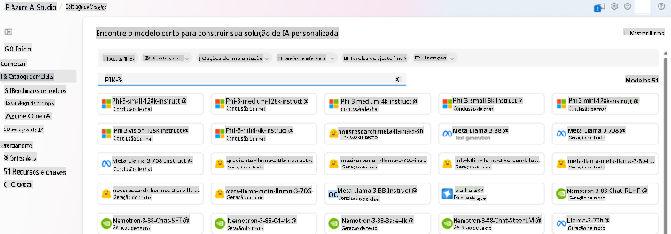
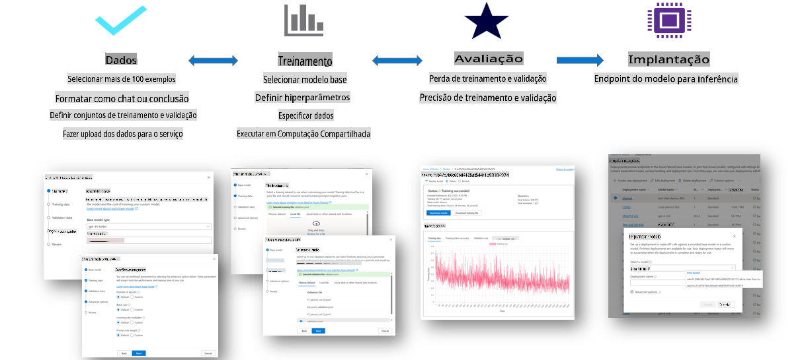
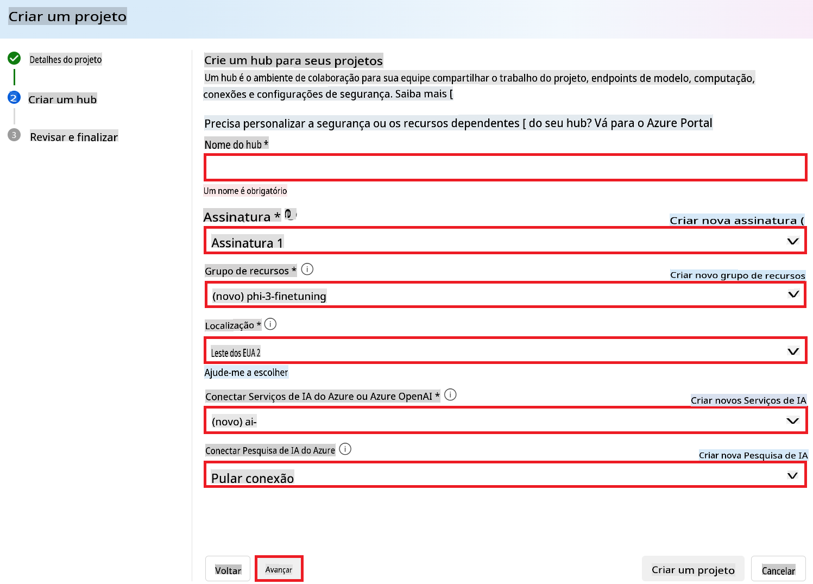
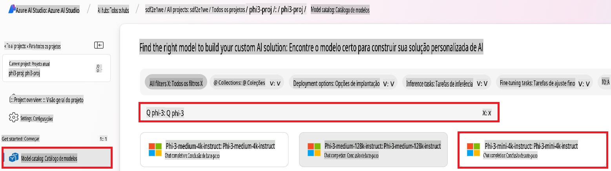
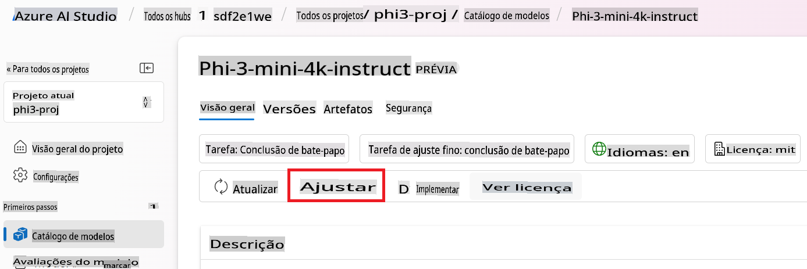
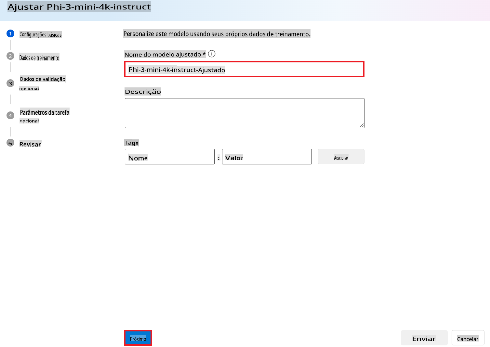
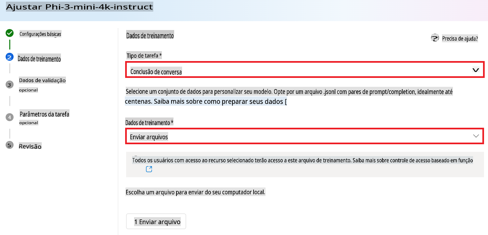
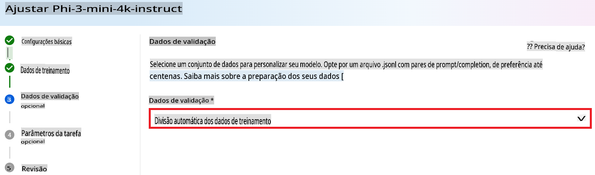
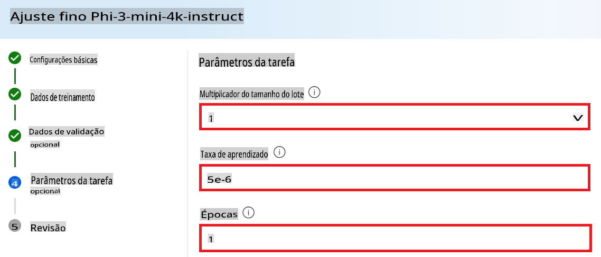
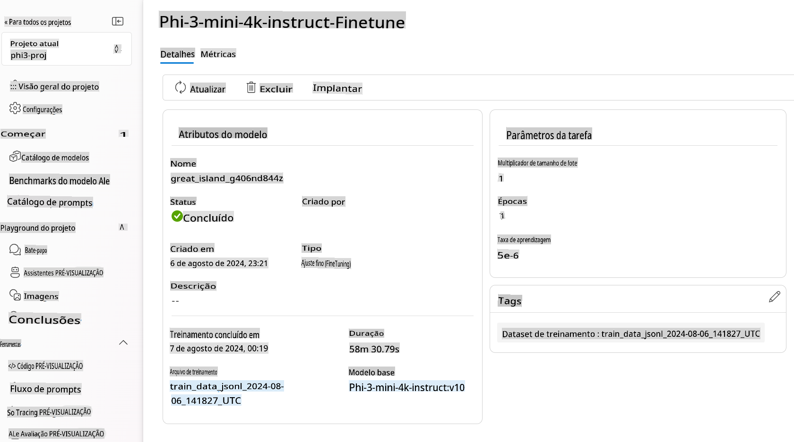

# Ajustando o Phi-3 com o Azure AI Foundry

Vamos explorar como ajustar o modelo de linguagem Phi-3 Mini da Microsoft usando o Azure AI Foundry. O ajuste fino permite adaptar o Phi-3 Mini a tarefas específicas, tornando-o ainda mais poderoso e consciente do contexto.

## Considerações

- **Capacidades:** Quais modelos podem ser ajustados? O que o modelo base pode fazer após o ajuste?
- **Custo:** Qual é o modelo de precificação para ajuste fino?
- **Personalização:** Até que ponto posso modificar o modelo base – e de que maneiras?
- **Praticidade:** Como o ajuste fino realmente funciona – preciso escrever código personalizado? Preciso trazer minha própria infraestrutura?
- **Segurança:** Modelos ajustados podem apresentar riscos de segurança – existem proteções para evitar danos não intencionais?



## Preparação para o ajuste fino

### Pré-requisitos

> [!NOTE]
> Para os modelos da família Phi-3, o modelo de ajuste fino pay-as-you-go está disponível apenas em hubs criados na região **East US 2**.

- Uma assinatura do Azure. Se você não tem uma assinatura, crie uma [conta paga do Azure](https://azure.microsoft.com/pricing/purchase-options/pay-as-you-go) para começar.

- Um [projeto do AI Foundry](https://ai.azure.com?WT.mc_id=aiml-138114-kinfeylo).
- Controles de acesso baseados em função do Azure (Azure RBAC) são usados para conceder acesso às operações no Azure AI Foundry. Para realizar os passos deste artigo, sua conta de usuário deve ter o papel __Azure AI Developer__ no grupo de recursos.

### Registro do provedor de assinatura

Verifique se a assinatura está registrada no provedor de recursos `Microsoft.Network`.

1. Faça login no [portal do Azure](https://portal.azure.com).
1. Selecione **Assinaturas** no menu à esquerda.
1. Escolha a assinatura que deseja usar.
1. Clique em **Configurações do projeto de IA** > **Provedores de recursos** no menu à esquerda.
1. Confirme que **Microsoft.Network** está na lista de provedores de recursos. Caso contrário, adicione-o.

### Preparação dos dados

Prepare seus dados de treinamento e validação para ajustar o modelo. Seus conjuntos de dados de treinamento e validação devem conter exemplos de entrada e saída que representem como você deseja que o modelo funcione.

Certifique-se de que todos os exemplos de treinamento sigam o formato esperado para inferência. Para ajustar os modelos de forma eficaz, garanta um conjunto de dados equilibrado e diversificado.

Isso inclui manter o equilíbrio dos dados, abranger diversos cenários e refinar periodicamente os dados de treinamento para alinhá-los às expectativas do mundo real, levando a respostas mais precisas e equilibradas do modelo.

Diferentes tipos de modelos requerem formatos diferentes de dados de treinamento.

### Conclusão de Chat

Os dados de treinamento e validação **devem** estar no formato de documento JSON Lines (JSONL). Para `Phi-3-mini-128k-instruct`, o conjunto de dados de ajuste fino deve estar no formato conversacional utilizado pela API de conclusão de chat.

### Exemplo de formato de arquivo

```json
    {"messages": [{"role": "system", "content": "You are an Xbox customer support agent whose primary goal is to help users with issues they are experiencing with their Xbox devices. You are friendly and concise. You only provide factual answers to queries, and do not provide answers that are not related to Xbox."}, {"role": "user", "content": "Is Xbox better than PlayStation?"}, {"role": "assistant", "content": "I apologize, but I cannot provide personal opinions. My primary job is to assist you with any issues related to your Xbox device. Do you have any Xbox-related issues that need addressing?"}]}
    {"messages": [{"role": "system", "content": "You are an Xbox customer support agent whose primary goal is to help users with issues they are experiencing with their Xbox devices. You are friendly and concise. You only provide factual answers to queries, and do not provide answers that are not related to Xbox."}, {"role": "user", "content": "Can I play PC games on my Xbox?"}, {"role": "assistant", "content": "While Xbox consoles don't natively support PC games, they can play an array of Xbox games, many of which are also available on PC. Can I assist you with finding games compatible with your Xbox device?"}]}
    {"messages": [{"role": "system", "content": "You are an Xbox customer support agent whose primary goal is to help users with issues they are experiencing with their Xbox devices. You are friendly and concise. You only provide factual answers to queries, and do not provide answers that are not related to Xbox."}, {"role": "user", "content": "I'm having trouble connecting my Xbox to the Wi-Fi."}, {"role": "assistant", "content": "No worries, let's go through the network settings on your Xbox. Can you please tell me what happens when you try to connect it to the Wi-Fi?"}]}
```

O tipo de arquivo suportado é JSON Lines. Os arquivos são carregados no armazenamento padrão e disponibilizados em seu projeto.

## Ajustando o Phi-3 com o Azure AI Foundry

O Azure AI Foundry permite que você adapte modelos de linguagem grandes aos seus próprios conjuntos de dados usando um processo conhecido como ajuste fino. O ajuste fino proporciona grande valor, permitindo personalização e otimização para tarefas e aplicações específicas. Isso resulta em melhor desempenho, eficiência de custos, menor latência e saídas personalizadas.



### Criar um Novo Projeto

1. Faça login no [Azure AI Foundry](https://ai.azure.com).

1. Selecione **+Novo projeto** para criar um novo projeto no Azure AI Foundry.

    

1. Realize as seguintes tarefas:

    - Nome do **Hub do projeto**. Deve ser um valor único.
    - Selecione o **Hub** a ser usado (crie um novo, se necessário).

    

1. Realize as seguintes tarefas para criar um novo hub:

    - Insira o **Nome do Hub**. Deve ser um valor único.
    - Selecione sua **Assinatura do Azure**.
    - Escolha o **Grupo de recursos** a ser usado (crie um novo, se necessário).
    - Escolha a **Localização** desejada.
    - Selecione **Conectar Serviços de IA do Azure** para usar (crie um novo, se necessário).
    - Escolha **Pular conexão** para **Conectar Pesquisa de IA do Azure**.

    

1. Clique em **Próximo**.
1. Selecione **Criar um projeto**.

### Preparação de Dados

Antes do ajuste fino, reúna ou crie um conjunto de dados relevante para sua tarefa, como instruções de chat, pares de perguntas e respostas ou outros dados textuais pertinentes. Limpe e pré-processe esses dados removendo ruídos, lidando com valores ausentes e tokenizando o texto.

### Ajustando os modelos Phi-3 no Azure AI Foundry

> [!NOTE]
> O ajuste fino dos modelos Phi-3 é atualmente suportado em projetos localizados na região East US 2.

1. Selecione **Catálogo de modelos** no menu lateral esquerdo.

1. Digite *phi-3* na **barra de pesquisa** e selecione o modelo phi-3 que deseja usar.

    

1. Clique em **Ajustar**.

    

1. Insira o **Nome do modelo ajustado**.

    

1. Clique em **Próximo**.

1. Realize as seguintes tarefas:

    - Selecione **tipo de tarefa** como **Conclusão de Chat**.
    - Escolha os **Dados de treinamento** que deseja usar. Você pode carregá-los através do Azure AI Foundry ou de seu ambiente local.

    

1. Clique em **Próximo**.

1. Carregue os **Dados de validação** que deseja usar, ou selecione **Divisão automática dos dados de treinamento**.

    

1. Clique em **Próximo**.

1. Realize as seguintes tarefas:

    - Escolha o **Multiplicador do tamanho do lote** que deseja usar.
    - Defina a **Taxa de aprendizado**.
    - Escolha o número de **Épocas**.

    

1. Clique em **Enviar** para iniciar o processo de ajuste fino.

    

1. Assim que o modelo for ajustado, o status será exibido como **Concluído**, como mostrado na imagem abaixo. Agora você pode implantar o modelo e usá-lo em sua própria aplicação, no playground ou no fluxo de prompts. Para mais informações, veja [Como implantar a família de modelos Phi-3 com Azure AI Foundry](https://learn.microsoft.com/azure/ai-studio/how-to/deploy-models-phi-3?tabs=phi-3-5&pivots=programming-language-python).

    

> [!NOTE]
> Para informações mais detalhadas sobre o ajuste fino do Phi-3, visite [Ajuste fino de modelos Phi-3 no Azure AI Foundry](https://learn.microsoft.com/azure/ai-studio/how-to/fine-tune-phi-3?tabs=phi-3-mini).

## Limpando seus modelos ajustados

Você pode excluir um modelo ajustado da lista de modelos ajustados no [Azure AI Foundry](https://ai.azure.com) ou da página de detalhes do modelo. Selecione o modelo ajustado que deseja excluir na página de Ajuste Fino e clique no botão Excluir.

> [!NOTE]
> Não é possível excluir um modelo personalizado se ele tiver uma implantação existente. Primeiro, exclua a implantação do modelo antes de excluí-lo.

## Custos e cotas

### Considerações sobre custo e cota para ajuste fino de modelos Phi-3

Os modelos Phi ajustados como serviço são oferecidos pela Microsoft e integrados ao Azure AI Foundry para uso. Você pode encontrar os preços ao [implantar](https://learn.microsoft.com/azure/ai-studio/how-to/deploy-models-phi-3?tabs=phi-3-5&pivots=programming-language-python) ou ajustar os modelos na aba Preços e Termos no assistente de implantação.

## Filtragem de conteúdo

Os modelos implantados como serviço com o modelo pay-as-you-go são protegidos pelo Azure AI Content Safety. Quando implantados em endpoints em tempo real, é possível optar por desativar essa funcionalidade. Com o Azure AI Content Safety ativado, tanto o prompt quanto a conclusão passam por um conjunto de modelos de classificação projetados para detectar e prevenir a geração de conteúdo prejudicial. O sistema de filtragem de conteúdo detecta e toma medidas em categorias específicas de conteúdo potencialmente prejudicial nos prompts de entrada e nas respostas geradas. Saiba mais sobre [Azure AI Content Safety](https://learn.microsoft.com/azure/ai-studio/concepts/content-filtering).

**Configuração de Ajuste Fino**

Hiperparâmetros: Defina hiperparâmetros como taxa de aprendizado, tamanho do lote e número de épocas de treinamento.

**Função de Perda**

Escolha uma função de perda adequada para sua tarefa (por exemplo, entropia cruzada).

**Otimizador**

Selecione um otimizador (por exemplo, Adam) para atualizações de gradiente durante o treinamento.

**Processo de Ajuste Fino**

- Carregar Modelo Pré-Treinado: Carregue o checkpoint do Phi-3 Mini.
- Adicionar Camadas Personalizadas: Adicione camadas específicas para a tarefa (por exemplo, cabeçalho de classificação para instruções de chat).

**Treine o Modelo**
Ajuste o modelo usando seu conjunto de dados preparado. Monitore o progresso do treinamento e ajuste os hiperparâmetros conforme necessário.

**Avaliação e Validação**

Conjunto de Validação: Divida seus dados em conjuntos de treinamento e validação.

**Avalie o Desempenho**

Use métricas como acurácia, F1-score ou perplexidade para avaliar o desempenho do modelo.

## Salvar Modelo Ajustado

**Checkpoint**
Salve o checkpoint do modelo ajustado para uso futuro.

## Implantação

- Implante como um Serviço Web: Implante seu modelo ajustado como um serviço web no Azure AI Foundry.
- Teste o Endpoint: Envie consultas de teste para o endpoint implantado para verificar sua funcionalidade.

## Iterar e Melhorar

Iteração: Se o desempenho não for satisfatório, ajuste os hiperparâmetros, adicione mais dados ou realize mais épocas de ajuste fino.

## Monitorar e Refinar

Monitore continuamente o comportamento do modelo e refine conforme necessário.

## Personalizar e Expandir

Tarefas Personalizadas: O Phi-3 Mini pode ser ajustado para várias tarefas além de instruções de chat. Explore outros casos de uso!
Experimente: Teste diferentes arquiteturas, combinações de camadas e técnicas para melhorar o desempenho.

> [!NOTE]
> O ajuste fino é um processo iterativo. Experimente, aprenda e adapte seu modelo para alcançar os melhores resultados para sua tarefa específica!

**Aviso Legal**:  
Este documento foi traduzido utilizando serviços de tradução automatizada por IA. Embora nos esforcemos para alcançar a precisão, esteja ciente de que traduções automáticas podem conter erros ou imprecisões. O documento original em seu idioma nativo deve ser considerado a fonte oficial. Para informações críticas, recomenda-se a tradução humana profissional. Não nos responsabilizamos por quaisquer mal-entendidos ou interpretações equivocadas decorrentes do uso desta tradução.