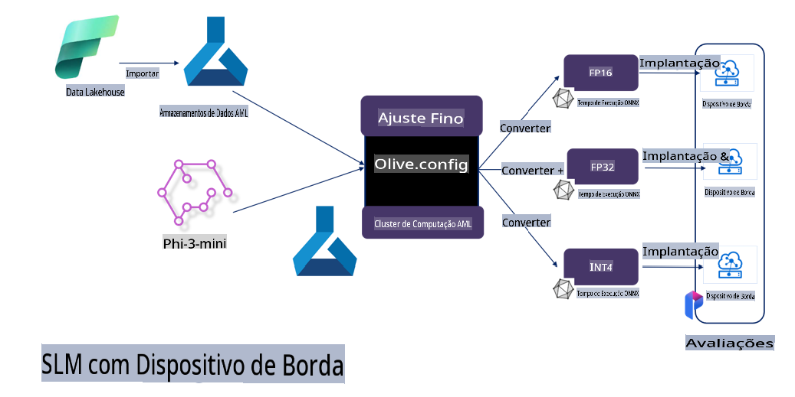

# **Aprimorando o Phi-3 com o Microsoft Olive**

[Olive](https://github.com/microsoft/OLive?WT.mc_id=aiml-138114-kinfeylo) é uma ferramenta de otimização de modelos ciente de hardware, fácil de usar, que reúne técnicas líderes do setor em compressão, otimização e compilação de modelos.

Ela foi projetada para simplificar o processo de otimização de modelos de aprendizado de máquina, garantindo o uso mais eficiente de arquiteturas de hardware específicas.

Seja para aplicações baseadas na nuvem ou dispositivos de borda, o Olive permite que você otimize seus modelos de forma simples e eficaz.

## Principais Características:
- O Olive agrega e automatiza técnicas de otimização para os alvos de hardware desejados.
- Não existe uma técnica única que se ajuste a todos os cenários, então o Olive permite extensibilidade, possibilitando que especialistas do setor integrem suas inovações de otimização.

## Redução do Esforço de Engenharia:
- Os desenvolvedores frequentemente precisam aprender e usar várias ferramentas específicas de fornecedores de hardware para preparar e otimizar modelos treinados para implantação.
- O Olive simplifica essa experiência automatizando técnicas de otimização para o hardware desejado.

## Solução de Otimização E2E Pronta para Uso:

Ao compor e ajustar técnicas integradas, o Olive oferece uma solução unificada para otimização de ponta a ponta.
Ele leva em consideração restrições como precisão e latência ao otimizar modelos.

## Usando o Microsoft Olive para aprimoramento

O Microsoft Olive é uma ferramenta de otimização de modelos de código aberto muito fácil de usar, que abrange tanto o aprimoramento quanto a referência no campo da inteligência artificial generativa. Com uma configuração simples, combinada com o uso de pequenos modelos de linguagem de código aberto e ambientes de execução relacionados (AzureML / GPU local, CPU, DirectML), você pode concluir o aprimoramento ou a referência do modelo por meio de otimização automática e encontrar o melhor modelo para implantar na nuvem ou em dispositivos de borda. Isso permite que as empresas construam seus próprios modelos verticais do setor localmente e na nuvem.


## Aprimorando o Phi-3 com o Microsoft Olive 



## Exemplo e Código do Phi-3 com Olive
Neste exemplo, você usará o Olive para:

- Ajustar um adaptador LoRA para classificar frases em Tristeza, Alegria, Medo e Surpresa.
- Mesclar os pesos do adaptador no modelo base.
- Otimizar e quantizar o modelo para int4.

[Código de Exemplo](../../code/03.Finetuning/olive-ort-example/README.md)

### Configurando o Microsoft Olive

A instalação do Microsoft Olive é muito simples e pode ser feita para CPU, GPU, DirectML e Azure ML.

```bash
pip install olive-ai
```

Se você deseja executar um modelo ONNX com uma CPU, pode usar:

```bash
pip install olive-ai[cpu]
```

Se você deseja executar um modelo ONNX com uma GPU, pode usar:

```python
pip install olive-ai[gpu]
```

Se você deseja usar o Azure ML, utilize:

```python
pip install git+https://github.com/microsoft/Olive#egg=olive-ai[azureml]
```

**Aviso**
Requisito do sistema operacional: Ubuntu 20.04 / 22.04 

### **Config.json do Microsoft Olive**

Após a instalação, você pode configurar diferentes configurações específicas do modelo por meio do arquivo Config, incluindo dados, computação, treinamento, implantação e geração de modelos.

**1. Dados**

No Microsoft Olive, é possível realizar o treinamento com dados locais e na nuvem, e isso pode ser configurado nas configurações.

*Configuração de dados locais*

Você pode configurar facilmente o conjunto de dados que precisa ser treinado para o aprimoramento, geralmente no formato json, e adaptá-lo ao modelo de dados. Isso precisa ser ajustado com base nos requisitos do modelo (por exemplo, adaptá-lo ao formato necessário pelo Microsoft Phi-3-mini. Se você tiver outros modelos, consulte os formatos de aprimoramento necessários para esses modelos).

```json

    "data_configs": [
        {
            "name": "dataset_default_train",
            "type": "HuggingfaceContainer",
            "load_dataset_config": {
                "params": {
                    "data_name": "json", 
                    "data_files":"dataset/dataset-classification.json",
                    "split": "train"
                }
            },
            "pre_process_data_config": {
                "params": {
                    "dataset_type": "corpus",
                    "text_cols": [
                            "phrase",
                            "tone"
                    ],
                    "text_template": "### Text: {phrase}\n### The tone is:\n{tone}",
                    "corpus_strategy": "join",
                    "source_max_len": 2048,
                    "pad_to_max_len": false,
                    "use_attention_mask": false
                }
            }
        }
    ],
```

**Configuração de fonte de dados na nuvem**

Ao vincular o repositório de dados do Azure AI Studio / Azure Machine Learning Service, é possível introduzir diferentes fontes de dados para o Azure AI Studio / Azure Machine Learning Service por meio do Microsoft Fabric e Azure Data como suporte para o aprimoramento dos dados.

```json

    "data_configs": [
        {
            "name": "dataset_default_train",
            "type": "HuggingfaceContainer",
            "load_dataset_config": {
                "params": {
                    "data_name": "json", 
                    "data_files": {
                        "type": "azureml_datastore",
                        "config": {
                            "azureml_client": {
                                "subscription_id": "Your Azure Subscrition ID",
                                "resource_group": "Your Azure Resource Group",
                                "workspace_name": "Your Azure ML Workspaces name"
                            },
                            "datastore_name": "workspaceblobstore",
                            "relative_path": "Your train_data.json Azure ML Location"
                        }
                    },
                    "split": "train"
                }
            },
            "pre_process_data_config": {
                "params": {
                    "dataset_type": "corpus",
                    "text_cols": [
                            "Question",
                            "Best Answer"
                    ],
                    "text_template": "<|user|>\n{Question}<|end|>\n<|assistant|>\n{Best Answer}\n<|end|>",
                    "corpus_strategy": "join",
                    "source_max_len": 2048,
                    "pad_to_max_len": false,
                    "use_attention_mask": false
                }
            }
        }
    ],
    
```

**2. Configuração de Computação**

Se você precisar de recursos locais, pode usar diretamente os dados locais. Para usar os recursos do Azure AI Studio / Azure Machine Learning Service, é necessário configurar os parâmetros relevantes do Azure, como o nome do recurso computacional.

```json

    "systems": {
        "aml": {
            "type": "AzureML",
            "config": {
                "accelerators": ["gpu"],
                "hf_token": true,
                "aml_compute": "Your Azure AI Studio / Azure Machine Learning Service Compute Name",
                "aml_docker_config": {
                    "base_image": "Your Azure AI Studio / Azure Machine Learning Service docker",
                    "conda_file_path": "conda.yaml"
                }
            }
        },
        "azure_arc": {
            "type": "AzureML",
            "config": {
                "accelerators": ["gpu"],
                "aml_compute": "Your Azure AI Studio / Azure Machine Learning Service Compute Name",
                "aml_docker_config": {
                    "base_image": "Your Azure AI Studio / Azure Machine Learning Service docker",
                    "conda_file_path": "conda.yaml"
                }
            }
        }
    },
```

***Aviso***

Como é executado por meio de um contêiner no Azure AI Studio / Azure Machine Learning Service, é necessário configurar o ambiente necessário. Isso é feito no ambiente conda.yaml.

```yaml

name: project_environment
channels:
  - defaults
dependencies:
  - python=3.8.13
  - pip=22.3.1
  - pip:
      - einops
      - accelerate
      - azure-keyvault-secrets
      - azure-identity
      - bitsandbytes
      - datasets
      - huggingface_hub
      - peft
      - scipy
      - sentencepiece
      - torch>=2.2.0
      - transformers
      - git+https://github.com/microsoft/Olive@jiapli/mlflow_loading_fix#egg=olive-ai[gpu]
      - --extra-index-url https://aiinfra.pkgs.visualstudio.com/PublicPackages/_packaging/ORT-Nightly/pypi/simple/ 
      - ort-nightly-gpu==1.18.0.dev20240307004
      - --extra-index-url https://aiinfra.pkgs.visualstudio.com/PublicPackages/_packaging/onnxruntime-genai/pypi/simple/
      - onnxruntime-genai-cuda

    

```

**3. Escolha seu SLM**

Você pode usar o modelo diretamente do Hugging Face ou combiná-lo diretamente com o Catálogo de Modelos do Azure AI Studio / Azure Machine Learning para selecionar o modelo a ser usado. No exemplo de código abaixo, usaremos o Microsoft Phi-3-mini como exemplo.

Se você tiver o modelo localmente, pode usar este método:

```json

    "input_model":{
        "type": "PyTorchModel",
        "config": {
            "hf_config": {
                "model_name": "model-cache/microsoft/phi-3-mini",
                "task": "text-generation",
                "model_loading_args": {
                    "trust_remote_code": true
                }
            }
        }
    },
```

Se você deseja usar um modelo do Azure AI Studio / Azure Machine Learning Service, pode usar este método:

```json

    "input_model":{
        "type": "PyTorchModel",
        "config": {
            "model_path": {
                "type": "azureml_registry_model",
                "config": {
                    "name": "microsoft/Phi-3-mini-4k-instruct",
                    "registry_name": "azureml-msr",
                    "version": "11"
                }
            },
             "model_file_format": "PyTorch.MLflow",
             "hf_config": {
                "model_name": "microsoft/Phi-3-mini-4k-instruct",
                "task": "text-generation",
                "from_pretrained_args": {
                    "trust_remote_code": true
                }
            }
        }
    },
```

**Aviso:**
É necessário integrar com o Azure AI Studio / Azure Machine Learning Service. Portanto, ao configurar o modelo, consulte o número da versão e a nomenclatura relacionada.

Todos os modelos no Azure precisam ser configurados como PyTorch.MLflow.

Você precisa ter uma conta no Hugging Face e vincular a chave ao valor de chave do Azure AI Studio / Azure Machine Learning.

**4. Algoritmo**

O Microsoft Olive encapsula muito bem os algoritmos de ajuste fino Lora e QLora. Tudo o que você precisa configurar são alguns parâmetros relevantes. Aqui, utilizamos o QLora como exemplo.

```json
        "lora": {
            "type": "LoRA",
            "config": {
                "target_modules": [
                    "o_proj",
                    "qkv_proj"
                ],
                "double_quant": true,
                "lora_r": 64,
                "lora_alpha": 64,
                "lora_dropout": 0.1,
                "train_data_config": "dataset_default_train",
                "eval_dataset_size": 0.3,
                "training_args": {
                    "seed": 0,
                    "data_seed": 42,
                    "per_device_train_batch_size": 1,
                    "per_device_eval_batch_size": 1,
                    "gradient_accumulation_steps": 4,
                    "gradient_checkpointing": false,
                    "learning_rate": 0.0001,
                    "num_train_epochs": 3,
                    "max_steps": 10,
                    "logging_steps": 10,
                    "evaluation_strategy": "steps",
                    "eval_steps": 187,
                    "group_by_length": true,
                    "adam_beta2": 0.999,
                    "max_grad_norm": 0.3
                }
            }
        },
```

Se você deseja conversão de quantização, a ramificação principal do Microsoft Olive já suporta o método onnxruntime-genai. Você pode configurá-lo conforme necessário:

1. Mesclar os pesos do adaptador no modelo base.
2. Converter o modelo para o formato onnx com a precisão necessária usando o ModelBuilder.

Por exemplo, convertendo para INT4 quantizado:

```json

        "merge_adapter_weights": {
            "type": "MergeAdapterWeights"
        },
        "builder": {
            "type": "ModelBuilder",
            "config": {
                "precision": "int4"
            }
        }
```

**Aviso** 
- Se você usar o QLoRA, a conversão de quantização do ONNXRuntime-genai não é suportada no momento.

- É importante observar que você pode configurar os passos acima conforme necessário. Não é obrigatório configurar todos os passos mencionados. Dependendo das suas necessidades, você pode usar diretamente os passos do algoritmo sem ajuste fino. Por fim, é necessário configurar os mecanismos relevantes.

```json

    "engine": {
        "log_severity_level": 0,
        "host": "aml",
        "target": "aml",
        "search_strategy": false,
        "execution_providers": ["CUDAExecutionProvider"],
        "cache_dir": "../model-cache/models/phi3-finetuned/cache",
        "output_dir" : "../model-cache/models/phi3-finetuned"
    }
```

**5. Finalizando o ajuste fino**

No terminal, execute no diretório do arquivo olive-config.json:

```bash
olive run --config olive-config.json  
```

**Aviso Legal**:  
Este documento foi traduzido utilizando serviços de tradução automática baseados em IA. Embora nos esforcemos para garantir a precisão, esteja ciente de que traduções automáticas podem conter erros ou imprecisões. O documento original em seu idioma nativo deve ser considerado a fonte autoritativa. Para informações críticas, recomenda-se a tradução profissional realizada por humanos. Não nos responsabilizamos por quaisquer mal-entendidos ou interpretações equivocadas decorrentes do uso desta tradução.