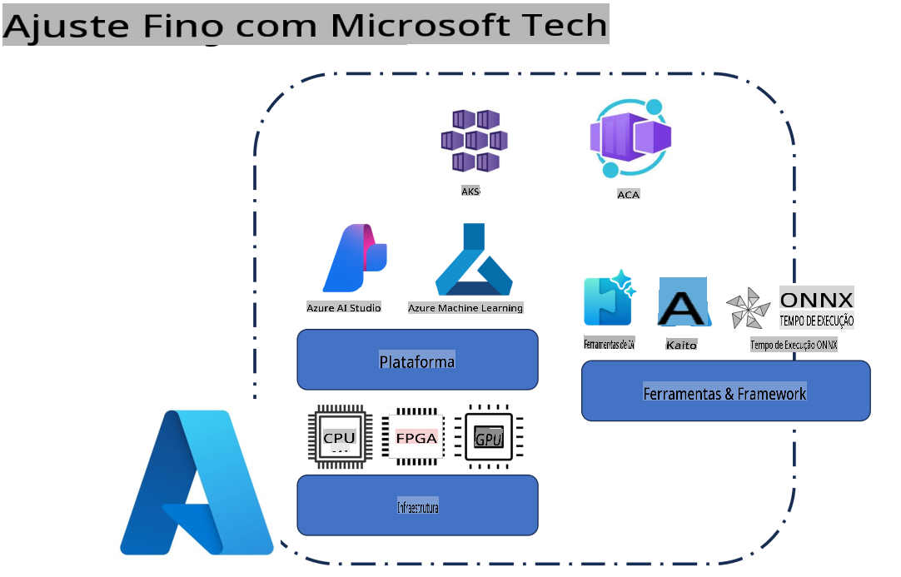
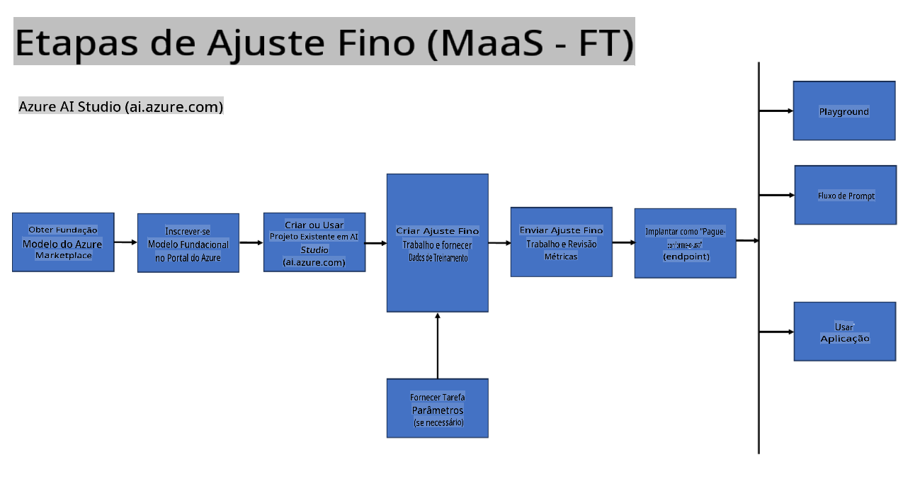
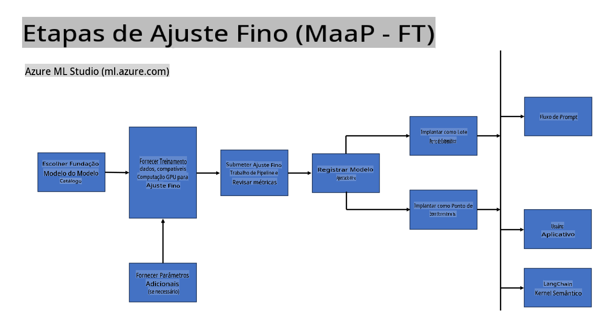
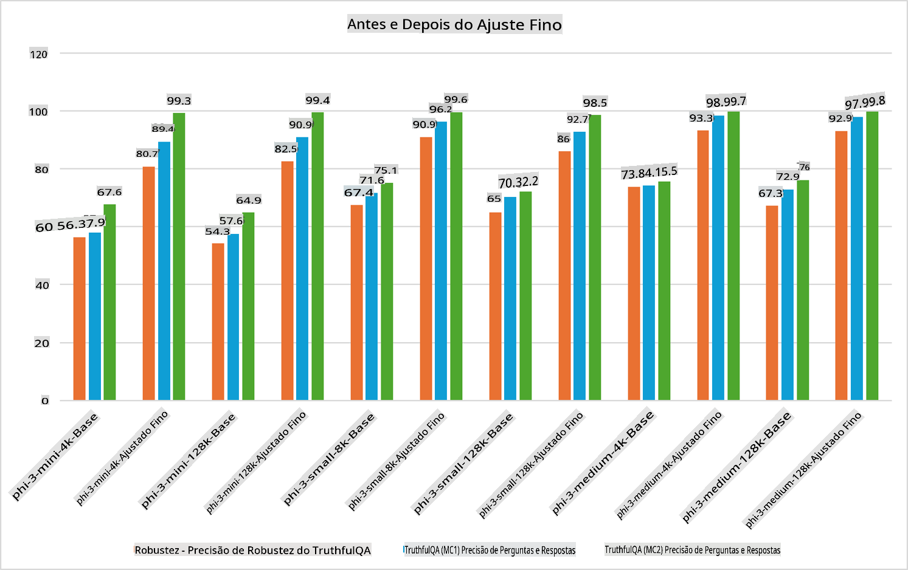

## Cenários de Ajuste Fino

**Plataforma** Isso inclui várias tecnologias, como Azure AI Foundry, Azure Machine Learning, AI Tools, Kaito e ONNX Runtime.

**Infraestrutura** Isso abrange CPU e FPGA, que são essenciais para o processo de ajuste fino. Vou mostrar os ícones de cada uma dessas tecnologias.

**Ferramentas e Frameworks** Isso inclui ONNX Runtime e ONNX Runtime. Vou mostrar os ícones de cada uma dessas tecnologias.  
[Inserir ícones para ONNX Runtime e ONNX Runtime]

O processo de ajuste fino com tecnologias da Microsoft envolve diversos componentes e ferramentas. Ao compreender e utilizar essas tecnologias, podemos ajustar nossas aplicações de maneira eficaz e criar soluções melhores.

## Modelo como Serviço

Ajuste fino do modelo usando recursos de ajuste hospedados, sem a necessidade de criar e gerenciar infraestrutura de computação.

O ajuste fino sem servidor está disponível para os modelos Phi-3-mini e Phi-3-medium, permitindo que os desenvolvedores personalizem rapidamente os modelos para cenários na nuvem e na borda, sem precisar configurar infraestrutura de computação. Também anunciamos que o Phi-3-small está agora disponível através da nossa oferta de Modelos-como-Serviço, permitindo que os desenvolvedores iniciem rapidamente o desenvolvimento de IA sem a necessidade de gerenciar a infraestrutura subjacente.

## Modelo como Plataforma

Os usuários gerenciam sua própria infraestrutura de computação para ajustar seus modelos.

[Amostra de Ajuste Fino](https://github.com/Azure/azureml-examples/blob/main/sdk/python/foundation-models/system/finetune/chat-completion/chat-completion.ipynb)

## Cenários de Ajuste Fino

| | | | | | | |
|-|-|-|-|-|-|-|
|Cenário|LoRA|QLoRA|PEFT|DeepSpeed|ZeRO|DORA|
|Adaptar LLMs pré-treinados para tarefas ou domínios específicos|Sim|Sim|Sim|Sim|Sim|Sim|
|Ajuste fino para tarefas de PLN, como classificação de texto, reconhecimento de entidades nomeadas e tradução automática|Sim|Sim|Sim|Sim|Sim|Sim|
|Ajuste fino para tarefas de QA|Sim|Sim|Sim|Sim|Sim|Sim|
|Ajuste fino para gerar respostas semelhantes às humanas em chatbots|Sim|Sim|Sim|Sim|Sim|Sim|
|Ajuste fino para gerar música, arte ou outras formas de criatividade|Sim|Sim|Sim|Sim|Sim|Sim|
|Redução de custos computacionais e financeiros|Sim|Sim|Não|Sim|Sim|Não|
|Redução no uso de memória|Não|Sim|Não|Sim|Sim|Sim|
|Uso de menos parâmetros para ajuste fino eficiente|Não|Sim|Sim|Não|Não|Sim|
|Forma eficiente de paralelismo de dados em memória, permitindo acesso à memória agregada de todas as GPUs disponíveis|Não|Não|Não|Sim|Sim|Sim|

## Exemplos de Desempenho no Ajuste Fino

**Aviso Legal**:  
Este documento foi traduzido usando serviços de tradução automática baseados em IA. Embora nos esforcemos para garantir a precisão, esteja ciente de que traduções automáticas podem conter erros ou imprecisões. O documento original em seu idioma nativo deve ser considerado a fonte oficial. Para informações críticas, recomenda-se a tradução humana profissional. Não nos responsabilizamos por quaisquer mal-entendidos ou interpretações equivocadas decorrentes do uso desta tradução.