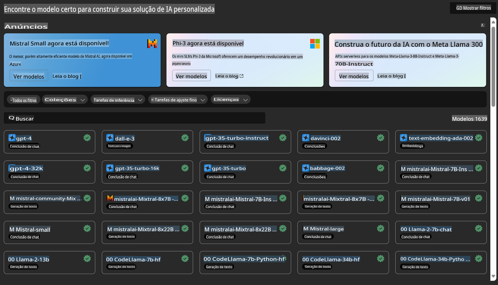

# **Introdução ao Azure Machine Learning Service**

[Azure Machine Learning](https://ml.azure.com?WT.mc_id=aiml-138114-kinfeylo) é um serviço em nuvem para acelerar e gerenciar o ciclo de vida de projetos de aprendizado de máquina (ML).

Profissionais de ML, cientistas de dados e engenheiros podem utilizá-lo em seus fluxos de trabalho diários para:

- Treinar e implantar modelos.
- Gerenciar operações de aprendizado de máquina (MLOps).
- Criar um modelo no Azure Machine Learning ou usar um modelo desenvolvido em uma plataforma de código aberto, como PyTorch, TensorFlow ou scikit-learn.
- As ferramentas de MLOps ajudam a monitorar, retreinar e reimplantar modelos.

## Para quem é o Azure Machine Learning?

**Cientistas de Dados e Engenheiros de ML**

Eles podem usar ferramentas para acelerar e automatizar seus fluxos de trabalho diários.  
O Azure ML oferece recursos para equidade, explicabilidade, rastreamento e auditabilidade.  

**Desenvolvedores de Aplicações**

Podem integrar modelos em aplicativos ou serviços de forma simples.

**Desenvolvedores de Plataforma**

Têm acesso a um conjunto robusto de ferramentas suportadas por APIs duráveis do Azure Resource Manager.  
Essas ferramentas permitem construir ferramentas avançadas de ML.

**Empresas**

Trabalhando na nuvem Microsoft Azure, as empresas se beneficiam de segurança familiar e controle de acesso baseado em funções.  
Configure projetos para controlar o acesso a dados protegidos e operações específicas.

## Produtividade para Todos na Equipe

Projetos de ML geralmente exigem uma equipe com habilidades variadas para construir e manter.  

O Azure ML fornece ferramentas que permitem:  
- Colaborar com sua equipe por meio de notebooks compartilhados, recursos de computação, computação sem servidor, dados e ambientes.  
- Desenvolver modelos com equidade, explicabilidade, rastreamento e auditabilidade para atender aos requisitos de conformidade de linhagem e auditoria.  
- Implantar modelos de ML de forma rápida e fácil em escala, além de gerenciá-los e governá-los eficientemente com MLOps.  
- Executar cargas de trabalho de aprendizado de máquina em qualquer lugar com governança, segurança e conformidade integradas.

## Ferramentas de Plataforma Compatíveis

Qualquer membro de uma equipe de ML pode usar suas ferramentas preferidas para realizar o trabalho.  
Seja conduzindo experimentos rápidos, ajustando hiperparâmetros, construindo pipelines ou gerenciando inferências, você pode usar interfaces familiares, incluindo:  
- Azure Machine Learning Studio  
- Python SDK (v2)  
- Azure CLI (v2)  
- APIs REST do Azure Resource Manager  

À medida que você refina modelos e colabora ao longo do ciclo de desenvolvimento, pode compartilhar e encontrar ativos, recursos e métricas na interface do Azure Machine Learning Studio.

## **LLM/SLM no Azure ML**

O Azure ML adicionou várias funções relacionadas a LLM/SLM, combinando LLMOps e SLMOps para criar uma plataforma tecnológica de inteligência artificial generativa em nível empresarial.

### **Catálogo de Modelos**

Usuários corporativos podem implantar diferentes modelos de acordo com cenários de negócios específicos por meio do Catálogo de Modelos, oferecendo serviços como Model as Service para que desenvolvedores ou usuários empresariais possam acessá-los.

O Catálogo de Modelos no Azure Machine Learning Studio é o ponto central para descobrir e usar uma ampla gama de modelos que permitem construir aplicações de IA generativa. O catálogo de modelos apresenta centenas de modelos de provedores como Azure OpenAI Service, Mistral, Meta, Cohere, Nvidia, Hugging Face, incluindo modelos treinados pela Microsoft.  
Modelos de provedores que não sejam a Microsoft são considerados Produtos Não Microsoft, conforme definido nos Termos de Produto da Microsoft, e estão sujeitos aos termos fornecidos com o modelo.

### **Pipeline de Trabalho**

O núcleo de um pipeline de aprendizado de máquina é dividir uma tarefa completa de aprendizado de máquina em um fluxo de trabalho com múltiplas etapas. Cada etapa é um componente gerenciável que pode ser desenvolvido, otimizado, configurado e automatizado individualmente. As etapas são conectadas por meio de interfaces bem definidas. O serviço de pipeline do Azure Machine Learning orquestra automaticamente todas as dependências entre as etapas do pipeline.

No ajuste fino de SLM / LLM, podemos gerenciar nossos processos de dados, treinamento e geração por meio do Pipeline.

### **Prompt Flow**

Benefícios de usar o Prompt Flow do Azure Machine Learning  
O Prompt Flow do Azure Machine Learning oferece uma série de benefícios que ajudam os usuários a passar da ideação para a experimentação e, finalmente, para aplicações baseadas em LLM prontas para produção:

**Agilidade na Engenharia de Prompts**

- Experiência de autoria interativa: o Prompt Flow do Azure Machine Learning fornece uma representação visual da estrutura do fluxo, permitindo que os usuários compreendam e naveguem facilmente por seus projetos. Ele também oferece uma experiência de codificação semelhante a um notebook para desenvolvimento e depuração eficientes de fluxos.  
- Variantes para ajuste de prompts: os usuários podem criar e comparar múltiplas variantes de prompts, facilitando um processo iterativo de refinamento.  
- Avaliação: fluxos de avaliação integrados permitem que os usuários avaliem a qualidade e a eficácia de seus prompts e fluxos.  
- Recursos abrangentes: o Prompt Flow do Azure Machine Learning inclui uma biblioteca de ferramentas integradas, exemplos e templates que servem como ponto de partida para o desenvolvimento, inspirando criatividade e acelerando o processo.

**Prontidão Empresarial para Aplicações Baseadas em LLM**

- Colaboração: o Prompt Flow do Azure Machine Learning suporta colaboração em equipe, permitindo que múltiplos usuários trabalhem juntos em projetos de engenharia de prompts, compartilhem conhecimento e mantenham controle de versão.  
- Plataforma completa: o Prompt Flow do Azure Machine Learning simplifica todo o processo de engenharia de prompts, desde o desenvolvimento e avaliação até a implantação e monitoramento. Os usuários podem implantar seus fluxos como endpoints do Azure Machine Learning e monitorar seu desempenho em tempo real, garantindo operação ideal e melhoria contínua.  
- Soluções de Prontidão Empresarial do Azure Machine Learning: o Prompt Flow aproveita as robustas soluções de prontidão empresarial do Azure Machine Learning, fornecendo uma base segura, escalável e confiável para o desenvolvimento, experimentação e implantação de fluxos.

Com o Prompt Flow do Azure Machine Learning, os usuários podem liberar sua agilidade na engenharia de prompts, colaborar de forma eficaz e aproveitar soluções de nível empresarial para o desenvolvimento e implantação bem-sucedidos de aplicações baseadas em LLM.

Combinando o poder de computação, dados e diferentes componentes do Azure ML, desenvolvedores empresariais podem criar facilmente suas próprias aplicações de inteligência artificial.

**Aviso Legal**:  
Este documento foi traduzido utilizando serviços de tradução baseados em IA. Embora nos esforcemos para garantir a precisão, esteja ciente de que traduções automáticas podem conter erros ou imprecisões. O documento original em seu idioma nativo deve ser considerado a fonte oficial. Para informações críticas, recomenda-se a tradução profissional feita por humanos. Não nos responsabilizamos por quaisquer mal-entendidos ou interpretações equivocadas decorrentes do uso desta tradução.