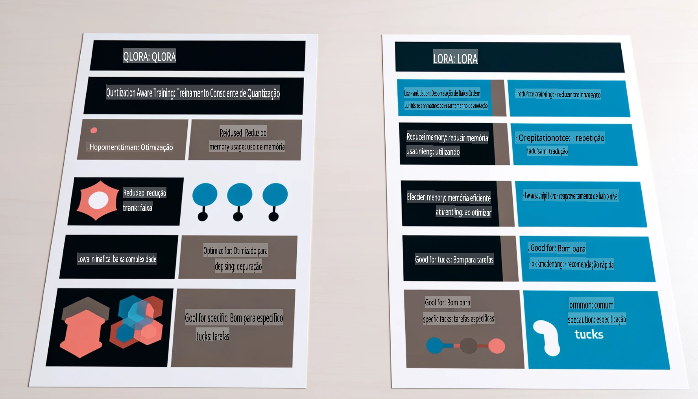

# **Deixe o Phi-3 se tornar um especialista na indústria**

Para inserir o modelo Phi-3 em uma indústria, é necessário adicionar dados empresariais do setor ao modelo Phi-3. Temos duas opções diferentes: a primeira é o RAG (Geração Aumentada por Recuperação) e a segunda é o Fine-Tuning (Ajuste Fino).

## **RAG vs Fine-Tuning**

### **Geração Aumentada por Recuperação (RAG)**

RAG é a combinação de recuperação de dados + geração de texto. Os dados estruturados e não estruturados da empresa são armazenados em um banco de dados vetorial. Ao buscar conteúdo relevante, o resumo e o conteúdo relacionados são encontrados para formar um contexto, e a capacidade de conclusão de texto do LLM/SLM é combinada para gerar conteúdo.

### **Fine-Tuning**

Fine-tuning é uma melhoria baseada em um modelo específico. Não é necessário começar com o algoritmo do modelo, mas é preciso acumular dados continuamente. Se você deseja uma terminologia e uma expressão linguística mais precisas em aplicações industriais, o fine-tuning é a melhor escolha. No entanto, se os seus dados mudam frequentemente, o fine-tuning pode se tornar complicado.

### **Como escolher**

1. Se nossa resposta exige a introdução de dados externos, o RAG é a melhor escolha.

2. Se você precisa gerar conhecimento estável e preciso da indústria, o fine-tuning será uma boa opção. O RAG prioriza a recuperação de conteúdo relevante, mas pode não captar sempre as nuances especializadas.

3. Fine-tuning exige um conjunto de dados de alta qualidade, e se for apenas um pequeno conjunto de dados, não fará muita diferença. O RAG é mais flexível.

4. Fine-tuning é uma "caixa preta", uma abordagem complexa, e é difícil compreender seu mecanismo interno. Mas o RAG facilita a localização da origem dos dados, permitindo ajustar efetivamente alucinações ou erros de conteúdo e oferecendo maior transparência.

### **Cenários**

1. Indústrias verticais que exigem vocabulário e expressões profissionais específicas, ***Fine-tuning*** será a melhor escolha.

2. Sistema de perguntas e respostas (QA), que envolve a síntese de diferentes pontos de conhecimento, ***RAG*** será a melhor escolha.

3. Combinação de fluxo de negócios automatizado ***RAG + Fine-tuning*** é a melhor escolha.

## **Como usar o RAG**

Um banco de dados vetorial é uma coleção de dados armazenados em formato matemático. Bancos de dados vetoriais facilitam que modelos de aprendizado de máquina lembrem entradas anteriores, permitindo que o aprendizado de máquina seja usado para suportar casos de uso como busca, recomendações e geração de texto. Os dados podem ser identificados com base em métricas de similaridade em vez de correspondências exatas, permitindo que os modelos computacionais compreendam o contexto dos dados.

O banco de dados vetorial é a chave para implementar o RAG. Podemos converter dados em armazenamento vetorial por meio de modelos vetoriais como text-embedding-3, jina-ai-embedding, etc.

Saiba mais sobre como criar uma aplicação RAG [https://github.com/microsoft/Phi-3CookBook](https://github.com/microsoft/Phi-3CookBook?WT.mc_id=aiml-138114-kinfeylo)

## **Como usar o Fine-Tuning**

Os algoritmos mais usados no Fine-Tuning são Lora e QLora. Como escolher?  
- [Saiba mais com este notebook de exemplo](../../../../code/04.Finetuning/Phi_3_Inference_Finetuning.ipynb)  
- [Exemplo de Script Python de Fine-Tuning](../../../../code/04.Finetuning/FineTrainingScript.py)

### **Lora e QLora**

LoRA (Low-Rank Adaptation) e QLoRA (Quantized Low-Rank Adaptation) são técnicas usadas para ajustar modelos de linguagem grandes (LLMs) utilizando Fine-Tuning Eficiente em Parâmetros (PEFT). As técnicas PEFT são projetadas para treinar modelos de forma mais eficiente do que os métodos tradicionais.  
LoRA é uma técnica independente de ajuste fino que reduz o uso de memória aplicando uma aproximação de baixa classificação à matriz de atualização de pesos. Ela oferece tempos de treinamento rápidos e mantém desempenho próximo aos métodos tradicionais de ajuste fino.

QLoRA é uma versão estendida do LoRA que incorpora técnicas de quantização para reduzir ainda mais o uso de memória. O QLoRA quantiza a precisão dos parâmetros de peso no LLM pré-treinado para uma precisão de 4 bits, o que é mais eficiente em termos de memória do que o LoRA. No entanto, o treinamento com QLoRA é cerca de 30% mais lento do que com LoRA devido às etapas adicionais de quantização e desquantização.

QLoRA utiliza o LoRA como um acessório para corrigir os erros introduzidos durante a quantização. QLoRA permite o ajuste fino de modelos massivos com bilhões de parâmetros em GPUs relativamente pequenas e amplamente disponíveis. Por exemplo, o QLoRA pode ajustar um modelo de 70 bilhões de parâmetros que requer 36 GPUs com apenas 2.

**Aviso Legal**:  
Este documento foi traduzido utilizando serviços de tradução automática por IA. Embora nos esforcemos para garantir a precisão, esteja ciente de que traduções automáticas podem conter erros ou imprecisões. O documento original em seu idioma nativo deve ser considerado a fonte oficial. Para informações críticas, recomenda-se a tradução profissional feita por humanos. Não nos responsabilizamos por quaisquer mal-entendidos ou interpretações equivocadas decorrentes do uso desta tradução.