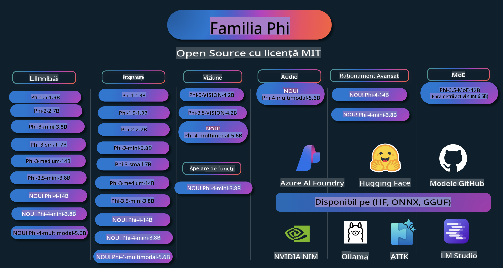

# Phi Cookbook: Exemple practice cu Modelele Phi de la Microsoft

  

  
  
  

  
  

Phi este o serie de modele AI open-source dezvoltate de Microsoft.

Phi este în prezent cel mai puternic și eficient model de limbaj de dimensiuni mici (SLM), cu performanțe remarcabile în scenarii precum multilingvism, raționament, generare text/chat, codare, imagini, audio și altele.

Poți implementa Phi în cloud sau pe dispozitive edge și poți construi cu ușurință aplicații generative AI folosind resurse limitate de calcul.

Urmează acești pași pentru a începe să folosești aceste resurse:
1. **Fă un Fork al Repozitoriului**: Click   
2. **Clonează Repozitoriul**:   `git clone https://github.com/microsoft/PhiCookBook.git`  
3. [**Alătură-te Comunității Microsoft AI pe Discord pentru a întâlni experți și alți dezvoltatori**](https://discord.com/invite/ByRwuEEgH4?WT.mc_id=aiml-137032-kinfeylo)

## Cuprins

- Introducere
  - [Bine ai venit în familia Phi](./md/01.Introduction/01/01.PhiFamily.md)
  - [Configurarea mediului tău](./md/01.Introduction/01/01.EnvironmentSetup.md)
  - [Înțelegerea tehnologiilor cheie](./md/01.Introduction/01/01.Understandingtech.md)
  - [Siguranța AI pentru modelele Phi](./md/01.Introduction/01/01.AISafety.md)
  - [Suport hardware pentru Phi](./md/01.Introduction/01/01.Hardwaresupport.md)
  - [Modelele Phi și disponibilitatea pe diverse platforme](./md/01.Introduction/01/01.Edgeandcloud.md)
  - [Folosirea Guidance-ai și Phi](./md/01.Introduction/01/01.Guidance.md)
  - [Modele din GitHub Marketplace](https://github.com/marketplace/models)
  - [Catalogul de modele Azure AI](https://ai.azure.com)

- Inferență Phi în diferite medii
    - [Hugging Face](./md/01.Introduction/02/01.HF.md)
    - [Modele GitHub](./md/01.Introduction/02/02.GitHubModel.md)
    - [Catalogul de modele Azure AI Foundry](./md/01.Introduction/02/03.AzureAIFoundry.md)
    - [Ollama](./md/01.Introduction/02/04.Ollama.md)
    - [AI Toolkit VSCode (AITK)](./md/01.Introduction/02/05.AITK.md)
    - [NVIDIA NIM](./md/01.Introduction/02/06.NVIDIA.md)

- Inferență pentru familia Phi
    - [Inferență Phi pe iOS](./md/01.Introduction/03/iOS_Inference.md)
    - [Inferență Phi pe Android](./md/01.Introduction/03/Android_Inference.md)
- [Inferența Phi pe Jetson](./md/01.Introduction/03/Jetson_Inference.md)
    - [Inferența Phi pe AI PC](./md/01.Introduction/03/AIPC_Inference.md)
    - [Inferența Phi cu Apple MLX Framework](./md/01.Introduction/03/MLX_Inference.md)
    - [Inferența Phi pe un server local](./md/01.Introduction/03/Local_Server_Inference.md)
    - [Inferența Phi pe un server la distanță folosind AI Toolkit](./md/01.Introduction/03/Remote_Interence.md)
    - [Inferența Phi cu Rust](./md/01.Introduction/03/Rust_Inference.md)
    - [Inferența Phi--Vision local](./md/01.Introduction/03/Vision_Inference.md)
    - [Inferența Phi cu Kaito AKS, containere Azure (suport oficial)](./md/01.Introduction/03/Kaito_Inference.md)
-  [Cuantificarea familiei Phi](./md/01.Introduction/04/QuantifyingPhi.md)
    - [Cuantificarea Phi-3.5 / 4 folosind llama.cpp](./md/01.Introduction/04/UsingLlamacppQuantifyingPhi.md)
    - [Cuantificarea Phi-3.5 / 4 folosind extensii Generative AI pentru onnxruntime](./md/01.Introduction/04/UsingORTGenAIQuantifyingPhi.md)
    - [Cuantificarea Phi-3.5 / 4 folosind Intel OpenVINO](./md/01.Introduction/04/UsingIntelOpenVINOQuantifyingPhi.md)
    - [Cuantificarea Phi-3.5 / 4 folosind Apple MLX Framework](./md/01.Introduction/04/UsingAppleMLXQuantifyingPhi.md)

-  Evaluarea Phi
    - [AI responsabil](./md/01.Introduction/05/ResponsibleAI.md)
    - [Azure AI Foundry pentru evaluare](./md/01.Introduction/05/AIFoundry.md)
    - [Folosirea Promptflow pentru evaluare](./md/01.Introduction/05/Promptflow.md)
 
- RAG cu Azure AI Search
    - [Cum să folosești Phi-4-mini și Phi-4-multimodal (RAG) cu Azure AI Search](https://github.com/microsoft/PhiCookBook/blob/main/code/06.E2E/E2E_Phi-4-RAG-Azure-AI-Search.ipynb)

- Exemple de dezvoltare aplicații Phi
  - Aplicații Text & Chat
    - Exemple Phi-4 🆕
      - [📓] [Chat cu modelul Phi-4-mini ONNX](./md/02.Application/01.TextAndChat/Phi4/ChatWithPhi4ONNX/README.md)
      - [Chat cu modelul local Phi-4 ONNX în .NET](../../md/04.HOL/dotnet/src/LabsPhi4-Chat-01OnnxRuntime)
      - [Aplicație console .NET pentru chat cu Phi-4 ONNX folosind Semantic Kernel](../../md/04.HOL/dotnet/src/LabsPhi4-Chat-02SK)
    - Exemple Phi-3 / 3.5
      - [Chatbot local în browser folosind Phi3, ONNX Runtime Web și WebGPU](https://github.com/microsoft/onnxruntime-inference-examples/tree/main/js/chat)
      - [Chat OpenVino](./md/02.Application/01.TextAndChat/Phi3/E2E_OpenVino_Chat.md)
      - [Model multiplu - Interacțiune între Phi-3-mini și OpenAI Whisper](./md/02.Application/01.TextAndChat/Phi3/E2E_Phi-3-mini_with_whisper.md)
      - [MLFlow - Construirea unui wrapper și folosirea Phi-3 cu MLFlow](./md//02.Application/01.TextAndChat/Phi3/E2E_Phi-3-MLflow.md)
      - [Optimizarea modelului - Cum să optimizezi modelul Phi-3-min pentru ONNX Runtime Web cu Olive](https://github.com/microsoft/Olive/tree/main/examples/phi3)
      - [Aplicație WinUI3 cu Phi-3 mini-4k-instruct-onnx](https://github.com/microsoft/Phi3-Chat-WinUI3-Sample/)
      - [Exemplu de aplicație de notițe AI multi-model cu WinUI3](https://github.com/microsoft/ai-powered-notes-winui3-sample)
      - [Perfecționarea și integrarea modelelor personalizate Phi-3 cu Promptflow](./md/02.Application/01.TextAndChat/Phi3/E2E_Phi-3-FineTuning_PromptFlow_Integration.md)
      - [Perfecționarea și integrarea modelelor personalizate Phi-3 cu Promptflow în Azure AI Foundry](./md/02.Application/01.TextAndChat/Phi3/E2E_Phi-3-FineTuning_PromptFlow_Integration_AIFoundry.md)
      - [Evaluarea modelului perfecționat Phi-3 / Phi-3.5 în Azure AI Foundry cu accent pe principiile AI responsabile ale Microsoft](./md/02.Application/01.TextAndChat/Phi3/E2E_Phi-3-Evaluation_AIFoundry.md)
- [📓] [Exemplu de predicție a limbajului Phi-3.5-mini-instruct (Chineză/Engleză)](../../md/02.Application/01.TextAndChat/Phi3/phi3-instruct-demo.ipynb)  
      - [Chatbot RAG WebGPU Phi-3.5-Instruct](./md/02.Application/01.TextAndChat/Phi3/WebGPUWithPhi35Readme.md)  
      - [Utilizarea GPU-ului Windows pentru a crea o soluție Prompt flow cu Phi-3.5-Instruct ONNX](./md/02.Application/01.TextAndChat/Phi3/UsingPromptFlowWithONNX.md)  
      - [Crearea unei aplicații Android cu Microsoft Phi-3.5 tflite](./md/02.Application/01.TextAndChat/Phi3/UsingPhi35TFLiteCreateAndroidApp.md)  
      - [Exemplu Q&A .NET folosind modelul local ONNX Phi-3 cu Microsoft.ML.OnnxRuntime](../../md/04.HOL/dotnet/src/LabsPhi301)  
      - [Aplicație .NET de chat în consolă cu Semantic Kernel și Phi-3](../../md/04.HOL/dotnet/src/LabsPhi302)  

  - Exemple bazate pe cod pentru SDK-ul Azure AI Inference  
    - Exemple Phi-4 🆕  
      - [📓] [Generarea codului proiectului utilizând Phi-4-multimodal](./md/02.Application/02.Code/Phi4/GenProjectCode/README.md)  
    - Exemple Phi-3 / 3.5  
      - [Creează propriul tău Visual Studio Code GitHub Copilot Chat cu Microsoft Phi-3 Family](./md/02.Application/02.Code/Phi3/VSCodeExt/README.md)  
      - [Creează propriul tău Agent Chat Copilot în Visual Studio Code cu Phi-3.5 folosind modelele GitHub](/md/02.Application/02.Code/Phi3/CreateVSCodeChatAgentWithGitHubModels.md)  

  - Exemple de raționament avansat  
    - Exemple Phi-4 🆕  
      - [📓] [Exemple de raționament Phi-4-mini](./md/02.Application/03.AdvancedReasoning/Phi4/AdvancedResoningPhi4mini/README.md)  

  - Demonstrații  
      - [Demonstrații Phi-4-mini găzduite pe Hugging Face Spaces](https://huggingface.co/spaces/microsoft/phi-4-mini?WT.mc_id=aiml-137032-kinfeylo)  
      - [Demonstrații Phi-4-multimodal găzduite pe Hugging Face Spaces](https://huggingface.co/spaces/microsoft/phi-4-multimodal?WT.mc_id=aiml-137032-kinfeylo)  
  - Exemple de viziune  
    - Exemple Phi-4 🆕  
      - [📓] [Utilizarea Phi-4-multimodal pentru a citi imagini și a genera cod](./md/02.Application/04.Vision/Phi4/CreateFrontend/README.md)  
    - Exemple Phi-3 / 3.5  
      - [📓][Phi-3-vision - Imagine text la text](../../md/02.Application/04.Vision/Phi3/E2E_Phi-3-vision-image-text-to-text-online-endpoint.ipynb)  
      - [Phi-3-vision-ONNX](https://onnxruntime.ai/docs/genai/tutorials/phi3-v.html)  
      - [📓][Phi-3-vision CLIP Embedding](../../md/02.Application/04.Vision/Phi3/E2E_Phi-3-vision-image-text-to-text-online-endpoint.ipynb)  
      - [DEMO: Phi-3 Recycling](https://github.com/jennifermarsman/PhiRecycling/)  
      - [Phi-3-vision - Asistent vizual lingvistic - cu Phi3-Vision și OpenVINO](https://docs.openvino.ai/nightly/notebooks/phi-3-vision-with-output.html)  
      - [Phi-3 Vision Nvidia NIM](./md/02.Application/04.Vision/Phi3/E2E_Nvidia_NIM_Vision.md)  
      - [Phi-3 Vision OpenVino](./md/02.Application/04.Vision/Phi3/E2E_OpenVino_Phi3Vision.md)  
      - [📓][Phi-3.5 Vision - exemplu multi-cadru sau multi-imagine](../../md/02.Application/04.Vision/Phi3/phi3-vision-demo.ipynb)  
      - [Model ONNX local Phi-3 Vision utilizând Microsoft.ML.OnnxRuntime .NET](../../md/04.HOL/dotnet/src/LabsPhi303)  
      - [Model ONNX local Phi-3 Vision bazat pe meniu, utilizând Microsoft.ML.OnnxRuntime .NET](../../md/04.HOL/dotnet/src/LabsPhi304)  

  - Exemple audio  
    - Exemple Phi-4 🆕  
      - [📓] [Extracția transcrierilor audio utilizând Phi-4-multimodal](./md/02.Application/05.Audio/Phi4/Transciption/README.md)  
      - [📓] [Exemplu audio Phi-4-multimodal](../../md/02.Application/05.Audio/Phi4/Siri/demo.ipynb)  
      - [📓] [Exemplu de traducere a vorbirii cu Phi-4-multimodal](../../md/02.Application/05.Audio/Phi4/Translate/demo.ipynb)  
      - [Aplicație .NET în consolă folosind Phi-4-multimodal Audio pentru a analiza un fișier audio și a genera o transcriere](../../md/04.HOL/dotnet/src/LabsPhi4-MultiModal-02Audio)  

  - Exemple MOE  
    - Exemple Phi-3 / 3.5  
      - [📓] [Phi-3.5 Mixture of Experts Models (MoEs) - Exemplu Social Media](../../md/02.Application/06.MoE/Phi3/phi3_moe_demo.ipynb)  
      - [📓] [Construirea unui pipeline de generare augmentată de recuperare (RAG) cu NVIDIA NIM Phi-3 MOE, Azure AI Search și LlamaIndex](../../md/02.Application/06.MoE/Phi3/azure-ai-search-nvidia-rag.ipynb)  
  - Exemple de apelare a funcțiilor  
    - Exemple Phi-4 🆕  
      - [📓] [Utilizarea apelării funcțiilor cu Phi-4-mini](./md/02.Application/07.FunctionCalling/Phi4/FunctionCallingBasic/README.md)  
  - Exemple de amestec multimodal  
    - Exemple Phi-4 🆕  
-  [📓] [Utilizarea Phi-4-multimodal ca jurnalist tehnologic](../../md/02.Application/08.Multimodel/Phi4/TechJournalist/phi_4_mm_audio_text_publish_news.ipynb)
      - [Aplicație console .NET utilizând Phi-4-multimodal pentru analiza imaginilor](../../md/04.HOL/dotnet/src/LabsPhi4-MultiModal-01Images)

- Ajustarea fină a eșantioanelor Phi
  - [Scenarii de ajustare fină](./md/03.FineTuning/FineTuning_Scenarios.md)
  - [Ajustare fină vs RAG](./md/03.FineTuning/FineTuning_vs_RAG.md)
  - [Ajustare fină: Transformarea Phi-3 într-un expert industrial](./md/03.FineTuning/LetPhi3gotoIndustriy.md)
  - [Ajustare fină a Phi-3 cu AI Toolkit pentru VS Code](./md/03.FineTuning/Finetuning_VSCodeaitoolkit.md)
  - [Ajustare fină a Phi-3 cu Azure Machine Learning Service](./md/03.FineTuning/Introduce_AzureML.md)
  - [Ajustare fină a Phi-3 cu Lora](./md/03.FineTuning/FineTuning_Lora.md)
  - [Ajustare fină a Phi-3 cu QLora](./md/03.FineTuning/FineTuning_Qlora.md)
  - [Ajustare fină a Phi-3 cu Azure AI Foundry](./md/03.FineTuning/FineTuning_AIFoundry.md)
  - [Ajustare fină a Phi-3 cu Azure ML CLI/SDK](./md/03.FineTuning/FineTuning_MLSDK.md)
  - [Ajustare fină cu Microsoft Olive](./md/03.FineTuning/FineTuning_MicrosoftOlive.md)
  - [Laborator practic de ajustare fină cu Microsoft Olive](./md/03.FineTuning/olive-lab/readme.md)
  - [Ajustare fină a Phi-3-vision cu Weights and Bias](./md/03.FineTuning/FineTuning_Phi-3-visionWandB.md)
  - [Ajustare fină a Phi-3 cu Apple MLX Framework](./md/03.FineTuning/FineTuning_MLX.md)
  - [Ajustare fină a Phi-3-vision (suport oficial)](./md/03.FineTuning/FineTuning_Vision.md)
  - [Ajustare fină a Phi-3 cu Kaito AKS, Azure Containers (suport oficial)](./md/03.FineTuning/FineTuning_Kaito.md)
  - [Ajustare fină a Phi-3 și 3.5 Vision](https://github.com/2U1/Phi3-Vision-Finetune)

- Laborator practic
  - [Explorarea modelelor de ultimă generație: LLM-uri, SLM-uri, dezvoltare locală și altele](https://github.com/microsoft/aitour-exploring-cutting-edge-models)
  - [Dezvăluirea potențialului NLP: Ajustare fină cu Microsoft Olive](https://github.com/azure/Ignite_FineTuning_workshop)

- Lucrări de cercetare academică și publicații
  - [Manualele sunt tot ce ai nevoie II: raport tehnic phi-1.5](https://arxiv.org/abs/2309.05463)
  - [Raport tehnic Phi-3: Un model lingvistic extrem de capabil, local pe telefonul tău](https://arxiv.org/abs/2404.14219)
  - [Raport tehnic Phi-4](https://arxiv.org/abs/2412.08905)
  - [Optimizarea modelelor lingvistice mici pentru apelarea funcțiilor în vehicul](https://arxiv.org/abs/2501.02342)
  - [(WhyPHI) Ajustarea fină a PHI-3 pentru răspunsuri la întrebări cu răspunsuri multiple: Metodologie, rezultate și provocări](https://arxiv.org/abs/2501.01588)

## Utilizarea modelelor Phi

### Phi pe Azure AI Foundry

Poți învăța cum să utilizezi Microsoft Phi și cum să construiești soluții end-to-end pe diferite dispozitive hardware. Pentru a experimenta Phi, începe prin a testa modelele și a personaliza Phi pentru scenariile tale utilizând [Catalogul de modele Azure AI Foundry](https://aka.ms/phi3-azure-ai). Poți afla mai multe în secțiunea Începe cu [Azure AI Foundry](/md/02.QuickStart/AzureAIFoundry_QuickStart.md).

**Playground**  
Fiecare model are un spațiu dedicat pentru testare: [Azure AI Playground](https://aka.ms/try-phi3).

### Phi pe modelele GitHub

Poți învăța cum să utilizezi Microsoft Phi și cum să construiești soluții end-to-end pe diferite dispozitive hardware. Pentru a experimenta Phi, începe prin a testa modelul și a personaliza Phi pentru scenariile tale utilizând [Catalogul de modele GitHub](https://github.com/marketplace/models?WT.mc_id=aiml-137032-kinfeylo). Poți afla mai multe în secțiunea Începe cu [Catalogul de modele GitHub](/md/02.QuickStart/GitHubModel_QuickStart.md).

**Playground**
Fiecare model are un [spațiu de testare dedicat pentru a experimenta modelul](/md/02.QuickStart/GitHubModel_QuickStart.md).

### Phi pe Hugging Face

De asemenea, poți găsi modelul pe [Hugging Face](https://huggingface.co/microsoft)

**Spațiu de testare**  
[Hugging Chat playground](https://huggingface.co/chat/models/microsoft/Phi-3-mini-4k-instruct)

## AI Responsabil

Microsoft este dedicat să ajute clienții să folosească produsele noastre AI în mod responsabil, împărtășind învățămintele noastre și construind parteneriate bazate pe încredere prin instrumente precum Transparency Notes și Impact Assessments. Multe dintre aceste resurse pot fi găsite la [https://aka.ms/RAI](https://aka.ms/RAI).  
Abordarea Microsoft în ceea ce privește AI-ul responsabil este fundamentată pe principiile noastre AI: echitate, fiabilitate și siguranță, confidențialitate și securitate, incluziune, transparență și responsabilitate.

Modelele de scară largă pentru limbaj natural, imagini și vorbire - precum cele utilizate în acest exemplu - pot să se comporte uneori într-un mod incorect, nesigur sau ofensator, cauzând astfel daune. Te rugăm să consulți [nota de transparență a serviciului Azure OpenAI](https://learn.microsoft.com/legal/cognitive-services/openai/transparency-note?tabs=text) pentru a te informa despre riscuri și limitări.

Abordarea recomandată pentru a reduce aceste riscuri este să incluzi un sistem de siguranță în arhitectura ta, care să poată detecta și preveni comportamentele dăunătoare. [Azure AI Content Safety](https://learn.microsoft.com/azure/ai-services/content-safety/overview) oferă un strat independent de protecție, capabil să detecteze conținut dăunător generat de utilizatori sau de AI în aplicații și servicii. Azure AI Content Safety include API-uri pentru text și imagini care îți permit să detectezi materiale dăunătoare. În cadrul Azure AI Foundry, serviciul Content Safety îți permite să vizualizezi, să explorezi și să testezi coduri de exemplu pentru detectarea conținutului dăunător în diferite modalități. Documentația următoare [quickstart](https://learn.microsoft.com/azure/ai-services/content-safety/quickstart-text?tabs=visual-studio%2Clinux&pivots=programming-language-rest) te ghidează în realizarea solicitărilor către acest serviciu.

Un alt aspect de luat în considerare este performanța generală a aplicației. În cazul aplicațiilor multi-modale și multi-model, considerăm că performanța înseamnă ca sistemul să funcționeze conform așteptărilor tale și ale utilizatorilor, inclusiv să nu genereze rezultate dăunătoare. Este important să evaluezi performanța aplicației tale folosind [evaluatori pentru Performanță și Calitate și pentru Risc și Siguranță](https://learn.microsoft.com/azure/ai-studio/concepts/evaluation-metrics-built-in). De asemenea, ai posibilitatea să creezi și să evaluezi cu [evaluatori personalizați](https://learn.microsoft.com/azure/ai-studio/how-to/develop/evaluate-sdk#custom-evaluators).

Poți evalua aplicația AI în mediul tău de dezvoltare folosind [Azure AI Evaluation SDK](https://microsoft.github.io/promptflow/index.html). Având fie un set de date de testare, fie un obiectiv, generările aplicației tale AI generative sunt măsurate cantitativ folosind evaluatori încorporați sau personalizați, în funcție de preferințele tale. Pentru a începe să folosești Azure AI Evaluation SDK pentru a evalua sistemul tău, poți urma [ghidul quickstart](https://learn.microsoft.com/azure/ai-studio/how-to/develop/flow-evaluate-sdk). După ce execuți o rulare de evaluare, poți [vizualiza rezultatele în Azure AI Foundry](https://learn.microsoft.com/azure/ai-studio/how-to/evaluate-flow-results).

## Mărci comerciale

Acest proiect poate conține mărci comerciale sau logo-uri pentru proiecte, produse sau servicii. Utilizarea autorizată a mărcilor comerciale sau logo-urilor Microsoft este supusă și trebuie să respecte [Ghidurile de utilizare a mărcilor și brandurilor Microsoft](https://www.microsoft.com/legal/intellectualproperty/trademarks/usage/general).  
Utilizarea mărcilor comerciale sau logo-urilor Microsoft în versiuni modificate ale acestui proiect nu trebuie să creeze confuzie sau să implice sponsorizarea de către Microsoft. Orice utilizare a mărcilor comerciale sau logo-urilor terților este supusă politicilor acelor terți.

**Declinarea responsabilității**:  
Acest document a fost tradus utilizând servicii de traducere automată bazate pe inteligență artificială. Deși ne străduim să asigurăm acuratețea, vă rugăm să rețineți că traducerile automate pot conține erori sau inexactități. Documentul original în limba sa maternă ar trebui considerat sursa autoritară. Pentru informații critice, se recomandă traducerea umană realizată de profesioniști. Nu ne asumăm răspunderea pentru neînțelegerile sau interpretările greșite care pot apărea din utilizarea acestei traduceri.