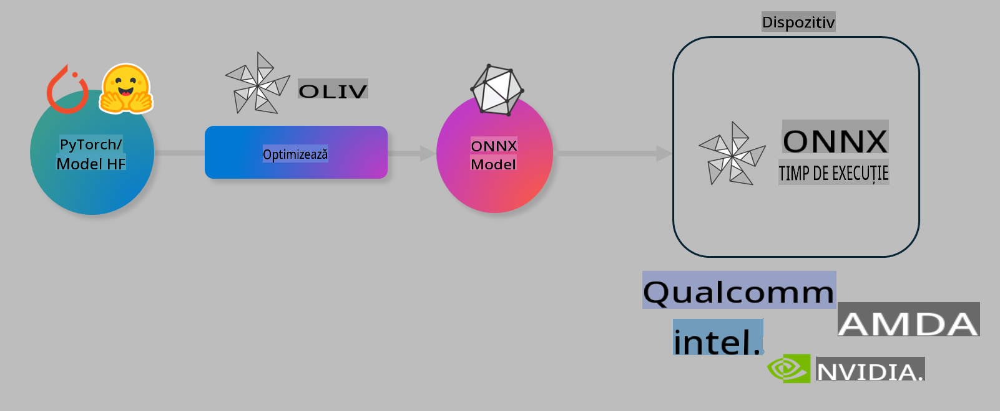

# Laborator. Optimizarea modelelor AI pentru inferență pe dispozitive

## Introducere

> [!IMPORTANT]
> Acest laborator necesită un **GPU Nvidia A10 sau A100** cu driverele și toolkit-ul CUDA (versiunea 12+) instalate.

> [!NOTE]
> Acesta este un laborator de **35 de minute** care vă oferă o introducere practică în conceptele de bază pentru optimizarea modelelor pentru inferență pe dispozitive folosind OLIVE.

## Obiective de învățare

La finalul acestui laborator, veți putea utiliza OLIVE pentru a:

- Cuantifica un model AI utilizând metoda de cuantificare AWQ.
- Ajusta un model AI pentru o sarcină specifică.
- Genera adaptori LoRA (model ajustat) pentru inferență eficientă pe dispozitive utilizând ONNX Runtime.

### Ce este Olive

Olive (*O*NNX *live*) este un instrument de optimizare a modelelor cu o interfață CLI care vă permite să livrați modele pentru ONNX Runtime +++https://onnxruntime.ai+++ cu performanțe și calitate ridicate.



Inputul pentru Olive este, de obicei, un model PyTorch sau Hugging Face, iar outputul este un model ONNX optimizat care rulează pe un dispozitiv (ținta de implementare) folosind ONNX Runtime. Olive optimizează modelul pentru acceleratorul AI al țintei de implementare (NPU, GPU, CPU) oferit de un furnizor de hardware, cum ar fi Qualcomm, AMD, Nvidia sau Intel.

Olive execută un *workflow*, care este o secvență ordonată de sarcini individuale de optimizare a modelului, numite *passes* - exemple de passes includ: comprimarea modelului, capturarea grafului, cuantificarea, optimizarea grafului. Fiecare pass are un set de parametri care pot fi ajustați pentru a obține cele mai bune metrici, cum ar fi acuratețea și latența, evaluate de evaluatorul corespunzător. Olive folosește o strategie de căutare care utilizează un algoritm de căutare pentru a ajusta automat fiecare pass, fie individual, fie împreună.

#### Beneficiile Olive

- **Reduce frustrarea și timpul** necesar experimentării manuale prin încercări și erori cu diferite tehnici de optimizare a grafului, comprimare și cuantificare. Definiți constrângerile de calitate și performanță și lăsați Olive să găsească automat cel mai bun model pentru dumneavoastră.
- **Peste 40 de componente de optimizare a modelelor** integrate, care acoperă tehnici de vârf în cuantificare, comprimare, optimizarea grafului și ajustare.
- **CLI ușor de utilizat** pentru sarcinile comune de optimizare a modelelor. De exemplu, olive quantize, olive auto-opt, olive finetune.
- Integrarea pachetului și implementării modelului este inclusă.
- Suport pentru generarea modelelor pentru **Multi LoRA serving**.
- Posibilitatea de a construi fluxuri de lucru folosind YAML/JSON pentru a orchestra sarcinile de optimizare și implementare a modelelor.
- Integrare cu **Hugging Face** și **Azure AI**.
- Mecanism de **cache** integrat pentru **reducerea costurilor**.

## Instrucțiuni pentru laborator
> [!NOTE]
> Asigurați-vă că ați configurat Azure AI Hub și Proiectul, precum și resursa de calcul A100 conform Laboratorului 1.

### Pasul 0: Conectați-vă la resursa de calcul Azure AI

Vă veți conecta la resursa de calcul Azure AI utilizând funcția de acces la distanță din **VS Code.**

1. Deschideți aplicația desktop **VS Code**:
1. Deschideți **command palette** utilizând **Shift+Ctrl+P**.
1. În command palette, căutați **AzureML - remote: Connect to compute instance in New Window**.
1. Urmați instrucțiunile afișate pe ecran pentru a vă conecta la resursa de calcul. Acest lucru va implica selectarea abonamentului Azure, grupului de resurse, proiectului și numelui resursei de calcul configurate în Laboratorul 1.
1. După conectare, conexiunea la resursa de calcul Azure ML va fi afișată în **colțul din stânga jos al Visual Code** `><Azure ML: Compute Name`.

### Pasul 1: Clonați acest depozit

În VS Code, puteți deschide un terminal nou cu **Ctrl+J** și clonați acest depozit:

În terminal ar trebui să vedeți promptul

```
azureuser@computername:~/cloudfiles/code$ 
```
Clonați soluția

```bash
cd ~/localfiles
git clone https://github.com/microsoft/phi-3cookbook.git
```

### Pasul 2: Deschideți folderul în VS Code

Pentru a deschide VS Code în folderul relevant, executați următoarea comandă în terminal, care va deschide o fereastră nouă:

```bash
code phi-3cookbook/code/04.Finetuning/Olive-lab
```

Alternativ, puteți deschide folderul selectând **File** > **Open Folder**.

### Pasul 3: Dependențe

Deschideți o fereastră de terminal în VS Code pe instanța de calcul Azure AI (sfat: **Ctrl+J**) și executați următoarele comenzi pentru a instala dependențele:

```bash
conda create -n olive-ai python=3.11 -y
conda activate olive-ai
pip install -r requirements.txt
az extension remove -n azure-cli-ml
az extension add -n ml
```

> [!NOTE]
> Instalarea tuturor dependențelor durează ~5 minute.

În acest laborator, veți descărca și încărca modele în catalogul de modele Azure AI. Pentru a accesa catalogul de modele, va trebui să vă autentificați în Azure utilizând:

```bash
az login
```

> [!NOTE]
> În timpul autentificării, vi se va cere să selectați abonamentul. Asigurați-vă că selectați abonamentul oferit pentru acest laborator.

### Pasul 4: Executați comenzile Olive

Deschideți o fereastră de terminal în VS Code pe instanța de calcul Azure AI (sfat: **Ctrl+J**) și asigurați-vă că mediul conda `olive-ai` este activat:

```bash
conda activate olive-ai
```

Apoi, executați următoarele comenzi Olive în linia de comandă.

1. **Inspectați datele:** În acest exemplu, veți ajusta modelul Phi-3.5-Mini astfel încât să fie specializat în a răspunde la întrebări legate de călătorii. Codul de mai jos afișează primele câteva înregistrări ale setului de date, care sunt în format JSON lines:

    ```bash
    head data/data_sample_travel.jsonl
    ```
1. **Cuantificați modelul:** Înainte de a antrena modelul, îl cuantificați cu următoarea comandă care folosește o tehnică numită Active Aware Quantization (AWQ) +++https://arxiv.org/abs/2306.00978+++. AWQ cuantifică greutățile unui model luând în considerare activările produse în timpul inferenței. Acest lucru înseamnă că procesul de cuantificare ia în considerare distribuția reală a datelor din activări, ceea ce duce la o mai bună păstrare a acurateței modelului în comparație cu metodele tradiționale de cuantificare a greutăților.

    ```bash
    olive quantize \
       --model_name_or_path microsoft/Phi-3.5-mini-instruct \
       --trust_remote_code \
       --algorithm awq \
       --output_path models/phi/awq \
       --log_level 1
    ```
    
    Procesul durează **~8 minute** pentru a finaliza cuantificarea AWQ, ceea ce va **reduce dimensiunea modelului de la ~7.5GB la ~2.5GB**.
   
   În acest laborator, vă arătăm cum să introduceți modele din Hugging Face (de exemplu: `microsoft/Phi-3.5-mini-instruct`). However, Olive also allows you to input models from the Azure AI catalog by updating the `model_name_or_path` argument to an Azure AI asset ID (for example:  `azureml://registries/azureml/models/Phi-3.5-mini-instruct/versions/4`). 

1. **Train the model:** Next, the `olive finetune` ajustează modelul cuantificat. Cuantificarea modelului *înainte* de ajustare în loc de după oferă o acuratețe mai bună, deoarece procesul de ajustare recuperează o parte din pierderile din cuantificare.

    ```bash
    olive finetune \
        --method lora \
        --model_name_or_path models/phi/awq \
        --data_files "data/data_sample_travel.jsonl" \
        --data_name "json" \
        --text_template "<|user|>\n{prompt}<|end|>\n<|assistant|>\n{response}<|end|>" \
        --max_steps 100 \
        --output_path ./models/phi/ft \
        --log_level 1
    ```
    
    Ajustarea durează **~6 minute** (cu 100 de pași).

1. **Optimizați:** După antrenarea modelului, optimizați modelul utilizând comanda `auto-opt` command, which will capture the ONNX graph and automatically perform a number of optimizations to improve the model performance for CPU by compressing the model and doing fusions. It should be noted, that you can also optimize for other devices such as NPU or GPU by just updating the `--device` and `--provider` din Olive - dar pentru acest laborator vom folosi CPU.

    ```bash
    olive auto-opt \
       --model_name_or_path models/phi/ft/model \
       --adapter_path models/phi/ft/adapter \
       --device cpu \
       --provider CPUExecutionProvider \
       --use_ort_genai \
       --output_path models/phi/onnx-ao \
       --log_level 1
    ```
    
    Procesul durează **~5 minute** pentru a finaliza optimizarea.

### Pasul 5: Test rapid de inferență a modelului

Pentru a testa inferența modelului, creați un fișier Python în folderul dvs. numit **app.py** și copiați-lipiți următorul cod:

```python
import onnxruntime_genai as og
import numpy as np

print("loading model and adapters...", end="", flush=True)
model = og.Model("models/phi/onnx-ao/model")
adapters = og.Adapters(model)
adapters.load("models/phi/onnx-ao/model/adapter_weights.onnx_adapter", "travel")
print("DONE!")

tokenizer = og.Tokenizer(model)
tokenizer_stream = tokenizer.create_stream()

params = og.GeneratorParams(model)
params.set_search_options(max_length=100, past_present_share_buffer=False)
user_input = "what is the best thing to see in chicago"
params.input_ids = tokenizer.encode(f"<|user|>\n{user_input}<|end|>\n<|assistant|>\n")

generator = og.Generator(model, params)

generator.set_active_adapter(adapters, "travel")

print(f"{user_input}")

while not generator.is_done():
    generator.compute_logits()
    generator.generate_next_token()

    new_token = generator.get_next_tokens()[0]
    print(tokenizer_stream.decode(new_token), end='', flush=True)

print("\n")
```

Executați codul utilizând:

```bash
python app.py
```

### Pasul 6: Încărcați modelul în Azure AI

Încărcarea modelului într-un depozit de modele Azure AI face modelul partajabil cu alți membri ai echipei dvs. de dezvoltare și gestionează, de asemenea, controlul versiunilor modelului. Pentru a încărca modelul, rulați următoarea comandă:

> [!NOTE]
> Actualizați `{}` placeholders with the name of your resource group and Azure AI Project Name. 

To find your resource group `"resourceGroup"` și numele proiectului Azure AI, apoi rulați următoarea comandă:

```
az ml workspace show
```

Sau accesați +++ai.azure.com+++ și selectați **management center**, **project**, **overview**.

Actualizați locurile `{}` cu numele grupului dvs. de resurse și numele proiectului Azure AI.

```bash
az ml model create \
    --name ft-for-travel \
    --version 1 \
    --path ./models/phi/onnx-ao \
    --resource-group {RESOURCE_GROUP_NAME} \
    --workspace-name {PROJECT_NAME}
```
Apoi, puteți vedea modelul încărcat și îl puteți implementa la https://ml.azure.com/model/list

**Declinarea responsabilității**:  
Acest document a fost tradus folosind servicii de traducere bazate pe inteligență artificială. Deși depunem eforturi pentru acuratețe, vă rugăm să rețineți că traducerile automate pot conține erori sau inexactități. Documentul original în limba sa natală trebuie considerat sursa autoritară. Pentru informații critice, se recomandă traducerea profesională realizată de un specialist. Nu ne asumăm răspunderea pentru eventualele neînțelegeri sau interpretări greșite care pot apărea din utilizarea acestei traduceri.