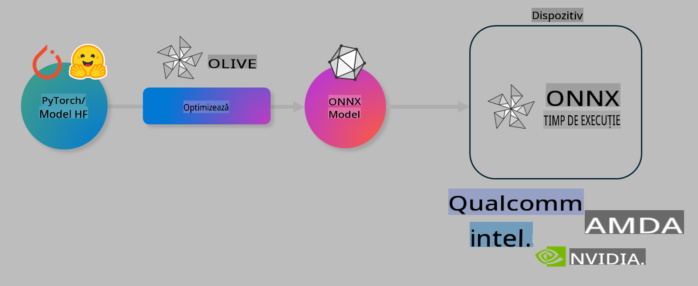

# Lab. Optimize AI models pentru inferență pe dispozitiv

## Introducere

> [!IMPORTANT]
> Acest laborator necesită un **GPU Nvidia A10 sau A100** cu driverele asociate și toolkit-ul CUDA (versiunea 12+) instalate.

> [!NOTE]
> Acesta este un laborator de **35 de minute** care îți va oferi o introducere practică în conceptele de bază ale optimizării modelelor pentru inferență pe dispozitiv folosind OLIVE.

## Obiectivele de învățare

Până la finalul acestui laborator, vei putea folosi OLIVE pentru a:

- Cuantiza un model AI utilizând metoda de cuantizare AWQ.
- Ajusta fin un model AI pentru o sarcină specifică.
- Genera adaptoare LoRA (model ajustat fin) pentru inferență eficientă pe dispozitiv în ONNX Runtime.

### Ce este Olive

Olive (*O*NNX *live*) este un toolkit de optimizare a modelelor, cu o interfață CLI asociată, care îți permite să livrezi modele pentru ONNX runtime +++https://onnxruntime.ai+++ cu calitate și performanță ridicate.



Input-ul pentru Olive este, de obicei, un model PyTorch sau Hugging Face, iar output-ul este un model ONNX optimizat, care este executat pe un dispozitiv (țintă de implementare) ce rulează ONNX runtime. Olive va optimiza modelul pentru acceleratorul AI (NPU, GPU, CPU) al țintei de implementare, oferit de un furnizor de hardware precum Qualcomm, AMD, Nvidia sau Intel.

Olive execută un *workflow*, care este o secvență ordonată de sarcini individuale de optimizare a modelului numite *passes* - exemple de passes includ: compresia modelului, capturarea grafului, cuantizarea, optimizarea grafului. Fiecare pass are un set de parametri care pot fi ajustați pentru a obține cele mai bune metrici, cum ar fi acuratețea și latența, evaluate de evaluatorul respectiv. Olive utilizează o strategie de căutare care folosește un algoritm pentru a ajusta automat fiecare pass, unul câte unul sau mai multe împreună.

#### Beneficiile Olive

- **Reduce frustrarea și timpul** asociate experimentelor manuale prin încercare-eroare cu diferite tehnici de optimizare a grafului, compresie și cuantizare. Definește-ți constrângerile de calitate și performanță, iar Olive va găsi automat cel mai bun model pentru tine.
- **Peste 40 de componente de optimizare a modelelor integrate**, care acoperă tehnici de ultimă oră în cuantizare, compresie, optimizarea grafului și ajustare fină.
- **CLI ușor de utilizat** pentru sarcini comune de optimizare a modelelor. De exemplu, olive quantize, olive auto-opt, olive finetune.
- Ambalarea și implementarea modelelor sunt integrate.
- Suportă generarea de modele pentru **Multi LoRA serving**.
- Construiește fluxuri de lucru folosind YAML/JSON pentru a orchestra sarcinile de optimizare și implementare a modelelor.
- Integrare cu **Hugging Face** și **Azure AI**.
- Mecanism de **caching integrat** pentru a **reduce costurile**.

## Instrucțiuni pentru laborator
> [!NOTE]
> Asigură-te că ai configurat Azure AI Hub și Proiectul și că ai setat resursa A100 conform Laboratorului 1.

### Pasul 0: Conectează-te la Azure AI Compute

Te vei conecta la resursa Azure AI Compute utilizând funcția de conectare la distanță din **VS Code.**

1. Deschide aplicația desktop **VS Code**:
1. Deschide **paleta de comenzi** utilizând **Shift+Ctrl+P**.
1. În paleta de comenzi, caută **AzureML - remote: Connect to compute instance in New Window**.
1. Urmează instrucțiunile de pe ecran pentru a te conecta la resursa Compute. Acest lucru va implica selectarea abonamentului Azure, grupului de resurse, proiectului și numelui resursei Compute configurate în Laboratorul 1.
1. După conectare, numele resursei Compute va fi afișat în **colțul din stânga jos al Visual Code** `><Azure ML: Compute Name`

### Pasul 1: Clonează acest repo

În VS Code, poți deschide un nou terminal cu **Ctrl+J** și clona acest repo:

În terminal ar trebui să vezi promptul

```
azureuser@computername:~/cloudfiles/code$ 
```
Clonează soluția 

```bash
cd ~/localfiles
git clone https://github.com/microsoft/phi-3cookbook.git
```

### Pasul 2: Deschide folderul în VS Code

Pentru a deschide VS Code în folderul relevant, execută următoarea comandă în terminal, care va deschide o nouă fereastră:

```bash
code phi-3cookbook/code/04.Finetuning/Olive-lab
```

Alternativ, poți deschide folderul selectând **File** > **Open Folder**. 

### Pasul 3: Dependențe

Deschide o fereastră de terminal în VS Code în Instanța Azure AI Compute (sugestie: **Ctrl+J**) și execută următoarele comenzi pentru a instala dependențele:

```bash
conda create -n olive-ai python=3.11 -y
conda activate olive-ai
pip install -r requirements.txt
az extension remove -n azure-cli-ml
az extension add -n ml
```

> [!NOTE]
> Instalarea tuturor dependențelor durează aproximativ ~5 minute.

În acest laborator vei descărca și încărca modele în catalogul de modele Azure AI. Pentru a putea accesa catalogul de modele, va trebui să te autentifici în Azure utilizând:

```bash
az login
```

> [!NOTE]
> La autentificare, ți se va cere să selectezi abonamentul. Asigură-te că selectezi abonamentul oferit pentru acest laborator.

### Pasul 4: Execută comenzile Olive 

Deschide o fereastră de terminal în VS Code în Instanța Azure AI Compute (sugestie: **Ctrl+J**) și asigură-te că mediul conda `olive-ai` este activat:

```bash
conda activate olive-ai
```

Apoi, execută următoarele comenzi Olive în linia de comandă.

1. **Inspectează datele:** În acest exemplu, vei ajusta fin modelul Phi-3.5-Mini astfel încât să fie specializat în răspunsuri la întrebări legate de călătorii. Codul de mai jos afișează primele câteva înregistrări din setul de date, care sunt în format JSON lines:
   
    ```bash
    head data/data_sample_travel.jsonl
    ```
1. **Cuantizează modelul:** Înainte de a antrena modelul, îl cuantizezi utilizând următoarea comandă care folosește o tehnică numită Active Aware Quantization (AWQ) +++https://arxiv.org/abs/2306.00978+++. AWQ cuantizează greutățile unui model luând în considerare activările produse în timpul inferenței. Aceasta înseamnă că procesul de cuantizare ține cont de distribuția efectivă a datelor din activări, ceea ce duce la o mai bună păstrare a acurateței modelului comparativ cu metodele tradiționale de cuantizare a greutăților.
    
    ```bash
    olive quantize \
       --model_name_or_path microsoft/Phi-3.5-mini-instruct \
       --trust_remote_code \
       --algorithm awq \
       --output_path models/phi/awq \
       --log_level 1
    ```
    
    Procesul durează **~8 minute** pentru a finaliza cuantizarea AWQ, ceea ce va **reduce dimensiunea modelului de la ~7.5GB la ~2.5GB**.
   
   În acest laborator, îți arătăm cum să introduci modele din Hugging Face (de exemplu: `microsoft/Phi-3.5-mini-instruct`). However, Olive also allows you to input models from the Azure AI catalog by updating the `model_name_or_path` argument to an Azure AI asset ID (for example:  `azureml://registries/azureml/models/Phi-3.5-mini-instruct/versions/4`). 

1. **Train the model:** Next, the `olive finetune` comandă ajustează fin modelul cuantizat. Cuantizarea modelului *înainte* de ajustarea fină, în loc de după, oferă o mai bună acuratețe, deoarece procesul de ajustare fină recuperează o parte din pierderile cauzate de cuantizare.
    
    ```bash
    olive finetune \
        --method lora \
        --model_name_or_path models/phi/awq \
        --data_files "data/data_sample_travel.jsonl" \
        --data_name "json" \
        --text_template "<|user|>\n{prompt}<|end|>\n<|assistant|>\n{response}<|end|>" \
        --max_steps 100 \
        --output_path ./models/phi/ft \
        --log_level 1
    ```
    
    Ajustarea fină durează **~6 minute** (cu 100 de pași).

1. **Optimizează:** După ce modelul este antrenat, optimizează-l utilizând comanda `auto-opt` command, which will capture the ONNX graph and automatically perform a number of optimizations to improve the model performance for CPU by compressing the model and doing fusions. It should be noted, that you can also optimize for other devices such as NPU or GPU by just updating the `--device` and `--provider` din Olive - dar pentru scopurile acestui laborator vom folosi CPU.

    ```bash
    olive auto-opt \
       --model_name_or_path models/phi/ft/model \
       --adapter_path models/phi/ft/adapter \
       --device cpu \
       --provider CPUExecutionProvider \
       --use_ort_genai \
       --output_path models/phi/onnx-ao \
       --log_level 1
    ```
    
    Procesul durează **~5 minute** pentru a finaliza optimizarea.

### Pasul 5: Test rapid de inferență a modelului

Pentru a testa inferența modelului, creează un fișier Python în folderul tău numit **app.py** și copiază-lipeste următorul cod:

```python
import onnxruntime_genai as og
import numpy as np

print("loading model and adapters...", end="", flush=True)
model = og.Model("models/phi/onnx-ao/model")
adapters = og.Adapters(model)
adapters.load("models/phi/onnx-ao/model/adapter_weights.onnx_adapter", "travel")
print("DONE!")

tokenizer = og.Tokenizer(model)
tokenizer_stream = tokenizer.create_stream()

params = og.GeneratorParams(model)
params.set_search_options(max_length=100, past_present_share_buffer=False)
user_input = "what is the best thing to see in chicago"
params.input_ids = tokenizer.encode(f"<|user|>\n{user_input}<|end|>\n<|assistant|>\n")

generator = og.Generator(model, params)

generator.set_active_adapter(adapters, "travel")

print(f"{user_input}")

while not generator.is_done():
    generator.compute_logits()
    generator.generate_next_token()

    new_token = generator.get_next_tokens()[0]
    print(tokenizer_stream.decode(new_token), end='', flush=True)

print("\n")
```

Execută codul utilizând:

```bash
python app.py
```

### Pasul 6: Încarcă modelul în Azure AI

Încărcarea modelului într-un depozit de modele Azure AI face ca modelul să fie partajabil cu alți membri ai echipei tale de dezvoltare și, de asemenea, gestionează controlul versiunilor modelului. Pentru a încărca modelul, rulează următoarea comandă:

> [!NOTE]
> Actualizează `{}` placeholders with the name of your resource group and Azure AI Project Name. 

To find your resource group `"resourceGroup"și numele proiectului Azure AI, rulează următoarea comandă 

```
az ml workspace show
```

Sau mergând la +++ai.azure.com+++ și selectând **management center** **project** **overview**

Actualizează `{}` cu numele grupului tău de resurse și numele proiectului Azure AI.

```bash
az ml model create \
    --name ft-for-travel \
    --version 1 \
    --path ./models/phi/onnx-ao \
    --resource-group {RESOURCE_GROUP_NAME} \
    --workspace-name {PROJECT_NAME}
```
Apoi poți vedea modelul încărcat și îl poți implementa la https://ml.azure.com/model/list

**Declinări de responsabilitate**:  
Acest document a fost tradus folosind servicii de traducere automată bazate pe inteligență artificială. Deși ne străduim să asigurăm acuratețea, vă rugăm să rețineți că traducerile automate pot conține erori sau inexactități. Documentul original, în limba sa nativă, trebuie considerat sursa autoritară. Pentru informații critice, se recomandă traducerea profesională realizată de un specialist. Nu ne asumăm răspunderea pentru eventualele neînțelegeri sau interpretări greșite rezultate din utilizarea acestei traduceri.