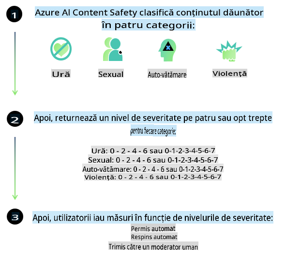
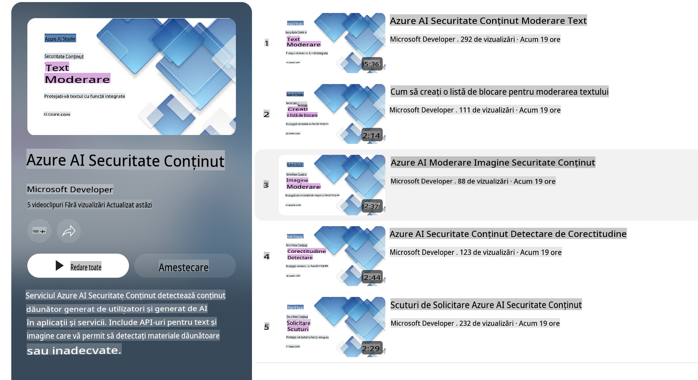

# Siguranța AI pentru modelele Phi

Familia de modele Phi a fost dezvoltată în conformitate cu [Standardul Microsoft pentru AI Responsabil](https://query.prod.cms.rt.microsoft.com/cms/api/am/binary/RE5cmFl), un set de cerințe la nivel de companie bazat pe următoarele șase principii: responsabilitate, transparență, corectitudine, fiabilitate și siguranță, confidențialitate și securitate, și incluziune, care formează [principiile Microsoft pentru AI Responsabil](https://www.microsoft.com/ai/responsible-ai).

La fel ca modelele Phi anterioare, a fost adoptată o abordare multifacetică pentru evaluarea siguranței și post-antrenamentul pentru siguranță, cu măsuri suplimentare pentru a ține cont de capacitățile multilingve ale acestei versiuni. Abordarea noastră pentru antrenamentul și evaluările de siguranță, inclusiv testarea în mai multe limbi și categorii de risc, este descrisă în [Lucrarea despre Siguranța Post-Antrenament Phi](https://arxiv.org/abs/2407.13833). Deși modelele Phi beneficiază de această abordare, dezvoltatorii ar trebui să aplice cele mai bune practici pentru AI responsabil, inclusiv cartografierea, măsurarea și atenuarea riscurilor asociate cu cazul lor specific de utilizare și contextul cultural și lingvistic.

## Cele mai bune practici

La fel ca alte modele, familia de modele Phi poate manifesta comportamente care sunt nedrepte, nesigure sau ofensatoare.

Unele dintre comportamentele limitative ale SLM și LLM pe care trebuie să le aveți în vedere includ:

- **Calitatea Serviciului:** Modelele Phi sunt antrenate în principal pe text în limba engleză. Limbile diferite de engleză vor avea performanțe mai slabe. Varietățile de limbă engleză mai puțin reprezentate în datele de antrenament pot avea performanțe mai slabe decât engleza americană standard.
- **Reprezentarea prejudiciilor și perpetuarea stereotipurilor:** Aceste modele pot supra- sau sub-reprezenta grupuri de oameni, pot șterge reprezentarea unor grupuri sau pot întări stereotipuri negative sau denigratoare. În ciuda antrenamentului post-siguranță, aceste limitări pot fi încă prezente din cauza nivelurilor diferite de reprezentare a grupurilor sau a prevalenței exemplelor de stereotipuri negative în datele de antrenament, care reflectă modele din lumea reală și prejudecăți sociale.
- **Conținut inadecvat sau ofensator:** Aceste modele pot genera alte tipuri de conținut inadecvat sau ofensator, ceea ce le poate face nepotrivite pentru utilizarea în contexte sensibile fără măsuri suplimentare specifice cazului de utilizare.
- **Fiabilitatea informației:** Modelele lingvistice pot genera conținut lipsit de sens sau pot fabrica informații care par rezonabile, dar sunt inexacte sau depășite.
- **Domeniu limitat pentru cod:** Majoritatea datelor de antrenament Phi-3 sunt bazate pe Python și folosesc pachete comune precum „typing, math, random, collections, datetime, itertools”. Dacă modelul generează scripturi Python care utilizează alte pachete sau scripturi în alte limbi, recomandăm cu tărie utilizatorilor să verifice manual toate utilizările API.

Dezvoltatorii ar trebui să aplice cele mai bune practici pentru AI responsabil și sunt responsabili pentru a se asigura că un caz specific de utilizare respectă legile și reglementările relevante (ex: confidențialitate, comerț etc.).

## Considerații privind AI Responsabil

La fel ca alte modele lingvistice, modelele din seria Phi pot manifesta comportamente care sunt nedrepte, nesigure sau ofensatoare. Unele dintre comportamentele limitative pe care trebuie să le aveți în vedere includ:

**Calitatea Serviciului:** Modelele Phi sunt antrenate în principal pe text în limba engleză. Limbile diferite de engleză vor avea performanțe mai slabe. Varietățile de limbă engleză mai puțin reprezentate în datele de antrenament pot avea performanțe mai slabe decât engleza americană standard.

**Reprezentarea prejudiciilor și perpetuarea stereotipurilor:** Aceste modele pot supra- sau sub-reprezenta grupuri de oameni, pot șterge reprezentarea unor grupuri sau pot întări stereotipuri negative sau denigratoare. În ciuda antrenamentului post-siguranță, aceste limitări pot fi încă prezente din cauza nivelurilor diferite de reprezentare a grupurilor sau a prevalenței exemplelor de stereotipuri negative în datele de antrenament, care reflectă modele din lumea reală și prejudecăți sociale.

**Conținut inadecvat sau ofensator:** Aceste modele pot genera alte tipuri de conținut inadecvat sau ofensator, ceea ce le poate face nepotrivite pentru utilizarea în contexte sensibile fără măsuri suplimentare specifice cazului de utilizare.

**Fiabilitatea informației:** Modelele lingvistice pot genera conținut lipsit de sens sau pot fabrica informații care par rezonabile, dar sunt inexacte sau depășite.

**Domeniu limitat pentru cod:** Majoritatea datelor de antrenament Phi-3 sunt bazate pe Python și folosesc pachete comune precum „typing, math, random, collections, datetime, itertools”. Dacă modelul generează scripturi Python care utilizează alte pachete sau scripturi în alte limbi, recomandăm cu tărie utilizatorilor să verifice manual toate utilizările API.

Dezvoltatorii ar trebui să aplice cele mai bune practici pentru AI responsabil și sunt responsabili pentru a se asigura că un caz specific de utilizare respectă legile și reglementările relevante (ex: confidențialitate, comerț etc.). Zone importante de luat în considerare includ:

**Alocare:** Modelele pot să nu fie potrivite pentru scenarii care ar putea avea un impact semnificativ asupra statutului legal sau alocării resurselor sau oportunităților de viață (ex: locuințe, angajare, credit etc.) fără evaluări suplimentare și tehnici suplimentare de eliminare a prejudecăților.

**Scenarii cu risc ridicat:** Dezvoltatorii ar trebui să evalueze potrivirea utilizării modelelor în scenarii cu risc ridicat în care ieșirile nedrepte, nesigure sau ofensatoare ar putea avea consecințe grave sau ar putea cauza daune. Aceasta include oferirea de sfaturi în domenii sensibile sau de specialitate, unde acuratețea și fiabilitatea sunt critice (ex: sfaturi juridice sau medicale). Ar trebui implementate măsuri de protecție suplimentare la nivelul aplicației, în funcție de contextul implementării.

**Dezinformare:** Modelele pot produce informații inexacte. Dezvoltatorii ar trebui să urmeze cele mai bune practici de transparență și să informeze utilizatorii finali că interacționează cu un sistem AI. La nivelul aplicației, dezvoltatorii pot construi mecanisme de feedback și fluxuri pentru a fundamenta răspunsurile în informații specifice cazului de utilizare, o tehnică cunoscută sub numele de Generare Augmentată prin Regăsire (RAG).

**Generarea de conținut dăunător:** Dezvoltatorii ar trebui să evalueze ieșirile în funcție de contextul lor și să utilizeze clasificatoare de siguranță disponibile sau soluții personalizate adecvate pentru cazul lor de utilizare.

**Utilizare abuzivă:** Alte forme de utilizare abuzivă, cum ar fi frauda, spam-ul sau producerea de malware, pot fi posibile, iar dezvoltatorii ar trebui să se asigure că aplicațiile lor nu încalcă legile și reglementările aplicabile.

### Finetuning și Siguranța Conținutului AI

După ajustarea unui model, recomandăm cu tărie utilizarea măsurilor [Azure AI Content Safety](https://learn.microsoft.com/azure/ai-services/content-safety/overview) pentru a monitoriza conținutul generat de modele, a identifica și bloca riscurile potențiale, amenințările și problemele de calitate.

[Azure AI Content Safety](https://learn.microsoft.com/azure/ai-services/content-safety/overview) suportă atât conținut text, cât și imagine. Poate fi implementat în cloud, containere deconectate și pe dispozitive edge/embedded.

## Prezentare generală a Azure AI Content Safety

Azure AI Content Safety nu este o soluție universală; poate fi personalizată pentru a se alinia politicilor specifice ale afacerilor. În plus, modelele sale multilingve permit înțelegerea simultană a mai multor limbi.

- **Azure AI Content Safety**
- **Microsoft Developer**
- **5 videoclipuri**

Serviciul Azure AI Content Safety detectează conținut dăunător generat de utilizatori și AI în aplicații și servicii. Include API-uri pentru text și imagini care permit detectarea materialelor dăunătoare sau inadecvate.

[Playlist AI Content Safety](https://www.youtube.com/playlist?list=PLlrxD0HtieHjaQ9bJjyp1T7FeCbmVcPkQ)

**Declinare de responsabilitate**:  
Acest document a fost tradus utilizând servicii de traducere bazate pe inteligență artificială. Deși ne străduim să asigurăm acuratețea, vă rugăm să aveți în vedere că traducerile automate pot conține erori sau inexactități. Documentul original, în limba sa natală, ar trebui considerat sursa de autoritate. Pentru informații critice, se recomandă traducerea realizată de un profesionist uman. Nu ne asumăm responsabilitatea pentru eventualele neînțelegeri sau interpretări greșite care pot apărea din utilizarea acestei traduceri.