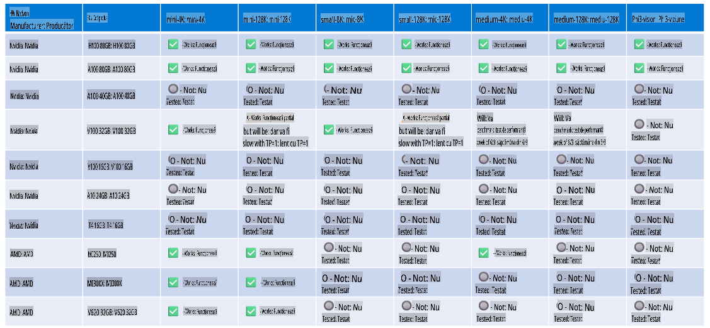

# Suport hardware pentru Phi

Microsoft Phi a fost optimizat pentru ONNX Runtime și suportă Windows DirectML. Funcționează bine pe diverse tipuri de hardware, inclusiv GPU-uri, CPU-uri și chiar dispozitive mobile.

## Hardware pentru dispozitive  
Specificațiile hardware suportate includ:

- GPU SKU: RTX 4090 (DirectML)
- GPU SKU: 1 A100 80GB (CUDA)
- CPU SKU: Standard F64s v2 (64 vCPU-uri, 128 GiB memorie)

## SKU pentru dispozitive mobile  

- Android - Samsung Galaxy S21  
- Apple iPhone 14 sau mai recent, cu procesor A16/A17  

## Specificații hardware pentru Phi  

- Configurație minimă necesară:  
  - Windows: GPU compatibil cu DirectX 12 și minimum 4GB RAM combinată  

CUDA: GPU NVIDIA cu Compute Capability >= 7.02  



## Rularea onnxruntime pe mai multe GPU-uri  

Modelele Phi ONNX disponibile în prezent sunt doar pentru 1 GPU. Este posibil să se suporte multi-gpu pentru modelele Phi, dar ORT cu 2 GPU-uri nu garantează că va oferi un throughput mai mare comparativ cu 2 instanțe de ORT. Consultați [ONNX Runtime](https://onnxruntime.ai/) pentru cele mai recente actualizări.

La [Build 2024, echipa GenAI ONNX](https://youtu.be/WLW4SE8M9i8?si=EtG04UwDvcjunyfC) a anunțat că a activat utilizarea multi-instancă în loc de multi-gpu pentru modelele Phi.

În prezent, acest lucru vă permite să rulați o instanță onnxruntime sau onnxruntime-genai cu variabila de mediu CUDA_VISIBLE_DEVICES, astfel:

```Python
CUDA_VISIBLE_DEVICES=0 python infer.py
CUDA_VISIBLE_DEVICES=1 python infer.py
```

Explorați mai multe despre Phi în [Azure AI Foundry](https://ai.azure.com)

**Declinare responsabilitate**:  
Acest document a fost tradus utilizând servicii de traducere bazate pe inteligență artificială. Deși depunem eforturi pentru acuratețe, vă rugăm să rețineți că traducerile automate pot conține erori sau inexactități. Documentul original, în limba sa nativă, ar trebui considerat sursa autoritară. Pentru informații critice, se recomandă o traducere profesională realizată de un traducător uman. Nu ne asumăm răspunderea pentru eventualele neînțelegeri sau interpretări greșite rezultate din utilizarea acestei traduceri.