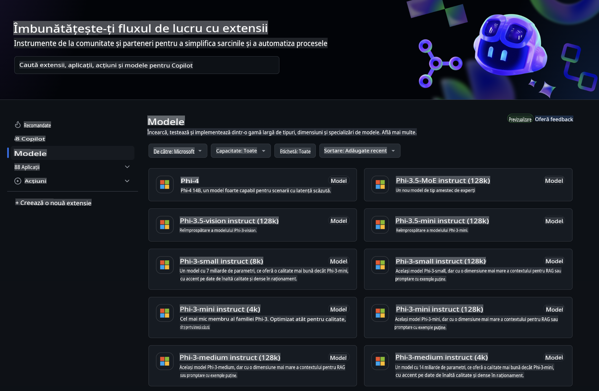
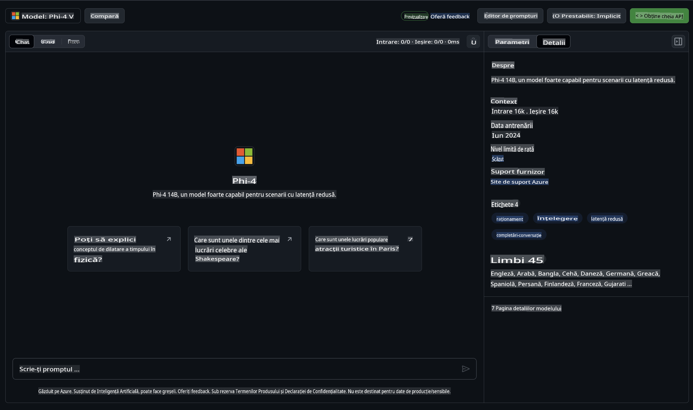
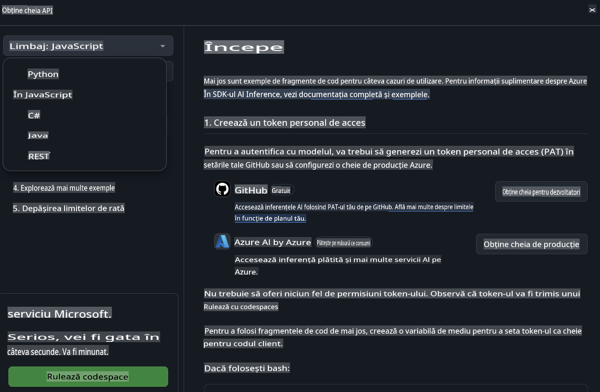
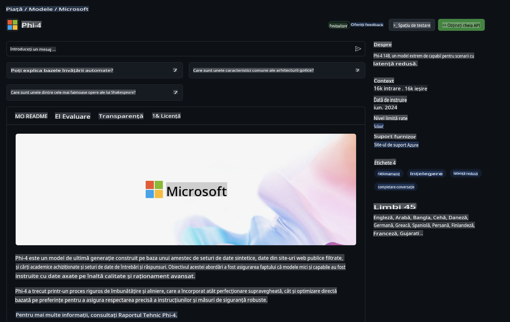

## Familia Phi în Modelele GitHub

Bun venit la [Modelele GitHub](https://github.com/marketplace/models)! Avem totul pregătit pentru ca tu să explorezi Modelele AI găzduite pe Azure AI.



Pentru mai multe informații despre Modelele disponibile pe GitHub Models, consultă [GitHub Model Marketplace](https://github.com/marketplace/models).

## Modele Disponibile

Fiecare model are un playground dedicat și cod de exemplu.



### Familia Phi în Catalogul de Modele GitHub

- [Phi-4](https://github.com/marketplace/models/azureml/Phi-4)

- [Phi-3.5-MoE instruct (128k)](https://github.com/marketplace/models/azureml/Phi-3-5-MoE-instruct)

- [Phi-3.5-vision instruct (128k)](https://github.com/marketplace/models/azureml/Phi-3-5-vision-instruct)

- [Phi-3.5-mini instruct (128k)](https://github.com/marketplace/models/azureml/Phi-3-5-mini-instruct)

- [Phi-3-Medium-128k-Instruct](https://github.com/marketplace/models/azureml/Phi-3-medium-128k-instruct)

- [Phi-3-medium-4k-instruct](https://github.com/marketplace/models/azureml/Phi-3-medium-4k-instruct)

- [Phi-3-mini-128k-instruct](https://github.com/marketplace/models/azureml/Phi-3-mini-128k-instruct)

- [Phi-3-mini-4k-instruct](https://github.com/marketplace/models/azureml/Phi-3-mini-4k-instruct)

- [Phi-3-small-128k-instruct](https://github.com/marketplace/models/azureml/Phi-3-small-128k-instruct)

- [Phi-3-small-8k-instruct](https://github.com/marketplace/models/azureml/Phi-3-small-8k-instruct)

## Începe

Există câteva exemple de bază gata să fie rulate. Le poți găsi în directorul samples. Dacă dorești să sari direct la limbajul tău preferat, poți găsi exemplele în următoarele limbaje:

- Python  
- JavaScript  
- C#  
- Java  
- cURL  

Există, de asemenea, un mediu dedicat Codespaces pentru rularea exemplelor și modelelor.



## Cod de Exemplu

Mai jos sunt fragmente de cod pentru câteva cazuri de utilizare. Pentru informații suplimentare despre Azure AI Inference SDK, vezi documentația completă și exemplele.

## Configurare

1. Creează un token de acces personal  
Nu este nevoie să acorzi permisiuni tokenului. Reține că tokenul va fi trimis către un serviciu Microsoft.

Pentru a folosi fragmentele de cod de mai jos, creează o variabilă de mediu pentru a seta tokenul ca cheie pentru codul client.

Dacă folosești bash:  
```
export GITHUB_TOKEN="<your-github-token-goes-here>"
```  
Dacă folosești powershell:  

```
$Env:GITHUB_TOKEN="<your-github-token-goes-here>"
```  

Dacă folosești Windows command prompt:  

```
set GITHUB_TOKEN=<your-github-token-goes-here>
```  

## Exemplu Python

### Instalare dependențe  
Instalează Azure AI Inference SDK folosind pip (Necesită: Python >=3.8):  

```
pip install azure-ai-inference
```  

### Rulează un exemplu de bază  

Acest exemplu demonstrează un apel de bază către API-ul de completare a conversației. Utilizează endpoint-ul de inferență al modelului AI GitHub și tokenul tău GitHub. Apelul este sincron.  

```python
import os
from azure.ai.inference import ChatCompletionsClient
from azure.ai.inference.models import SystemMessage, UserMessage
from azure.core.credentials import AzureKeyCredential

endpoint = "https://models.inference.ai.azure.com"
model_name = "Phi-4"
token = os.environ["GITHUB_TOKEN"]

client = ChatCompletionsClient(
    endpoint=endpoint,
    credential=AzureKeyCredential(token),
)

response = client.complete(
    messages=[
        UserMessage(content="I have $20,000 in my savings account, where I receive a 4% profit per year and payments twice a year. Can you please tell me how long it will take for me to become a millionaire? Also, can you please explain the math step by step as if you were explaining it to an uneducated person?"),
    ],
    temperature=0.4,
    top_p=1.0,
    max_tokens=2048,
    model=model_name
)

print(response.choices[0].message.content)
```  

### Rulează o conversație pe mai multe rânduri  

Acest exemplu demonstrează o conversație pe mai multe rânduri cu API-ul de completare a conversației. Când folosești modelul pentru o aplicație de chat, va trebui să gestionezi istoricul conversației și să trimiți cele mai recente mesaje către model.  

```
import os
from azure.ai.inference import ChatCompletionsClient
from azure.ai.inference.models import AssistantMessage, SystemMessage, UserMessage
from azure.core.credentials import AzureKeyCredential

token = os.environ["GITHUB_TOKEN"]
endpoint = "https://models.inference.ai.azure.com"
# Replace Model_Name
model_name = "Phi-4"

client = ChatCompletionsClient(
    endpoint=endpoint,
    credential=AzureKeyCredential(token),
)

messages = [
    SystemMessage(content="You are a helpful assistant."),
    UserMessage(content="What is the capital of France?"),
    AssistantMessage(content="The capital of France is Paris."),
    UserMessage(content="What about Spain?"),
]

response = client.complete(messages=messages, model=model_name)

print(response.choices[0].message.content)
```  

### Stream-ul răspunsului  

Pentru o experiență mai bună a utilizatorului, vei dori să transmiți răspunsul modelului astfel încât primul token să apară rapid, evitând așteptările pentru răspunsuri lungi.  

```
import os
from azure.ai.inference import ChatCompletionsClient
from azure.ai.inference.models import SystemMessage, UserMessage
from azure.core.credentials import AzureKeyCredential

token = os.environ["GITHUB_TOKEN"]
endpoint = "https://models.inference.ai.azure.com"
# Replace Model_Name
model_name = "Phi-4"

client = ChatCompletionsClient(
    endpoint=endpoint,
    credential=AzureKeyCredential(token),
)

response = client.complete(
    stream=True,
    messages=[
        SystemMessage(content="You are a helpful assistant."),
        UserMessage(content="Give me 5 good reasons why I should exercise every day."),
    ],
    model=model_name,
)

for update in response:
    if update.choices:
        print(update.choices[0].delta.content or "", end="")

client.close()
```  

## Utilizare GRATUITĂ și limite de rată pentru Modelele GitHub  



[Limitele de rată pentru playground și utilizarea gratuită a API-ului](https://docs.github.com/en/github-models/prototyping-with-ai-models#rate-limits) sunt concepute pentru a te ajuta să experimentezi cu modelele și să creezi prototipuri pentru aplicația ta AI. Pentru utilizare dincolo de aceste limite și pentru a scala aplicația, trebuie să aloci resurse dintr-un cont Azure și să autentifici de acolo în loc să folosești tokenul tău personal GitHub. Nu trebuie să schimbi nimic altceva în codul tău. Folosește acest link pentru a descoperi cum să depășești limitele nivelului gratuit în Azure AI.  

### Declarații  

Reține că atunci când interacționezi cu un model, experimentezi cu AI, deci pot apărea greșeli de conținut.  

Funcționalitatea este supusă unor limite variate (inclusiv cereri pe minut, cereri pe zi, tokeni per cerere și cereri concurente) și nu este destinată utilizării în scenarii de producție.  

Modelele GitHub folosesc Azure AI Content Safety. Aceste filtre nu pot fi dezactivate ca parte a experienței Modelelor GitHub. Dacă decizi să utilizezi modelele printr-un serviciu plătit, configurează filtrele de conținut pentru a îndeplini cerințele tale.  

Acest serviciu este oferit în baza Termenilor de Pre-lansare ai GitHub.  

**Declinări de responsabilitate**:  
Acest document a fost tradus folosind servicii de traducere bazate pe inteligență artificială. Deși ne străduim să asigurăm acuratețea, vă rugăm să aveți în vedere că traducerile automate pot conține erori sau inexactități. Documentul original în limba sa maternă trebuie considerat sursa autoritară. Pentru informații critice, se recomandă traducerea profesională realizată de un specialist. Nu ne asumăm răspunderea pentru neînțelegerile sau interpretările greșite care pot apărea din utilizarea acestei traduceri.