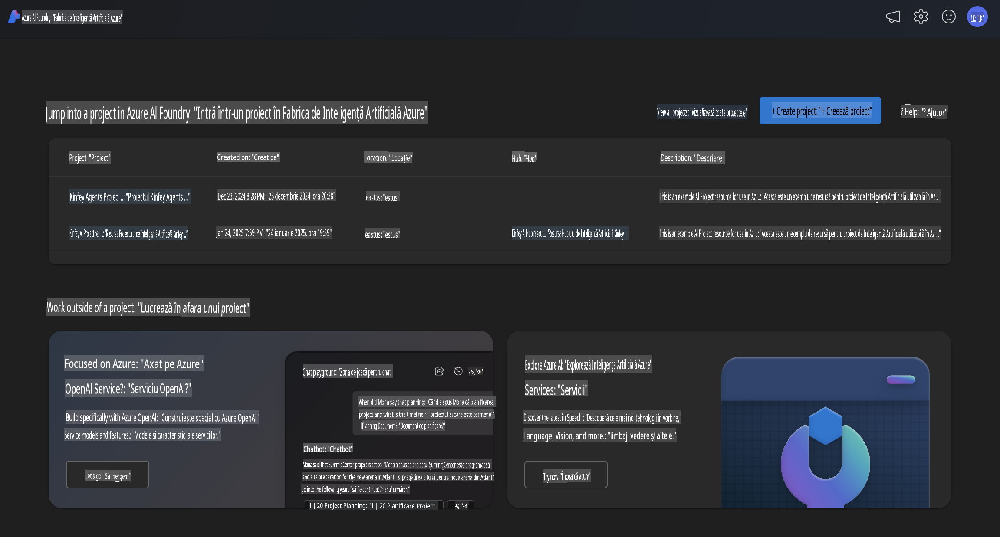
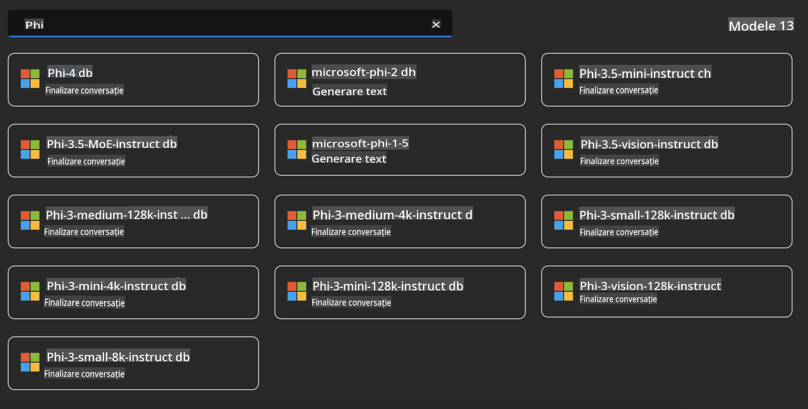
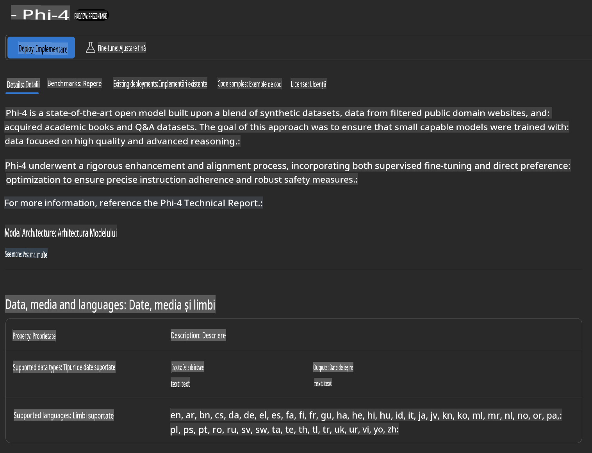
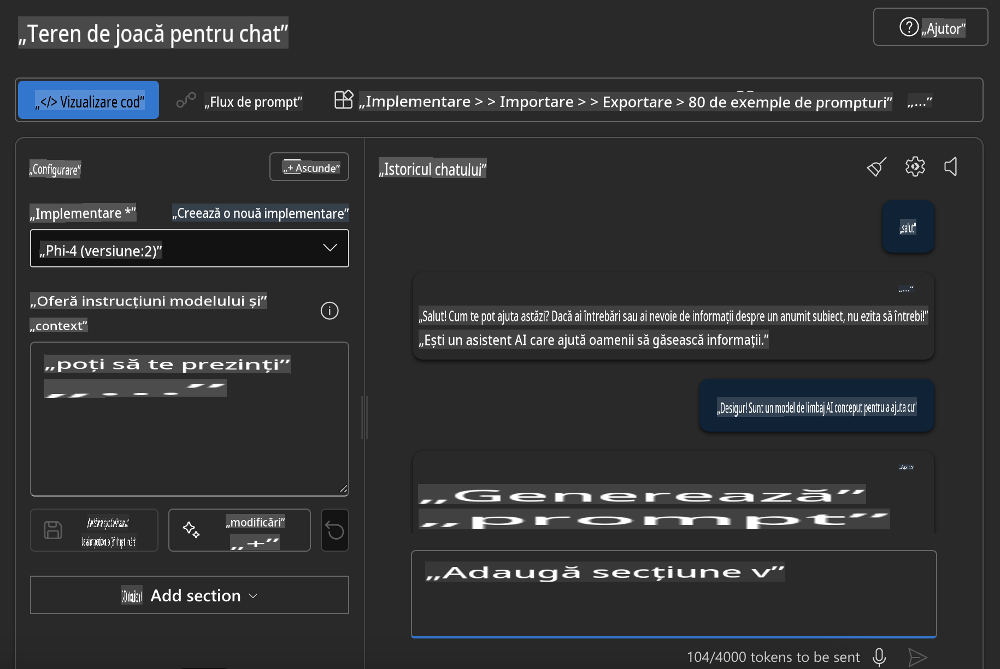

## Familia Phi în Azure AI Foundry

[Azure AI Foundry](https://ai.azure.com) este o platformă de încredere care oferă dezvoltatorilor posibilitatea de a inova și de a modela viitorul cu ajutorul inteligenței artificiale într-un mod sigur, securizat și responsabil.

[Azure AI Foundry](https://ai.azure.com) este concepută pentru dezvoltatori pentru a:

- Construi aplicații de AI generativă pe o platformă de nivel enterprise.
- Explora, construi, testa și implementa folosind cele mai avansate instrumente AI și modele ML, bazate pe practici responsabile de AI.
- Colabora cu o echipă pentru întregul ciclu de viață al dezvoltării aplicațiilor.

Cu Azure AI Foundry, poți explora o gamă variată de modele, servicii și capabilități și poți începe să construiești aplicații AI care să răspundă cel mai bine obiectivelor tale. Platforma Azure AI Foundry facilitează scalabilitatea pentru a transforma conceptele de probă în aplicații de producție complete cu ușurință. Monitorizarea continuă și rafinarea sprijină succesul pe termen lung.



Pe lângă utilizarea Azure AOAI Service în Azure AI Foundry, poți folosi și modele terțe disponibile în Catalogul de Modele al Azure AI Foundry. Aceasta este o alegere bună dacă dorești să utilizezi Azure AI Foundry ca platformă pentru soluțiile tale AI.

Putem implementa rapid Modelele Familia Phi prin intermediul Catalogului de Modele din Azure AI Foundry.



### **Implementarea Phi-4 în Azure AI Foundry**



### **Testarea Phi-4 în Azure AI Foundry Playground**



### **Rularea codului Python pentru a apela Azure AI Foundry Phi-4**

```python

import os  
import base64
from openai import AzureOpenAI  
from azure.identity import DefaultAzureCredential, get_bearer_token_provider  
        
endpoint = os.getenv("ENDPOINT_URL", "Your Azure AOAI Service Endpoint")  
deployment = os.getenv("DEPLOYMENT_NAME", "Phi-4")  
      
token_provider = get_bearer_token_provider(  
    DefaultAzureCredential(),  
    "https://cognitiveservices.azure.com/.default"  
)  
  
client = AzureOpenAI(  
    azure_endpoint=endpoint,  
    azure_ad_token_provider=token_provider,  
    api_version="2024-05-01-preview",  
)  
  

chat_prompt = [
    {
        "role": "system",
        "content": "You are an AI assistant that helps people find information."
    },
    {
        "role": "user",
        "content": "can you introduce yourself"
    }
] 
    
# Include speech result if speech is enabled  
messages = chat_prompt 

completion = client.chat.completions.create(  
    model=deployment,  
    messages=messages,
    max_tokens=800,  
    temperature=0.7,  
    top_p=0.95,  
    frequency_penalty=0,  
    presence_penalty=0,
    stop=None,  
    stream=False  
)  
  
print(completion.to_json())  

```

**Declinări de responsabilitate**:  
Acest document a fost tradus utilizând servicii de traducere bazate pe inteligență artificială. Deși ne străduim să asigurăm acuratețea, vă rugăm să rețineți că traducerile automate pot conține erori sau inexactități. Documentul original în limba sa natală ar trebui considerat sursa autoritară. Pentru informații critice, se recomandă traducerea umană realizată de profesioniști. Nu ne asumăm răspunderea pentru neînțelegerile sau interpretările greșite care pot apărea din utilizarea acestei traduceri.