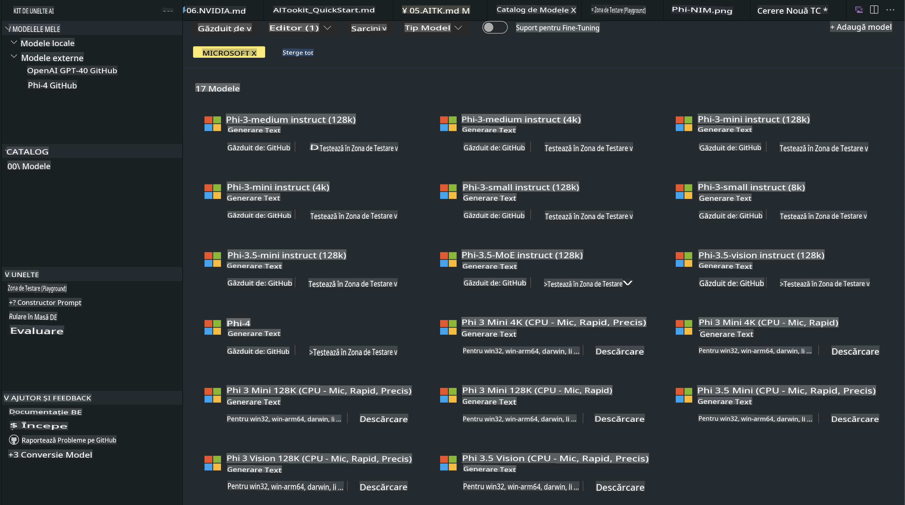
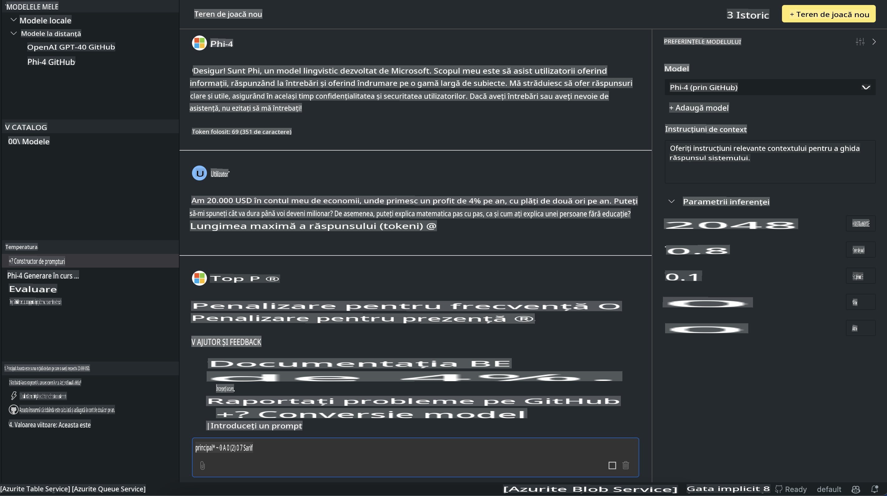

# Familia Phi în AITK

[AI Toolkit pentru VS Code](https://marketplace.visualstudio.com/items?itemName=ms-windows-ai-studio.windows-ai-studio) simplifică dezvoltarea aplicațiilor AI generative, reunind instrumente avansate de dezvoltare AI și modele din Azure AI Foundry Catalog și alte cataloage precum Hugging Face. Vei putea naviga prin catalogul de modele AI alimentat de GitHub Models și Azure AI Foundry Model Catalogs, să le descarci local sau remote, să le ajustezi, testezi și utilizezi în aplicația ta.

Previzualizarea AI Toolkit rulează local. Inferența locală sau ajustarea depinde de modelul selectat; este posibil să ai nevoie de un GPU precum NVIDIA CUDA GPU. De asemenea, poți rula GitHub Models direct cu AITK.

## Început

[Află mai multe despre cum să instalezi subsistemul Windows pentru Linux](https://learn.microsoft.com/windows/wsl/install?WT.mc_id=aiml-137032-kinfeylo)

și [cum să schimbi distribuția implicită](https://learn.microsoft.com/windows/wsl/install#change-the-default-linux-distribution-installed).

[Repository-ul GitHub AI Toolkit](https://github.com/microsoft/vscode-ai-toolkit/)

- Windows, Linux, macOS
  
- Pentru ajustare pe Windows și Linux, vei avea nevoie de un GPU Nvidia. În plus, **Windows** necesită subsistemul pentru Linux cu distribuția Ubuntu 18.4 sau mai mare. [Află mai multe despre cum să instalezi subsistemul Windows pentru Linux](https://learn.microsoft.com/windows/wsl/install) și [cum să schimbi distribuția implicită](https://learn.microsoft.com/windows/wsl/install#change-the-default-linux-distribution-installed).

### Instalarea AI Toolkit

AI Toolkit este livrat ca o [Extensie pentru Visual Studio Code](https://code.visualstudio.com/docs/setup/additional-components#_vs-code-extensions), deci mai întâi trebuie să instalezi [VS Code](https://code.visualstudio.com/docs/setup/windows?WT.mc_id=aiml-137032-kinfeylo) și să descarci AI Toolkit din [VS Marketplace](https://marketplace.visualstudio.com/items?itemName=ms-windows-ai-studio.windows-ai-studio).  
[AI Toolkit este disponibil în Visual Studio Marketplace](https://marketplace.visualstudio.com/items?itemName=ms-windows-ai-studio.windows-ai-studio) și poate fi instalat ca orice altă extensie VS Code.  

Dacă nu ești familiarizat cu instalarea extensiilor VS Code, urmează acești pași:

### Autentificare

1. În bara de activități din VS Code, selectează **Extensions**.
1. În bara de căutare a extensiilor, tastează "AI Toolkit".
1. Selectează "AI Toolkit for Visual Studio Code".
1. Apasă pe **Install**.

Acum ești pregătit să folosești extensia!

Vei fi solicitat să te autentifici în GitHub, așa că apasă "Allow" pentru a continua. Vei fi redirecționat către pagina de autentificare GitHub.

Autentifică-te și urmează pașii procesului. După finalizarea cu succes, vei fi redirecționat înapoi la VS Code.

După ce extensia a fost instalată, vei vedea pictograma AI Toolkit apărând în bara de activități.

Hai să explorăm acțiunile disponibile!

### Acțiuni disponibile

Bara laterală principală a AI Toolkit este organizată în  

- **Models**  
- **Resources**  
- **Playground**  
- **Fine-tuning**  
- **Evaluation**

Acestea sunt disponibile în secțiunea Resources. Pentru a începe, selectează **Model Catalog**.

### Descarcă un model din catalog

După lansarea AI Toolkit din bara laterală a VS Code, poți selecta dintre următoarele opțiuni:



- Găsește un model suportat din **Model Catalog** și descarcă-l local.
- Testează inferența modelului în **Model Playground**.
- Ajustează modelul local sau remote în **Model Fine-tuning**.
- Publică modelele ajustate în cloud prin paleta de comenzi pentru AI Toolkit.
- Evaluează modelele.

> [!NOTE]
>
> **GPU vs CPU**
>
> Vei observa că fișele modelelor arată dimensiunea modelului, platforma și tipul acceleratorului (CPU, GPU). Pentru performanță optimizată pe **dispozitive Windows care au cel puțin un GPU**, selectează versiuni de modele care vizează doar Windows.
>
> Acest lucru asigură un model optimizat pentru acceleratorul DirectML.
>
> Numele modelelor sunt în formatul:
>
> - `{model_name}-{accelerator}-{quantization}-{format}`.
>
>Pentru a verifica dacă ai un GPU pe dispozitivul tău Windows, deschide **Task Manager** și apoi selectează fila **Performance**. Dacă ai GPU-uri, acestea vor fi listate sub nume precum "GPU 0" sau "GPU 1".

### Rulează modelul în playground

După ce toate parametrii sunt setați, apasă pe **Generate Project**.

Odată ce modelul tău a fost descărcat, selectează **Load in Playground** pe fișa modelului din catalog:

- Inițiază descărcarea modelului.
- Instalează toate cerințele și dependențele.
- Creează un spațiu de lucru VS Code.



### Utilizează REST API în aplicația ta

AI Toolkit vine cu un server local REST API **pe portul 5272** care folosește formatul [OpenAI chat completions](https://platform.openai.com/docs/api-reference/chat/create). 

Acest lucru îți permite să testezi aplicația local fără a depinde de un serviciu de model AI din cloud. De exemplu, următorul fișier JSON arată cum să configurezi corpul cererii:

```json
{
    "model": "Phi-4",
    "messages": [
        {
            "role": "user",
            "content": "what is the golden ratio?"
        }
    ],
    "temperature": 0.7,
    "top_p": 1,
    "top_k": 10,
    "max_tokens": 100,
    "stream": true
}
```

Poți testa REST API folosind (de exemplu) [Postman](https://www.postman.com/) sau utilitarul CURL (Client URL):

```bash
curl -vX POST http://127.0.0.1:5272/v1/chat/completions -H 'Content-Type: application/json' -d @body.json
```

### Utilizarea bibliotecii client OpenAI pentru Python

```python
from openai import OpenAI

client = OpenAI(
    base_url="http://127.0.0.1:5272/v1/", 
    api_key="x" # required for the API but not used
)

chat_completion = client.chat.completions.create(
    messages=[
        {
            "role": "user",
            "content": "what is the golden ratio?",
        }
    ],
    model="Phi-4",
)

print(chat_completion.choices[0].message.content)
```

### Utilizarea bibliotecii client Azure OpenAI pentru .NET

Adaugă [biblioteca client Azure OpenAI pentru .NET](https://www.nuget.org/packages/Azure.AI.OpenAI/) în proiectul tău folosind NuGet:

```bash
dotnet add {project_name} package Azure.AI.OpenAI --version 1.0.0-beta.17
```

Adaugă un fișier C# numit **OverridePolicy.cs** în proiectul tău și inserează următorul cod:

```csharp
// OverridePolicy.cs
using Azure.Core.Pipeline;
using Azure.Core;

internal partial class OverrideRequestUriPolicy(Uri overrideUri)
    : HttpPipelineSynchronousPolicy
{
    private readonly Uri _overrideUri = overrideUri;

    public override void OnSendingRequest(HttpMessage message)
    {
        message.Request.Uri.Reset(_overrideUri);
    }
}
```

Apoi, inserează următorul cod în fișierul tău **Program.cs**:

```csharp
// Program.cs
using Azure.AI.OpenAI;

Uri localhostUri = new("http://localhost:5272/v1/chat/completions");

OpenAIClientOptions clientOptions = new();
clientOptions.AddPolicy(
    new OverrideRequestUriPolicy(localhostUri),
    Azure.Core.HttpPipelinePosition.BeforeTransport);
OpenAIClient client = new(openAIApiKey: "unused", clientOptions);

ChatCompletionsOptions options = new()
{
    DeploymentName = "Phi-4",
    Messages =
    {
        new ChatRequestSystemMessage("You are a helpful assistant. Be brief and succinct."),
        new ChatRequestUserMessage("What is the golden ratio?"),
    }
};

StreamingResponse<StreamingChatCompletionsUpdate> streamingChatResponse
    = await client.GetChatCompletionsStreamingAsync(options);

await foreach (StreamingChatCompletionsUpdate chatChunk in streamingChatResponse)
{
    Console.Write(chatChunk.ContentUpdate);
}
```

## Ajustare fină cu AI Toolkit

- Începe cu descoperirea modelelor și playground.
- Ajustare fină și inferență utilizând resursele de calcul locale.
- Ajustare fină și inferență remote folosind resurse Azure.

[Ajustare fină cu AI Toolkit](../../03.FineTuning/Finetuning_VSCodeaitoolkit.md)

## Resurse de întrebări și răspunsuri AI Toolkit

Te rugăm să consulți [pagina noastră de întrebări și răspunsuri](https://github.com/microsoft/vscode-ai-toolkit/blob/main/archive/QA.md) pentru cele mai comune probleme și soluții.

**Declinarea responsabilității**:  
Acest document a fost tradus folosind servicii de traducere bazate pe inteligență artificială. Deși ne străduim să asigurăm acuratețea, vă rugăm să rețineți că traducerile automate pot conține erori sau inexactități. Documentul original în limba sa natală ar trebui considerat sursa autoritară. Pentru informații critice, se recomandă traducerea umană realizată de profesioniști. Nu ne asumăm răspunderea pentru eventualele neînțelegeri sau interpretări greșite care pot apărea din utilizarea acestei traduceri.