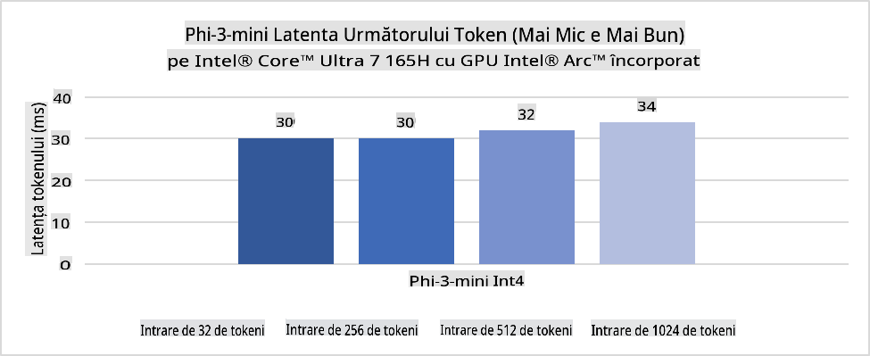
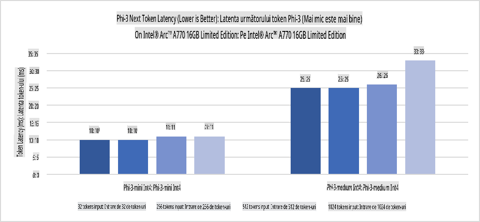
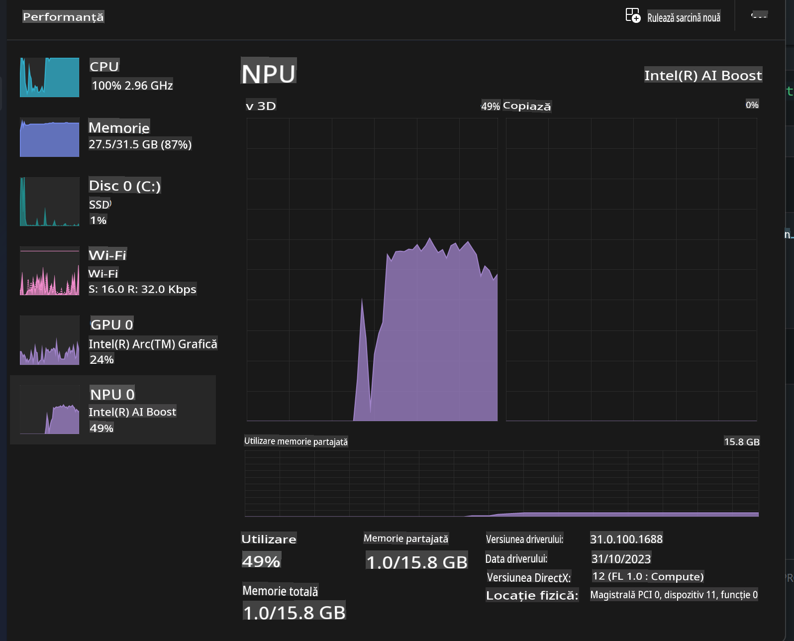
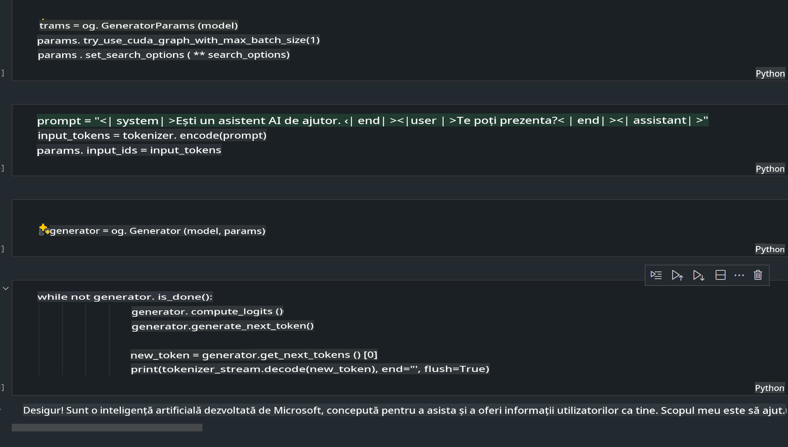
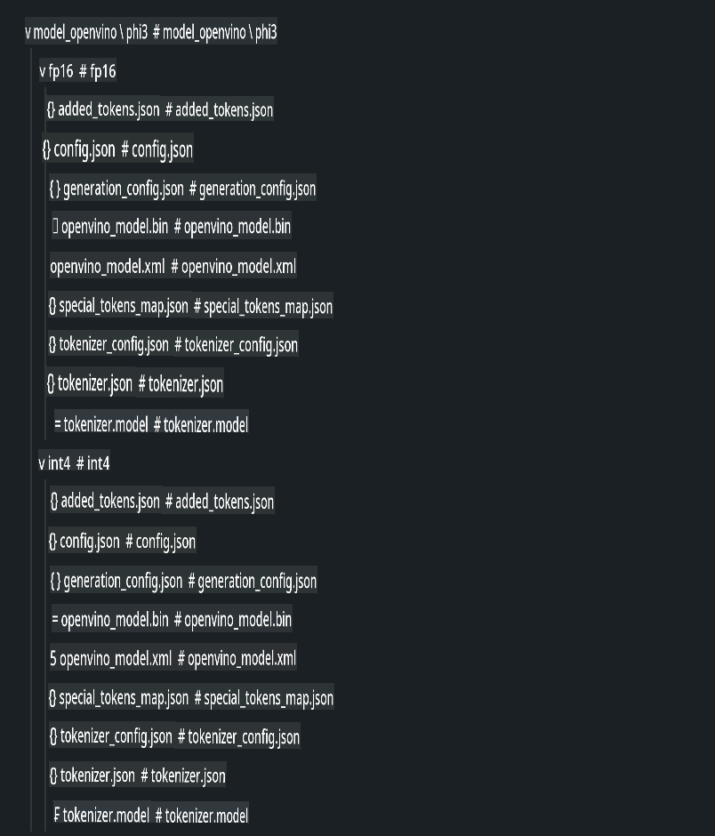
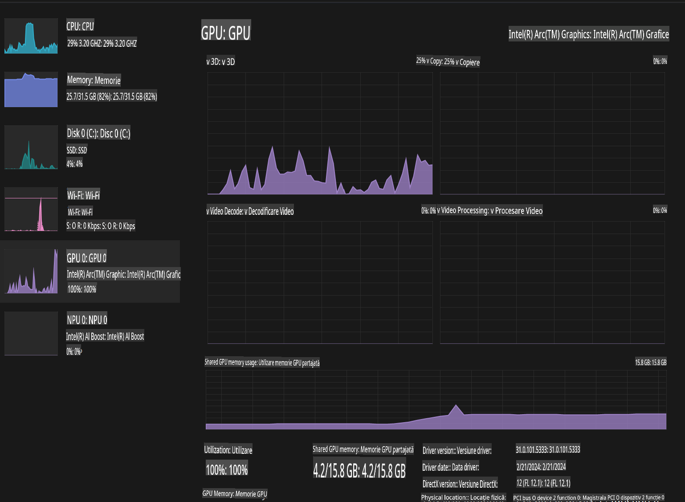

# **Inferența Phi-3 în AI PC**

Odată cu avansul AI-ului generativ și îmbunătățirea capacităților hardware ale dispozitivelor edge, tot mai multe modele AI generative pot fi acum integrate în dispozitivele personale ale utilizatorilor (BYOD). AI PC-urile fac parte din această tendință. Începând cu 2024, Intel, AMD și Qualcomm au colaborat cu producători de PC-uri pentru a introduce AI PC-uri care facilitează implementarea modelelor AI generative locale prin modificări hardware. În această discuție, ne vom concentra pe AI PC-urile Intel și vom explora cum să implementăm Phi-3 pe un AI PC Intel.

### Ce este NPU

Un NPU (Unitate de Procesare Neurală) este un procesor dedicat sau o unitate de procesare pe un SoC mai mare, conceput special pentru accelerarea operațiunilor de rețea neurală și a sarcinilor AI. Spre deosebire de CPU-urile și GPU-urile generaliste, NPU-urile sunt optimizate pentru calcul paralel bazat pe date, fiind extrem de eficiente în procesarea unor cantități masive de date multimedia, cum ar fi videoclipuri și imagini, și în procesarea datelor pentru rețele neurale. Acestea sunt deosebit de bune pentru sarcini legate de AI, cum ar fi recunoașterea vocală, estomparea fundalului în apeluri video și procesele de editare foto sau video, precum detectarea obiectelor.

## NPU vs GPU

Deși multe sarcini AI și de învățare automată rulează pe GPU-uri, există o diferență crucială între GPU-uri și NPU-uri.  
GPU-urile sunt cunoscute pentru capacitățile lor de calcul paralel, dar nu toate GPU-urile sunt la fel de eficiente în afara procesării grafice. NPU-urile, pe de altă parte, sunt construite special pentru calculele complexe implicate în operațiunile rețelelor neurale, făcându-le extrem de eficiente pentru sarcini AI.

În concluzie, NPU-urile sunt "geniile matematicii" care accelerează calculele AI și joacă un rol esențial în era emergentă a AI PC-urilor!

***Acest exemplu este bazat pe cel mai recent procesor Intel Core Ultra***

## **1. Utilizarea NPU pentru a rula modelul Phi-3**

Dispozitivul Intel® NPU este un accelerator de inferență AI integrat în CPU-urile client Intel, începând cu generația Intel® Core™ Ultra (cunoscută anterior ca Meteor Lake). Acesta permite execuția eficientă din punct de vedere energetic a sarcinilor rețelelor neurale artificiale.





**Biblioteca Intel NPU Acceleration**

Biblioteca Intel NPU Acceleration [https://github.com/intel/intel-npu-acceleration-library](https://github.com/intel/intel-npu-acceleration-library) este o bibliotecă Python concepută pentru a crește eficiența aplicațiilor dvs. prin utilizarea puterii Intel Neural Processing Unit (NPU) pentru a efectua calcule de mare viteză pe hardware compatibil.

Exemplu de Phi-3-mini pe un AI PC alimentat de procesoare Intel® Core™ Ultra.


Instalarea bibliotecii Python cu pip

```bash

   pip install intel-npu-acceleration-library

```

***Notă*** Proiectul este încă în dezvoltare, dar modelul de referință este deja foarte complet.

### **Rularea Phi-3 cu Intel NPU Acceleration Library**

Folosind accelerarea NPU Intel, această bibliotecă nu afectează procesul tradițional de codificare. Trebuie doar să utilizați biblioteca pentru a cuantifica modelul original Phi-3, cum ar fi FP16, INT8, INT4, cum ar fi  

```python
from transformers import AutoTokenizer, pipeline,TextStreamer
from intel_npu_acceleration_library import NPUModelForCausalLM, int4
from intel_npu_acceleration_library.compiler import CompilerConfig
import warnings

model_id = "microsoft/Phi-3-mini-4k-instruct"

compiler_conf = CompilerConfig(dtype=int4)
model = NPUModelForCausalLM.from_pretrained(
    model_id, use_cache=True, config=compiler_conf, attn_implementation="sdpa"
).eval()

tokenizer = AutoTokenizer.from_pretrained(model_id)

text_streamer = TextStreamer(tokenizer, skip_prompt=True)
```

După ce cuantificarea este realizată cu succes, continuați execuția pentru a apela NPU pentru a rula modelul Phi-3.

```python
generation_args = {
   "max_new_tokens": 1024,
   "return_full_text": False,
   "temperature": 0.3,
   "do_sample": False,
   "streamer": text_streamer,
}

pipe = pipeline(
   "text-generation",
   model=model,
   tokenizer=tokenizer,
)

query = "<|system|>You are a helpful AI assistant.<|end|><|user|>Can you introduce yourself?<|end|><|assistant|>"

with warnings.catch_warnings():
    warnings.simplefilter("ignore")
    pipe(query, **generation_args)
```

Când executăm codul, putem vizualiza starea de funcționare a NPU prin Task Manager.



***Exemple*** : [AIPC_NPU_DEMO.ipynb](../../../../../code/03.Inference/AIPC/AIPC_NPU_DEMO.ipynb)

## **2. Utilizarea DirectML + ONNX Runtime pentru a rula modelul Phi-3**

### **Ce este DirectML**

[DirectML](https://github.com/microsoft/DirectML) este o bibliotecă DirectX 12 de înaltă performanță, accelerată hardware, pentru învățarea automată. DirectML oferă accelerare GPU pentru sarcini comune de învățare automată pe o gamă largă de hardware și drivere compatibile, inclusiv toate GPU-urile compatibile DirectX 12 de la furnizori precum AMD, Intel, NVIDIA și Qualcomm.

Când este utilizat independent, API-ul DirectML este o bibliotecă DirectX 12 de nivel scăzut și este potrivită pentru aplicații de înaltă performanță și latență redusă, cum ar fi framework-uri, jocuri și alte aplicații în timp real. Interoperabilitatea fără probleme a DirectML cu Direct3D 12, precum și costurile sale reduse și conformitatea pe diferite hardware-uri, fac ca DirectML să fie ideal pentru accelerarea învățării automate atunci când este dorită atât performanța ridicată, cât și fiabilitatea și predictibilitatea rezultatelor pe hardware.

***Notă*** : Cel mai recent DirectML deja suportă NPU(https://devblogs.microsoft.com/directx/introducing-neural-processor-unit-npu-support-in-directml-developer-preview/)

### DirectML și CUDA în ceea ce privește capacitățile și performanța:

**DirectML** este o bibliotecă de învățare automată dezvoltată de Microsoft. Este concepută pentru a accelera sarcinile de învățare automată pe dispozitive Windows, inclusiv desktop-uri, laptop-uri și dispozitive edge.  
- Bazat pe DX12: DirectML este construit pe DirectX 12 (DX12), oferind suport hardware larg pe GPU-uri, inclusiv NVIDIA și AMD.  
- Suport extins: Deoarece folosește DX12, DirectML poate funcționa cu orice GPU compatibil DX12, chiar și GPU-uri integrate.  
- Procesare de imagini: DirectML procesează imagini și alte date folosind rețele neurale, fiind potrivit pentru sarcini precum recunoașterea imaginilor, detectarea obiectelor și altele.  
- Configurare ușoară: Configurarea DirectML este simplă și nu necesită SDK-uri sau biblioteci specifice de la producătorii de GPU-uri.  
- Performanță: În unele cazuri, DirectML performează bine și poate fi mai rapid decât CUDA, mai ales pentru anumite sarcini.  
- Limitări: Totuși, există cazuri în care DirectML poate fi mai lent, în special pentru loturi mari float16.

**CUDA** este platforma de calcul paralel și modelul de programare al NVIDIA. Permite dezvoltatorilor să folosească puterea GPU-urilor NVIDIA pentru calcul general, inclusiv învățare automată și simulări științifice.  
- Specific NVIDIA: CUDA este integrat strâns cu GPU-urile NVIDIA și este conceput special pentru acestea.  
- Foarte optimizat: Oferă performanță excelentă pentru sarcinile accelerate de GPU, mai ales când se folosesc GPU-uri NVIDIA.  
- Utilizat pe scară largă: Multe framework-uri și biblioteci de învățare automată (cum ar fi TensorFlow și PyTorch) au suport pentru CUDA.  
- Personalizare: Dezvoltatorii pot ajusta setările CUDA pentru sarcini specifice, ceea ce poate duce la o performanță optimă.  
- Limitări: Totuși, dependența CUDA de hardware-ul NVIDIA poate fi o limitare dacă doriți compatibilitate mai largă pe diferite GPU-uri.

### Alegerea între DirectML și CUDA

Alegerea între DirectML și CUDA depinde de cazul dvs. specific, disponibilitatea hardware-ului și preferințe.  
Dacă căutați compatibilitate mai largă și o configurare ușoară, DirectML ar putea fi o alegere bună. Totuși, dacă aveți GPU-uri NVIDIA și aveți nevoie de performanță optimizată, CUDA rămâne o opțiune puternică. În concluzie, ambele au puncte forte și puncte slabe, așa că luați în considerare cerințele dvs. și hardware-ul disponibil atunci când faceți o alegere.

### **AI generativ cu ONNX Runtime**

În era AI, portabilitatea modelelor AI este foarte importantă. ONNX Runtime poate implementa cu ușurință modele antrenate pe dispozitive diferite. Dezvoltatorii nu trebuie să se preocupe de framework-ul de inferență și pot folosi o API unificată pentru a realiza inferența modelului. În era AI generativ, ONNX Runtime a realizat și optimizări de cod (https://onnxruntime.ai/docs/genai/). Prin intermediul ONNX Runtime optimizat, modelul AI generativ cuantificat poate fi inferat pe terminale diferite. În AI generativ cu ONNX Runtime, puteți utiliza API-ul modelului AI prin Python, C#, C / C++. Desigur, implementarea pe iPhone poate beneficia de API-ul AI generativ ONNX Runtime al C++.

[Cod exemplu](https://github.com/Azure-Samples/Phi-3MiniSamples/tree/main/onnx)

***Compilare AI generativ cu biblioteca ONNX Runtime***

```bash

winget install --id=Kitware.CMake  -e

git clone https://github.com/microsoft/onnxruntime.git

cd .\onnxruntime\

./build.bat --build_shared_lib --skip_tests --parallel --use_dml --config Release

cd ../

git clone https://github.com/microsoft/onnxruntime-genai.git

cd .\onnxruntime-genai\

mkdir ort

cd ort

mkdir include

mkdir lib

copy ..\onnxruntime\include\onnxruntime\core\providers\dml\dml_provider_factory.h ort\include

copy ..\onnxruntime\include\onnxruntime\core\session\onnxruntime_c_api.h ort\include

copy ..\onnxruntime\build\Windows\Release\Release\*.dll ort\lib

copy ..\onnxruntime\build\Windows\Release\Release\onnxruntime.lib ort\lib

python build.py --use_dml


```

**Instalare bibliotecă**

```bash

pip install .\onnxruntime_genai_directml-0.3.0.dev0-cp310-cp310-win_amd64.whl

```

Acesta este rezultatul rulării



***Exemple*** : [AIPC_DirectML_DEMO.ipynb](../../../../../code/03.Inference/AIPC/AIPC_DirectML_DEMO.ipynb)

## **3. Utilizarea Intel OpenVino pentru a rula modelul Phi-3**

### **Ce este OpenVINO**

[OpenVINO](https://github.com/openvinotoolkit/openvino) este un toolkit open-source pentru optimizarea și implementarea modelelor de învățare profundă. Acesta oferă performanță îmbunătățită pentru modelele de viziune, audio și limbaj din framework-uri populare precum TensorFlow, PyTorch și altele. OpenVINO poate fi folosit și în combinație cu CPU și GPU pentru a rula modelul Phi-3.

***Notă***: În prezent, OpenVINO nu suportă NPU.

### **Instalare bibliotecă OpenVINO**

```bash

 pip install git+https://github.com/huggingface/optimum-intel.git

 pip install git+https://github.com/openvinotoolkit/nncf.git

 pip install openvino-nightly

```

### **Rularea Phi-3 cu OpenVINO**

La fel ca în cazul NPU, OpenVINO realizează apelarea modelelor AI generative prin rularea modelelor cuantificate. Trebuie să cuantificăm mai întâi modelul Phi-3 și să completăm cuantificarea modelului pe linia de comandă prin optimum-cli.

**INT4**

```bash

optimum-cli export openvino --model "microsoft/Phi-3-mini-4k-instruct" --task text-generation-with-past --weight-format int4 --group-size 128 --ratio 0.6  --sym  --trust-remote-code ./openvinomodel/phi3/int4

```

**FP16**

```bash

optimum-cli export openvino --model "microsoft/Phi-3-mini-4k-instruct" --task text-generation-with-past --weight-format fp16 --trust-remote-code ./openvinomodel/phi3/fp16

```

Formatul convertit, arată astfel



Încărcați căile modelului (model_dir), configurațiile asociate (ov_config = {"PERFORMANCE_HINT": "LATENCY", "NUM_STREAMS": "1", "CACHE_DIR": ""}) și dispozitivele accelerate hardware (GPU.0) prin OVModelForCausalLM.

```python

ov_model = OVModelForCausalLM.from_pretrained(
     model_dir,
     device='GPU.0',
     ov_config=ov_config,
     config=AutoConfig.from_pretrained(model_dir, trust_remote_code=True),
     trust_remote_code=True,
)

```

Când executăm codul, putem vizualiza starea de funcționare a GPU-ului prin Task Manager.



***Exemple*** : [AIPC_OpenVino_Demo.ipynb](../../../../../code/03.Inference/AIPC/AIPC_OpenVino_Demo.ipynb)

### ***Notă*** : Cele trei metode de mai sus au fiecare avantajele lor, dar se recomandă utilizarea accelerării NPU pentru inferența AI pe PC.

**Declinări de responsabilitate**:  
Acest document a fost tradus folosind servicii de traducere bazate pe inteligență artificială. Deși ne străduim să asigurăm acuratețea, vă rugăm să rețineți că traducerile automate pot conține erori sau inexactități. Documentul original, în limba sa nativă, ar trebui considerat sursa autoritară. Pentru informații critice, se recomandă traducerea profesională realizată de un specialist. Nu ne asumăm răspunderea pentru neînțelegerile sau interpretările greșite care pot apărea din utilizarea acestei traduceri.