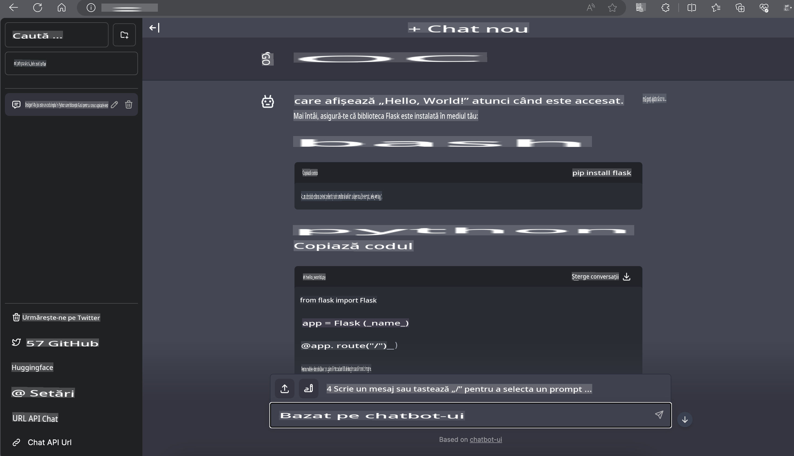

# **Inference Phi-3 pe Nvidia Jetson**

Nvidia Jetson este o serie de plăci de calcul încorporate de la Nvidia. Modelele Jetson TK1, TX1 și TX2 sunt echipate cu un procesor Tegra (sau SoC) de la Nvidia, care integrează o unitate centrală de procesare (CPU) cu arhitectură ARM. Jetson este un sistem cu consum redus de energie, proiectat pentru accelerarea aplicațiilor de învățare automată. Nvidia Jetson este utilizat de dezvoltatori profesioniști pentru a crea produse AI revoluționare în toate industriile, precum și de studenți și entuziaști pentru a învăța AI practic și a realiza proiecte uimitoare. SLM este implementat în dispozitive edge, cum ar fi Jetson, ceea ce va permite o mai bună aplicare a scenariilor industriale de generare AI.

## Implementare pe NVIDIA Jetson:
Dezvoltatorii care lucrează la robotică autonomă și dispozitive încorporate pot profita de Phi-3 Mini. Dimensiunea relativ mică a Phi-3 îl face ideal pentru implementarea în edge. Parametrii au fost ajustați cu atenție în timpul antrenării, asigurând un nivel ridicat de precizie în răspunsuri.

### Optimizarea TensorRT-LLM:
Biblioteca [TensorRT-LLM de la NVIDIA](https://github.com/NVIDIA/TensorRT-LLM?WT.mc_id=aiml-138114-kinfeylo) optimizează inferența modelelor lingvistice mari. Aceasta sprijină fereastra lungă de context a Phi-3 Mini, îmbunătățind atât debitul, cât și latența. Optimizările includ tehnici precum LongRoPE, FP8 și batching în timp real.

### Disponibilitate și Implementare:
Dezvoltatorii pot explora Phi-3 Mini cu fereastra de context de 128K la [AI-ul NVIDIA](https://www.nvidia.com/en-us/ai-data-science/generative-ai/). Este livrat sub formă de NVIDIA NIM, un microserviciu cu un API standard care poate fi implementat oriunde. De asemenea, consultați [implementările TensorRT-LLM pe GitHub](https://github.com/NVIDIA/TensorRT-LLM).

## **1. Pregătire**

a. Jetson Orin NX / Jetson NX

b. JetPack 5.1.2+
   
c. Cuda 11.8
   
d. Python 3.8+

## **2. Rularea Phi-3 pe Jetson**

Putem alege [Ollama](https://ollama.com) sau [LlamaEdge](https://llamaedge.com).

Dacă doriți să utilizați gguf atât în cloud, cât și pe dispozitive edge, LlamaEdge poate fi înțeles ca WasmEdge (WasmEdge este un runtime WebAssembly ușor, performant și scalabil, potrivit pentru aplicații native în cloud, edge și descentralizate. Acesta sprijină aplicații serverless, funcții încorporate, microservicii, contracte inteligente și dispozitive IoT). Puteți implementa modelul cantitativ gguf pe dispozitive edge și în cloud prin LlamaEdge.


Iată pașii de utilizare:

1. Instalați și descărcați bibliotecile și fișierele necesare

```bash

curl -sSf https://raw.githubusercontent.com/WasmEdge/WasmEdge/master/utils/install.sh | bash -s -- --plugin wasi_nn-ggml

curl -LO https://github.com/LlamaEdge/LlamaEdge/releases/latest/download/llama-api-server.wasm

curl -LO https://github.com/LlamaEdge/chatbot-ui/releases/latest/download/chatbot-ui.tar.gz

tar xzf chatbot-ui.tar.gz

```

**Notă**: llama-api-server.wasm și chatbot-ui trebuie să fie în același director.

2. Rulați scripturile în terminal

```bash

wasmedge --dir .:. --nn-preload default:GGML:AUTO:{Your gguf path} llama-api-server.wasm -p phi-3-chat

```

Rezultatul rulării este următorul:



***Cod exemplu*** [Phi-3 mini WASM Notebook Sample](https://github.com/Azure-Samples/Phi-3MiniSamples/tree/main/wasm)

În concluzie, Phi-3 Mini reprezintă un progres semnificativ în modelarea lingvistică, combinând eficiența, conștientizarea contextului și optimizările puternice ale NVIDIA. Indiferent dacă dezvoltați roboți sau aplicații edge, Phi-3 Mini este un instrument puternic pe care merită să-l cunoașteți.

**Declinarea responsabilității**:  
Acest document a fost tradus folosind servicii de traducere bazate pe inteligență artificială. Deși ne străduim să asigurăm acuratețea, vă rugăm să rețineți că traducerile automate pot conține erori sau inexactități. Documentul original, în limba sa maternă, ar trebui considerat sursa autoritară. Pentru informații critice, se recomandă traducerea realizată de un profesionist uman. Nu ne asumăm răspunderea pentru eventualele neînțelegeri sau interpretări greșite care pot apărea din utilizarea acestei traduceri.