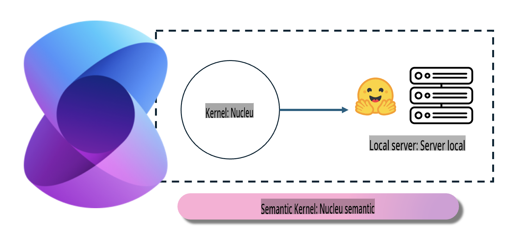
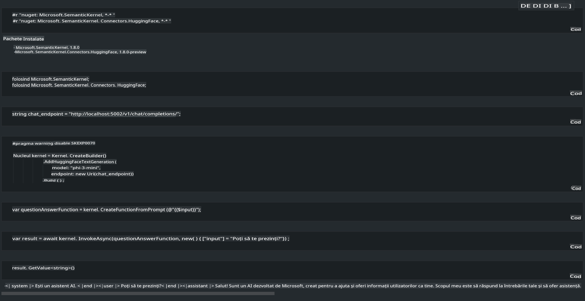

# **Inferența Phi-3 pe un Server Local**

Putem implementa Phi-3 pe un server local. Utilizatorii pot alege soluțiile [Ollama](https://ollama.com) sau [LM Studio](https://llamaedge.com) sau pot scrie propriul lor cod. Serviciile locale Phi-3 pot fi conectate prin [Semantic Kernel](https://github.com/microsoft/semantic-kernel?WT.mc_id=aiml-138114-kinfeylo) sau [Langchain](https://www.langchain.com/) pentru a construi aplicații de tip Copilot.

## **Utilizarea Semantic Kernel pentru a accesa Phi-3-mini**

În aplicațiile Copilot, creăm aplicații prin Semantic Kernel / LangChain. Acest tip de cadru de aplicație este în general compatibil cu Azure OpenAI Service / modelele OpenAI și poate sprijini, de asemenea, modele open-source de pe Hugging Face și modele locale. Ce trebuie să facem dacă vrem să folosim Semantic Kernel pentru a accesa Phi-3-mini? Folosind .NET ca exemplu, putem combina acest cadru cu Hugging Face Connector în Semantic Kernel. Implicit, acesta poate corespunde unui model id de pe Hugging Face (la prima utilizare, modelul va fi descărcat de pe Hugging Face, ceea ce durează mult timp). De asemenea, se poate conecta la serviciul local construit. Comparând cele două opțiuni, recomandăm utilizarea celei de-a doua, deoarece oferă un grad mai mare de autonomie, în special în aplicațiile pentru întreprinderi.

Din imagine, accesarea serviciilor locale prin Semantic Kernel permite conectarea ușoară la serverul de model Phi-3-mini construit local. Mai jos este rezultatul rulării.

***Cod Exemplu*** https://github.com/kinfey/Phi3MiniSamples/tree/main/semantickernel

**Declinarea responsabilității**:  
Acest document a fost tradus utilizând servicii de traducere automată bazate pe inteligență artificială. Deși depunem eforturi pentru a asigura acuratețea, vă rugăm să aveți în vedere că traducerile automate pot conține erori sau inexactități. Documentul original în limba sa maternă ar trebui considerat sursa autoritară. Pentru informații critice, se recomandă traducerea realizată de un traducător uman profesionist. Nu ne asumăm răspunderea pentru eventualele neînțelegeri sau interpretări greșite care ar putea rezulta din utilizarea acestei traduceri.