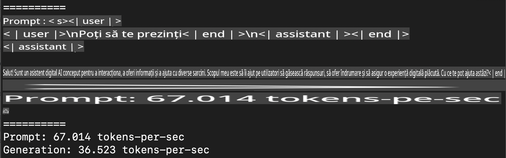
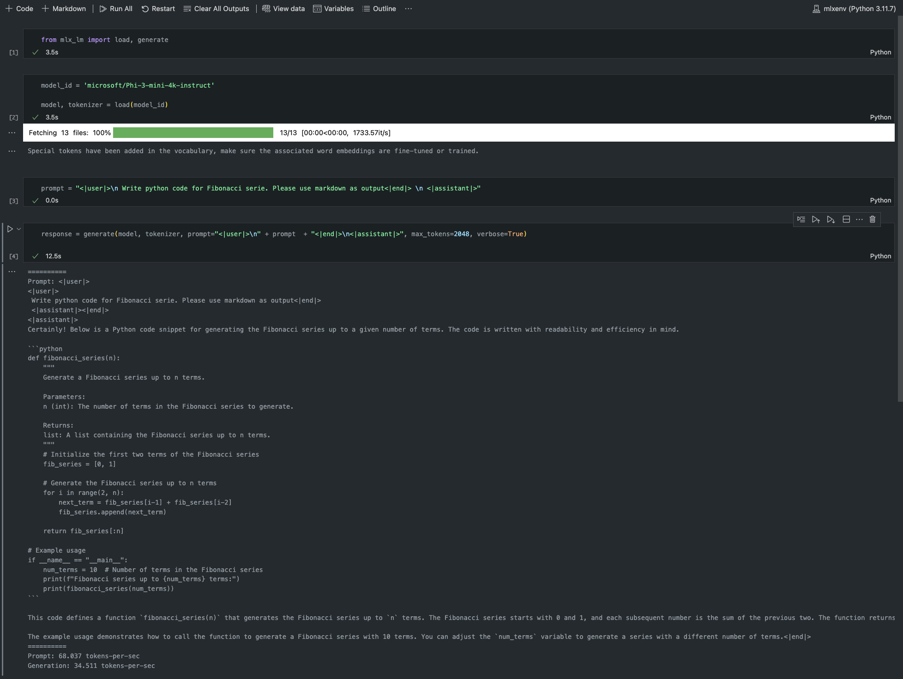

# **Inferența Phi-3 cu cadrul Apple MLX**

## **Ce este cadrul MLX**

MLX este un framework pentru cercetarea în domeniul învățării automate pe dispozitivele Apple Silicon, dezvoltat de echipa de cercetare Apple în domeniul învățării automate.

MLX este creat de cercetători în învățare automată pentru cercetători în învățare automată. Framework-ul este conceput să fie ușor de utilizat, dar în același timp eficient pentru antrenarea și implementarea modelelor. Design-ul framework-ului este, de asemenea, simplu din punct de vedere conceptual. Scopul este să le fie ușor cercetătorilor să extindă și să îmbunătățească MLX, astfel încât să poată explora rapid idei noi.

LLM-urile pot fi accelerate pe dispozitivele Apple Silicon folosind MLX, iar modelele pot fi rulate local foarte convenabil.

## **Utilizarea MLX pentru inferența Phi-3-mini**

### **1. Configurarea mediului MLX**

1. Python 3.11.x  
2. Instalarea bibliotecii MLX  

```bash

pip install mlx-lm

```

### **2. Rularea Phi-3-mini în Terminal cu MLX**

```bash

python -m mlx_lm.generate --model microsoft/Phi-3-mini-4k-instruct --max-token 2048 --prompt  "<|user|>\nCan you introduce yourself<|end|>\n<|assistant|>"

```

Rezultatul (mediul meu este Apple M1 Max, 64GB) este:



### **3. Cuantizarea Phi-3-mini cu MLX în Terminal**

```bash

python -m mlx_lm.convert --hf-path microsoft/Phi-3-mini-4k-instruct

```

***Notă：*** Modelul poate fi cuantizat folosind mlx_lm.convert, iar cuantizarea implicită este INT4. Acest exemplu cuantizează Phi-3-mini în INT4.

Modelul poate fi cuantizat folosind mlx_lm.convert, iar cuantizarea implicită este INT4. Acest exemplu cuantizează Phi-3-mini în INT4. După cuantizare, modelul va fi stocat în directorul implicit ./mlx_model.

Putem testa modelul cuantizat cu MLX din terminal.

```bash

python -m mlx_lm.generate --model ./mlx_model/ --max-token 2048 --prompt  "<|user|>\nCan you introduce yourself<|end|>\n<|assistant|>"

```

Rezultatul este:


### **4. Rularea Phi-3-mini cu MLX în Jupyter Notebook**



***Notă:*** Vă rugăm să consultați acest exemplu [click acest link](../../../../../code/03.Inference/MLX/MLX_DEMO.ipynb)

## **Resurse**

1. Aflați mai multe despre cadrul Apple MLX [https://ml-explore.github.io](https://ml-explore.github.io/mlx/build/html/index.html)  

2. Repositoriu GitHub Apple MLX [https://github.com/ml-explore](https://github.com/ml-explore)  

**Declinare de responsabilitate**:  
Acest document a fost tradus utilizând servicii de traducere automată bazate pe inteligență artificială. Deși ne străduim să asigurăm acuratețea, vă rugăm să rețineți că traducerile automate pot conține erori sau inexactități. Documentul original în limba sa nativă trebuie considerat sursa autoritară. Pentru informații critice, se recomandă traducerea profesională realizată de un specialist uman. Nu ne asumăm responsabilitatea pentru eventualele neînțelegeri sau interpretări greșite care pot apărea în urma utilizării acestei traduceri.