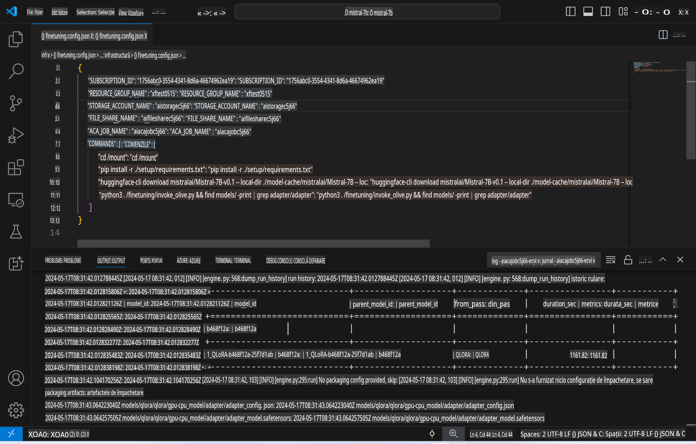
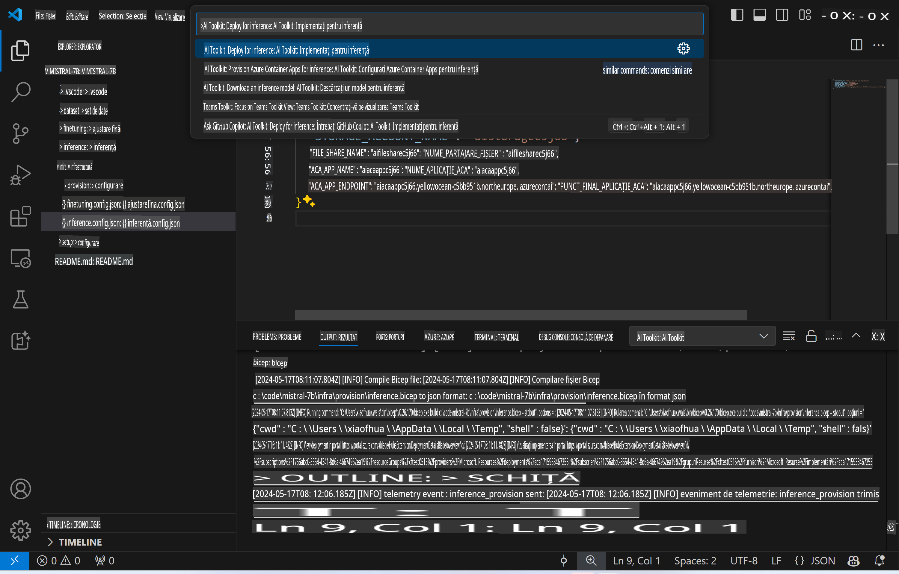

# Inferență la Distanță cu Modelul Fine-Tuned

După ce adaptoarele sunt antrenate în mediul remote, utilizați o aplicație simplă Gradio pentru a interacționa cu modelul.



### Configurarea Resurselor Azure
Trebuie să configurați Resursele Azure pentru inferența la distanță executând `AI Toolkit: Provision Azure Container Apps for inference` din paleta de comenzi. În timpul acestei configurări, vi se va cere să selectați Abonamentul Azure și grupul de resurse.  


Implicit, abonamentul și grupul de resurse pentru inferență ar trebui să fie aceleași cu cele utilizate pentru fine-tuning. Inferența va folosi același mediu Azure Container App și va accesa modelul și adaptorul modelului stocate în Azure Files, generate în timpul pasului de fine-tuning.

## Utilizarea AI Toolkit

### Implementare pentru Inferență
Dacă doriți să revizuiți codul de inferență sau să reîncărcați modelul de inferență, executați comanda `AI Toolkit: Deploy for inference`. Aceasta va sincroniza cel mai recent cod cu ACA și va reporni replica.



După finalizarea cu succes a implementării, modelul este acum pregătit pentru evaluare folosind acest endpoint.

### Accesarea API-ului de Inferență

Puteți accesa API-ul de inferență făcând clic pe butonul "*Go to Inference Endpoint*" afișat în notificarea VSCode. Alternativ, endpoint-ul web API poate fi găsit sub `ACA_APP_ENDPOINT` în `./infra/inference.config.json` și în panoul de ieșire.


> **Notă:** Endpoint-ul de inferență poate necesita câteva minute pentru a deveni complet operațional.

## Componentele de Inferență Incluse în Șablon

| Folder | Conținut |
| ------ |--------- |
| `infra` | Conține toate configurațiile necesare pentru operațiuni remote. |
| `infra/provision/inference.parameters.json` | Conține parametrii pentru șabloanele bicep, utilizate pentru configurarea resurselor Azure pentru inferență. |
| `infra/provision/inference.bicep` | Conține șabloane pentru configurarea resurselor Azure pentru inferență. |
| `infra/inference.config.json` | Fișierul de configurare, generat de comanda `AI Toolkit: Provision Azure Container Apps for inference`. Este utilizat ca intrare pentru alte comenzi din paleta remote. |

### Utilizarea AI Toolkit pentru Configurarea Resurselor Azure
Configurați [AI Toolkit](https://marketplace.visualstudio.com/items?itemName=ms-windows-ai-studio.windows-ai-studio)

Configurați Azure Container Apps pentru inferență` command.

You can find configuration parameters in `./infra/provision/inference.parameters.json` file. Here are the details:
| Parameter | Description |
| --------- |------------ |
| `defaultCommands` | This is the commands to initiate a web API. |
| `maximumInstanceCount` | This parameter sets the maximum capacity of GPU instances. |
| `location` | This is the location where Azure resources are provisioned. The default value is the same as the chosen resource group's location. |
| `storageAccountName`, `fileShareName` `acaEnvironmentName`, `acaEnvironmentStorageName`, `acaAppName`,  `acaLogAnalyticsName` | These parameters are used to name the Azure resources for provision. By default, they will be same to the fine-tuning resource name. You can input a new, unused resource name to create your own custom-named resources, or you can input the name of an already existing Azure resource if you'd prefer to use that. For details, refer to the section [Using existing Azure Resources](../../../../../md/01.Introduction/03). |

### Using Existing Azure Resources

By default, the inference provision use the same Azure Container App Environment, Storage Account, Azure File Share, and Azure Log Analytics that were used for fine-tuning. A separate Azure Container App is created solely for the inference API. 

If you have customized the Azure resources during the fine-tuning step or want to use your own existing Azure resources for inference, specify their names in the `./infra/inference.parameters.json`. Apoi, rulați comanda `AI Toolkit: Provision Azure Container Apps for inference` din paleta de comenzi. Aceasta va actualiza resursele specificate și va crea orice resurse lipsă.

De exemplu, dacă aveți un mediu Azure container existent, fișierul `./infra/finetuning.parameters.json` ar trebui să arate astfel:

```json
{
    "$schema": "https://schema.management.azure.com/schemas/2019-04-01/deploymentParameters.json#",
    "contentVersion": "1.0.0.0",
    "parameters": {
      ...
      "acaEnvironmentName": {
        "value": "<your-aca-env-name>"
      },
      "acaEnvironmentStorageName": {
        "value": null
      },
      ...
    }
  }
```

### Configurare Manuală
Dacă preferați să configurați manual resursele Azure, puteți folosi fișierele bicep furnizate în `./infra/provision` folders. If you have already set up and configured all the Azure resources without using the AI Toolkit command palette, you can simply enter the resource names in the `inference.config.json`.

De exemplu:

```json
{
  "SUBSCRIPTION_ID": "<your-subscription-id>",
  "RESOURCE_GROUP_NAME": "<your-resource-group-name>",
  "STORAGE_ACCOUNT_NAME": "<your-storage-account-name>",
  "FILE_SHARE_NAME": "<your-file-share-name>",
  "ACA_APP_NAME": "<your-aca-name>",
  "ACA_APP_ENDPOINT": "<your-aca-endpoint>"
}
```

**Declinarea responsabilității**:  
Acest document a fost tradus folosind servicii de traducere bazate pe inteligență artificială. Deși depunem eforturi pentru acuratețe, vă rugăm să rețineți că traducerile automate pot conține erori sau inexactități. Documentul original, în limba sa natală, trebuie considerat sursa autoritară. Pentru informații critice, se recomandă traducerea profesională realizată de un specialist. Nu ne asumăm răspunderea pentru eventualele neînțelegeri sau interpretări greșite care pot apărea în urma utilizării acestei traduceri.