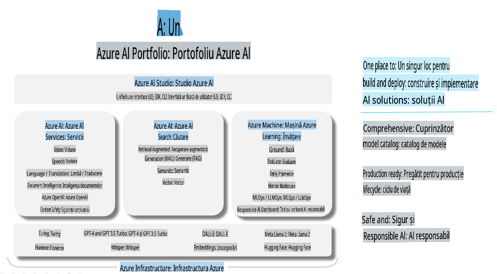

# **Utilizarea Azure AI Foundry pentru evaluare**

Cum să evaluați aplicația dvs. de AI generativ folosind [Azure AI Foundry](https://ai.azure.com?WT.mc_id=aiml-138114-kinfeylo). Indiferent dacă evaluați conversații simple sau complexe, Azure AI Foundry oferă instrumente pentru a analiza performanța și siguranța modelului.

## Cum să evaluați aplicațiile AI generative cu Azure AI Foundry
Pentru instrucțiuni detaliate, consultați [documentația Azure AI Foundry](https://learn.microsoft.com/azure/ai-studio/how-to/evaluate-generative-ai-app?WT.mc_id=aiml-138114-kinfeylo).

Iată pașii pentru a începe:

## Evaluarea modelelor AI generative în Azure AI Foundry

**Cerințe preliminare**

- Un set de date de testare în format CSV sau JSON.
- Un model AI generativ implementat (cum ar fi Phi-3, GPT 3.5, GPT 4 sau modelele Davinci).
- Un runtime cu o instanță de calcul pentru a rula evaluarea.

## Metrici de evaluare integrate

Azure AI Foundry vă permite să evaluați atât conversații simple, cât și conversații complexe, cu mai multe schimburi.
Pentru scenarii de Generare Îmbunătățită prin Regăsire (RAG), unde modelul se bazează pe date specifice, puteți analiza performanța folosind metrici de evaluare integrate.
De asemenea, puteți evalua scenarii generale de răspuns la întrebări simple (non-RAG).

## Crearea unei sesiuni de evaluare

Din interfața Azure AI Foundry, navigați fie la pagina Evaluate, fie la pagina Prompt Flow.
Urmați asistentul pentru crearea evaluării pentru a configura o sesiune de evaluare. Oferiți un nume opțional pentru evaluarea dvs.
Selectați scenariul care se aliniază obiectivelor aplicației dvs.
Alegeți una sau mai multe metrici de evaluare pentru a analiza rezultatele modelului.

## Flux personalizat de evaluare (opțional)

Pentru mai multă flexibilitate, puteți stabili un flux personalizat de evaluare. Personalizați procesul de evaluare în funcție de cerințele dvs. specifice.

## Vizualizarea rezultatelor

După rularea evaluării, înregistrați, vizualizați și analizați metricile detaliate de evaluare în Azure AI Foundry. Obțineți informații despre capacitățile și limitările aplicației dvs.

**Notă** Azure AI Foundry este în prezent în versiune publică de previzualizare, așa că utilizați-l pentru scopuri de experimentare și dezvoltare. Pentru sarcini de producție, luați în considerare alte opțiuni. Explorați [documentația oficială AI Foundry](https://learn.microsoft.com/azure/ai-studio/?WT.mc_id=aiml-138114-kinfeylo) pentru mai multe detalii și instrucțiuni pas cu pas.

**Declinarea responsabilității**:  
Acest document a fost tradus utilizând servicii de traducere bazate pe inteligență artificială. Deși ne străduim să asigurăm acuratețea, vă rugăm să aveți în vedere că traducerile automate pot conține erori sau inexactități. Documentul original în limba sa natală ar trebui considerat sursa autoritară. Pentru informații critice, se recomandă traducerea profesională realizată de un specialist. Nu ne asumăm răspunderea pentru neînțelegeri sau interpretări greșite care pot apărea din utilizarea acestei traduceri.