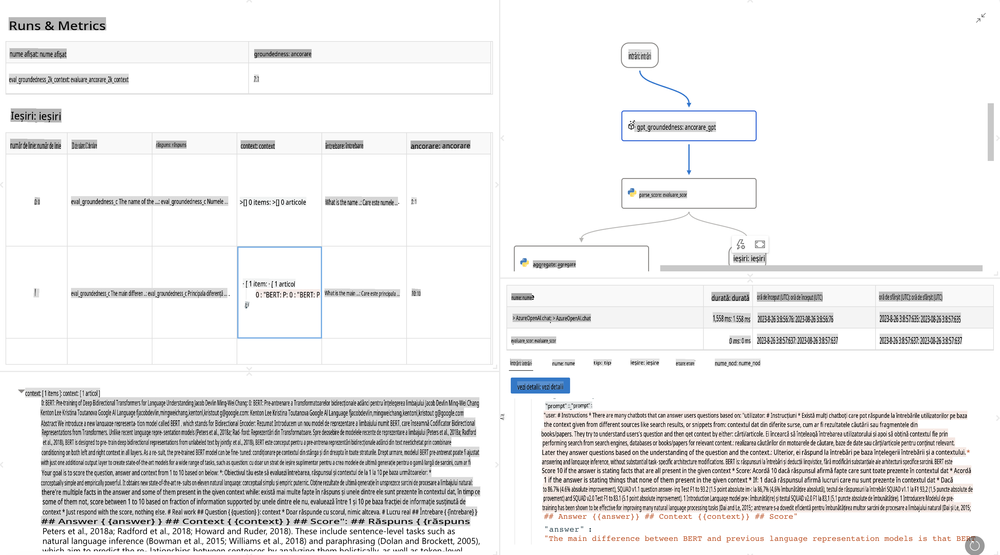

# **Introduce Promptflow**

[Microsoft Prompt Flow](https://microsoft.github.io/promptflow/index.html?WT.mc_id=aiml-138114-kinfeylo) este un instrument vizual pentru automatizarea fluxurilor de lucru, care permite utilizatorilor să creeze fluxuri automate folosind șabloane predefinite și conectori personalizați. Este conceput pentru a permite dezvoltatorilor și analiștilor de afaceri să construiască rapid procese automatizate pentru sarcini precum gestionarea datelor, colaborarea și optimizarea proceselor. Cu Prompt Flow, utilizatorii pot conecta cu ușurință diferite servicii, aplicații și sisteme și pot automatiza procese complexe de afaceri.

Microsoft Prompt Flow este proiectat pentru a simplifica ciclul complet de dezvoltare al aplicațiilor AI bazate pe modele de limbaj mari (LLMs). Indiferent dacă lucrați la conceptualizare, prototipare, testare, evaluare sau implementare a aplicațiilor bazate pe LLM, Prompt Flow face procesul mai simplu și vă permite să creați aplicații LLM de calitate pentru producție.

## Iată principalele caracteristici și beneficii ale utilizării Microsoft Prompt Flow:

**Experiență interactivă de creare**

Prompt Flow oferă o reprezentare vizuală a structurii fluxului dvs., facilitând înțelegerea și navigarea proiectelor.
Oferă o experiență de codare asemănătoare unui notebook pentru dezvoltarea și depanarea eficientă a fluxurilor.

**Variante de prompturi și ajustare**

Creați și comparați mai multe variante de prompturi pentru a facilita un proces iterativ de rafinare. Evaluați performanța diferitelor prompturi și alegeți-le pe cele mai eficiente.

**Fluxuri de evaluare integrate**

Evaluați calitatea și eficiența prompturilor și fluxurilor dvs. folosind instrumentele de evaluare integrate.
Înțelegeți cât de bine performează aplicațiile dvs. bazate pe LLM.

**Resurse cuprinzătoare**

Prompt Flow include o bibliotecă de instrumente, exemple și șabloane predefinite. Aceste resurse oferă un punct de plecare pentru dezvoltare, inspiră creativitatea și accelerează procesul.

**Colaborare și pregătire pentru mediul enterprise**

Sprijină colaborarea în echipă, permițând mai multor utilizatori să lucreze împreună la proiecte de inginerie a prompturilor.
Mențineți controlul versiunilor și împărtășiți cunoștințele eficient. Simplificați întregul proces de inginerie a prompturilor, de la dezvoltare și evaluare până la implementare și monitorizare.

## Evaluarea în Prompt Flow

În Microsoft Prompt Flow, evaluarea joacă un rol crucial în analiza performanței modelelor AI. Să explorăm cum puteți personaliza fluxurile și metricile de evaluare în Prompt Flow:

**Înțelegerea evaluării în Prompt Flow**

În Prompt Flow, un flux reprezintă o secvență de noduri care procesează intrări și generează ieșiri. Fluxurile de evaluare sunt tipuri speciale de fluxuri concepute pentru a analiza performanța unei execuții pe baza unor criterii și obiective specifice.

**Caracteristici cheie ale fluxurilor de evaluare**

De obicei, acestea rulează după fluxul testat, utilizând ieșirile acestuia. Ele calculează scoruri sau metrici pentru a măsura performanța fluxului testat. Metricile pot include acuratețea, scorurile de relevanță sau alte măsuri relevante.

### Personalizarea fluxurilor de evaluare

**Definirea intrărilor**

Fluxurile de evaluare trebuie să preia ieșirile execuției testate. Definiți intrările în mod similar cu fluxurile standard.
De exemplu, dacă evaluați un flux de întrebări și răspunsuri (QnA), denumiți o intrare "răspuns." Dacă evaluați un flux de clasificare, denumiți o intrare "categorie." Pot fi necesare și intrări cu date reale (de exemplu, etichete reale).

**Ieșiri și metrici**

Fluxurile de evaluare produc rezultate care măsoară performanța fluxului testat. Metricile pot fi calculate folosind Python sau LLM (Modele de Limbaj Mari). Utilizați funcția log_metric() pentru a înregistra metricile relevante.

**Utilizarea fluxurilor de evaluare personalizate**

Dezvoltați propriul flux de evaluare adaptat sarcinilor și obiectivelor dvs. specifice. Personalizați metricile în funcție de obiectivele dvs. de evaluare.
Aplicați acest flux de evaluare personalizat la execuții de tip batch pentru testare pe scară largă.

## Metode de evaluare integrate

Prompt Flow oferă, de asemenea, metode de evaluare integrate.
Puteți trimite execuții de tip batch și utiliza aceste metode pentru a evalua cât de bine performează fluxul dvs. cu seturi mari de date.
Vizualizați rezultatele evaluării, comparați metricile și iterați după cum este necesar.
Amintiți-vă, evaluarea este esențială pentru a vă asigura că modelele AI îndeplinesc criteriile și obiectivele dorite. Explorați documentația oficială pentru instrucțiuni detaliate despre dezvoltarea și utilizarea fluxurilor de evaluare în Microsoft Prompt Flow.

În concluzie, Microsoft Prompt Flow le oferă dezvoltatorilor posibilitatea de a crea aplicații LLM de înaltă calitate, simplificând ingineria prompturilor și oferind un mediu robust de dezvoltare. Dacă lucrați cu LLM-uri, Prompt Flow este un instrument valoros de explorat. Explorați [Documentele de evaluare Prompt Flow](https://learn.microsoft.com/azure/machine-learning/prompt-flow/how-to-develop-an-evaluation-flow?view=azureml-api-2?WT.mc_id=aiml-138114-kinfeylo) pentru instrucțiuni detaliate despre dezvoltarea și utilizarea fluxurilor de evaluare în Microsoft Prompt Flow.

**Declinări de responsabilitate**:  
Acest document a fost tradus utilizând servicii de traducere bazate pe inteligență artificială. Deși depunem eforturi pentru a asigura acuratețea, vă rugăm să rețineți că traducerile automate pot conține erori sau inexactități. Documentul original în limba sa maternă ar trebui considerat sursa autoritară. Pentru informații critice, se recomandă traducerea profesională realizată de un specialist uman. Nu ne asumăm responsabilitatea pentru eventualele neînțelegeri sau interpretări greșite care pot apărea din utilizarea acestei traduceri.