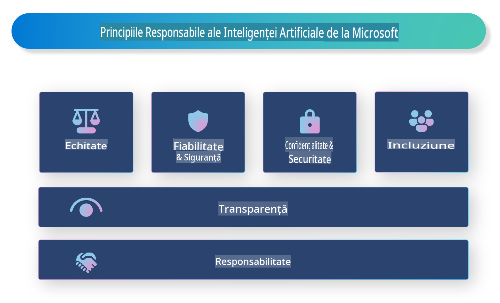

# **Introduceți Inteligența Artificială Responsabilă**

[Microsoft Responsible AI](https://www.microsoft.com/ai/responsible-ai?WT.mc_id=aiml-138114-kinfeylo) este o inițiativă care își propune să ajute dezvoltatorii și organizațiile să construiască sisteme de inteligență artificială care să fie transparente, de încredere și responsabile. Inițiativa oferă ghiduri și resurse pentru dezvoltarea soluțiilor de inteligență artificială responsabilă, aliniate principiilor etice, cum ar fi confidențialitatea, echitatea și transparența. Vom explora, de asemenea, unele dintre provocările și cele mai bune practici asociate cu construirea sistemelor de inteligență artificială responsabilă.

## Prezentare generală a Microsoft Responsible AI

**Principii etice** 

Microsoft Responsible AI este ghidat de un set de principii etice, cum ar fi confidențialitatea, echitatea, transparența, responsabilitatea și siguranța. Aceste principii sunt concepute pentru a asigura dezvoltarea sistemelor de inteligență artificială într-un mod etic și responsabil.

**Inteligență artificială transparentă**

Microsoft Responsible AI subliniază importanța transparenței în sistemele de inteligență artificială. Aceasta include oferirea de explicații clare despre modul în care funcționează modelele de inteligență artificială, precum și asigurarea faptului că sursele de date și algoritmii sunt accesibile publicului.

**Inteligență artificială responsabilă** 

[Microsoft Responsible AI](https://www.microsoft.com/ai/responsible-ai?WT.mc_id=aiml-138114-kinfeylo) promovează dezvoltarea sistemelor de inteligență artificială responsabile, care pot oferi informații despre modul în care modelele iau decizii. Acest lucru poate ajuta utilizatorii să înțeleagă și să aibă încredere în rezultatele generate de aceste sisteme.

**Incluziune** 

Sistemele de inteligență artificială ar trebui să fie concepute pentru a aduce beneficii tuturor. Microsoft își propune să creeze inteligență artificială incluzivă, care să ia în considerare perspective diverse și să evite prejudecățile sau discriminarea.

**Fiabilitate și siguranță**

Asigurarea faptului că sistemele de inteligență artificială sunt fiabile și sigure este esențială. Microsoft se concentrează pe construirea unor modele robuste care funcționează constant și evită rezultatele dăunătoare.

**Echitate în inteligența artificială** 

Microsoft Responsible AI recunoaște că sistemele de inteligență artificială pot perpetua prejudecăți dacă sunt antrenate pe date sau algoritmi părtinitori. Inițiativa oferă ghiduri pentru dezvoltarea unor sisteme de inteligență artificială echitabile, care nu discriminează pe baza unor factori precum rasa, genul sau vârsta.

**Confidențialitate și securitate** 

Microsoft Responsible AI subliniază importanța protejării confidențialității utilizatorilor și securității datelor în sistemele de inteligență artificială. Acest lucru include implementarea unor măsuri puternice de criptare a datelor și controale de acces, precum și auditarea regulată a sistemelor pentru a identifica vulnerabilitățile.

**Responsabilitate și asumare** 

Microsoft Responsible AI promovează responsabilitatea și asumarea în dezvoltarea și implementarea inteligenței artificiale. Acest lucru include asigurarea faptului că dezvoltatorii și organizațiile sunt conștienți de riscurile potențiale asociate cu sistemele de inteligență artificială și iau măsuri pentru a le reduce.

## Cele mai bune practici pentru construirea sistemelor de inteligență artificială responsabilă

**Dezvoltați modele de inteligență artificială folosind seturi de date diverse** 

Pentru a evita părtinirile în sistemele de inteligență artificială, este important să folosiți seturi de date diverse, care să reprezinte o gamă variată de perspective și experiențe.

**Utilizați tehnici de inteligență artificială explicabilă** 

Tehnicile de inteligență artificială explicabilă pot ajuta utilizatorii să înțeleagă modul în care modelele iau decizii, ceea ce poate crește încrederea în sistem.

**Auditați regulat sistemele de inteligență artificială pentru vulnerabilități** 

Auditările regulate ale sistemelor de inteligență artificială pot ajuta la identificarea riscurilor și vulnerabilităților care trebuie abordate.

**Implementați criptarea puternică a datelor și controale de acces** 

Criptarea datelor și controalele de acces pot ajuta la protejarea confidențialității și securității utilizatorilor în sistemele de inteligență artificială.

**Respectați principiile etice în dezvoltarea inteligenței artificiale** 

Respectarea principiilor etice, cum ar fi echitatea, transparența și responsabilitatea, poate contribui la crearea încrederii în sistemele de inteligență artificială și la asigurarea dezvoltării acestora într-un mod responsabil.

## Utilizarea AI Foundry pentru Inteligența Artificială Responsabilă 

[Azure AI Foundry](https://ai.azure.com?WT.mc_id=aiml-138114-kinfeylo) este o platformă puternică ce permite dezvoltatorilor și organizațiilor să creeze rapid aplicații inteligente, inovatoare, pregătite pentru piață și responsabile. Iată câteva dintre caracteristicile și capabilitățile cheie ale Azure AI Foundry:

**API-uri și modele predefinite** 

Azure AI Foundry oferă API-uri și modele preconstruite și personalizabile. Acestea acoperă o gamă largă de sarcini de inteligență artificială, inclusiv inteligență artificială generativă, procesare a limbajului natural pentru conversații, căutare, monitorizare, traducere, vorbire, viziune și luare de decizii.

**Prompt Flow** 

Prompt flow în Azure AI Foundry vă permite să creați experiențe de inteligență artificială conversațională. Vă oferă posibilitatea de a proiecta și gestiona fluxuri conversaționale, facilitând construirea chatbot-urilor, asistenților virtuali și altor aplicații interactive.

**Retrieval Augmented Generation (RAG)** 

RAG este o tehnică care combină abordările bazate pe regăsire și cele generative. Aceasta îmbunătățește calitatea răspunsurilor generate, utilizând atât cunoștințe preexistente (regăsire), cât și generare creativă (generare).

**Metrice de evaluare și monitorizare pentru inteligența artificială generativă** 

Azure AI Foundry oferă instrumente pentru evaluarea și monitorizarea modelelor de inteligență artificială generativă. Puteți analiza performanța, echitatea și alte metrice importante pentru a asigura o implementare responsabilă. De asemenea, dacă ați creat un tablou de bord, puteți utiliza interfața fără cod din Azure Machine Learning Studio pentru a personaliza și genera un Responsible AI Dashboard și o fișă de evaluare asociată, bazate pe librăriile Python din [Responsible AI Toolbox](https://responsibleaitoolbox.ai/?WT.mc_id=aiml-138114-kinfeylo). Această fișă ajută la partajarea informațiilor cheie legate de echitate, importanța caracteristicilor și alte considerații privind implementarea responsabilă, atât cu părțile interesate tehnice, cât și non-tehnice.

Pentru a utiliza AI Foundry cu inteligența artificială responsabilă, puteți urma aceste bune practici:

**Definiți problema și obiectivele sistemului de inteligență artificială**

Înainte de a începe procesul de dezvoltare, este important să definiți clar problema sau obiectivul pe care sistemul dvs. de inteligență artificială dorește să îl rezolve. Acest lucru vă va ajuta să identificați datele, algoritmii și resursele necesare pentru a construi un model eficient.

**Colectați și preprocesați date relevante** 

Calitatea și cantitatea datelor utilizate pentru antrenarea unui sistem de inteligență artificială pot avea un impact semnificativ asupra performanței acestuia. Prin urmare, este important să colectați date relevante, să le curățați, să le preprocesați și să vă asigurați că sunt reprezentative pentru populația sau problema pe care încercați să o rezolvați.

**Alegeți algoritmi de evaluare adecvați** 

Există diverse algoritmi de evaluare disponibili. Este important să alegeți algoritmul cel mai potrivit în funcție de datele și problema dvs.

**Evaluați și interpretați modelul** 

Odată ce ați construit un model de inteligență artificială, este important să îi evaluați performanța folosind metrici adecvate și să interpretați rezultatele într-un mod transparent. Acest lucru vă va ajuta să identificați orice prejudecăți sau limitări ale modelului și să faceți îmbunătățiri acolo unde este necesar.

**Asigurați transparența și explicabilitatea** 

Sistemele de inteligență artificială ar trebui să fie transparente și explicabile, astfel încât utilizatorii să înțeleagă cum funcționează și cum sunt luate deciziile. Acest lucru este deosebit de important pentru aplicațiile care au un impact semnificativ asupra vieților oamenilor, cum ar fi sănătatea, finanțele și sistemele juridice.

**Monitorizați și actualizați modelul** 

Sistemele de inteligență artificială ar trebui să fie monitorizate și actualizate continuu pentru a se asigura că rămân precise și eficiente în timp. Acest lucru necesită întreținere, testare și reantrenare continuă a modelului.

În concluzie, Microsoft Responsible AI este o inițiativă care își propune să ajute dezvoltatorii și organizațiile să construiască sisteme de inteligență artificială care să fie transparente, de încredere și responsabile. Amintiți-vă că implementarea responsabilă a inteligenței artificiale este esențială, iar Azure AI Foundry își propune să facă acest lucru practic pentru organizații. Urmând principiile etice și cele mai bune practici, putem asigura dezvoltarea și implementarea sistemelor de inteligență artificială într-un mod responsabil, care să aducă beneficii societății în ansamblu.

**Declinarea responsabilității**:  
Acest document a fost tradus folosind servicii de traducere bazate pe inteligență artificială. Deși ne străduim să asigurăm acuratețea, vă rugăm să aveți în vedere că traducerile automate pot conține erori sau inexactități. Documentul original în limba sa natală ar trebui considerat sursa autoritară. Pentru informații critice, se recomandă traducerea profesională realizată de un specialist. Nu ne asumăm răspunderea pentru neînțelegeri sau interpretări greșite care pot apărea din utilizarea acestei traduceri.