# Evaluează Modelul Fine-tuned Phi-3 / Phi-3.5 în Azure AI Foundry, Concentrându-te pe Principiile de AI Responsabil ale Microsoft

Acest exemplu complet (E2E) se bazează pe ghidul "[Evaluate Fine-tuned Phi-3 / 3.5 Models in Azure AI Foundry Focusing on Microsoft's Responsible AI](https://techcommunity.microsoft.com/t5/educator-developer-blog/evaluate-fine-tuned-phi-3-3-5-models-in-azure-ai-studio-focusing/ba-p/4227850?WT.mc_id=aiml-137032-kinfeylo)" din Microsoft Tech Community.

## Prezentare generală

### Cum poți evalua siguranța și performanța unui model fine-tuned Phi-3 / Phi-3.5 în Azure AI Foundry?

Fine-tuning-ul unui model poate duce uneori la răspunsuri neintenționate sau nedorite. Pentru a asigura că modelul rămâne sigur și eficient, este important să evaluezi potențialul acestuia de a genera conținut dăunător și abilitatea sa de a produce răspunsuri precise, relevante și coerente. În acest tutorial, vei învăța cum să evaluezi siguranța și performanța unui model fine-tuned Phi-3 / Phi-3.5 integrat cu Prompt flow în Azure AI Foundry.

Iată procesul de evaluare al Azure AI Foundry.

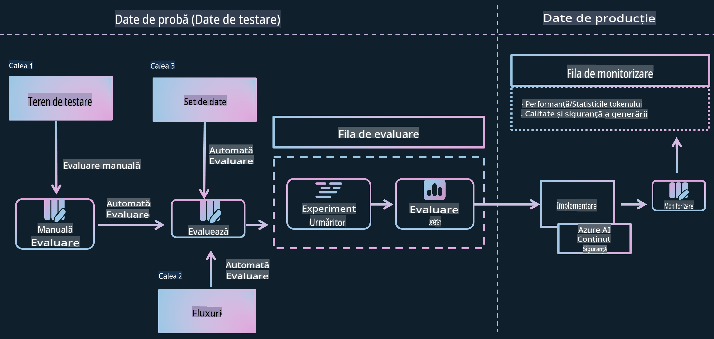

*Sursă imagine: [Evaluation of generative AI applications](https://learn.microsoft.com/azure/ai-studio/concepts/evaluation-approach-gen-ai?wt.mc_id%3Dstudentamb_279723)*

> [!NOTE]
>
> Pentru informații mai detaliate și resurse suplimentare despre Phi-3 / Phi-3.5, vizitează [Phi-3CookBook](https://github.com/microsoft/Phi-3CookBook?wt.mc_id=studentamb_279723).

### Cerințe preliminare

- [Python](https://www.python.org/downloads)
- [Abonament Azure](https://azure.microsoft.com/free?wt.mc_id=studentamb_279723)
- [Visual Studio Code](https://code.visualstudio.com)
- Model fine-tuned Phi-3 / Phi-3.5

### Cuprins

1. [**Scenariul 1: Introducere în evaluarea Prompt flow din Azure AI Foundry**](../../../../../../md/02.Application/01.TextAndChat/Phi3)

    - [Introducere în evaluarea siguranței](../../../../../../md/02.Application/01.TextAndChat/Phi3)
    - [Introducere în evaluarea performanței](../../../../../../md/02.Application/01.TextAndChat/Phi3)

1. [**Scenariul 2: Evaluarea modelului Phi-3 / Phi-3.5 în Azure AI Foundry**](../../../../../../md/02.Application/01.TextAndChat/Phi3)

    - [Înainte de a începe](../../../../../../md/02.Application/01.TextAndChat/Phi3)
    - [Deplasează Azure OpenAI pentru a evalua modelul Phi-3 / Phi-3.5](../../../../../../md/02.Application/01.TextAndChat/Phi3)
    - [Evaluează modelul fine-tuned Phi-3 / Phi-3.5 folosind evaluarea Prompt flow din Azure AI Foundry](../../../../../../md/02.Application/01.TextAndChat/Phi3)

1. [Felicitări!](../../../../../../md/02.Application/01.TextAndChat/Phi3)

## **Scenariul 1: Introducere în evaluarea Prompt flow din Azure AI Foundry**

### Introducere în evaluarea siguranței

Pentru a te asigura că modelul tău AI este etic și sigur, este esențial să îl evaluezi conform Principiilor de AI Responsabil ale Microsoft. În Azure AI Foundry, evaluările de siguranță îți permit să analizezi vulnerabilitatea modelului la atacuri de tip jailbreak și potențialul său de a genera conținut dăunător, ceea ce este în conformitate cu aceste principii.

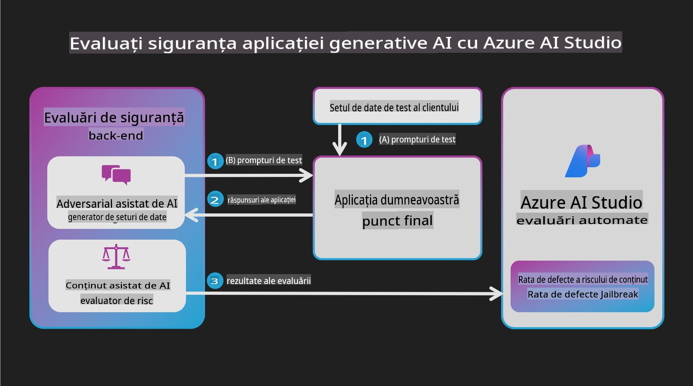

*Sursă imagine: [Evaluation of generative AI applications](https://learn.microsoft.com/azure/ai-studio/concepts/evaluation-approach-gen-ai?wt.mc_id%3Dstudentamb_279723)*

#### Principiile de AI Responsabil ale Microsoft

Înainte de a începe pașii tehnici, este esențial să înțelegi Principiile de AI Responsabil ale Microsoft, un cadru etic conceput pentru a ghida dezvoltarea, implementarea și operarea responsabilă a sistemelor AI. Aceste principii ghidează proiectarea, dezvoltarea și implementarea responsabilă a sistemelor AI, asigurând că tehnologiile AI sunt construite într-un mod echitabil, transparent și incluziv. Aceste principii stau la baza evaluării siguranței modelelor AI.

Principiile de AI Responsabil ale Microsoft includ:

- **Echitate și Incluziune**: Sistemele AI ar trebui să trateze pe toată lumea în mod echitabil și să evite să afecteze grupuri similare de persoane în moduri diferite. De exemplu, atunci când sistemele AI oferă recomandări privind tratamente medicale, aplicații pentru împrumuturi sau angajare, acestea ar trebui să facă aceleași recomandări pentru toți cei care au simptome, circumstanțe financiare sau calificări profesionale similare.

- **Fiabilitate și Siguranță**: Pentru a construi încredere, este esențial ca sistemele AI să funcționeze fiabil, sigur și constant. Aceste sisteme ar trebui să fie capabile să opereze conform proiectării inițiale, să răspundă în siguranță la condiții neprevăzute și să reziste manipulărilor dăunătoare.

- **Transparență**: Atunci când sistemele AI contribuie la decizii care au un impact semnificativ asupra vieții oamenilor, este esențial ca oamenii să înțeleagă cum au fost luate acele decizii.

- **Confidențialitate și Securitate**: Pe măsură ce AI devine mai răspândită, protejarea confidențialității și securizarea informațiilor personale și de afaceri devin mai importante și mai complexe.

- **Responsabilitate**: Cei care proiectează și implementează sisteme AI trebuie să fie responsabili pentru modul în care funcționează aceste sisteme. Organizațiile ar trebui să se bazeze pe standardele industriei pentru a dezvolta norme de responsabilitate.

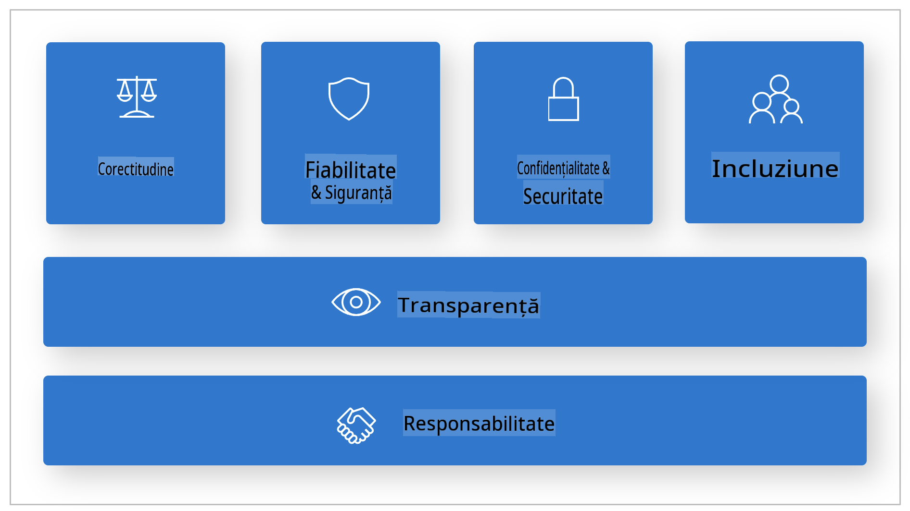

*Sursă imagine: [What is Responsible AI?](https://learn.microsoft.com/azure/machine-learning/concept-responsible-ai?view=azureml-api-2&viewFallbackFrom=azureml-api-2%253fwt.mc_id%3Dstudentamb_279723)*

> [!NOTE]
> Pentru a afla mai multe despre Principiile de AI Responsabil ale Microsoft, vizitează [What is Responsible AI?](https://learn.microsoft.com/azure/machine-learning/concept-responsible-ai?view=azureml-api-2?wt.mc_id=studentamb_279723).

#### Metrici de siguranță

În acest tutorial, vei evalua siguranța modelului fine-tuned Phi-3 folosind metricile de siguranță ale Azure AI Foundry. Aceste metrici te ajută să analizezi potențialul modelului de a genera conținut dăunător și vulnerabilitatea acestuia la atacuri de tip jailbreak. Metricile de siguranță includ:

- **Conținut legat de auto-vătămare**: Evaluează dacă modelul are tendința de a produce conținut legat de auto-vătămare.
- **Conținut urât sau nedrept**: Evaluează dacă modelul are tendința de a produce conținut urât sau nedrept.
- **Conținut violent**: Evaluează dacă modelul are tendința de a produce conținut violent.
- **Conținut sexual**: Evaluează dacă modelul are tendința de a produce conținut sexual nepotrivit.

Evaluarea acestor aspecte asigură că modelul AI nu produce conținut dăunător sau ofensator, aliniindu-se valorilor societale și standardelor de reglementare.


### Introducere în evaluarea performanței

Pentru a te asigura că modelul tău AI funcționează conform așteptărilor, este important să îi evaluezi performanța conform metricilor de performanță. În Azure AI Foundry, evaluările de performanță îți permit să analizezi eficiența modelului în generarea de răspunsuri precise, relevante și coerente.

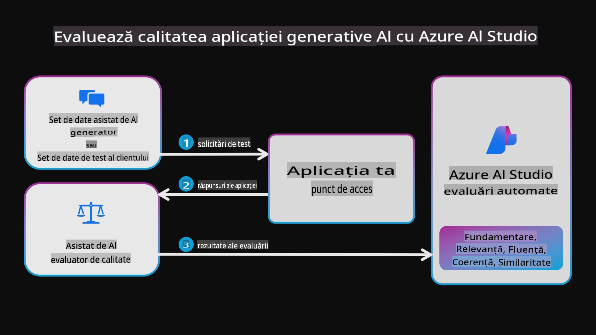

*Sursă imagine: [Evaluation of generative AI applications](https://learn.microsoft.com/azure/ai-studio/concepts/evaluation-approach-gen-ai?wt.mc_id%3Dstudentamb_279723)*

#### Metrici de performanță

În acest tutorial, vei evalua performanța modelului fine-tuned Phi-3 / Phi-3.5 folosind metricile de performanță ale Azure AI Foundry. Aceste metrici te ajută să analizezi eficiența modelului în generarea de răspunsuri precise, relevante și coerente. Metricile de performanță includ:

- **Alinierea**: Evaluează cât de bine se aliniază răspunsurile generate cu informațiile din sursa de intrare.
- **Relevanța**: Evaluează pertinența răspunsurilor generate la întrebările date.
- **Coerența**: Evaluează cât de natural curge textul generat și cât de bine seamănă cu limbajul uman.
- **Fluența**: Evaluează competența lingvistică a textului generat.
- **Similaritatea cu GPT**: Compară răspunsul generat cu adevărul de bază pentru similaritate.
- **Scorul F1**: Calculează raportul de cuvinte comune între răspunsul generat și datele sursă.

Aceste metrici te ajută să analizezi eficiența modelului în generarea de răspunsuri precise, relevante și coerente.

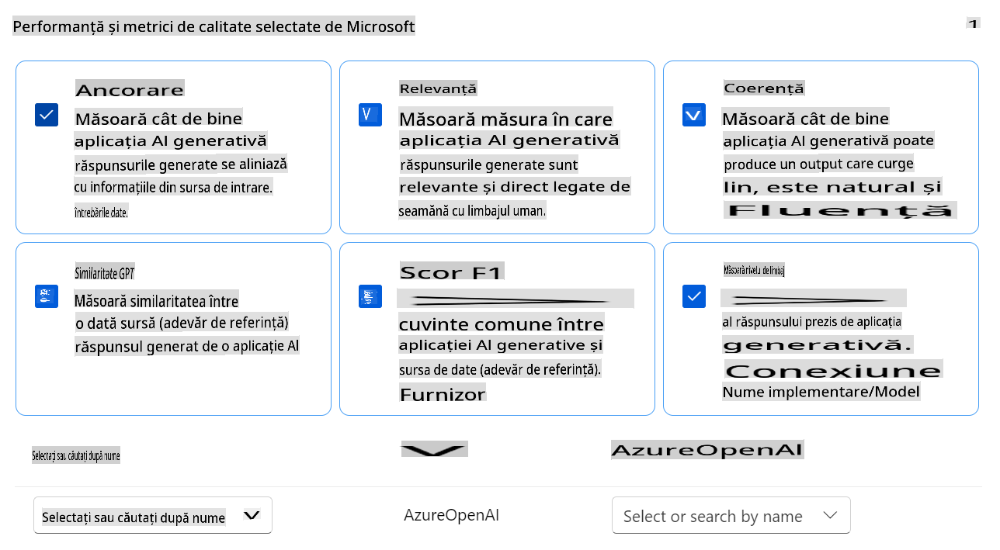

## **Scenariul 2: Evaluarea modelului Phi-3 / Phi-3.5 în Azure AI Foundry**

### Înainte de a începe

Acest tutorial este o continuare a postărilor anterioare de pe blog, "[Fine-Tune and Integrate Custom Phi-3 Models with Prompt Flow: Step-by-Step Guide](https://techcommunity.microsoft.com/t5/educator-developer-blog/fine-tune-and-integrate-custom-phi-3-models-with-prompt-flow/ba-p/4178612?wt.mc_id=studentamb_279723)" și "[Fine-Tune and Integrate Custom Phi-3 Models with Prompt Flow in Azure AI Foundry](https://techcommunity.microsoft.com/t5/educator-developer-blog/fine-tune-and-integrate-custom-phi-3-models-with-prompt-flow-in/ba-p/4191726?wt.mc_id=studentamb_279723)." În aceste postări, am parcurs procesul de fine-tuning al unui model Phi-3 / Phi-3.5 în Azure AI Foundry și integrarea acestuia cu Prompt flow.

În acest tutorial, vei implementa un model Azure OpenAI ca evaluator în Azure AI Foundry și îl vei folosi pentru a evalua modelul fine-tuned Phi-3 / Phi-3.5.

Înainte de a începe acest tutorial, asigură-te că ai următoarele cerințe preliminare, așa cum sunt descrise în tutorialele anterioare:

1. Un set de date pregătit pentru a evalua modelul fine-tuned Phi-3 / Phi-3.5.
1. Un model Phi-3 / Phi-3.5 care a fost fine-tuned și implementat în Azure Machine Learning.
1. Un Prompt flow integrat cu modelul tău fine-tuned Phi-3 / Phi-3.5 în Azure AI Foundry.

> [!NOTE]
> Vei folosi fișierul *test_data.jsonl*, aflat în folderul de date din setul de date **ULTRACHAT_200k**, descărcat în postările anterioare de pe blog, ca set de date pentru a evalua modelul fine-tuned Phi-3 / Phi-3.5.

#### Integrează modelul personalizat Phi-3 / Phi-3.5 cu Prompt flow în Azure AI Foundry (Abordare bazată pe cod)

> [!NOTE]
> Dacă ai urmat abordarea low-code descrisă în "[Fine-Tune and Integrate Custom Phi-3 Models with Prompt Flow in Azure AI Foundry](https://techcommunity.microsoft.com/t5/educator-developer-blog/fine-tune-and-integrate-custom-phi-3-models-with-prompt-flow-in/ba-p/4191726?wt.mc_id=studentamb_279723)", poți sări peste acest exercițiu și să treci la următorul.
> Totuși, dacă ai urmat abordarea bazată pe cod descrisă în "[Fine-Tune and Integrate Custom Phi-3 Models with Prompt Flow: Step-by-Step Guide](https://techcommunity.microsoft.com/t5/educator-developer-blog/fine-tune-and-integrate-custom-phi-3-models-with-prompt-flow/ba-p/4178612?wt.mc_id=studentamb_279723)" pentru a fine-tune și implementa modelul tău Phi-3 / Phi-3.5, procesul de conectare a modelului la Prompt flow este ușor diferit. Vei învăța acest proces în acest exercițiu.

Pentru a continua, trebuie să integrezi modelul tău fine-tuned Phi-3 / Phi-3.5 în Prompt flow din Azure AI Foundry.

#### Creează un Hub în Azure AI Foundry

Trebuie să creezi un Hub înainte de a crea Proiectul. Un Hub acționează ca un Grup de Resurse, permițându-ți să organizezi și să gestionezi mai multe Proiecte în Azure AI Foundry.

1. Conectează-te la [Azure AI Foundry](https://ai.azure.com/?wt.mc_id=studentamb_279723).

1. Selectează **All hubs** din bara laterală stângă.

1. Selectează **+ New hub** din meniul de navigare.

    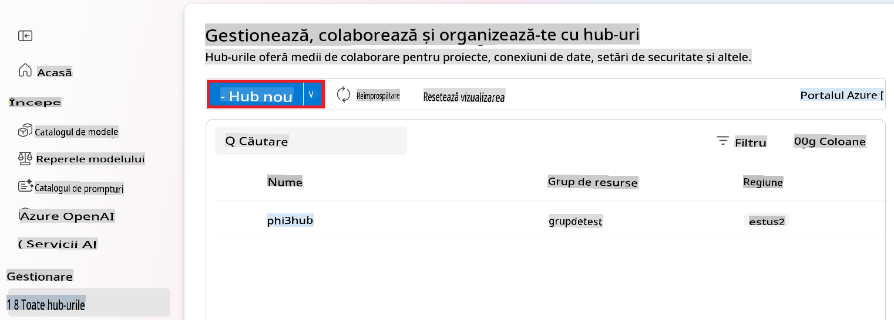

1. Realizează următoarele acțiuni:

    - Introdu **Hub name**. Acesta trebuie să fie unic.
    - Selectează abonamentul tău **Azure Subscription**.
    - Selectează **Resource group** pentru utilizare (creează unul nou, dacă este necesar).
    - Selectează locația **Location** dorită.
    - Selectează **Connect Azure AI Services** pentru utilizare (creează unul nou, dacă este necesar).
    - Selectează **Connect Azure AI Search** pentru a **Sări peste conectare**.
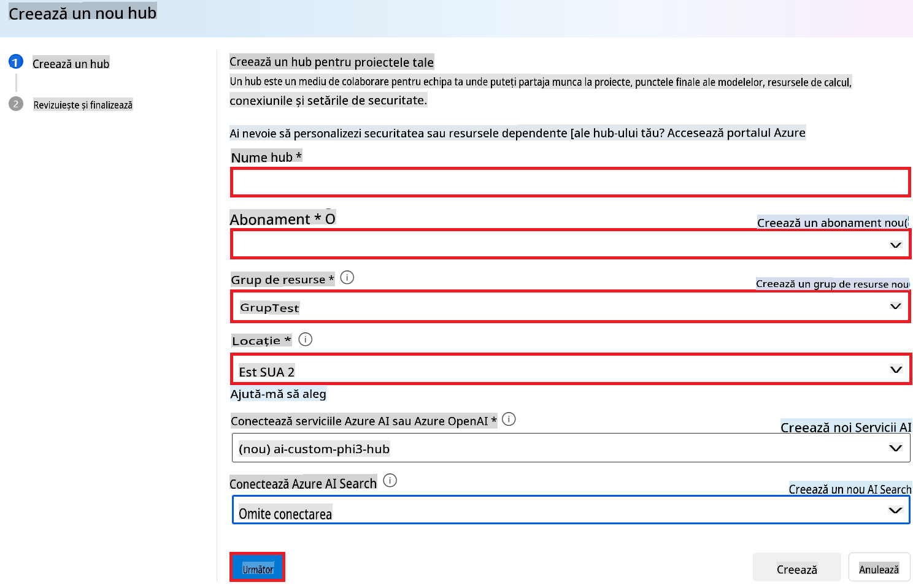

1. Selectați **Next**.

#### Crearea unui proiect Azure AI Foundry

1. În Hub-ul pe care l-ați creat, selectați **All projects** din bara laterală din stânga.

1. Selectați **+ New project** din meniul de navigare.

    

1. Introduceți **Project name**. Acesta trebuie să fie unic.

    

1. Selectați **Create a project**.

#### Adăugarea unei conexiuni personalizate pentru modelul ajustat Phi-3 / Phi-3.5

Pentru a integra modelul personalizat Phi-3 / Phi-3.5 cu Prompt flow, trebuie să salvați endpoint-ul și cheia modelului într-o conexiune personalizată. Această configurare asigură accesul la modelul personalizat Phi-3 / Phi-3.5 în Prompt flow.

#### Configurați cheia API și URI-ul endpoint-ului pentru modelul ajustat Phi-3 / Phi-3.5

1. Accesați [Azure ML Studio](https://ml.azure.com/home?wt.mc_id=studentamb_279723).

1. Navigați la workspace-ul Azure Machine Learning pe care l-ați creat.

1. Selectați **Endpoints** din bara laterală din stânga.

    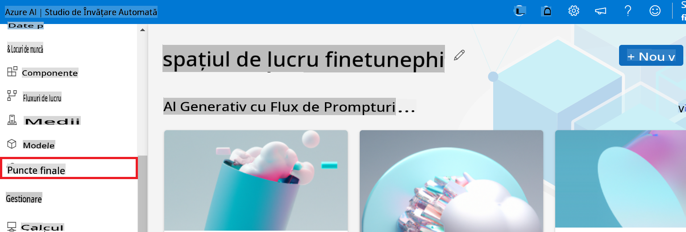

1. Selectați endpoint-ul pe care l-ați creat.

    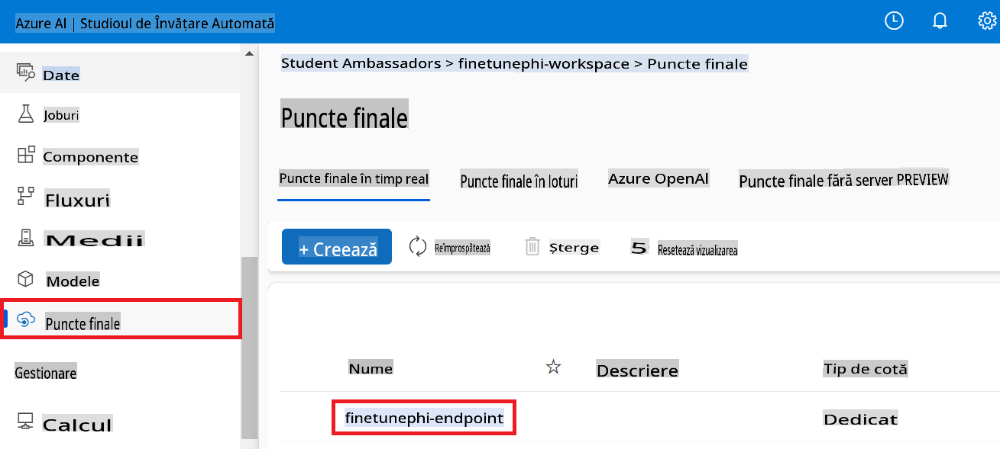

1. Selectați **Consume** din meniul de navigare.

1. Copiați **REST endpoint** și **Primary key**.

    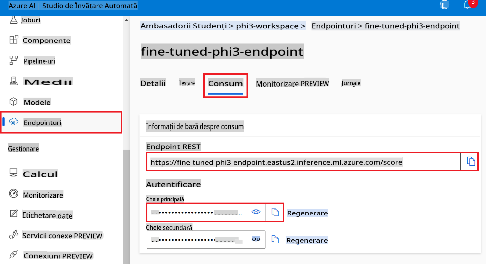

#### Adăugați conexiunea personalizată

1. Accesați [Azure AI Foundry](https://ai.azure.com/?wt.mc_id=studentamb_279723).

1. Navigați la proiectul Azure AI Foundry pe care l-ați creat.

1. În proiectul pe care l-ați creat, selectați **Settings** din bara laterală din stânga.

1. Selectați **+ New connection**.

    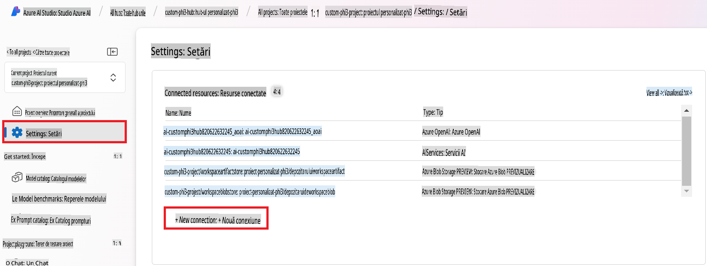

1. Selectați **Custom keys** din meniul de navigare.

    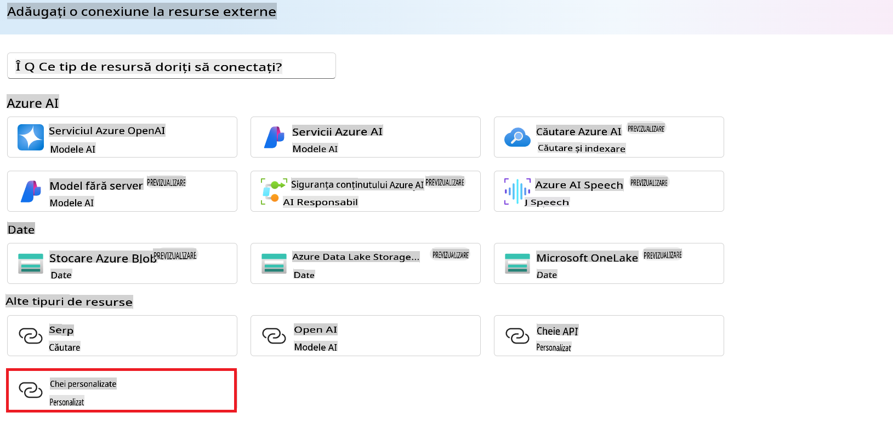

1. Realizați următoarele acțiuni:

    - Selectați **+ Add key value pairs**.
    - Pentru numele cheii, introduceți **endpoint** și lipiți endpoint-ul copiat din Azure ML Studio în câmpul de valoare.
    - Selectați din nou **+ Add key value pairs**.
    - Pentru numele cheii, introduceți **key** și lipiți cheia copiată din Azure ML Studio în câmpul de valoare.
    - După adăugarea cheilor, selectați **is secret** pentru a preveni expunerea cheii.

    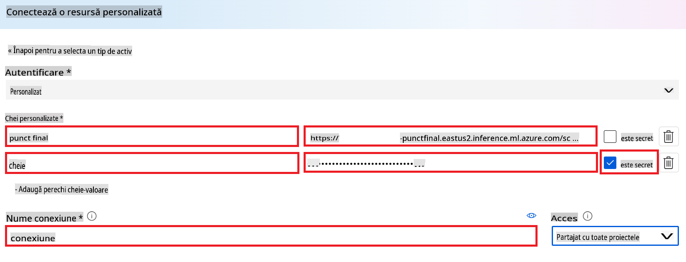

1. Selectați **Add connection**.

#### Crearea unui Prompt flow

Ați adăugat o conexiune personalizată în Azure AI Foundry. Acum, să creăm un Prompt flow utilizând următorii pași. Apoi, veți conecta acest Prompt flow la conexiunea personalizată pentru a utiliza modelul ajustat în Prompt flow.

1. Navigați la proiectul Azure AI Foundry pe care l-ați creat.

1. Selectați **Prompt flow** din bara laterală din stânga.

1. Selectați **+ Create** din meniul de navigare.

    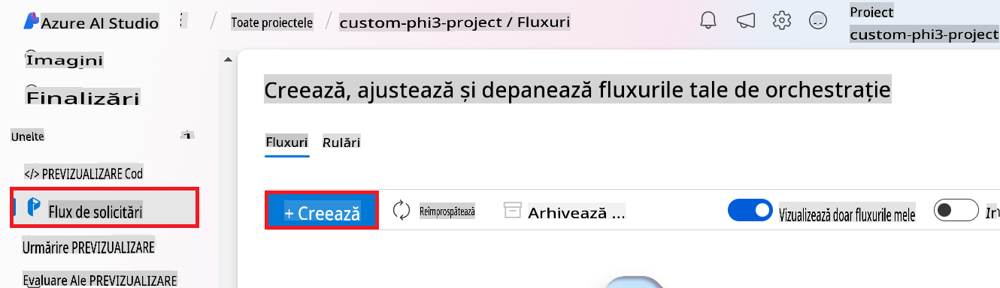

1. Selectați **Chat flow** din meniul de navigare.

    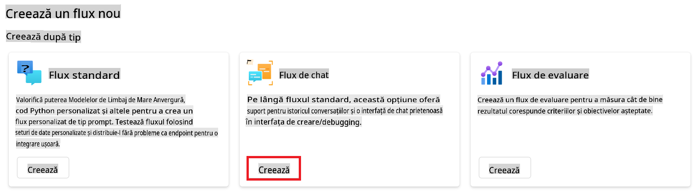

1. Introduceți **Folder name**.

    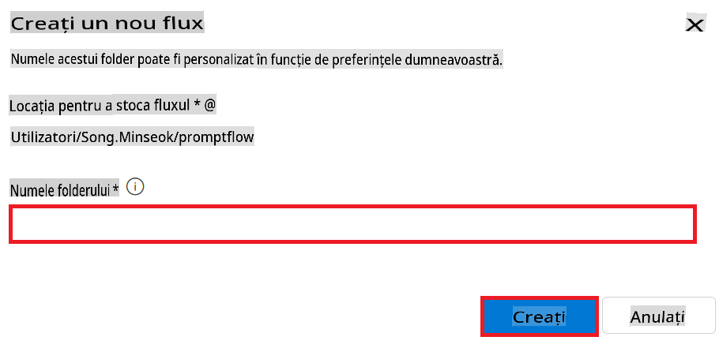

1. Selectați **Create**.

#### Configurați Prompt flow pentru a comunica cu modelul personalizat Phi-3 / Phi-3.5

Trebuie să integrați modelul ajustat Phi-3 / Phi-3.5 într-un Prompt flow. Totuși, Prompt flow-ul existent nu este proiectat pentru acest scop. Prin urmare, trebuie să reproiectați Prompt flow-ul pentru a permite integrarea modelului personalizat.

1. În Prompt flow, realizați următoarele acțiuni pentru a reconstrui fluxul existent:

    - Selectați **Raw file mode**.
    - Ștergeți tot codul existent din fișierul *flow.dag.yml*.
    - Adăugați următorul cod în *flow.dag.yml*.

        ```yml
        inputs:
          input_data:
            type: string
            default: "Who founded Microsoft?"

        outputs:
          answer:
            type: string
            reference: ${integrate_with_promptflow.output}

        nodes:
        - name: integrate_with_promptflow
          type: python
          source:
            type: code
            path: integrate_with_promptflow.py
          inputs:
            input_data: ${inputs.input_data}
        ```

    - Selectați **Save**.

    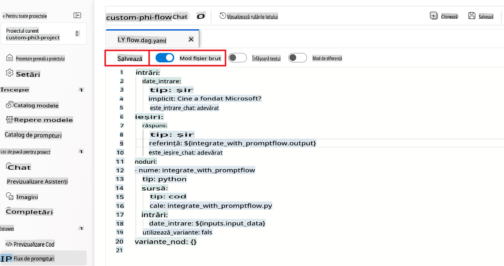

1. Adăugați următorul cod în *integrate_with_promptflow.py* pentru a utiliza modelul personalizat Phi-3 / Phi-3.5 în Prompt flow.

    ```python
    import logging
    import requests
    from promptflow import tool
    from promptflow.connections import CustomConnection

    # Logging setup
    logging.basicConfig(
        format="%(asctime)s - %(levelname)s - %(name)s - %(message)s",
        datefmt="%Y-%m-%d %H:%M:%S",
        level=logging.DEBUG
    )
    logger = logging.getLogger(__name__)

    def query_phi3_model(input_data: str, connection: CustomConnection) -> str:
        """
        Send a request to the Phi-3 / Phi-3.5 model endpoint with the given input data using Custom Connection.
        """

        # "connection" is the name of the Custom Connection, "endpoint", "key" are the keys in the Custom Connection
        endpoint_url = connection.endpoint
        api_key = connection.key

        headers = {
            "Content-Type": "application/json",
            "Authorization": f"Bearer {api_key}"
        }
    data = {
        "input_data": [input_data],
        "params": {
            "temperature": 0.7,
            "max_new_tokens": 128,
            "do_sample": True,
            "return_full_text": True
            }
        }
        try:
            response = requests.post(endpoint_url, json=data, headers=headers)
            response.raise_for_status()
            
            # Log the full JSON response
            logger.debug(f"Full JSON response: {response.json()}")

            result = response.json()["output"]
            logger.info("Successfully received response from Azure ML Endpoint.")
            return result
        except requests.exceptions.RequestException as e:
            logger.error(f"Error querying Azure ML Endpoint: {e}")
            raise

    @tool
    def my_python_tool(input_data: str, connection: CustomConnection) -> str:
        """
        Tool function to process input data and query the Phi-3 / Phi-3.5 model.
        """
        return query_phi3_model(input_data, connection)

    ```

    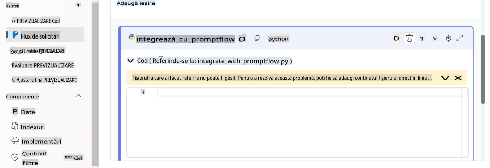

> [!NOTE]
> Pentru informații detaliate despre utilizarea Prompt flow în Azure AI Foundry, consultați [Prompt flow în Azure AI Foundry](https://learn.microsoft.com/azure/ai-studio/how-to/prompt-flow).

1. Selectați **Chat input**, **Chat output** pentru a activa chat-ul cu modelul dvs.

    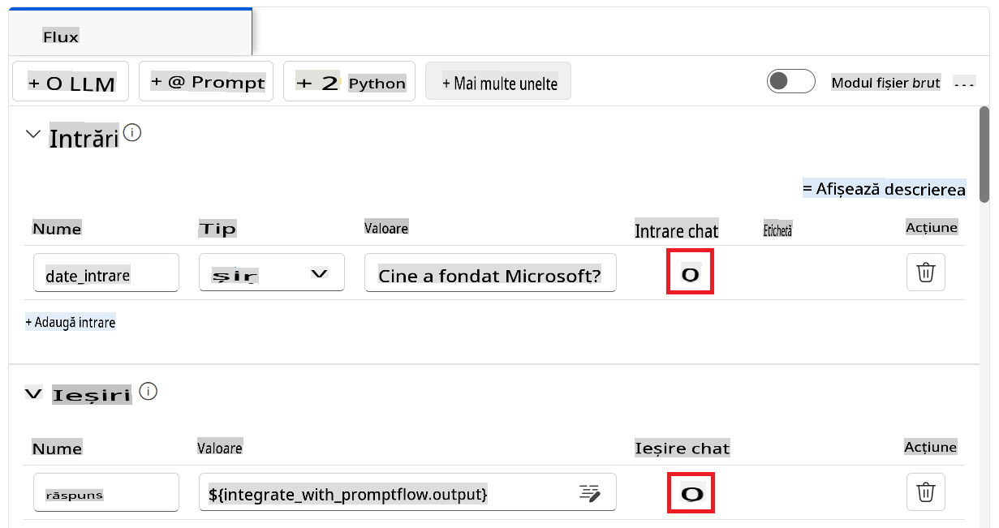

1. Acum sunteți gata să comunicați cu modelul personalizat Phi-3 / Phi-3.5. În următorul exercițiu, veți învăța cum să porniți Prompt flow și să-l utilizați pentru a comunica cu modelul ajustat Phi-3 / Phi-3.5.

> [!NOTE]
>
> Prompt flow-ul reconstruit ar trebui să arate astfel:
>
> 
>

#### Pornirea Prompt flow

1. Selectați **Start compute sessions** pentru a porni Prompt flow.

    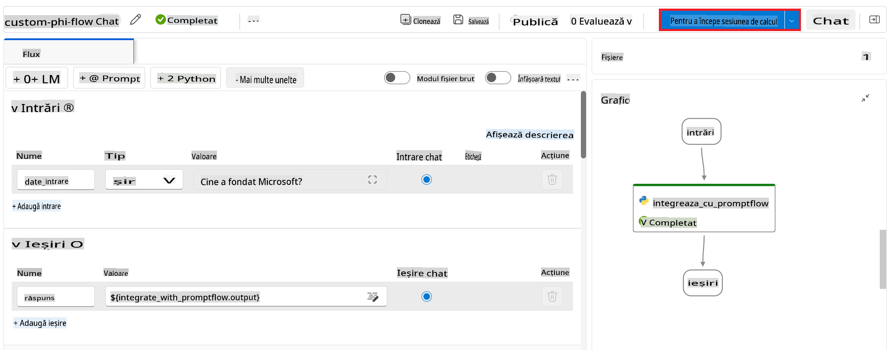

1. Selectați **Validate and parse input** pentru a reînnoi parametrii.

    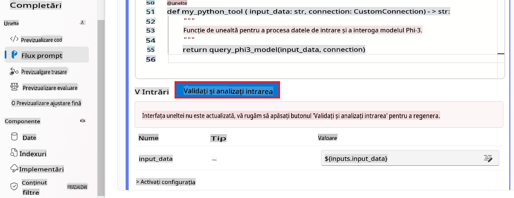

1. Selectați **Value** al **connection** pentru conexiunea personalizată pe care ați creat-o. De exemplu, *connection*.

    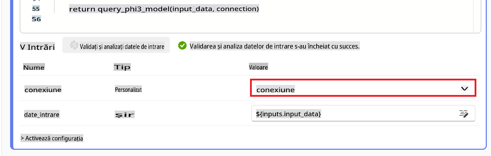

#### Comunicați cu modelul personalizat Phi-3 / Phi-3.5

1. Selectați **Chat**.

    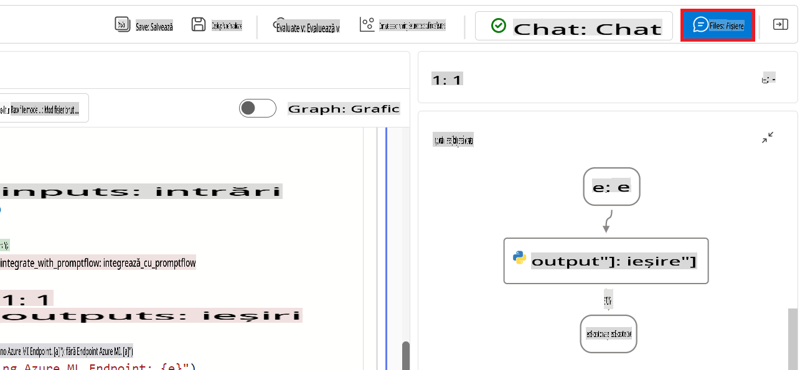

1. Iată un exemplu de rezultate: Acum puteți comunica cu modelul dvs. personalizat Phi-3 / Phi-3.5. Este recomandat să puneți întrebări bazate pe datele utilizate pentru ajustare.

    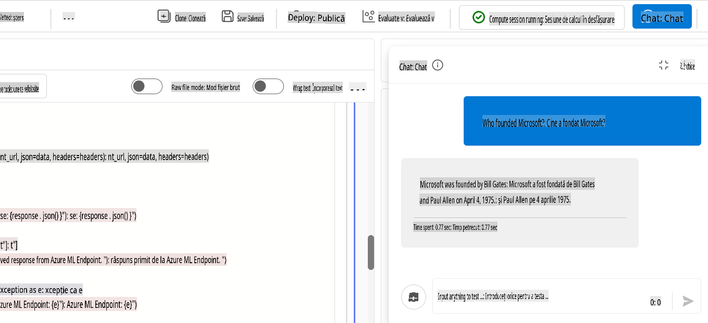

### Implementarea Azure OpenAI pentru evaluarea modelului Phi-3 / Phi-3.5

Pentru a evalua modelul Phi-3 / Phi-3.5 în Azure AI Foundry, trebuie să implementați un model Azure OpenAI. Acest model va fi utilizat pentru a evalua performanța modelului Phi-3 / Phi-3.5.

#### Implementați Azure OpenAI

1. Conectați-vă la [Azure AI Foundry](https://ai.azure.com/?wt.mc_id=studentamb_279723).

1. Navigați la proiectul Azure AI Foundry pe care l-ați creat.

    

1. În proiectul pe care l-ați creat, selectați **Deployments** din bara laterală din stânga.

1. Selectați **+ Deploy model** din meniul de navigare.

1. Selectați **Deploy base model**.

    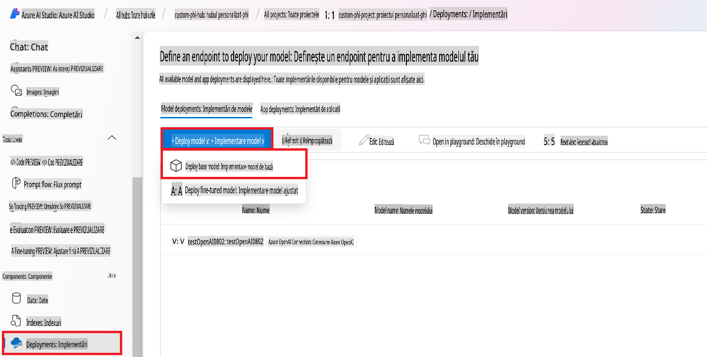

1. Selectați modelul Azure OpenAI pe care doriți să-l utilizați. De exemplu, **gpt-4o**.

    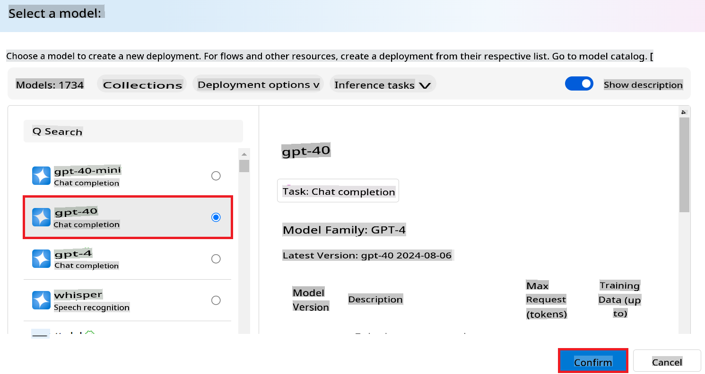

1. Selectați **Confirm**.

### Evaluarea modelului ajustat Phi-3 / Phi-3.5 utilizând evaluarea Prompt flow din Azure AI Foundry

### Începeți o evaluare nouă

1. Accesați [Azure AI Foundry](https://ai.azure.com/?wt.mc_id=studentamb_279723).

1. Navigați la proiectul Azure AI Foundry pe care l-ați creat.

    

1. În proiectul pe care l-ați creat, selectați **Evaluation** din bara laterală din stânga.

1. Selectați **+ New evaluation** din meniul de navigare.
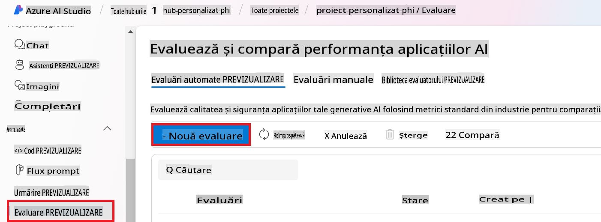

1. Selectați evaluarea **Prompt flow**.

    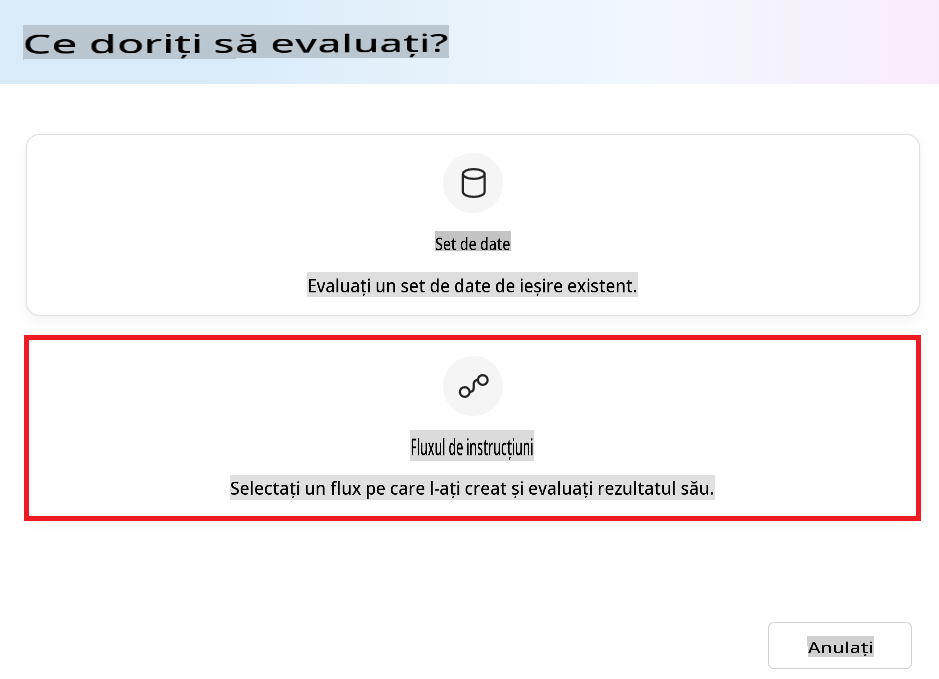

1. Realizați următoarele sarcini:

    - Introduceți numele evaluării. Acesta trebuie să fie un nume unic.
    - Selectați **Question and answer without context** ca tip de sarcină. Acest lucru se datorează faptului că dataset-ul **ULTRACHAT_200k** utilizat în acest tutorial nu conține context.
    - Selectați fluxul de prompturi pe care doriți să îl evaluați.

    

1. Selectați **Next**.

1. Realizați următoarele sarcini:

    - Selectați **Add your dataset** pentru a încărca dataset-ul. De exemplu, puteți încărca fișierul dataset-ului de test, cum ar fi *test_data.json1*, care este inclus atunci când descărcați dataset-ul **ULTRACHAT_200k**.
    - Selectați coloana corespunzătoare din dataset care se potrivește cu dataset-ul dvs. De exemplu, dacă utilizați dataset-ul **ULTRACHAT_200k**, selectați **${data.prompt}** ca și coloană a dataset-ului.

    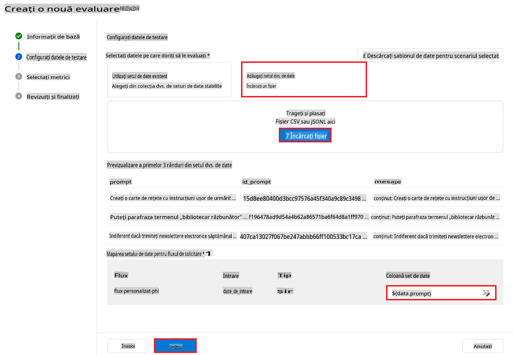

1. Selectați **Next**.

1. Realizați următoarele sarcini pentru a configura metricele de performanță și calitate:

    - Selectați metricele de performanță și calitate pe care doriți să le utilizați.
    - Selectați modelul Azure OpenAI pe care l-ați creat pentru evaluare. De exemplu, selectați **gpt-4o**.

    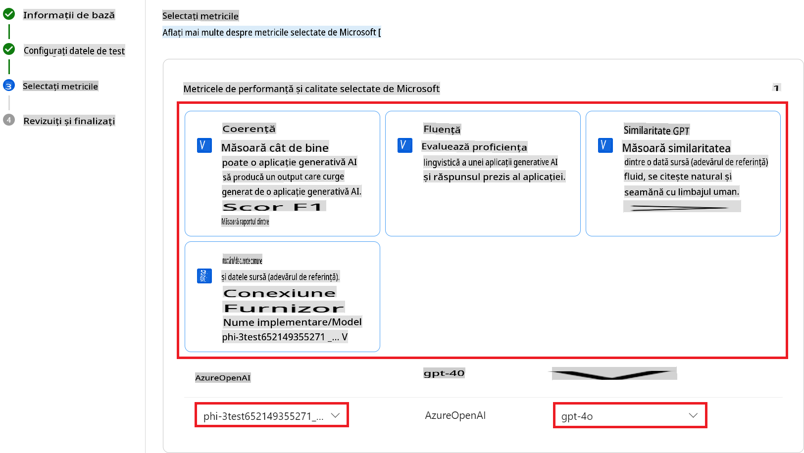

1. Realizați următoarele sarcini pentru a configura metricele de risc și siguranță:

    - Selectați metricele de risc și siguranță pe care doriți să le utilizați.
    - Selectați pragul pentru calculul ratei de defect pe care doriți să îl utilizați. De exemplu, selectați **Medium**.
    - Pentru **question**, selectați **Data source** la **{$data.prompt}**.
    - Pentru **answer**, selectați **Data source** la **{$run.outputs.answer}**.
    - Pentru **ground_truth**, selectați **Data source** la **{$data.message}**.

    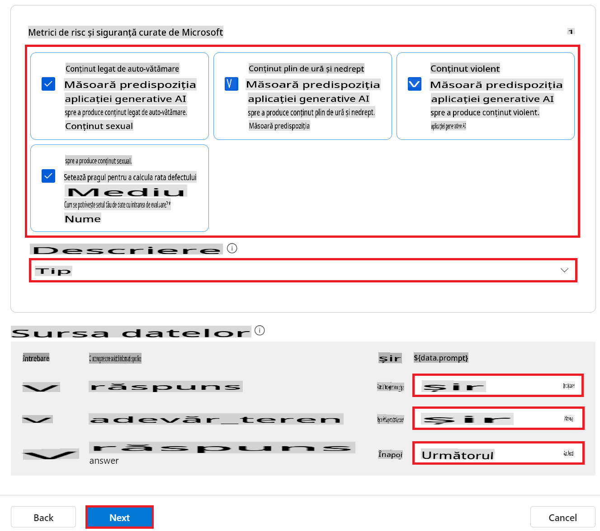

1. Selectați **Next**.

1. Selectați **Submit** pentru a începe evaluarea.

1. Evaluarea va dura ceva timp pentru a fi finalizată. Puteți monitoriza progresul în fila **Evaluation**.

### Revizuirea rezultatelor evaluării

> [!NOTE]
> Rezultatele prezentate mai jos sunt destinate să ilustreze procesul de evaluare. În acest tutorial, am utilizat un model ajustat pe un dataset relativ mic, ceea ce poate duce la rezultate sub-optime. Rezultatele reale pot varia semnificativ în funcție de dimensiunea, calitatea și diversitatea dataset-ului utilizat, precum și de configurația specifică a modelului.

După finalizarea evaluării, puteți revizui rezultatele pentru metricele de performanță și siguranță.

1. Metrice de performanță și calitate:

    - Evaluați eficacitatea modelului în generarea de răspunsuri coerente, fluente și relevante.

    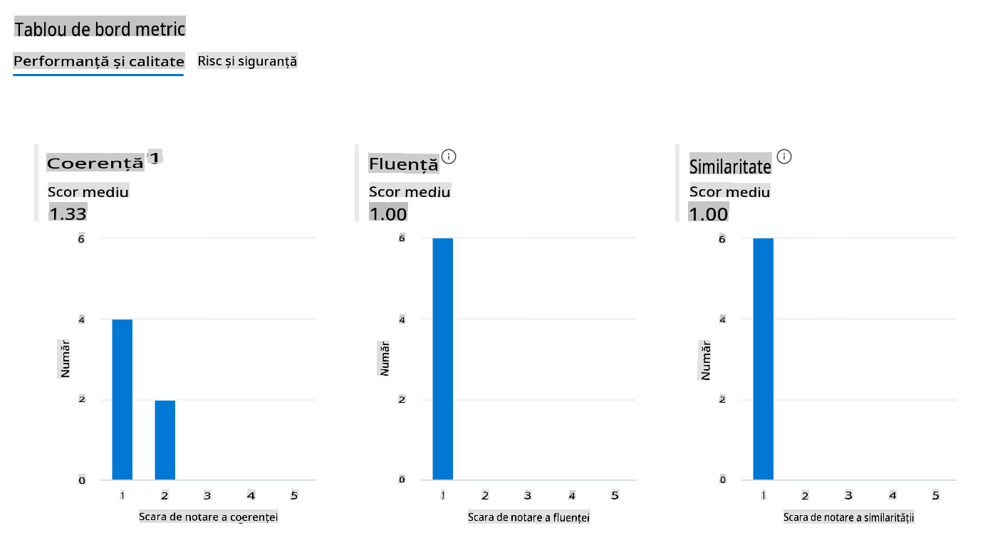

1. Metrice de risc și siguranță:

    - Asigurați-vă că ieșirile modelului sunt sigure și aliniate cu Principiile AI Responsabil, evitând conținutul dăunător sau ofensator.

    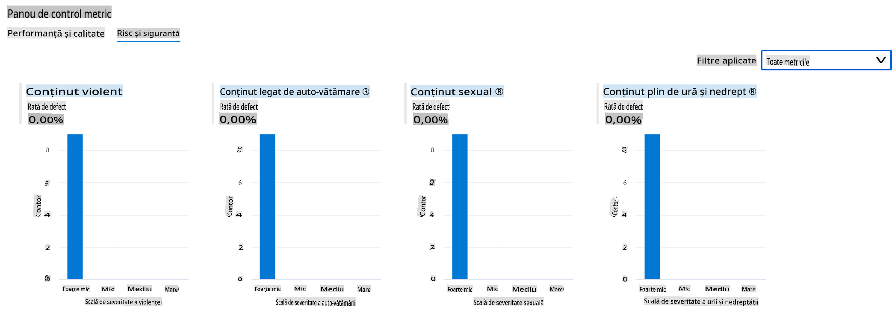

1. Puteți derula în jos pentru a vizualiza **Detailed metrics result**.

    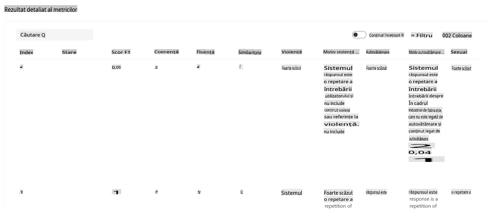

1. Evaluând modelul personalizat Phi-3 / Phi-3.5 în raport cu metricele de performanță și siguranță, puteți confirma că modelul nu doar că este eficient, dar respectă și practicile AI Responsabil, fiind astfel pregătit pentru implementare în lumea reală.

## Felicitări!

### Ați finalizat acest tutorial

Ați evaluat cu succes modelul ajustat Phi-3 integrat cu Prompt flow în Azure AI Foundry. Acesta este un pas important pentru a vă asigura că modelele dvs. AI nu doar că performează bine, dar respectă și principiile AI Responsabil ale Microsoft, ajutându-vă să construiți aplicații AI de încredere și fiabile.


## Curățarea resurselor Azure

Curățați resursele Azure pentru a evita costuri suplimentare în contul dvs. Accesați portalul Azure și ștergeți următoarele resurse:

- Resursa Azure Machine learning.
- Endpoint-ul modelului Azure Machine learning.
- Resursa proiectului Azure AI Foundry.
- Resursa Azure AI Foundry Prompt flow.

### Pași următori

#### Documentație

- [Evaluarea sistemelor AI utilizând dashboard-ul AI Responsabil](https://learn.microsoft.com/azure/machine-learning/concept-responsible-ai-dashboard?view=azureml-api-2&source=recommendations?wt.mc_id=studentamb_279723)
- [Metrice de evaluare și monitorizare pentru AI generativ](https://learn.microsoft.com/azure/ai-studio/concepts/evaluation-metrics-built-in?tabs=definition?wt.mc_id=studentamb_279723)
- [Documentația Azure AI Foundry](https://learn.microsoft.com/azure/ai-studio/?wt.mc_id=studentamb_279723)
- [Documentația Prompt flow](https://microsoft.github.io/promptflow/?wt.mc_id=studentamb_279723)

#### Conținut de instruire

- [Introducere în abordarea AI Responsabilă a Microsoft](https://learn.microsoft.com/training/modules/introduction-to-microsofts-responsible-ai-approach/?source=recommendations?wt.mc_id=studentamb_279723)
- [Introducere în Azure AI Foundry](https://learn.microsoft.com/training/modules/introduction-to-azure-ai-studio/?wt.mc_id=studentamb_279723)

### Referințe

- [Ce este AI Responsabil?](https://learn.microsoft.com/azure/machine-learning/concept-responsible-ai?view=azureml-api-2?wt.mc_id=studentamb_279723)
- [Anunțarea noilor instrumente din Azure AI pentru a vă ajuta să construiți aplicații AI generative mai sigure și de încredere](https://azure.microsoft.com/blog/announcing-new-tools-in-azure-ai-to-help-you-build-more-secure-and-trustworthy-generative-ai-applications/?wt.mc_id=studentamb_279723)
- [Evaluarea aplicațiilor AI generative](https://learn.microsoft.com/azure/ai-studio/concepts/evaluation-approach-gen-ai?wt.mc_id%3Dstudentamb_279723)

**Declinarea responsabilității**:  
Acest document a fost tradus folosind servicii de traducere automată bazate pe inteligență artificială. Deși ne străduim să asigurăm acuratețea, vă rugăm să rețineți că traducerile automate pot conține erori sau inexactități. Documentul original, în limba sa maternă, trebuie considerat sursa autoritară. Pentru informații critice, se recomandă traducerea profesională realizată de un specialist. Nu ne asumăm răspunderea pentru eventualele neînțelegeri sau interpretări greșite rezultate din utilizarea acestei traduceri.