# Ajustarea și integrarea modelelor personalizate Phi-3 cu Prompt flow

Acest exemplu complet (E2E) este bazat pe ghidul "[Fine-Tune and Integrate Custom Phi-3 Models with Prompt Flow: Step-by-Step Guide](https://techcommunity.microsoft.com/t5/educator-developer-blog/fine-tune-and-integrate-custom-phi-3-models-with-prompt-flow/ba-p/4178612?WT.mc_id=aiml-137032-kinfeylo)" din comunitatea Microsoft Tech. Acesta introduce procesele de ajustare, implementare și integrare a modelelor personalizate Phi-3 cu Prompt flow.

## Prezentare generală

În acest exemplu E2E, vei învăța cum să ajustezi modelul Phi-3 și să îl integrezi cu Prompt flow. Folosind Azure Machine Learning și Prompt flow, vei stabili un flux de lucru pentru implementarea și utilizarea modelelor AI personalizate. Acest exemplu E2E este împărțit în trei scenarii:

**Scenariul 1: Configurarea resurselor Azure și pregătirea pentru ajustare**

**Scenariul 2: Ajustarea modelului Phi-3 și implementarea în Azure Machine Learning Studio**

**Scenariul 3: Integrarea cu Prompt flow și interacțiunea cu modelul personalizat**

Mai jos este o prezentare generală a acestui exemplu E2E.

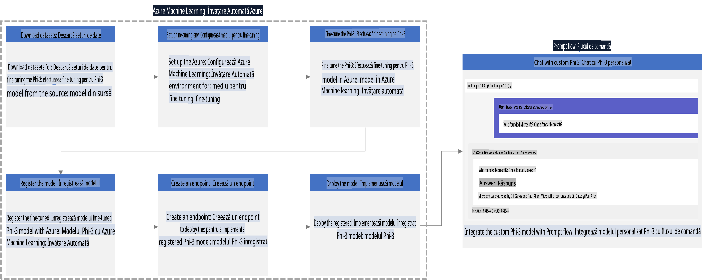

### Cuprins

1. **[Scenariul 1: Configurarea resurselor Azure și pregătirea pentru ajustare](../../../../../../md/02.Application/01.TextAndChat/Phi3)**
    - [Crearea unui Azure Machine Learning Workspace](../../../../../../md/02.Application/01.TextAndChat/Phi3)
    - [Solicitarea cotelor GPU în abonamentul Azure](../../../../../../md/02.Application/01.TextAndChat/Phi3)
    - [Adăugarea unei atribuiri de rol](../../../../../../md/02.Application/01.TextAndChat/Phi3)
    - [Configurarea proiectului](../../../../../../md/02.Application/01.TextAndChat/Phi3)
    - [Pregătirea setului de date pentru ajustare](../../../../../../md/02.Application/01.TextAndChat/Phi3)

1. **[Scenariul 2: Ajustarea modelului Phi-3 și implementarea în Azure Machine Learning Studio](../../../../../../md/02.Application/01.TextAndChat/Phi3)**
    - [Configurarea Azure CLI](../../../../../../md/02.Application/01.TextAndChat/Phi3)
    - [Ajustarea modelului Phi-3](../../../../../../md/02.Application/01.TextAndChat/Phi3)
    - [Implementarea modelului ajustat](../../../../../../md/02.Application/01.TextAndChat/Phi3)

1. **[Scenariul 3: Integrarea cu Prompt flow și interacțiunea cu modelul personalizat](../../../../../../md/02.Application/01.TextAndChat/Phi3)**
    - [Integrarea modelului personalizat Phi-3 cu Prompt flow](../../../../../../md/02.Application/01.TextAndChat/Phi3)
    - [Interacțiunea cu modelul personalizat](../../../../../../md/02.Application/01.TextAndChat/Phi3)

## Scenariul 1: Configurarea resurselor Azure și pregătirea pentru ajustare

### Crearea unui Azure Machine Learning Workspace

1. Tastează *azure machine learning* în **bara de căutare** din partea de sus a paginii portalului și selectează **Azure Machine Learning** din opțiunile afișate.

    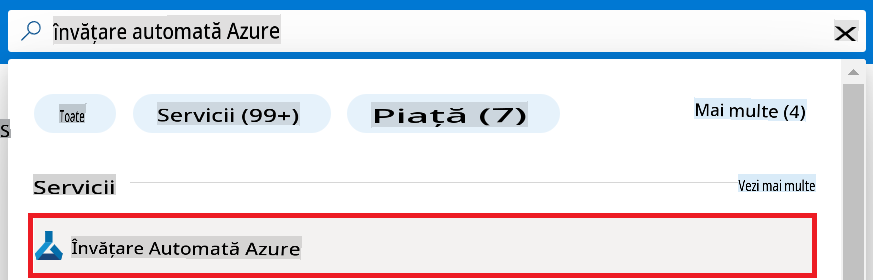

1. Selectează **+ Create** din meniul de navigare.

1. Selectează **New workspace** din meniul de navigare.

    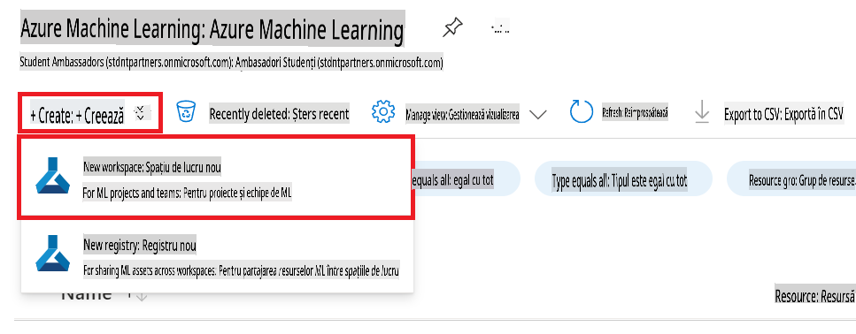

1. Efectuează următoarele acțiuni:

    - Selectează **Subscription** din Azure.
    - Selectează **Resource group** pe care dorești să îl folosești (creează unul nou dacă este necesar).
    - Introdu **Workspace Name**. Trebuie să fie o valoare unică.
    - Selectează **Region** pe care dorești să o folosești.
    - Selectează **Storage account** pe care dorești să îl folosești (creează unul nou dacă este necesar).
    - Selectează **Key vault** pe care dorești să îl folosești (creează unul nou dacă este necesar).
    - Selectează **Application insights** pe care dorești să îl folosești (creează unul nou dacă este necesar).
    - Selectează **Container registry** pe care dorești să îl folosești (creează unul nou dacă este necesar).

    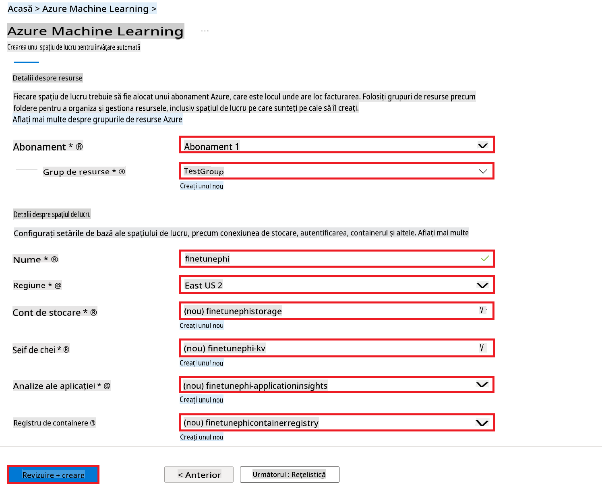

1. Selectează **Review + Create**.

1. Selectează **Create**.

### Solicitarea cotelor GPU în abonamentul Azure

În acest exemplu E2E, vei folosi GPU-ul *Standard_NC24ads_A100_v4* pentru ajustare, care necesită o solicitare de cotă, și CPU-ul *Standard_E4s_v3* pentru implementare, care nu necesită o solicitare de cotă.

> [!NOTE]
>
> Doar abonamentele Pay-As-You-Go (tipul standard de abonament) sunt eligibile pentru alocarea GPU-urilor; abonamentele de tip beneficii nu sunt acceptate momentan.
>
> Pentru cei care folosesc abonamente de tip beneficii (cum ar fi Visual Studio Enterprise Subscription) sau care doresc să testeze rapid procesul de ajustare și implementare, acest tutorial oferă și îndrumări pentru ajustarea cu un set de date minimal folosind un CPU. Totuși, este important de menționat că rezultatele ajustării sunt semnificativ mai bune atunci când se folosește un GPU cu seturi de date mai mari.

1. Accesează [Azure ML Studio](https://ml.azure.com/home?wt.mc_id=studentamb_279723).

1. Efectuează următoarele acțiuni pentru a solicita cota *Standard NCADSA100v4 Family*:

    - Selectează **Quota** din bara laterală.
    - Selectează **Virtual machine family** pe care dorești să o folosești. De exemplu, selectează **Standard NCADSA100v4 Family Cluster Dedicated vCPUs**, care include GPU-ul *Standard_NC24ads_A100_v4*.
    - Selectează **Request quota** din meniul de navigare.

        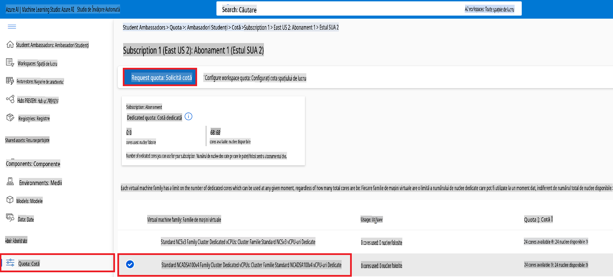

    - În pagina Request quota, introdu **New cores limit** pe care dorești să îl folosești. De exemplu, 24.
    - În pagina Request quota, selectează **Submit** pentru a solicita cota GPU.

> [!NOTE]
> Poți selecta GPU-ul sau CPU-ul potrivit pentru nevoile tale consultând documentația [Dimensiuni pentru mașinile virtuale în Azure](https://learn.microsoft.com/azure/virtual-machines/sizes/overview?tabs=breakdownseries%2Cgeneralsizelist%2Ccomputesizelist%2Cmemorysizelist%2Cstoragesizelist%2Cgpusizelist%2Cfpgasizelist%2Chpcsizelist).

### Adăugarea unei atribuiri de rol

Pentru a ajusta și implementa modelele tale, trebuie să creezi mai întâi o Identitate Gestionată Atribuită Utilizatorului (UAI) și să îi atribui permisiunile corespunzătoare. Această UAI va fi folosită pentru autentificare în timpul implementării.

#### Crearea Identității Gestionate Atribuite Utilizatorului (UAI)

1. Tastează *managed identities* în **bara de căutare** din partea de sus a paginii portalului și selectează **Managed Identities** din opțiunile afișate.

    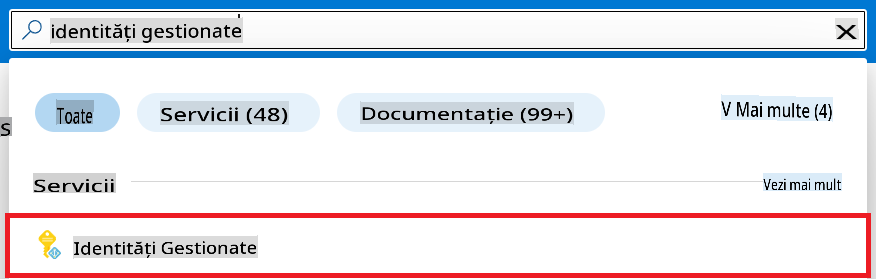

1. Selectează **+ Create**.

    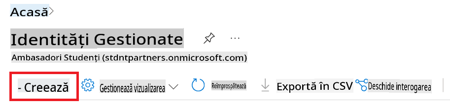

1. Efectuează următoarele acțiuni:

    - Selectează **Subscription** din Azure.
    - Selectează **Resource group** pe care dorești să îl folosești (creează unul nou dacă este necesar).
    - Selectează **Region** pe care dorești să o folosești.
    - Introdu **Name**. Trebuie să fie o valoare unică.

1. Selectează **Review + create**.

1. Selectează **+ Create**.

#### Adăugarea rolului Contributor la Identitatea Gestionată

1. Navighează la resursa Identitate Gestionată pe care ai creat-o.

1. Selectează **Azure role assignments** din bara laterală.

1. Selectează **+Add role assignment** din meniul de navigare.

1. În pagina Add role assignment, efectuează următoarele acțiuni:
    - Selectează **Scope** la **Resource group**.
    - Selectează **Subscription** din Azure.
    - Selectează **Resource group** pe care dorești să îl folosești.
    - Selectează **Role** la **Contributor**.

    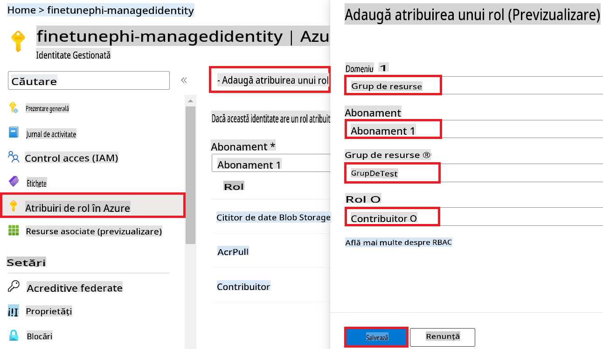

1. Selectează **Save**.

#### Adăugarea rolului Storage Blob Data Reader la Identitatea Gestionată

1. Tastează *storage accounts* în **bara de căutare** din partea de sus a paginii portalului și selectează **Storage accounts** din opțiunile afișate.

    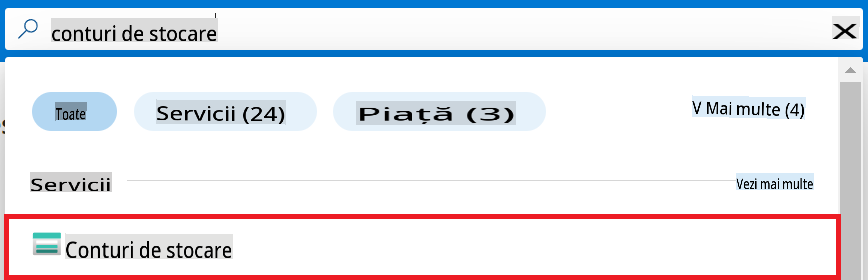

1. Selectează contul de stocare asociat cu workspace-ul Azure Machine Learning pe care l-ai creat. De exemplu, *finetunephistorage*.

1. Efectuează următoarele acțiuni pentru a naviga la pagina Add role assignment:

    - Navighează la contul de stocare Azure pe care l-ai creat.
    - Selectează **Access Control (IAM)** din bara laterală.
    - Selectează **+ Add** din meniul de navigare.
    - Selectează **Add role assignment** din meniul de navigare.

    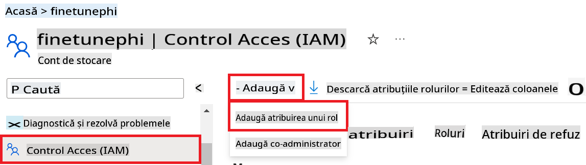

1. În pagina Add role assignment, efectuează următoarele acțiuni:

    - În pagina Role, tastează *Storage Blob Data Reader* în **bara de căutare** și selectează **Storage Blob Data Reader** din opțiunile afișate.
    - În pagina Role, selectează **Next**.
    - În pagina Members, selectează **Assign access to** **Managed identity**.
    - În pagina Members, selectează **+ Select members**.
    - În pagina Select managed identities, selectează **Subscription** din Azure.
    - În pagina Select managed identities, selectează **Managed identity** la **Manage Identity**.
    - În pagina Select managed identities, selectează Identitatea Gestionată pe care ai creat-o. De exemplu, *finetunephi-managedidentity*.
    - În pagina Select managed identities, selectează **Select**.

    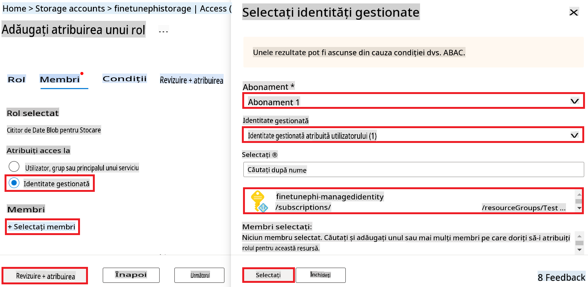

1. Selectează **Review + assign**.

#### Adăugarea rolului AcrPull la Identitatea Gestionată

1. Tastează *container registries* în **bara de căutare** din partea de sus a paginii portalului și selectează **Container registries** din opțiunile afișate.

    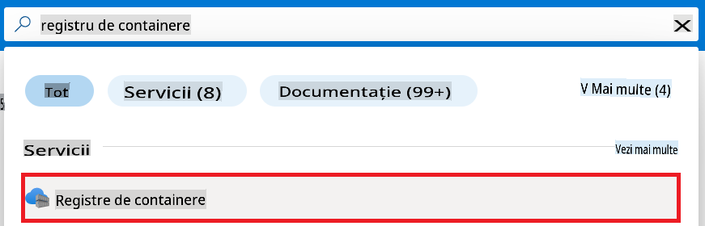

1. Selectează registrul de containere asociat cu workspace-ul Azure Machine Learning. De exemplu, *finetunephicontainerregistries*

1. Efectuează următoarele acțiuni pentru a naviga la pagina Add role assignment:

    - Selectează **Access Control (IAM)** din bara laterală.
    - Selectează **+ Add** din meniul de navigare.
    - Selectează **Add role assignment** din meniul de navigare.

1. În pagina Add role assignment, efectuează următoarele acțiuni:

    - În pagina Role, tastează *AcrPull* în **bara de căutare** și selectează **AcrPull** din opțiunile afișate.
    - În pagina Role, selectează **Next**.
    - În pagina Members, selectează **Assign access to** **Managed identity**.
    - În pagina Members, selectează **+ Select members**.
    - În pagina Select managed identities, selectează **Subscription** din Azure.
    - În pagina Select managed identities, selectează **Managed identity** la **Manage Identity**.
    - În pagina Select managed identities, selectează Identitatea Gestionată pe care ai creat-o. De exemplu, *finetunephi-managedidentity*.
    - În pagina Select managed identities, selectează **Select**.
    - Selectează **Review + assign**.

### Configurarea proiectului

Acum vei crea un folder pentru a lucra și vei configura un mediu virtual pentru a dezvolta un program care interacționează cu utilizatorii și folosește istoricul chat-urilor stocat în Azure Cosmos DB pentru a-și informa răspunsurile.

#### Crearea unui folder pentru proiect

1. Deschide o fereastră de terminal și tastează următoarea comandă pentru a crea un folder numit *finetune-phi* în calea implicită.

    ```console
    mkdir finetune-phi
    ```

1. Tastează următoarea comandă în terminal pentru a naviga la folderul *finetune-phi* pe care l-ai creat.

    ```console
    cd finetune-phi
    ```

#### Crearea unui mediu virtual

1. Tastează următoarea comandă în terminal pentru a crea un mediu virtual numit *.venv*.

    ```console
    python -m venv .venv
    ```

1. Tastează următoarea comandă în terminal pentru a activa mediul virtual.

    ```console
    .venv\Scripts\activate.bat
    ```

> [!NOTE]
>
> Dacă a funcționat, ar trebui să vezi *(.venv)* înaintea promptului de comandă.

#### Instalarea pachetelor necesare

1. Tastează următoarele comenzi în terminal pentru a instala pachetele necesare.

    ```console
    pip install datasets==2.19.1
    pip install transformers==4.41.1
    pip install azure-ai-ml==1.16.0
    pip install torch==2.3.1
    pip install trl==0.9.4
    pip install promptflow==1.12.0
    ```

#### Crearea fișierelor proiectului

În acest exercițiu, vei crea fișierele esențiale pentru proiect. Aceste fișiere includ scripturi pentru descărcarea setului de date, configurarea mediului Azure Machine Learning, ajustarea modelului Phi-3 și implementarea modelului ajustat. De asemenea, vei crea un fișier *conda.yml* pentru a configura mediul de ajustare.

În acest exercițiu vei:

- Crea un fișier *download_dataset.py* pentru a descărca setul de date.
- Crea un fișier *setup_ml.py* pentru a configura mediul Azure Machine Learning.
- Crea un fișier *fine_tune.py* în folderul *finetuning_dir* pentru a ajusta modelul Phi-3 folosind setul de date.
- Crea un fișier *conda.yml* pentru a configura mediul de ajustare.
- Crea un fișier *deploy_model.py* pentru a implementa modelul ajustat.
- Crea un fișier *integrate_with_promptflow.py* pentru a integra modelul ajustat și a-l executa folosind Prompt flow.
- Crea un fișier flow.dag.yml pentru a configura structura fluxului de lucru pentru Prompt flow.
- Crea un fișier *config.py* pentru a introduce informațiile Azure.

> [!NOTE]
>
> Structura completă a folderului:
>
> ```text
> └── YourUserName
> .    └── finetune-phi
> .        ├── finetuning_dir
> .        │      └── fine_tune.py
> .        ├── conda.yml
> .        ├── config.py
> .        ├── deploy_model.py
> .        ├── download_dataset.py
> .        ├── flow.dag.yml
> .        ├── integrate_with_promptflow.py
> .        └── setup_ml.py
> ```

1. Deschide **Visual Studio Code**.

1. Selectează **File** din bara de meniu.

1. Selectează **Open Folder**.

1. Selectează folderul *finetune-phi* pe care l-ai creat, care este localizat la *C:\Users\yourUserName\finetune-phi*.

    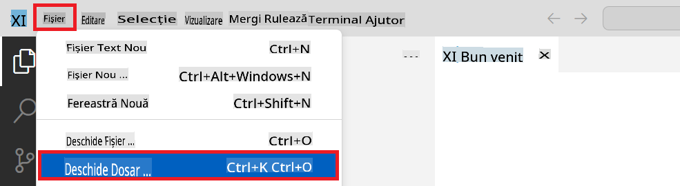

1. În panoul din stânga al Visual Studio Code, fă clic dreapta și selectează **New File** pentru a crea un fișier nou numit *download_dataset.py*.

1. În panoul din stânga al Visual Studio Code, fă clic dreapta și selectează **New File** pentru a crea un fișier nou numit *setup_ml.py*.

1. În panoul din stânga al Visual Studio Code, fă clic dreapta și selectează **New File** pentru a crea un fișier nou numit *deploy_model.py*.

    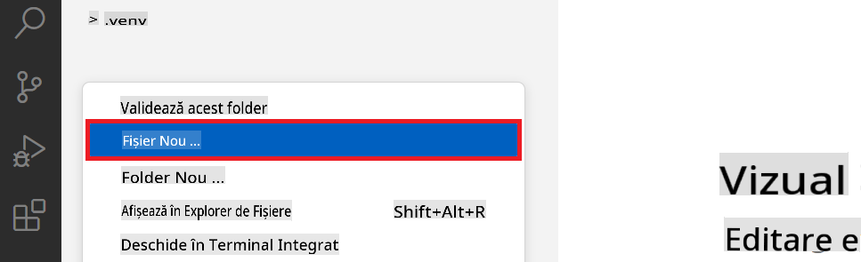

1. În panoul din stânga al Visual Studio Code, fă clic dreapta și selectează **New Folder** pentru a crea un folder nou numit *finetuning_dir*.

1. În folderul *finetuning_dir*, creează un fișier nou numit *fine_tune.py*.

#### Crearea și configurarea fișierului *conda.yml*

1. În panoul din stânga al Visual Studio Code, fă clic dreapta și selectează **New File** pentru a crea un fișier nou numit *conda.yml*.


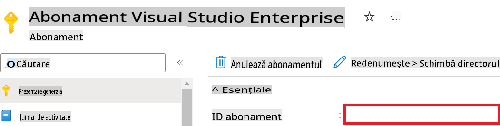

1. Realizează următorii pași pentru a adăuga numele Workspace-ului Azure:

    - Navighează la resursa Azure Machine Learning pe care ai creat-o.
    - Copiază și lipește numele contului tău în fișierul *config.py*.

    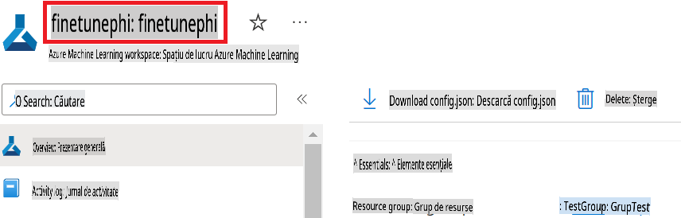

1. Realizează următorii pași pentru a adăuga numele Grupului de Resurse Azure:

    - Navighează la resursa Azure Machine Learning pe care ai creat-o.
    - Copiază și lipește numele Grupului de Resurse Azure în fișierul *config.py*.

    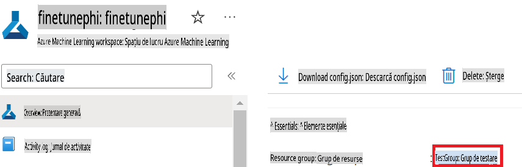

2. Realizează următorii pași pentru a adăuga numele Identității Gestionate Azure:

    - Navighează la resursa Managed Identities pe care ai creat-o.
    - Copiază și lipește numele Identității Gestionate Azure în fișierul *config.py*.

    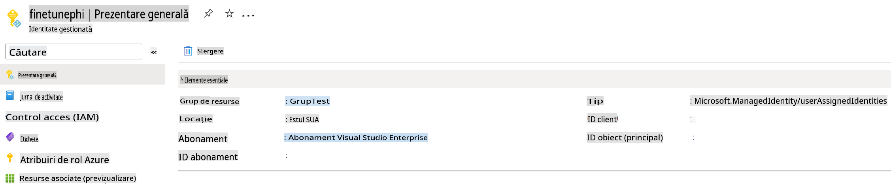

### Pregătește dataset-ul pentru fine-tuning

În acest exercițiu, vei rula fișierul *download_dataset.py* pentru a descărca dataset-urile *ULTRACHAT_200k* în mediul tău local. Vei utiliza aceste dataset-uri pentru fine-tuning-ul modelului Phi-3 în Azure Machine Learning.

#### Descarcă dataset-ul folosind *download_dataset.py*

1. Deschide fișierul *download_dataset.py* în Visual Studio Code.

1. Adaugă următorul cod în *download_dataset.py*.

    ```python
    import json
    import os
    from datasets import load_dataset
    from config import (
        TRAIN_DATA_PATH,
        TEST_DATA_PATH)

    def load_and_split_dataset(dataset_name, config_name, split_ratio):
        """
        Load and split a dataset.
        """
        # Load the dataset with the specified name, configuration, and split ratio
        dataset = load_dataset(dataset_name, config_name, split=split_ratio)
        print(f"Original dataset size: {len(dataset)}")
        
        # Split the dataset into train and test sets (80% train, 20% test)
        split_dataset = dataset.train_test_split(test_size=0.2)
        print(f"Train dataset size: {len(split_dataset['train'])}")
        print(f"Test dataset size: {len(split_dataset['test'])}")
        
        return split_dataset

    def save_dataset_to_jsonl(dataset, filepath):
        """
        Save a dataset to a JSONL file.
        """
        # Create the directory if it does not exist
        os.makedirs(os.path.dirname(filepath), exist_ok=True)
        
        # Open the file in write mode
        with open(filepath, 'w', encoding='utf-8') as f:
            # Iterate over each record in the dataset
            for record in dataset:
                # Dump the record as a JSON object and write it to the file
                json.dump(record, f)
                # Write a newline character to separate records
                f.write('\n')
        
        print(f"Dataset saved to {filepath}")

    def main():
        """
        Main function to load, split, and save the dataset.
        """
        # Load and split the ULTRACHAT_200k dataset with a specific configuration and split ratio
        dataset = load_and_split_dataset("HuggingFaceH4/ultrachat_200k", 'default', 'train_sft[:1%]')
        
        # Extract the train and test datasets from the split
        train_dataset = dataset['train']
        test_dataset = dataset['test']

        # Save the train dataset to a JSONL file
        save_dataset_to_jsonl(train_dataset, TRAIN_DATA_PATH)
        
        # Save the test dataset to a separate JSONL file
        save_dataset_to_jsonl(test_dataset, TEST_DATA_PATH)

    if __name__ == "__main__":
        main()

    ```

> [!TIP]
>
> **Ghid pentru fine-tuning cu un dataset minimal folosind un CPU**
>
> Dacă dorești să utilizezi un CPU pentru fine-tuning, această abordare este ideală pentru cei cu abonamente de beneficii (cum ar fi Visual Studio Enterprise Subscription) sau pentru a testa rapid procesul de fine-tuning și implementare.
>
> Înlocuiește `dataset = load_and_split_dataset("HuggingFaceH4/ultrachat_200k", 'default', 'train_sft[:1%]')` with `dataset = load_and_split_dataset("HuggingFaceH4/ultrachat_200k", 'default', 'train_sft[:10]')`
>

1. Introdu următoarea comandă în terminal pentru a rula scriptul și a descărca dataset-ul în mediul tău local.

    ```console
    python download_data.py
    ```

1. Verifică dacă dataset-urile au fost salvate cu succes în directorul local *finetune-phi/data*.

> [!NOTE]
>
> **Dimensiunea dataset-ului și timpul de fine-tuning**
>
> În acest exemplu E2E, se utilizează doar 1% din dataset (`train_sft[:1%]`). Aceasta reduce semnificativ cantitatea de date, accelerând atât procesul de încărcare, cât și cel de fine-tuning. Poți ajusta procentajul pentru a găsi echilibrul potrivit între timpul de antrenare și performanța modelului. Utilizarea unui subset mai mic din dataset reduce timpul necesar pentru fine-tuning, făcând procesul mai gestionabil pentru un exemplu E2E.

## Scenariul 2: Fine-tune modelul Phi-3 și implementează-l în Azure Machine Learning Studio

### Configurează Azure CLI

Trebuie să configurezi Azure CLI pentru a autentifica mediul tău. Azure CLI îți permite să gestionezi resursele Azure direct din linia de comandă și oferă acreditivele necesare pentru ca Azure Machine Learning să acceseze aceste resurse. Pentru a începe, instalează [Azure CLI](https://learn.microsoft.com/cli/azure/install-azure-cli)

1. Deschide o fereastră de terminal și tastează următoarea comandă pentru a te autentifica în contul tău Azure.

    ```console
    az login
    ```

1. Selectează contul Azure pe care dorești să îl utilizezi.

1. Selectează abonamentul Azure pe care dorești să îl utilizezi.

    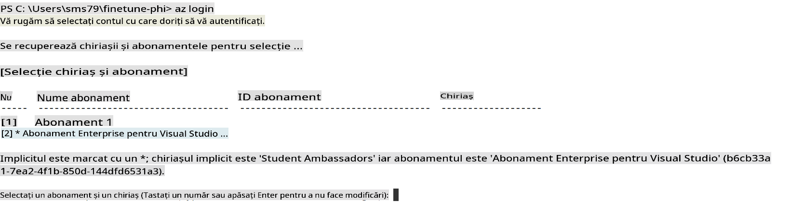

> [!TIP]
>
> Dacă întâmpini dificultăți la autentificarea în Azure, încearcă să utilizezi un cod de dispozitiv. Deschide o fereastră de terminal și tastează următoarea comandă pentru a te autentifica în contul tău Azure:
>
> ```console
> az login --use-device-code
> ```
>

### Fine-tune modelul Phi-3

În acest exercițiu, vei realiza fine-tuning pentru modelul Phi-3 utilizând dataset-ul furnizat. Mai întâi, vei defini procesul de fine-tuning în fișierul *fine_tune.py*. Apoi, vei configura mediul Azure Machine Learning și vei iniția procesul de fine-tuning rulând fișierul *setup_ml.py*. Acest script asigură că fine-tuning-ul are loc în mediul Azure Machine Learning.

Rulând *setup_ml.py*, vei iniția procesul de fine-tuning în mediul Azure Machine Learning.

#### Adaugă cod în fișierul *fine_tune.py*

1. Navighează la folderul *finetuning_dir* și deschide fișierul *fine_tune.py* în Visual Studio Code.

1. Adaugă următorul cod în *fine_tune.py*.

    ```python
    import argparse
    import sys
    import logging
    import os
    from datasets import load_dataset
    import torch
    import mlflow
    from transformers import AutoModelForCausalLM, AutoTokenizer, TrainingArguments
    from trl import SFTTrainer

    # To avoid the INVALID_PARAMETER_VALUE error in MLflow, disable MLflow integration
    os.environ["DISABLE_MLFLOW_INTEGRATION"] = "True"

    # Logging setup
    logging.basicConfig(
        format="%(asctime)s - %(levelname)s - %(name)s - %(message)s",
        datefmt="%Y-%m-%d %H:%M:%S",
        handlers=[logging.StreamHandler(sys.stdout)],
        level=logging.WARNING
    )
    logger = logging.getLogger(__name__)

    def initialize_model_and_tokenizer(model_name, model_kwargs):
        """
        Initialize the model and tokenizer with the given pretrained model name and arguments.
        """
        model = AutoModelForCausalLM.from_pretrained(model_name, **model_kwargs)
        tokenizer = AutoTokenizer.from_pretrained(model_name)
        tokenizer.model_max_length = 2048
        tokenizer.pad_token = tokenizer.unk_token
        tokenizer.pad_token_id = tokenizer.convert_tokens_to_ids(tokenizer.pad_token)
        tokenizer.padding_side = 'right'
        return model, tokenizer

    def apply_chat_template(example, tokenizer):
        """
        Apply a chat template to tokenize messages in the example.
        """
        messages = example["messages"]
        if messages[0]["role"] != "system":
            messages.insert(0, {"role": "system", "content": ""})
        example["text"] = tokenizer.apply_chat_template(
            messages, tokenize=False, add_generation_prompt=False
        )
        return example

    def load_and_preprocess_data(train_filepath, test_filepath, tokenizer):
        """
        Load and preprocess the dataset.
        """
        train_dataset = load_dataset('json', data_files=train_filepath, split='train')
        test_dataset = load_dataset('json', data_files=test_filepath, split='train')
        column_names = list(train_dataset.features)

        train_dataset = train_dataset.map(
            apply_chat_template,
            fn_kwargs={"tokenizer": tokenizer},
            num_proc=10,
            remove_columns=column_names,
            desc="Applying chat template to train dataset",
        )

        test_dataset = test_dataset.map(
            apply_chat_template,
            fn_kwargs={"tokenizer": tokenizer},
            num_proc=10,
            remove_columns=column_names,
            desc="Applying chat template to test dataset",
        )

        return train_dataset, test_dataset

    def train_and_evaluate_model(train_dataset, test_dataset, model, tokenizer, output_dir):
        """
        Train and evaluate the model.
        """
        training_args = TrainingArguments(
            bf16=True,
            do_eval=True,
            output_dir=output_dir,
            eval_strategy="epoch",
            learning_rate=5.0e-06,
            logging_steps=20,
            lr_scheduler_type="cosine",
            num_train_epochs=3,
            overwrite_output_dir=True,
            per_device_eval_batch_size=4,
            per_device_train_batch_size=4,
            remove_unused_columns=True,
            save_steps=500,
            seed=0,
            gradient_checkpointing=True,
            gradient_accumulation_steps=1,
            warmup_ratio=0.2,
        )

        trainer = SFTTrainer(
            model=model,
            args=training_args,
            train_dataset=train_dataset,
            eval_dataset=test_dataset,
            max_seq_length=2048,
            dataset_text_field="text",
            tokenizer=tokenizer,
            packing=True
        )

        train_result = trainer.train()
        trainer.log_metrics("train", train_result.metrics)

        mlflow.transformers.log_model(
            transformers_model={"model": trainer.model, "tokenizer": tokenizer},
            artifact_path=output_dir,
        )

        tokenizer.padding_side = 'left'
        eval_metrics = trainer.evaluate()
        eval_metrics["eval_samples"] = len(test_dataset)
        trainer.log_metrics("eval", eval_metrics)

    def main(train_file, eval_file, model_output_dir):
        """
        Main function to fine-tune the model.
        """
        model_kwargs = {
            "use_cache": False,
            "trust_remote_code": True,
            "torch_dtype": torch.bfloat16,
            "device_map": None,
            "attn_implementation": "eager"
        }

        # pretrained_model_name = "microsoft/Phi-3-mini-4k-instruct"
        pretrained_model_name = "microsoft/Phi-3.5-mini-instruct"

        with mlflow.start_run():
            model, tokenizer = initialize_model_and_tokenizer(pretrained_model_name, model_kwargs)
            train_dataset, test_dataset = load_and_preprocess_data(train_file, eval_file, tokenizer)
            train_and_evaluate_model(train_dataset, test_dataset, model, tokenizer, model_output_dir)

    if __name__ == "__main__":
        parser = argparse.ArgumentParser()
        parser.add_argument("--train-file", type=str, required=True, help="Path to the training data")
        parser.add_argument("--eval-file", type=str, required=True, help="Path to the evaluation data")
        parser.add_argument("--model_output_dir", type=str, required=True, help="Directory to save the fine-tuned model")
        args = parser.parse_args()
        main(args.train_file, args.eval_file, args.model_output_dir)

    ```

1. Salvează și închide fișierul *fine_tune.py*.

> [!TIP]
> **Poți realiza fine-tuning pentru modelul Phi-3.5**
>
> În fișierul *fine_tune.py*, poți schimba câmpul `pretrained_model_name` from `"microsoft/Phi-3-mini-4k-instruct"` to any model you want to fine-tune. For example, if you change it to `"microsoft/Phi-3.5-mini-instruct"`, you'll be using the Phi-3.5-mini-instruct model for fine-tuning. To find and use the model name you prefer, visit [Hugging Face](https://huggingface.co/), search for the model you're interested in, and then copy and paste its name into the `pretrained_model_name` din scriptul tău.
>
> :::image type="content" source="../../imgs/03/FineTuning-PromptFlow/finetunephi3.5.png" alt-text="Fine-tune Phi-3.5.":::
>

#### Adaugă cod în fișierul *setup_ml.py*

1. Deschide fișierul *setup_ml.py* în Visual Studio Code.

1. Adaugă următorul cod în *setup_ml.py*.

    ```python
    import logging
    from azure.ai.ml import MLClient, command, Input
    from azure.ai.ml.entities import Environment, AmlCompute
    from azure.identity import AzureCliCredential
    from config import (
        AZURE_SUBSCRIPTION_ID,
        AZURE_RESOURCE_GROUP_NAME,
        AZURE_ML_WORKSPACE_NAME,
        TRAIN_DATA_PATH,
        TEST_DATA_PATH
    )

    # Constants

    # Uncomment the following lines to use a CPU instance for training
    # COMPUTE_INSTANCE_TYPE = "Standard_E16s_v3" # cpu
    # COMPUTE_NAME = "cpu-e16s-v3"
    # DOCKER_IMAGE_NAME = "mcr.microsoft.com/azureml/openmpi4.1.0-ubuntu20.04:latest"

    # Uncomment the following lines to use a GPU instance for training
    COMPUTE_INSTANCE_TYPE = "Standard_NC24ads_A100_v4"
    COMPUTE_NAME = "gpu-nc24s-a100-v4"
    DOCKER_IMAGE_NAME = "mcr.microsoft.com/azureml/curated/acft-hf-nlp-gpu:59"

    CONDA_FILE = "conda.yml"
    LOCATION = "eastus2" # Replace with the location of your compute cluster
    FINETUNING_DIR = "./finetuning_dir" # Path to the fine-tuning script
    TRAINING_ENV_NAME = "phi-3-training-environment" # Name of the training environment
    MODEL_OUTPUT_DIR = "./model_output" # Path to the model output directory in azure ml

    # Logging setup to track the process
    logger = logging.getLogger(__name__)
    logging.basicConfig(
        format="%(asctime)s - %(levelname)s - %(name)s - %(message)s",
        datefmt="%Y-%m-%d %H:%M:%S",
        level=logging.WARNING
    )

    def get_ml_client():
        """
        Initialize the ML Client using Azure CLI credentials.
        """
        credential = AzureCliCredential()
        return MLClient(credential, AZURE_SUBSCRIPTION_ID, AZURE_RESOURCE_GROUP_NAME, AZURE_ML_WORKSPACE_NAME)

    def create_or_get_environment(ml_client):
        """
        Create or update the training environment in Azure ML.
        """
        env = Environment(
            image=DOCKER_IMAGE_NAME,  # Docker image for the environment
            conda_file=CONDA_FILE,  # Conda environment file
            name=TRAINING_ENV_NAME,  # Name of the environment
        )
        return ml_client.environments.create_or_update(env)

    def create_or_get_compute_cluster(ml_client, compute_name, COMPUTE_INSTANCE_TYPE, location):
        """
        Create or update the compute cluster in Azure ML.
        """
        try:
            compute_cluster = ml_client.compute.get(compute_name)
            logger.info(f"Compute cluster '{compute_name}' already exists. Reusing it for the current run.")
        except Exception:
            logger.info(f"Compute cluster '{compute_name}' does not exist. Creating a new one with size {COMPUTE_INSTANCE_TYPE}.")
            compute_cluster = AmlCompute(
                name=compute_name,
                size=COMPUTE_INSTANCE_TYPE,
                location=location,
                tier="Dedicated",  # Tier of the compute cluster
                min_instances=0,  # Minimum number of instances
                max_instances=1  # Maximum number of instances
            )
            ml_client.compute.begin_create_or_update(compute_cluster).wait()  # Wait for the cluster to be created
        return compute_cluster

    def create_fine_tuning_job(env, compute_name):
        """
        Set up the fine-tuning job in Azure ML.
        """
        return command(
            code=FINETUNING_DIR,  # Path to fine_tune.py
            command=(
                "python fine_tune.py "
                "--train-file ${{inputs.train_file}} "
                "--eval-file ${{inputs.eval_file}} "
                "--model_output_dir ${{inputs.model_output}}"
            ),
            environment=env,  # Training environment
            compute=compute_name,  # Compute cluster to use
            inputs={
                "train_file": Input(type="uri_file", path=TRAIN_DATA_PATH),  # Path to the training data file
                "eval_file": Input(type="uri_file", path=TEST_DATA_PATH),  # Path to the evaluation data file
                "model_output": MODEL_OUTPUT_DIR
            }
        )

    def main():
        """
        Main function to set up and run the fine-tuning job in Azure ML.
        """
        # Initialize ML Client
        ml_client = get_ml_client()

        # Create Environment
        env = create_or_get_environment(ml_client)
        
        # Create or get existing compute cluster
        create_or_get_compute_cluster(ml_client, COMPUTE_NAME, COMPUTE_INSTANCE_TYPE, LOCATION)

        # Create and Submit Fine-Tuning Job
        job = create_fine_tuning_job(env, COMPUTE_NAME)
        returned_job = ml_client.jobs.create_or_update(job)  # Submit the job
        ml_client.jobs.stream(returned_job.name)  # Stream the job logs
        
        # Capture the job name
        job_name = returned_job.name
        print(f"Job name: {job_name}")

    if __name__ == "__main__":
        main()

    ```

1. Înlocuiește `COMPUTE_INSTANCE_TYPE`, `COMPUTE_NAME`, and `LOCATION` cu detaliile tale specifice.

    ```python
   # Uncomment the following lines to use a GPU instance for training
    COMPUTE_INSTANCE_TYPE = "Standard_NC24ads_A100_v4"
    COMPUTE_NAME = "gpu-nc24s-a100-v4"
    ...
    LOCATION = "eastus2" # Replace with the location of your compute cluster
    ```

> [!TIP]
>
> **Ghid pentru fine-tuning cu un dataset minimal folosind un CPU**
>
> Dacă dorești să utilizezi un CPU pentru fine-tuning, această abordare este ideală pentru cei cu abonamente de beneficii (cum ar fi Visual Studio Enterprise Subscription) sau pentru a testa rapid procesul de fine-tuning și implementare.
>
> 1. Deschide fișierul *setup_ml*.
> 1. Înlocuiește `COMPUTE_INSTANCE_TYPE`, `COMPUTE_NAME`, and `DOCKER_IMAGE_NAME` with the following. If you do not have access to *Standard_E16s_v3*, you can use an equivalent CPU instance or request a new quota.
> 1. Replace `LOCATION` cu detaliile tale specifice.
>
>    ```python
>    # Uncomment the following lines to use a CPU instance for training
>    COMPUTE_INSTANCE_TYPE = "Standard_E16s_v3" # cpu
>    COMPUTE_NAME = "cpu-e16s-v3"
>    DOCKER_IMAGE_NAME = "mcr.microsoft.com/azureml/openmpi4.1.0-ubuntu20.04:latest"
>    LOCATION = "eastus2" # Replace with the location of your compute cluster
>    ```
>

1. Tastează următoarea comandă pentru a rula scriptul *setup_ml.py* și a începe procesul de fine-tuning în Azure Machine Learning.

    ```python
    python setup_ml.py
    ```

1. În acest exercițiu, ai realizat cu succes fine-tuning pentru modelul Phi-3 utilizând Azure Machine Learning. Rulând scriptul *setup_ml.py*, ai configurat mediul Azure Machine Learning și ai inițiat procesul de fine-tuning definit în fișierul *fine_tune.py*. Reține că procesul de fine-tuning poate dura destul de mult timp. După ce rulezi `python setup_ml.py` command, you need to wait for the process to complete. You can monitor the status of the fine-tuning job by following the link provided in the terminal to the Azure Machine Learning portal.

    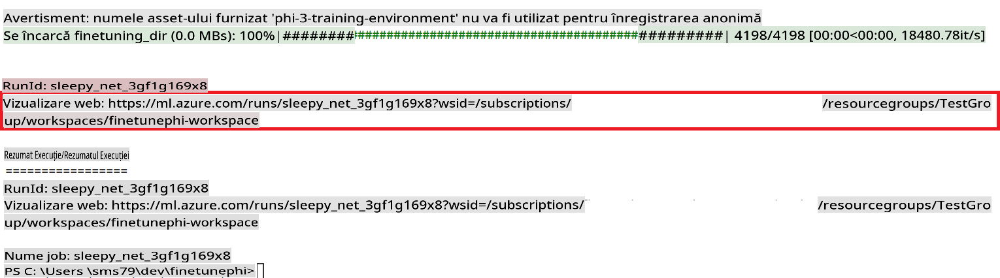

### Deploy the fine-tuned model

To integrate the fine-tuned Phi-3 model with Prompt Flow, you need to deploy the model to make it accessible for real-time inference. This process involves registering the model, creating an online endpoint, and deploying the model.

#### Set the model name, endpoint name, and deployment name for deployment

1. Open *config.py* file.

1. Replace `AZURE_MODEL_NAME = "your_fine_tuned_model_name"` with the desired name for your model.

1. Replace `AZURE_ENDPOINT_NAME = "your_fine_tuned_model_endpoint_name"` with the desired name for your endpoint.

1. Replace `AZURE_DEPLOYMENT_NAME = "your_fine_tuned_model_deployment_name"` cu numele dorit pentru implementarea ta.

#### Adaugă cod în fișierul *deploy_model.py*

Rularea fișierului *deploy_model.py* automatizează întregul proces de implementare. Acesta înregistrează modelul, creează un endpoint și execută implementarea pe baza setărilor specificate în fișierul config.py, care include numele modelului, numele endpoint-ului și numele implementării.

1. Deschide fișierul *deploy_model.py* în Visual Studio Code.

1. Adaugă următorul cod în *deploy_model.py*.

    ```python
    import logging
    from azure.identity import AzureCliCredential
    from azure.ai.ml import MLClient
    from azure.ai.ml.entities import Model, ProbeSettings, ManagedOnlineEndpoint, ManagedOnlineDeployment, IdentityConfiguration, ManagedIdentityConfiguration, OnlineRequestSettings
    from azure.ai.ml.constants import AssetTypes

    # Configuration imports
    from config import (
        AZURE_SUBSCRIPTION_ID,
        AZURE_RESOURCE_GROUP_NAME,
        AZURE_ML_WORKSPACE_NAME,
        AZURE_MANAGED_IDENTITY_RESOURCE_ID,
        AZURE_MANAGED_IDENTITY_CLIENT_ID,
        AZURE_MODEL_NAME,
        AZURE_ENDPOINT_NAME,
        AZURE_DEPLOYMENT_NAME
    )

    # Constants
    JOB_NAME = "your-job-name"
    COMPUTE_INSTANCE_TYPE = "Standard_E4s_v3"

    deployment_env_vars = {
        "SUBSCRIPTION_ID": AZURE_SUBSCRIPTION_ID,
        "RESOURCE_GROUP_NAME": AZURE_RESOURCE_GROUP_NAME,
        "UAI_CLIENT_ID": AZURE_MANAGED_IDENTITY_CLIENT_ID,
    }

    # Logging setup
    logging.basicConfig(
        format="%(asctime)s - %(levelname)s - %(name)s - %(message)s",
        datefmt="%Y-%m-%d %H:%M:%S",
        level=logging.DEBUG
    )
    logger = logging.getLogger(__name__)

    def get_ml_client():
        """Initialize and return the ML Client."""
        credential = AzureCliCredential()
        return MLClient(credential, AZURE_SUBSCRIPTION_ID, AZURE_RESOURCE_GROUP_NAME, AZURE_ML_WORKSPACE_NAME)

    def register_model(ml_client, model_name, job_name):
        """Register a new model."""
        model_path = f"azureml://jobs/{job_name}/outputs/artifacts/paths/model_output"
        logger.info(f"Registering model {model_name} from job {job_name} at path {model_path}.")
        run_model = Model(
            path=model_path,
            name=model_name,
            description="Model created from run.",
            type=AssetTypes.MLFLOW_MODEL,
        )
        model = ml_client.models.create_or_update(run_model)
        logger.info(f"Registered model ID: {model.id}")
        return model

    def delete_existing_endpoint(ml_client, endpoint_name):
        """Delete existing endpoint if it exists."""
        try:
            endpoint_result = ml_client.online_endpoints.get(name=endpoint_name)
            logger.info(f"Deleting existing endpoint {endpoint_name}.")
            ml_client.online_endpoints.begin_delete(name=endpoint_name).result()
            logger.info(f"Deleted existing endpoint {endpoint_name}.")
        except Exception as e:
            logger.info(f"No existing endpoint {endpoint_name} found to delete: {e}")

    def create_or_update_endpoint(ml_client, endpoint_name, description=""):
        """Create or update an endpoint."""
        delete_existing_endpoint(ml_client, endpoint_name)
        logger.info(f"Creating new endpoint {endpoint_name}.")
        endpoint = ManagedOnlineEndpoint(
            name=endpoint_name,
            description=description,
            identity=IdentityConfiguration(
                type="user_assigned",
                user_assigned_identities=[ManagedIdentityConfiguration(resource_id=AZURE_MANAGED_IDENTITY_RESOURCE_ID)]
            )
        )
        endpoint_result = ml_client.online_endpoints.begin_create_or_update(endpoint).result()
        logger.info(f"Created new endpoint {endpoint_name}.")
        return endpoint_result

    def create_or_update_deployment(ml_client, endpoint_name, deployment_name, model):
        """Create or update a deployment."""

        logger.info(f"Creating deployment {deployment_name} for endpoint {endpoint_name}.")
        deployment = ManagedOnlineDeployment(
            name=deployment_name,
            endpoint_name=endpoint_name,
            model=model.id,
            instance_type=COMPUTE_INSTANCE_TYPE,
            instance_count=1,
            environment_variables=deployment_env_vars,
            request_settings=OnlineRequestSettings(
                max_concurrent_requests_per_instance=3,
                request_timeout_ms=180000,
                max_queue_wait_ms=120000
            ),
            liveness_probe=ProbeSettings(
                failure_threshold=30,
                success_threshold=1,
                period=100,
                initial_delay=500,
            ),
            readiness_probe=ProbeSettings(
                failure_threshold=30,
                success_threshold=1,
                period=100,
                initial_delay=500,
            ),
        )
        deployment_result = ml_client.online_deployments.begin_create_or_update(deployment).result()
        logger.info(f"Created deployment {deployment.name} for endpoint {endpoint_name}.")
        return deployment_result

    def set_traffic_to_deployment(ml_client, endpoint_name, deployment_name):
        """Set traffic to the specified deployment."""
        try:
            # Fetch the current endpoint details
            endpoint = ml_client.online_endpoints.get(name=endpoint_name)
            
            # Log the current traffic allocation for debugging
            logger.info(f"Current traffic allocation: {endpoint.traffic}")
            
            # Set the traffic allocation for the deployment
            endpoint.traffic = {deployment_name: 100}
            
            # Update the endpoint with the new traffic allocation
            endpoint_poller = ml_client.online_endpoints.begin_create_or_update(endpoint)
            updated_endpoint = endpoint_poller.result()
            
            # Log the updated traffic allocation for debugging
            logger.info(f"Updated traffic allocation: {updated_endpoint.traffic}")
            logger.info(f"Set traffic to deployment {deployment_name} at endpoint {endpoint_name}.")
            return updated_endpoint
        except Exception as e:
            # Log any errors that occur during the process
            logger.error(f"Failed to set traffic to deployment: {e}")
            raise


    def main():
        ml_client = get_ml_client()

        registered_model = register_model(ml_client, AZURE_MODEL_NAME, JOB_NAME)
        logger.info(f"Registered model ID: {registered_model.id}")

        endpoint = create_or_update_endpoint(ml_client, AZURE_ENDPOINT_NAME, "Endpoint for finetuned Phi-3 model")
        logger.info(f"Endpoint {AZURE_ENDPOINT_NAME} is ready.")

        try:
            deployment = create_or_update_deployment(ml_client, AZURE_ENDPOINT_NAME, AZURE_DEPLOYMENT_NAME, registered_model)
            logger.info(f"Deployment {AZURE_DEPLOYMENT_NAME} is created for endpoint {AZURE_ENDPOINT_NAME}.")

            set_traffic_to_deployment(ml_client, AZURE_ENDPOINT_NAME, AZURE_DEPLOYMENT_NAME)
            logger.info(f"Traffic is set to deployment {AZURE_DEPLOYMENT_NAME} at endpoint {AZURE_ENDPOINT_NAME}.")
        except Exception as e:
            logger.error(f"Failed to create or update deployment: {e}")

    if __name__ == "__main__":
        main()

    ```

1. Realizează următorii pași pentru a obține `JOB_NAME`:

    - Navigate to Azure Machine Learning resource that you created.
    - Select **Studio web URL** to open the Azure Machine Learning workspace.
    - Select **Jobs** from the left side tab.
    - Select the experiment for fine-tuning. For example, *finetunephi*.
    - Select the job that you created.
    - Copy and paste your job Name into the `JOB_NAME = "your-job-name"` in *deploy_model.py* file.

1. Replace `COMPUTE_INSTANCE_TYPE` cu detaliile tale specifice.

1. Tastează următoarea comandă pentru a rula scriptul *deploy_model.py* și a începe procesul de implementare în Azure Machine Learning.

    ```python
    python deploy_model.py
    ```

> [!WARNING]
> Pentru a evita costuri suplimentare în contul tău, asigură-te că ștergi endpoint-ul creat în workspace-ul Azure Machine Learning.
>

#### Verifică statusul implementării în Workspace-ul Azure Machine Learning

1. Vizitează [Azure ML Studio](https://ml.azure.com/home?wt.mc_id=studentamb_279723).

1. Navighează la workspace-ul Azure Machine Learning pe care l-ai creat.

1. Selectează **Studio web URL** pentru a deschide workspace-ul Azure Machine Learning.

1. Selectează **Endpoints** din bara laterală.

    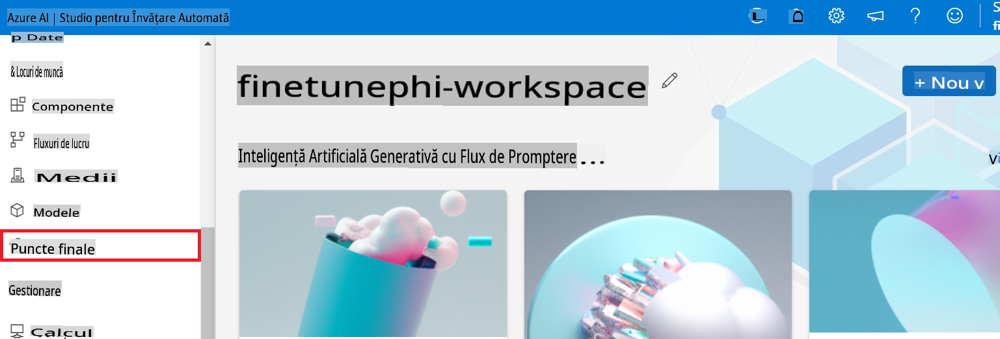

2. Selectează endpoint-ul pe care l-ai creat.

    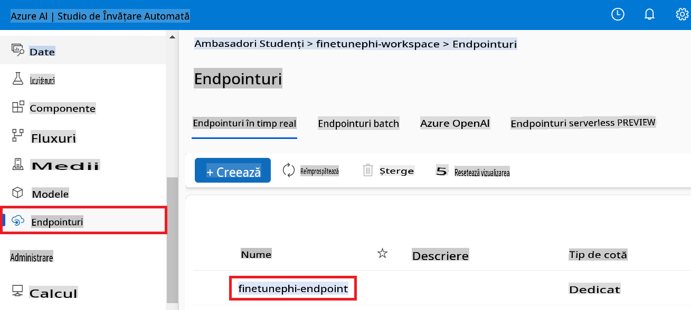

3. Pe această pagină, poți gestiona endpoint-urile create în timpul procesului de implementare.

## Scenariul 3: Integrare cu Prompt flow și interacționează cu modelul tău personalizat

### Integrează modelul personalizat Phi-3 cu Prompt flow

După ce ai implementat cu succes modelul tău fine-tuned, îl poți integra cu Prompt flow pentru a-l utiliza în aplicații în timp real, permițând o varietate de sarcini interactive cu modelul tău personalizat Phi-3.

#### Setează cheia API și URI-ul endpoint-ului pentru modelul Phi-3 personalizat

1. Navighează la workspace-ul Azure Machine Learning pe care l-ai creat.
1. Selectează **Endpoints** din bara laterală.
1. Selectează endpoint-ul pe care l-ai creat.
1. Selectează **Consume** din meniul de navigare.
1. Copiază și lipește **REST endpoint** în fișierul *config.py*, înlocuind `AZURE_ML_ENDPOINT = "your_fine_tuned_model_endpoint_uri"` with your **REST endpoint**.
1. Copy and paste your **Primary key** into the *config.py* file, replacing `AZURE_ML_API_KEY = "your_fine_tuned_model_api_key"` cu **Primary key**.

    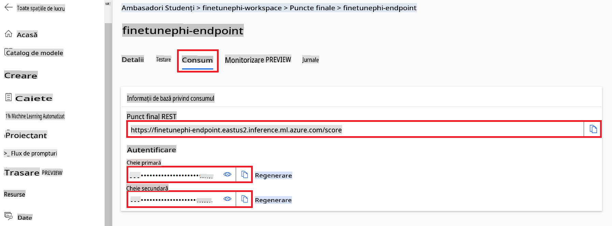

#### Adaugă cod în fișierul *flow.dag.yml*

1. Deschide fișierul *flow.dag.yml* în Visual Studio Code.

1. Adaugă următorul cod în *flow.dag.yml*.

    ```yml
    inputs:
      input_data:
        type: string
        default: "Who founded Microsoft?"

    outputs:
      answer:
        type: string
        reference: ${integrate_with_promptflow.output}

    nodes:
    - name: integrate_with_promptflow
      type: python
      source:
        type: code
        path: integrate_with_promptflow.py
      inputs:
        input_data: ${inputs.input_data}
    ```

#### Adaugă cod în fișierul *integrate_with_promptflow.py*

1. Deschide fișierul *integrate_with_promptflow.py* în Visual Studio Code.

1. Adaugă următorul cod în *integrate_with_promptflow.py*.

    ```python
    import logging
    import requests
    from promptflow.core import tool
    import asyncio
    import platform
    from config import (
        AZURE_ML_ENDPOINT,
        AZURE_ML_API_KEY
    )

    # Logging setup
    logging.basicConfig(
        format="%(asctime)s - %(levelname)s - %(name)s - %(message)s",
        datefmt="%Y-%m-%d %H:%M:%S",
        level=logging.DEBUG
    )
    logger = logging.getLogger(__name__)

    def query_azml_endpoint(input_data: list, endpoint_url: str, api_key: str) -> str:
        """
        Send a request to the Azure ML endpoint with the given input data.
        """
        headers = {
            "Content-Type": "application/json",
            "Authorization": f"Bearer {api_key}"
        }
        data = {
            "input_data": [input_data],
            "params": {
                "temperature": 0.7,
                "max_new_tokens": 128,
                "do_sample": True,
                "return_full_text": True
            }
        }
        try:
            response = requests.post(endpoint_url, json=data, headers=headers)
            response.raise_for_status()
            result = response.json()[0]
            logger.info("Successfully received response from Azure ML Endpoint.")
            return result
        except requests.exceptions.RequestException as e:
            logger.error(f"Error querying Azure ML Endpoint: {e}")
            raise

    def setup_asyncio_policy():
        """
        Setup asyncio event loop policy for Windows.
        """
        if platform.system() == 'Windows':
            asyncio.set_event_loop_policy(asyncio.WindowsSelectorEventLoopPolicy())
            logger.info("Set Windows asyncio event loop policy.")

    @tool
    def my_python_tool(input_data: str) -> str:
        """
        Tool function to process input data and query the Azure ML endpoint.
        """
        setup_asyncio_policy()
        return query_azml_endpoint(input_data, AZURE_ML_ENDPOINT, AZURE_ML_API_KEY)

    ```

### Interacționează cu modelul tău personalizat

1. Tastează următoarea comandă pentru a rula scriptul *deploy_model.py* și a începe procesul de implementare în Azure Machine Learning.

    ```python
    pf flow serve --source ./ --port 8080 --host localhost
    ```

1. Iată un exemplu de rezultate: Acum poți interacționa cu modelul tău personalizat Phi-3. Este recomandat să pui întrebări bazate pe datele utilizate pentru fine-tuning.

    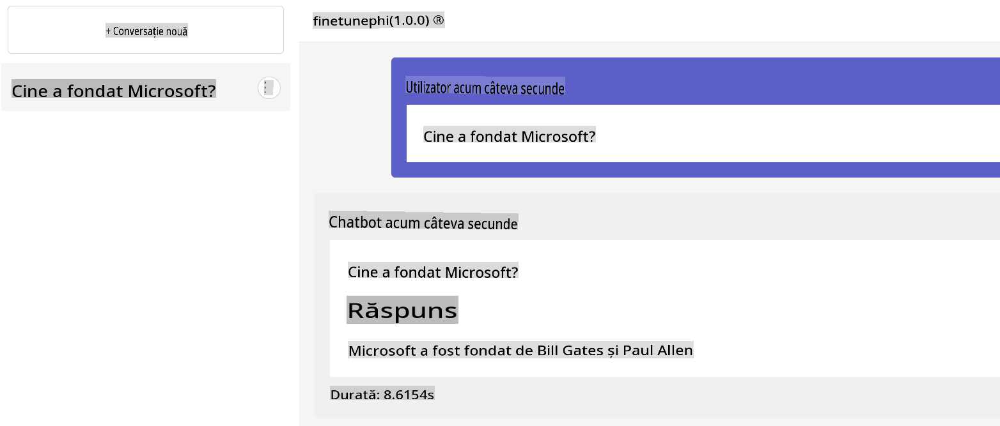

**Declinarea responsabilității**:  
Acest document a fost tradus utilizând servicii de traducere bazate pe inteligență artificială. Deși depunem eforturi pentru a asigura acuratețea, vă rugăm să rețineți că traducerile automate pot conține erori sau inexactități. Documentul original, în limba sa natală, ar trebui considerat sursa autoritară. Pentru informații critice, se recomandă traducerea realizată de un profesionist uman. Nu ne asumăm răspunderea pentru neînțelegerile sau interpretările greșite care pot apărea din utilizarea acestei traduceri.