# Ajuste fin și integrare a modelelor personalizate Phi-3 cu Prompt Flow în Azure AI Foundry

Acest exemplu complet (E2E) se bazează pe ghidul "[Fine-Tune and Integrate Custom Phi-3 Models with Prompt Flow in Azure AI Foundry](https://techcommunity.microsoft.com/t5/educator-developer-blog/fine-tune-and-integrate-custom-phi-3-models-with-prompt-flow-in/ba-p/4191726?WT.mc_id=aiml-137032-kinfeylo)" din Microsoft Tech Community. Ghidul introduce procesele de ajustare fină, implementare și integrare a modelelor personalizate Phi-3 cu Prompt Flow în Azure AI Foundry.  
Spre deosebire de exemplul complet "[Fine-Tune and Integrate Custom Phi-3 Models with Prompt Flow](./E2E_Phi-3-FineTuning_PromptFlow_Integration.md)", care presupunea rularea codului local, acest tutorial se concentrează exclusiv pe ajustarea fină și integrarea modelului în cadrul Azure AI / ML Studio.

## Prezentare generală

În acest exemplu complet, vei învăța cum să ajustezi fin modelul Phi-3 și să îl integrezi cu Prompt Flow în Azure AI Foundry. Prin utilizarea Azure AI / ML Studio, vei stabili un flux de lucru pentru implementarea și utilizarea modelelor AI personalizate. Acest exemplu complet este împărțit în trei scenarii:

**Scenariul 1: Configurarea resurselor Azure și pregătirea pentru ajustare fină**  
**Scenariul 2: Ajustarea fină a modelului Phi-3 și implementarea în Azure Machine Learning Studio**  
**Scenariul 3: Integrarea cu Prompt Flow și interacțiunea cu modelul personalizat în Azure AI Foundry**

Iată o prezentare generală a acestui exemplu complet.

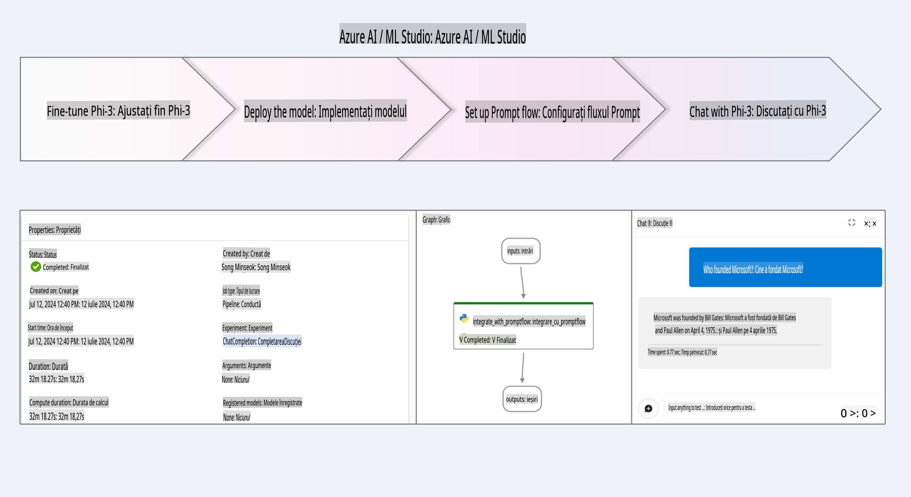

### Cuprins

1. **[Scenariul 1: Configurarea resurselor Azure și pregătirea pentru ajustare fină](../../../../../../md/02.Application/01.TextAndChat/Phi3)**  
    - [Crearea unui Azure Machine Learning Workspace](../../../../../../md/02.Application/01.TextAndChat/Phi3)  
    - [Solicitarea cotelor GPU în abonamentul Azure](../../../../../../md/02.Application/01.TextAndChat/Phi3)  
    - [Adăugarea unei asignări de rol](../../../../../../md/02.Application/01.TextAndChat/Phi3)  
    - [Configurarea proiectului](../../../../../../md/02.Application/01.TextAndChat/Phi3)  
    - [Pregătirea setului de date pentru ajustare fină](../../../../../../md/02.Application/01.TextAndChat/Phi3)

1. **[Scenariul 2: Ajustarea fină a modelului Phi-3 și implementarea în Azure Machine Learning Studio](../../../../../../md/02.Application/01.TextAndChat/Phi3)**  
    - [Ajustarea fină a modelului Phi-3](../../../../../../md/02.Application/01.TextAndChat/Phi3)  
    - [Implementarea modelului Phi-3 ajustat fin](../../../../../../md/02.Application/01.TextAndChat/Phi3)

1. **[Scenariul 3: Integrarea cu Prompt Flow și interacțiunea cu modelul personalizat în Azure AI Foundry](../../../../../../md/02.Application/01.TextAndChat/Phi3)**  
    - [Integrarea modelului personalizat Phi-3 cu Prompt Flow](../../../../../../md/02.Application/01.TextAndChat/Phi3)  
    - [Interacțiunea cu modelul personalizat Phi-3](../../../../../../md/02.Application/01.TextAndChat/Phi3)

## Scenariul 1: Configurarea resurselor Azure și pregătirea pentru ajustare fină

### Crearea unui Azure Machine Learning Workspace

1. Tastează *azure machine learning* în **bara de căutare** din partea de sus a paginii portalului și selectează **Azure Machine Learning** din opțiunile care apar.

    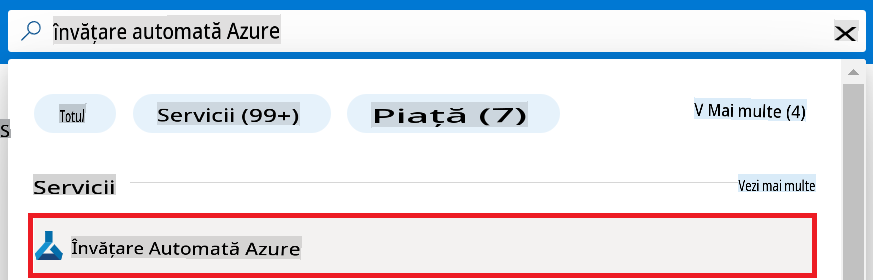

2. Selectează **+ Create** din meniul de navigare.

3. Selectează **New workspace** din meniul de navigare.

    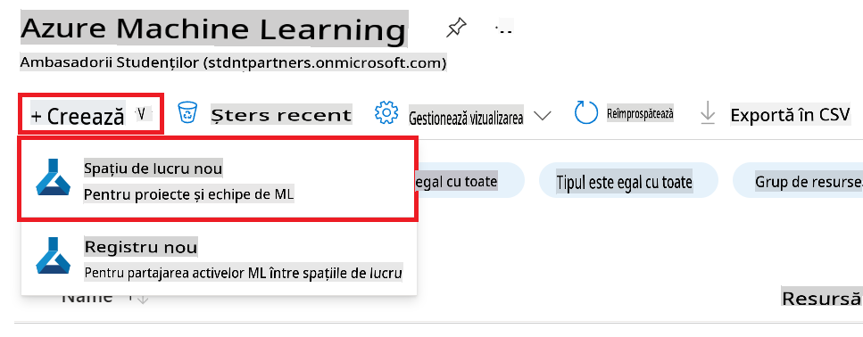

4. Realizează următoarele acțiuni:

    - Selectează **Abonamentul Azure**.
    - Selectează **Grupul de resurse** pe care dorești să îl utilizezi (creează unul nou, dacă este necesar).
    - Introdu **Numele Workspace-ului**. Trebuie să fie un nume unic.
    - Selectează **Regiunea** pe care dorești să o utilizezi.
    - Selectează **Contul de stocare** pe care dorești să îl utilizezi (creează unul nou, dacă este necesar).
    - Selectează **Key Vault** pe care dorești să îl utilizezi (creează unul nou, dacă este necesar).
    - Selectează **Application Insights** pe care dorești să îl utilizezi (creează unul nou, dacă este necesar).
    - Selectează **Container Registry** pe care dorești să îl utilizezi (creează unul nou, dacă este necesar).

    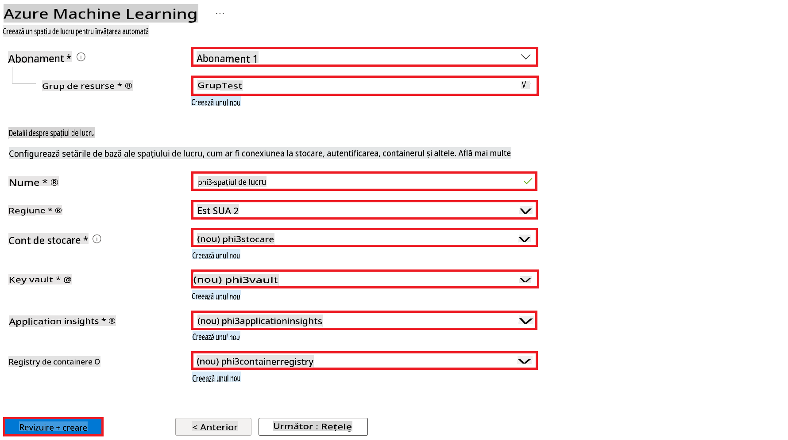

5. Selectează **Review + Create**.

6. Selectează **Create**.

### Solicitarea cotelor GPU în abonamentul Azure

În acest tutorial, vei învăța cum să ajustezi fin și să implementezi un model Phi-3 utilizând GPU-uri. Pentru ajustarea fină, vei utiliza GPU-ul *Standard_NC24ads_A100_v4*, care necesită o solicitare de cotă. Pentru implementare, vei utiliza GPU-ul *Standard_NC6s_v3*, care de asemenea necesită o solicitare de cotă.

> [!NOTE]
>
> Doar abonamentele de tip Pay-As-You-Go (tipul standard de abonament) sunt eligibile pentru alocarea GPU-urilor; abonamentele de tip beneficii nu sunt momentan suportate.
>

1. Vizitează [Azure ML Studio](https://ml.azure.com/home?wt.mc_id=studentamb_279723).

1. Realizează următoarele acțiuni pentru a solicita cota pentru familia *Standard NCADSA100v4*:

    - Selectează **Quota** din bara laterală stângă.
    - Selectează **Familia de mașini virtuale** pe care dorești să o utilizezi. De exemplu, selectează **Standard NCADSA100v4 Family Cluster Dedicated vCPUs**, care include GPU-ul *Standard_NC24ads_A100_v4*.
    - Selectează **Request quota** din meniul de navigare.

        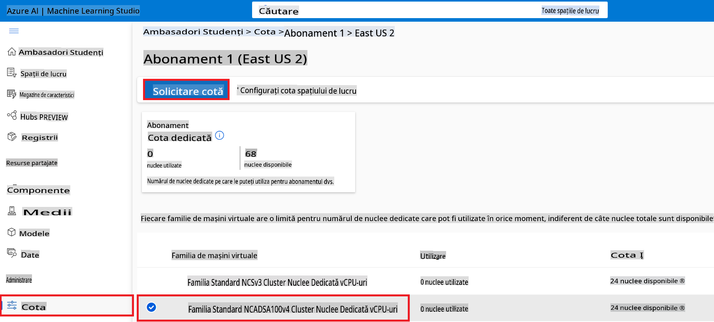

    - În pagina de solicitare a cotei, introdu **Limita de nuclee noi** pe care dorești să o utilizezi. De exemplu, 24.
    - În pagina de solicitare a cotei, selectează **Submit** pentru a solicita cota GPU.

1. Realizează următoarele acțiuni pentru a solicita cota pentru familia *Standard NCSv3*:

    - Selectează **Quota** din bara laterală stângă.
    - Selectează **Familia de mașini virtuale** pe care dorești să o utilizezi. De exemplu, selectează **Standard NCSv3 Family Cluster Dedicated vCPUs**, care include GPU-ul *Standard_NC6s_v3*.
    - Selectează **Request quota** din meniul de navigare.
    - În pagina de solicitare a cotei, introdu **Limita de nuclee noi** pe care dorești să o utilizezi. De exemplu, 24.
    - În pagina de solicitare a cotei, selectează **Submit** pentru a solicita cota GPU.

### Adăugarea unei asignări de rol

Pentru a ajusta fin și implementa modelele tale, trebuie mai întâi să creezi o Identitate Gestionată Atribuită Utilizatorului (UAI) și să îi atribui permisiunile corespunzătoare. Această UAI va fi utilizată pentru autentificare în timpul implementării.

#### Crearea unei Identități Gestionate Atribuite Utilizatorului (UAI)

1. Tastează *managed identities* în **bara de căutare** din partea de sus a paginii portalului și selectează **Managed Identities** din opțiunile care apar.

    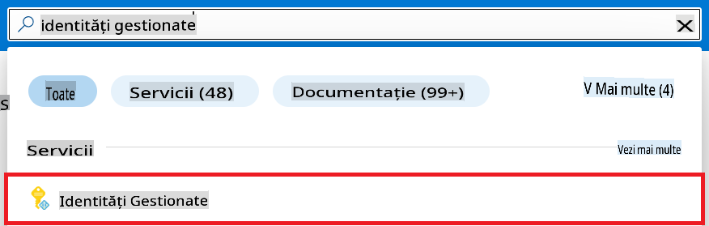

1. Selectează **+ Create**.

    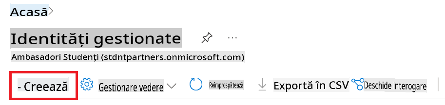

1. Realizează următoarele acțiuni:

    - Selectează **Abonamentul Azure**.
    - Selectează **Grupul de resurse** pe care dorești să îl utilizezi (creează unul nou, dacă este necesar).
    - Selectează **Regiunea** pe care dorești să o utilizezi.
    - Introdu **Numele**. Trebuie să fie un nume unic.

    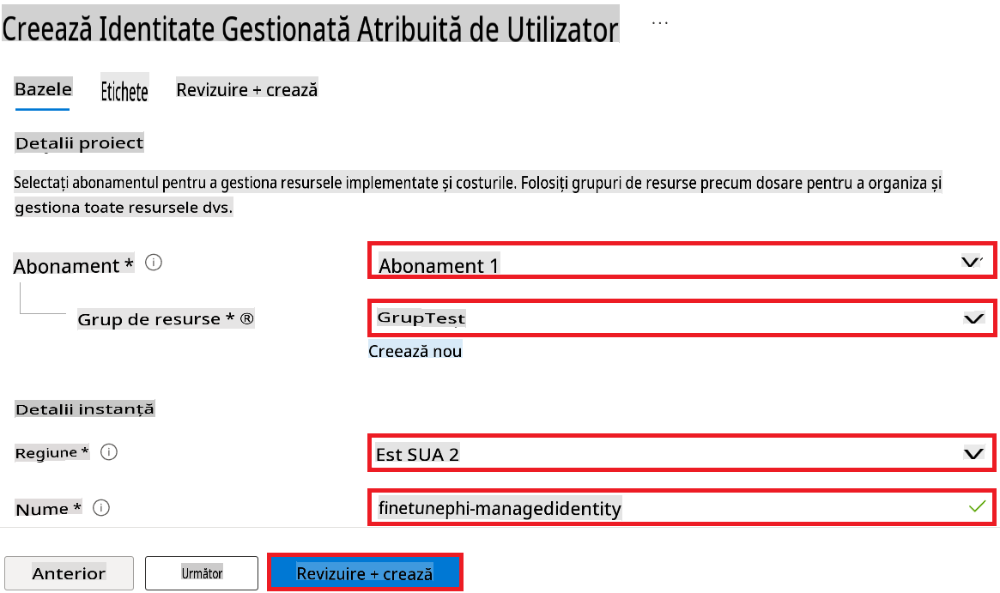

1. Selectează **Review + create**.

1. Selectează **+ Create**.

#### Adăugarea rolului Contributor la Identitatea Gestionată

1. Navighează la resursa Identitate Gestionată pe care ai creat-o.

1. Selectează **Azure role assignments** din bara laterală stângă.

1. Selectează **+Add role assignment** din meniul de navigare.

1. În pagina de adăugare a rolului, realizează următoarele acțiuni:
    - Selectează **Scope** ca **Resource group**.
    - Selectează **Abonamentul Azure**.
    - Selectează **Grupul de resurse** pe care dorești să îl utilizezi.
    - Selectează **Rolul** ca **Contributor**.

    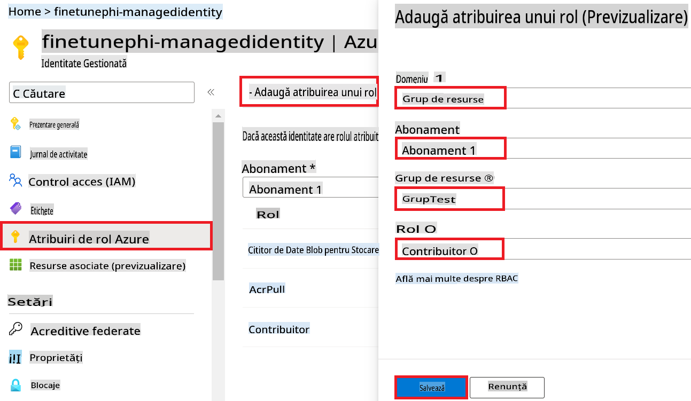

2. Selectează **Save**.

#### Adăugarea rolului Storage Blob Data Reader la Identitatea Gestionată

1. Tastează *storage accounts* în **bara de căutare** din partea de sus a paginii portalului și selectează **Storage accounts** din opțiunile care apar.

    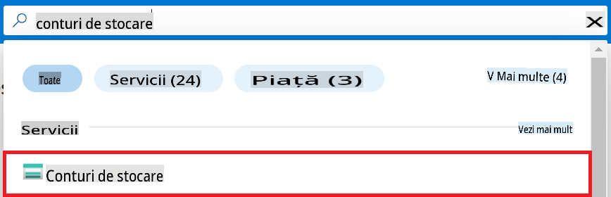

1. Selectează contul de stocare asociat cu workspace-ul Azure Machine Learning pe care l-ai creat. De exemplu, *finetunephistorage*.

1. Realizează următoarele acțiuni pentru a naviga la pagina de adăugare a rolului:

    - Navighează la contul Azure Storage pe care l-ai creat.
    - Selectează **Access Control (IAM)** din bara laterală stângă.
    - Selectează **+ Add** din meniul de navigare.
    - Selectează **Add role assignment** din meniul de navigare.

    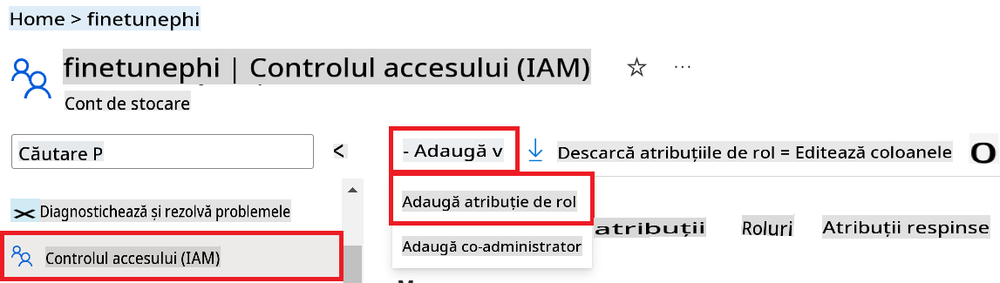

1. În pagina de adăugare a rolului, realizează următoarele acțiuni:

    - În pagina Rol, tastează *Storage Blob Data Reader* în **bara de căutare** și selectează **Storage Blob Data Reader** din opțiunile care apar.
    - În pagina Rol, selectează **Next**.
    - În pagina Members, selectează **Assign access to** **Managed identity**.
    - În pagina Members, selectează **+ Select members**.
    - În pagina Select managed identities, selectează **Abonamentul Azure**.
    - În pagina Select managed identities, selectează **Identitatea Gestionată**.
    - În pagina Select managed identities, selectează Identitatea Gestionată pe care ai creat-o. De exemplu, *finetunephi-managedidentity*.
    - În pagina Select managed identities, selectează **Select**.

    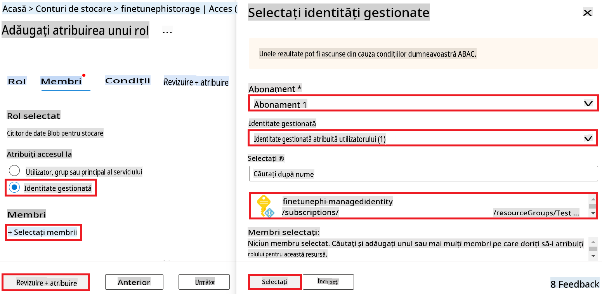

1. Selectează **Review + assign**.

#### Adăugarea rolului AcrPull la Identitatea Gestionată

1. Tastează *container registries* în **bara de căutare** din partea de sus a paginii portalului și selectează **Container registries** din opțiunile care apar.

    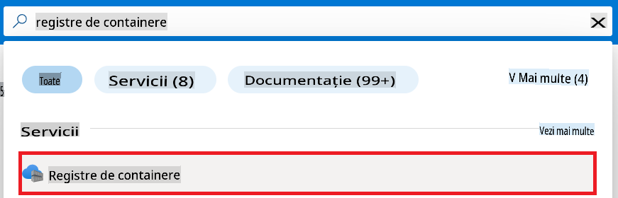

1. Selectează registrul de containere asociat cu workspace-ul Azure Machine Learning. De exemplu, *finetunephicontainerregistry*.

1. Realizează următoarele acțiuni pentru a naviga la pagina de adăugare a rolului:

    - Selectează **Access Control (IAM)** din bara laterală stângă.
    - Selectează **+ Add** din meniul de navigare.
    - Selectează **Add role assignment** din meniul de navigare.

1. În pagina de adăugare a rolului, realizează următoarele acțiuni:

    - În pagina Rol, tastează *AcrPull* în **bara de căutare** și selectează **AcrPull** din opțiunile care apar.
    - În pagina Rol, selectează **Next**.
    - În pagina Members, selectează **Assign access to** **Managed identity**.
    - În pagina Members, selectează **+ Select members**.
    - În pagina Select managed identities, selectează **Abonamentul Azure**.
    - În pagina Select managed identities, selectează **Identitatea Gestionată**.
    - În pagina Select managed identities, selectează Identitatea Gestionată pe care ai creat-o. De exemplu, *finetunephi-managedidentity*.
    - În pagina Select managed identities, selectează **Select**.
    - Selectează **Review + assign**.

### Configurarea proiectului

Pentru a descărca seturile de date necesare pentru ajustare fină, vei configura un mediu local.

În acest exercițiu, vei:

- Crea un folder pentru a lucra în el.
- Crea un mediu virtual.
- Instala pachetele necesare.
- Crea un fișier *download_dataset.py* pentru a descărca setul de date.

#### Crearea unui folder pentru a lucra în el

1. Deschide o fereastră de terminal și tastează următoarea comandă pentru a crea un folder numit *finetune-phi* în calea implicită.

    ```console
    mkdir finetune-phi
    ```

2. Tastează următoarea comandă în terminal pentru a naviga la folderul *finetune-phi* pe care l-ai creat.

    ```console
    cd finetune-phi
    ```

#### Crearea unui mediu virtual

1. Tastează următoarea comandă în terminal pentru a crea un mediu virtual numit *.venv*.

    ```console
    python -m venv .venv
    ```

2. Tastează următoarea comandă în terminal pentru a activa mediul virtual.

    ```console
    .venv\Scripts\activate.bat
    ```

> [!NOTE]  
> Dacă a funcționat, ar trebui să vezi *(.venv)* înainte de promptul terminalului.

#### Instalarea pachetelor necesare

1. Tastează următoarele comenzi în terminal pentru a instala pachetele necesare.

    ```console
    pip install datasets==2.19.1
    ```

#### Crearea fișierului `download_dataset.py`

> [!NOTE]  
> Structura completă a folderului:  
>
> ```text
> └── YourUserName
> .    └── finetune-phi
> .        └── download_dataset.py
> ```

1. Deschide **Visual Studio Code**.

1. Selectează **File** din bara de meniu.

1. Selectează **Open Folder**.

1. Selectează folderul *finetune-phi* pe care l-ai creat, situat la *C:\Users\yourUserName\finetune-phi*.

    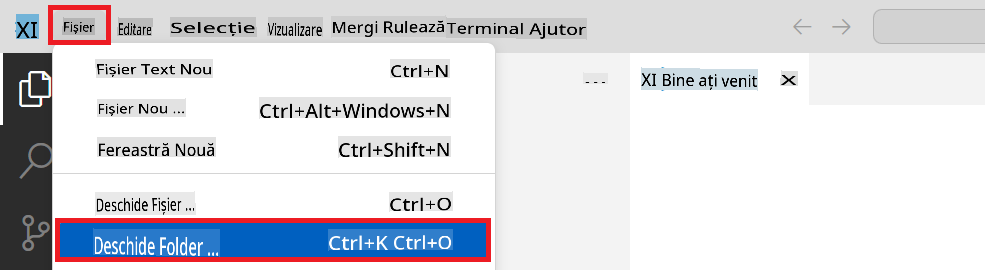

1. În panoul din stânga al Visual Studio Code, fă clic dreapta și selectează **New File** pentru a crea un fișier nou numit *download_dataset.py*.

    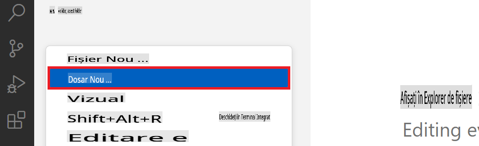

### Pregătirea setului de date pentru ajustare fină

În acest exercițiu, vei rula fișierul *download_dataset.py* pentru a descărca seturile de date *ultrachat_200k* în mediul tău local. Vei utiliza apoi aceste seturi de date pentru a ajusta fin modelul Phi-3 în Azure Machine Learning.

În acest exercițiu, vei:

- Adăuga cod în fișierul *download_dataset.py* pentru a descărca seturile de date.
- Rula fișierul *download_dataset.py* pentru a descărca seturile de date în mediul tău local.

#### Descărcarea setului de date folosind *download_dataset.py*

1. Deschide fișierul *
1. Accesați [Azure ML Studio](https://ml.azure.com/home?wt.mc_id=studentamb_279723).

1. Selectați **Compute** din bara laterală stângă.

1. Selectați **Compute clusters** din meniul de navigare.

1. Selectați **+ New**.

    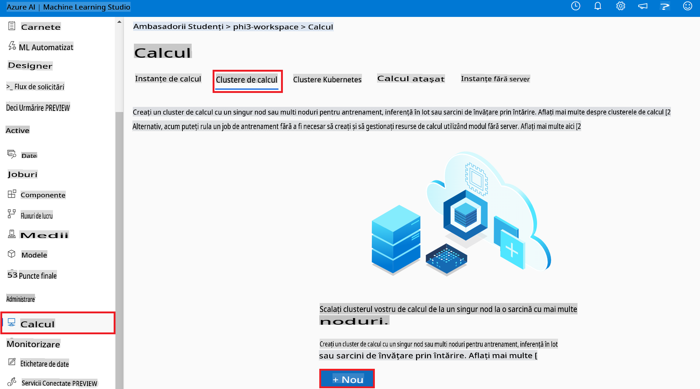

1. Efectuați următoarele acțiuni:

    - Selectați **Region** pe care doriți să o utilizați.
    - Selectați **Virtual machine tier** la **Dedicated**.
    - Selectați **Virtual machine type** la **GPU**.
    - Filtrați **Virtual machine size** la **Select from all options**.
    - Selectați **Virtual machine size** la **Standard_NC24ads_A100_v4**.

    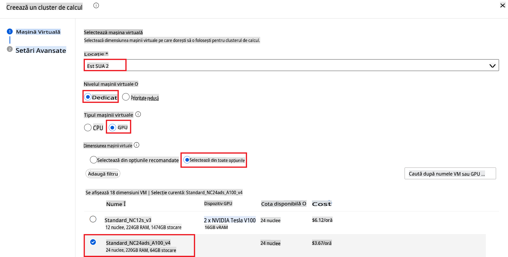

1. Selectați **Next**.

1. Efectuați următoarele acțiuni:

    - Introduceți **Compute name**. Acesta trebuie să fie unic.
    - Setați **Minimum number of nodes** la **0**.
    - Setați **Maximum number of nodes** la **1**.
    - Setați **Idle seconds before scale down** la **120**.

    

1. Selectați **Create**.

#### Ajustarea modelului Phi-3

1. Accesați [Azure ML Studio](https://ml.azure.com/home?wt.mc_id=studentamb_279723).

1. Selectați spațiul de lucru Azure Machine Learning pe care l-ați creat.

    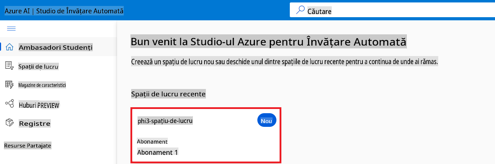

1. Efectuați următoarele acțiuni:

    - Selectați **Model catalog** din bara laterală stângă.
    - Introduceți *phi-3-mini-4k* în **bara de căutare** și selectați **Phi-3-mini-4k-instruct** din opțiunile afișate.

    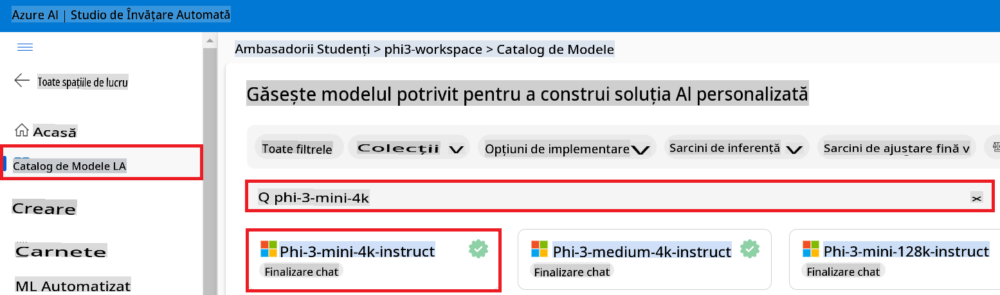

1. Selectați **Fine-tune** din meniul de navigare.

    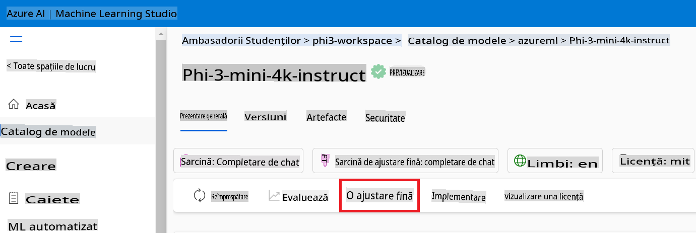

1. Efectuați următoarele acțiuni:

    - Setați **Select task type** la **Chat completion**.
    - Selectați **+ Select data** pentru a încărca **Traning data**.
    - Setați tipul de încărcare pentru Validation data la **Provide different validation data**.
    - Selectați **+ Select data** pentru a încărca **Validation data**.

    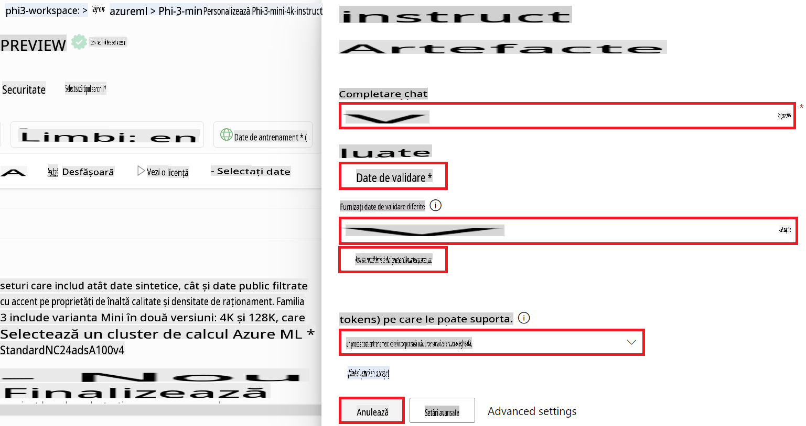

    > [!TIP]
    >
    > Puteți selecta **Advanced settings** pentru a personaliza configurările, precum **learning_rate** și **lr_scheduler_type**, pentru a optimiza procesul de ajustare în funcție de nevoile dvs.

1. Selectați **Finish**.

1. În acest exercițiu, ați ajustat cu succes modelul Phi-3 utilizând Azure Machine Learning. Rețineți că procesul de ajustare poate dura mult timp. După lansarea job-ului de ajustare, va trebui să așteptați finalizarea acestuia. Puteți monitoriza starea job-ului navigând la fila Jobs din bara laterală a spațiului dvs. de lucru Azure Machine Learning. În seria următoare, veți implementa modelul ajustat și îl veți integra cu Prompt flow.

    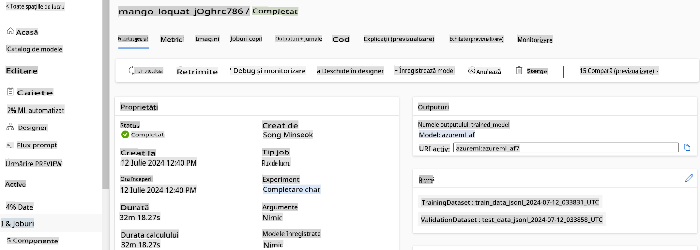

### Implementarea modelului Phi-3 ajustat

Pentru a integra modelul ajustat Phi-3 cu Prompt flow, trebuie să implementați modelul pentru a-l face accesibil pentru inferență în timp real. Acest proces implică înregistrarea modelului, crearea unui endpoint online și implementarea modelului.

În acest exercițiu, veți:

- Înregistra modelul ajustat în spațiul de lucru Azure Machine Learning.
- Crea un endpoint online.
- Implementa modelul Phi-3 ajustat.

#### Înregistrarea modelului ajustat

1. Accesați [Azure ML Studio](https://ml.azure.com/home?wt.mc_id=studentamb_279723).

1. Selectați spațiul de lucru Azure Machine Learning pe care l-ați creat.

    

1. Selectați **Models** din bara laterală stângă.
1. Selectați **+ Register**.
1. Selectați **From a job output**.

    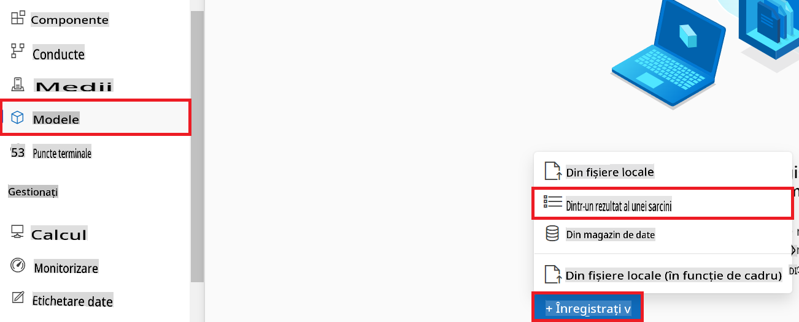

1. Selectați job-ul pe care l-ați creat.

    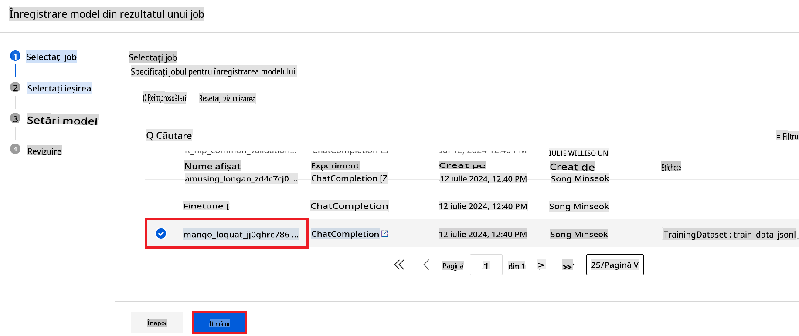

1. Selectați **Next**.

1. Setați **Model type** la **MLflow**.

1. Asigurați-vă că **Job output** este selectat; ar trebui să fie selectat automat.

    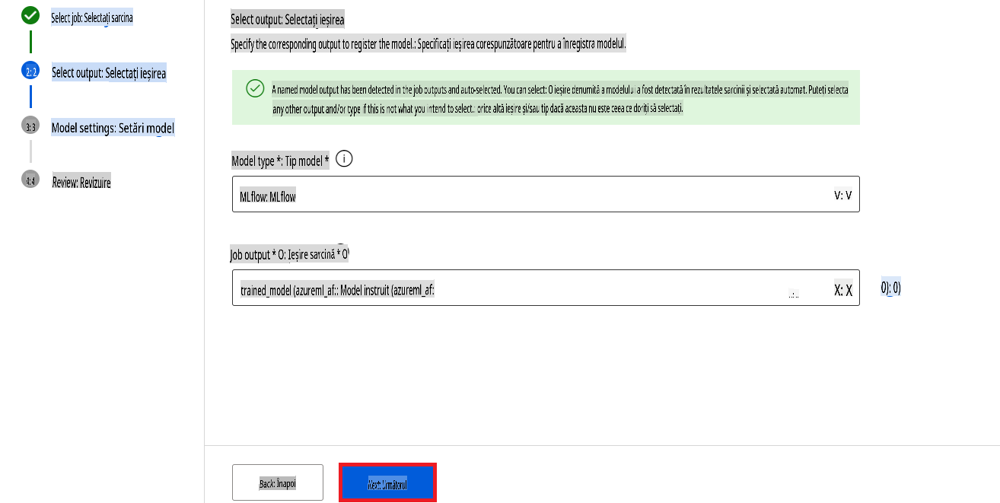

2. Selectați **Next**.

3. Selectați **Register**.

    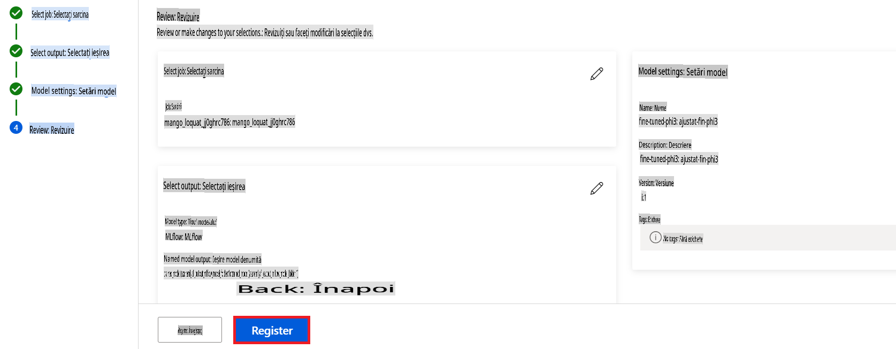

4. Puteți vizualiza modelul înregistrat navigând la meniul **Models** din bara laterală.

    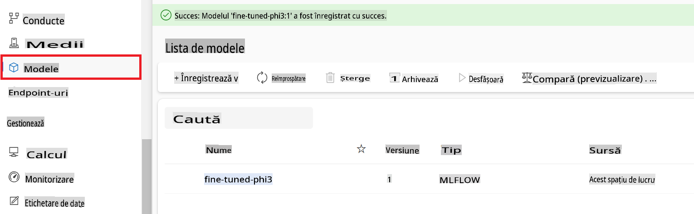

#### Implementarea modelului ajustat

1. Navigați la spațiul de lucru Azure Machine Learning pe care l-ați creat.

1. Selectați **Endpoints** din bara laterală stângă.

1. Selectați **Real-time endpoints** din meniul de navigare.

    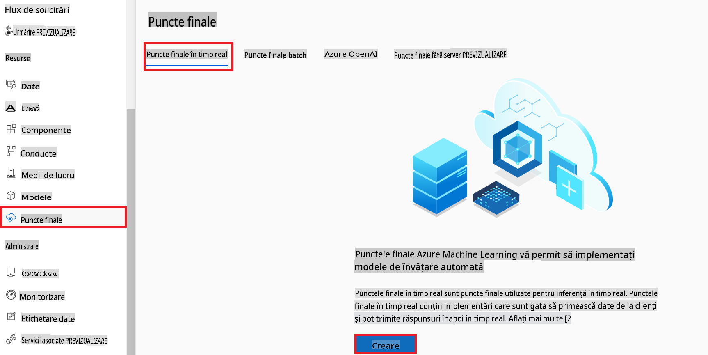

1. Selectați **Create**.

1. Selectați modelul înregistrat pe care l-ați creat.

    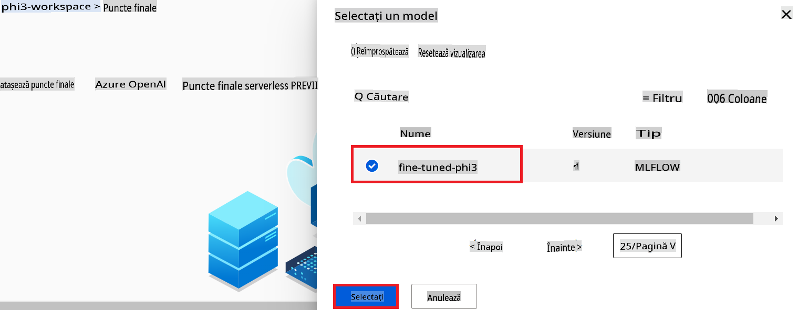

1. Selectați **Select**.

1. Efectuați următoarele acțiuni:

    - Setați **Virtual machine** la *Standard_NC6s_v3*.
    - Setați **Instance count** pe care doriți să îl utilizați. De exemplu, *1*.
    - Setați **Endpoint** la **New** pentru a crea un endpoint.
    - Introduceți **Endpoint name**. Acesta trebuie să fie unic.
    - Introduceți **Deployment name**. Acesta trebuie să fie unic.

    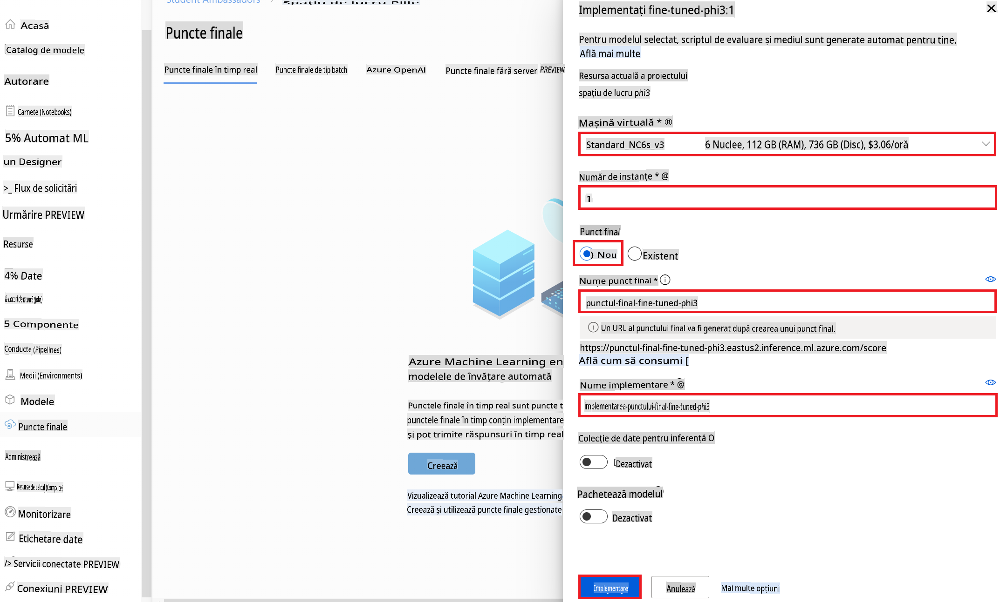

1. Selectați **Deploy**.

> [!WARNING]
> Pentru a evita costuri suplimentare în contul dvs., asigurați-vă că ștergeți endpoint-ul creat în spațiul de lucru Azure Machine Learning.
>

#### Verificați starea implementării în Azure Machine Learning Workspace

1. Navigați la spațiul de lucru Azure Machine Learning pe care l-ați creat.

1. Selectați **Endpoints** din bara laterală stângă.

1. Selectați endpoint-ul pe care l-ați creat.

    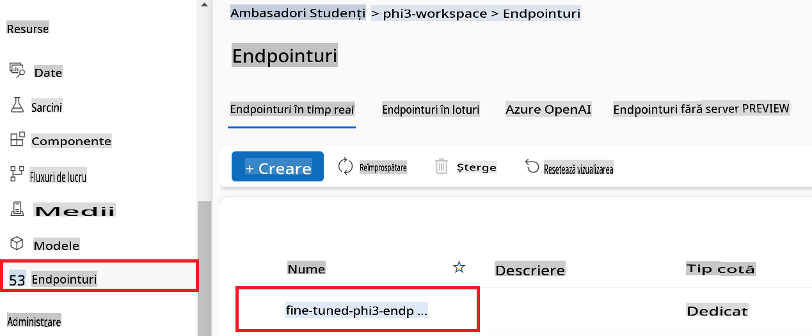

1. Pe această pagină, puteți gestiona endpoint-urile pe durata procesului de implementare.

> [!NOTE]
> Odată ce implementarea este completă, asigurați-vă că **Live traffic** este setat la **100%**. Dacă nu este, selectați **Update traffic** pentru a ajusta setările de trafic. Rețineți că nu puteți testa modelul dacă traficul este setat la 0%.
>
> 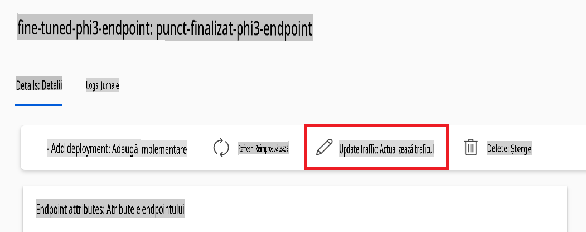
>

## Scenariul 3: Integrarea cu Prompt flow și interacțiunea cu modelul personalizat în Azure AI Foundry

### Integrarea modelului personalizat Phi-3 cu Prompt flow

După implementarea cu succes a modelului ajustat, acum îl puteți integra cu Prompt Flow pentru a-l utiliza în aplicații în timp real, permițând diverse sarcini interactive cu modelul dvs. personalizat Phi-3.

În acest exercițiu, veți:

- Crea un Hub Azure AI Foundry.
- Crea un Proiect Azure AI Foundry.
- Configura Prompt flow.
- Adăuga o conexiune personalizată pentru modelul ajustat Phi-3.
- Configura Prompt flow pentru a interacționa cu modelul dvs. personalizat Phi-3.

> [!NOTE]
> Puteți integra și cu Promptflow utilizând Azure ML Studio. Procesul de integrare este același și în Azure ML Studio.

#### Crearea unui Hub Azure AI Foundry

Trebuie să creați un Hub înainte de a crea un Proiect. Un Hub funcționează ca un Grup de Resurse, permițându-vă să organizați și să gestionați mai multe Proiecte în cadrul Azure AI Foundry.

1. Accesați [Azure AI Foundry](https://ai.azure.com/?WT.mc_id=aiml-137032-kinfeylo).

1. Selectați **All hubs** din bara laterală stângă.

1. Selectați **+ New hub** din meniul de navigare.

    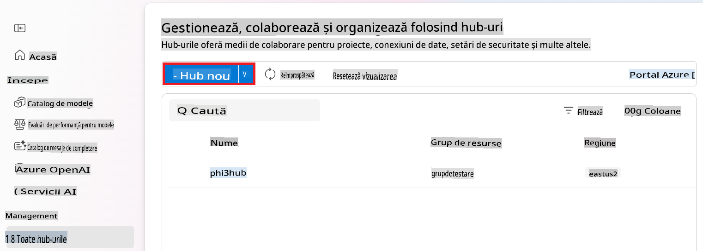

1. Efectuați următoarele acțiuni:

    - Introduceți **Hub name**. Acesta trebuie să fie unic.
    - Selectați **Subscription** Azure.
    - Alegeți **Resource group** pe care doriți să îl utilizați (creați unul nou dacă este necesar).
    - Selectați **Location** pe care doriți să o utilizați.
    - Conectați **Azure AI Services** (creați unul nou dacă este necesar).
    - Setați **Connect Azure AI Search** la **Skip connecting**.

    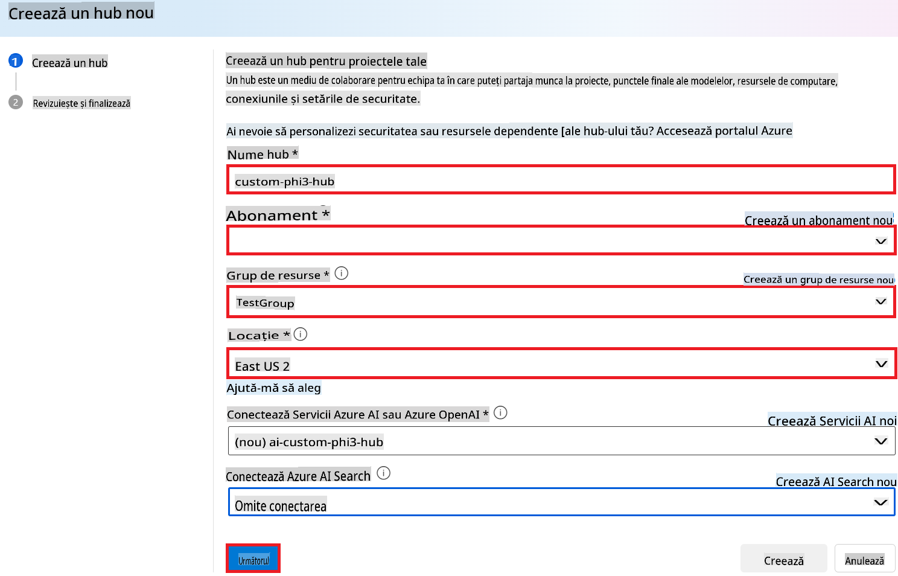

1. Selectați **Next**.

#### Crearea unui Proiect Azure AI Foundry

1. În Hub-ul pe care l-ați creat, selectați **All projects** din bara laterală stângă.

1. Selectați **+ New project** din meniul de navigare.

    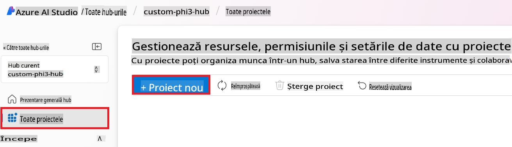

1. Introduceți **Project name**. Acesta trebuie să fie unic.

    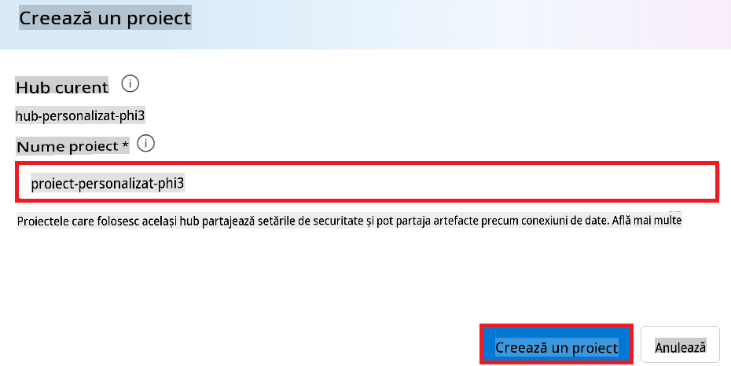

1. Selectați **Create a project**.

#### Adăugarea unei conexiuni personalizate pentru modelul ajustat Phi-3

Pentru a integra modelul personalizat Phi-3 cu Prompt flow, trebuie să salvați endpoint-ul și cheia modelului într-o conexiune personalizată. Această configurare asigură accesul la modelul dvs. personalizat Phi-3 în Prompt flow.

#### Setarea cheii API și a URI-ului endpoint-ului pentru modelul ajustat Phi-3

1. Accesați [Azure ML Studio](https://ml.azure.com/home?WT.mc_id=aiml-137032-kinfeylo).

1. Navigați la spațiul de lucru Azure Machine Learning pe care l-ați creat.

1. Selectați **Endpoints** din bara laterală stângă.

    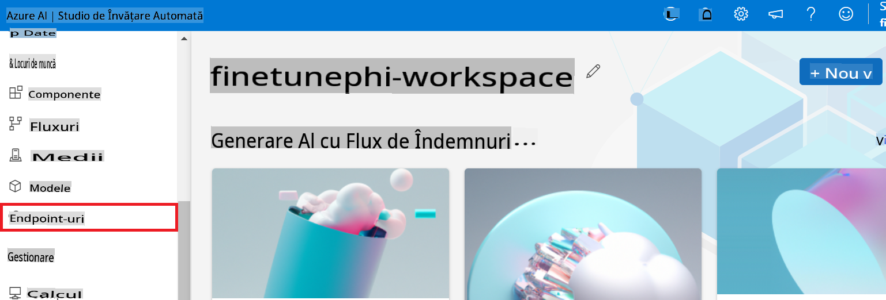

1. Selectați endpoint-ul pe care l-ați creat.

    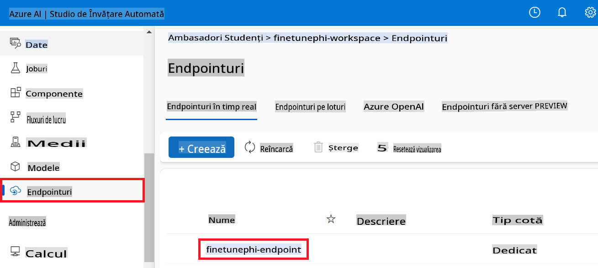

1. Selectați **Consume** din meniul de navigare.

1. Copiați **REST endpoint** și **Primary key**.
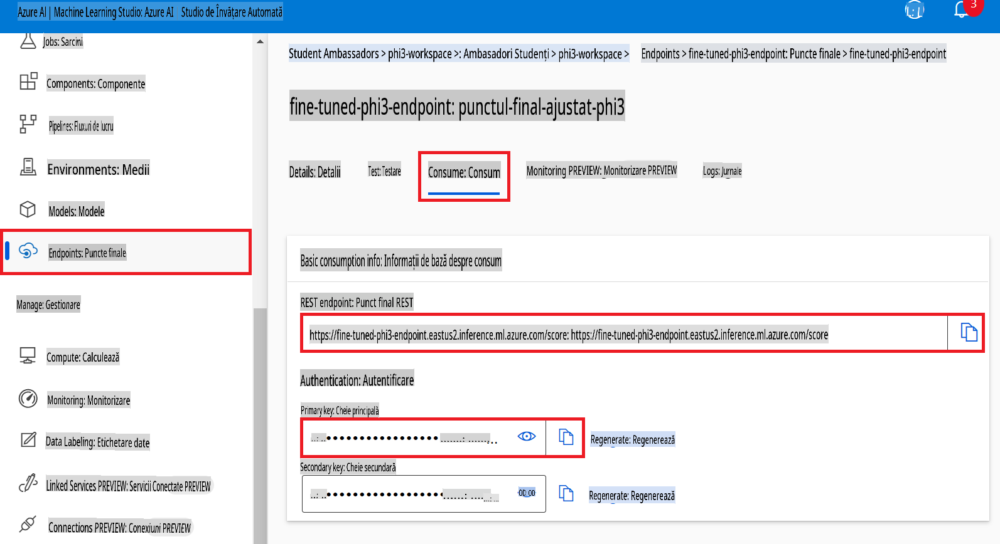

#### Adăugați Conexiunea Personalizată

1. Vizitați [Azure AI Foundry](https://ai.azure.com/?WT.mc_id=aiml-137032-kinfeylo).

1. Navigați la proiectul Azure AI Foundry pe care l-ați creat.

1. În proiectul creat, selectați **Settings** din meniul din stânga.

1. Selectați **+ New connection**.

    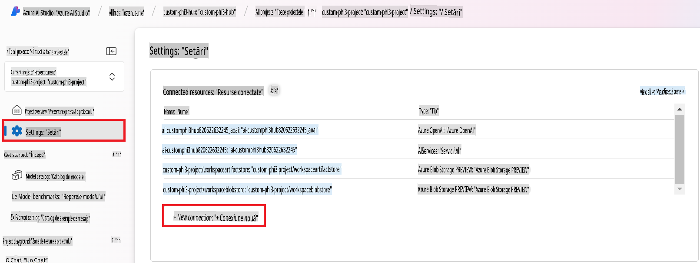

1. Selectați **Custom keys** din meniul de navigare.

    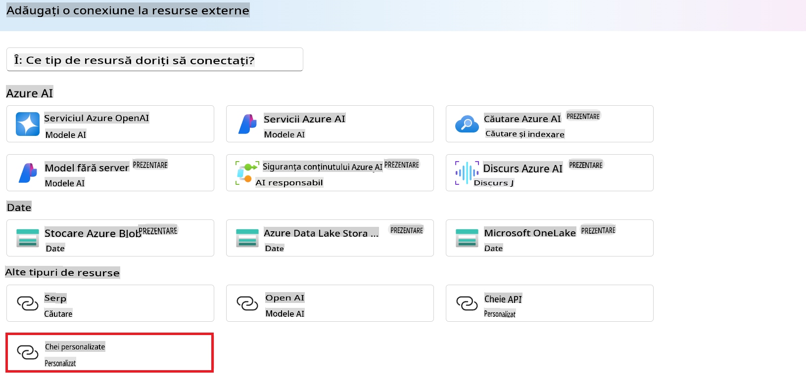

1. Realizați următoarele acțiuni:

    - Selectați **+ Add key value pairs**.
    - Pentru numele cheii, introduceți **endpoint** și lipiți endpoint-ul copiat din Azure ML Studio în câmpul valorii.
    - Selectați din nou **+ Add key value pairs**.
    - Pentru numele cheii, introduceți **key** și lipiți cheia copiată din Azure ML Studio în câmpul valorii.
    - După adăugarea cheilor, selectați **is secret** pentru a preveni expunerea cheii.

    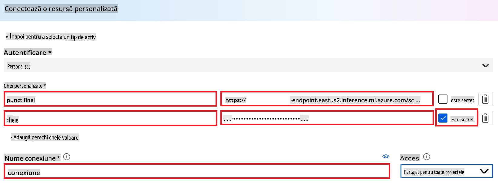

1. Selectați **Add connection**.

#### Creați Prompt flow

Ați adăugat o conexiune personalizată în Azure AI Foundry. Acum, să creăm un Prompt flow folosind pașii următori. Ulterior, veți conecta acest Prompt flow la conexiunea personalizată pentru a putea utiliza modelul ajustat în Prompt flow.

1. Navigați la proiectul Azure AI Foundry pe care l-ați creat.

1. Selectați **Prompt flow** din meniul din stânga.

1. Selectați **+ Create** din meniul de navigare.

    

1. Selectați **Chat flow** din meniul de navigare.

    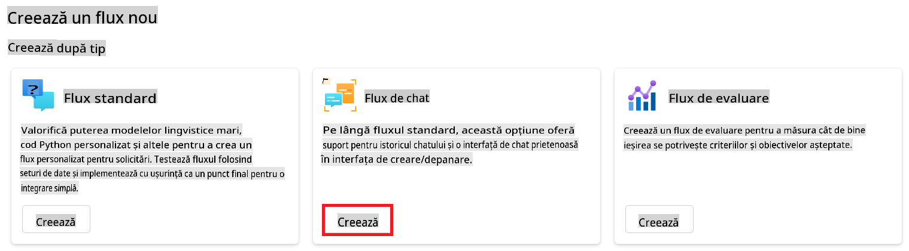

1. Introduceți **Folder name** pentru utilizare.

    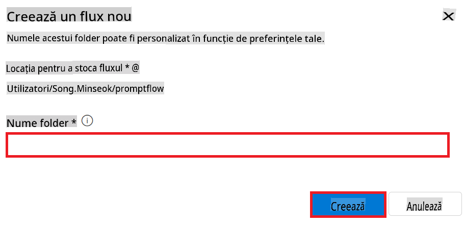

2. Selectați **Create**.

#### Configurați Prompt flow pentru a comunica cu modelul personalizat Phi-3

Trebuie să integrați modelul ajustat Phi-3 într-un Prompt flow. Totuși, Prompt flow-ul existent nu este conceput pentru acest scop. Prin urmare, trebuie să reconstruiți Prompt flow-ul pentru a permite integrarea modelului personalizat.

1. În Prompt flow, realizați următoarele acțiuni pentru a reconstrui fluxul existent:

    - Selectați **Raw file mode**.
    - Ștergeți tot codul existent din fișierul *flow.dag.yml*.
    - Adăugați următorul cod în fișierul *flow.dag.yml*.

        ```yml
        inputs:
          input_data:
            type: string
            default: "Who founded Microsoft?"

        outputs:
          answer:
            type: string
            reference: ${integrate_with_promptflow.output}

        nodes:
        - name: integrate_with_promptflow
          type: python
          source:
            type: code
            path: integrate_with_promptflow.py
          inputs:
            input_data: ${inputs.input_data}
        ```

    - Selectați **Save**.

    

1. Adăugați următorul cod în fișierul *integrate_with_promptflow.py* pentru a utiliza modelul personalizat Phi-3 în Prompt flow.

    ```python
    import logging
    import requests
    from promptflow import tool
    from promptflow.connections import CustomConnection

    # Logging setup
    logging.basicConfig(
        format="%(asctime)s - %(levelname)s - %(name)s - %(message)s",
        datefmt="%Y-%m-%d %H:%M:%S",
        level=logging.DEBUG
    )
    logger = logging.getLogger(__name__)

    def query_phi3_model(input_data: str, connection: CustomConnection) -> str:
        """
        Send a request to the Phi-3 model endpoint with the given input data using Custom Connection.
        """

        # "connection" is the name of the Custom Connection, "endpoint", "key" are the keys in the Custom Connection
        endpoint_url = connection.endpoint
        api_key = connection.key

        headers = {
            "Content-Type": "application/json",
            "Authorization": f"Bearer {api_key}"
        }
        data = {
            "input_data": {
                "input_string": [
                    {"role": "user", "content": input_data}
                ],
                "parameters": {
                    "temperature": 0.7,
                    "max_new_tokens": 128
                }
            }
        }
        try:
            response = requests.post(endpoint_url, json=data, headers=headers)
            response.raise_for_status()
            
            # Log the full JSON response
            logger.debug(f"Full JSON response: {response.json()}")

            result = response.json()["output"]
            logger.info("Successfully received response from Azure ML Endpoint.")
            return result
        except requests.exceptions.RequestException as e:
            logger.error(f"Error querying Azure ML Endpoint: {e}")
            raise

    @tool
    def my_python_tool(input_data: str, connection: CustomConnection) -> str:
        """
        Tool function to process input data and query the Phi-3 model.
        """
        return query_phi3_model(input_data, connection)

    ```

    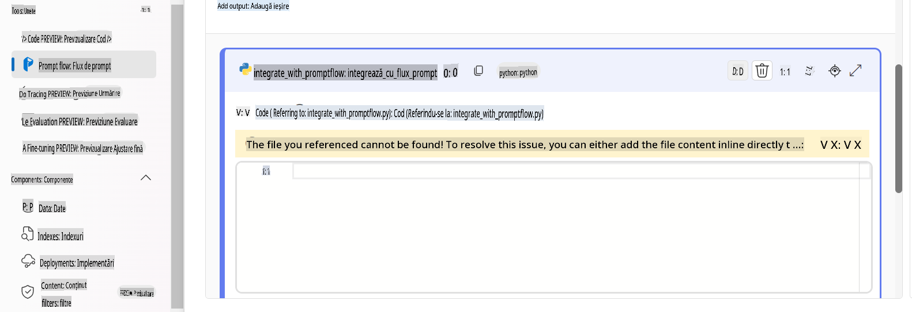

> [!NOTE]
> Pentru informații mai detaliate despre utilizarea Prompt flow în Azure AI Foundry, consultați [Prompt flow în Azure AI Foundry](https://learn.microsoft.com/azure/ai-studio/how-to/prompt-flow).

1. Selectați **Chat input**, **Chat output** pentru a activa chat-ul cu modelul dvs.

    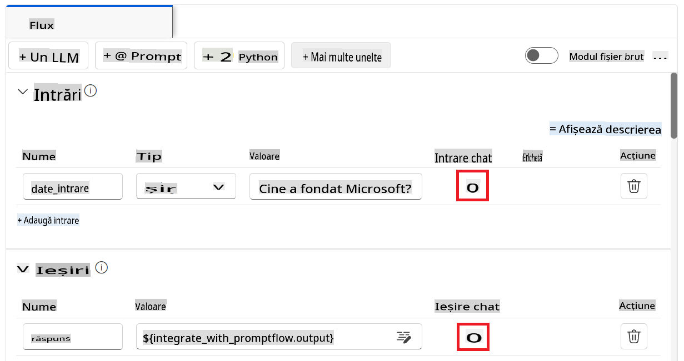

1. Acum sunteți pregătit să comunicați cu modelul dvs. personalizat Phi-3. În următorul exercițiu, veți învăța cum să porniți Prompt flow și să îl utilizați pentru a comunica cu modelul ajustat Phi-3.

> [!NOTE]
>
> Fluxul reconstruit ar trebui să arate astfel:
>
> 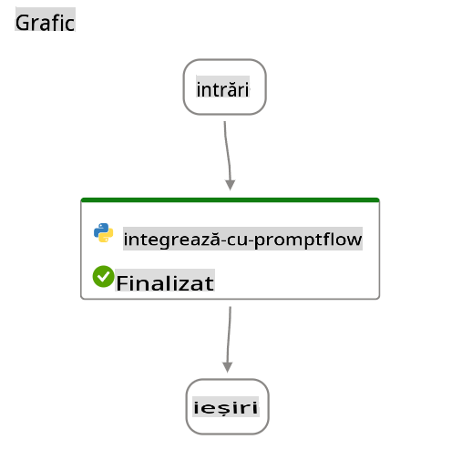
>

### Comunicați cu modelul dvs. personalizat Phi-3

Acum că ați ajustat și integrat modelul dvs. personalizat Phi-3 cu Prompt flow, sunteți gata să începeți să interacționați cu el. Acest exercițiu vă va ghida prin procesul de configurare și inițiere a unei sesiuni de chat cu modelul dvs. Urmând acești pași, veți putea utiliza pe deplin capabilitățile modelului dvs. ajustat Phi-3 pentru diverse sarcini și conversații.

- Comunicați cu modelul dvs. personalizat Phi-3 folosind Prompt flow.

#### Porniți Prompt flow

1. Selectați **Start compute sessions** pentru a porni Prompt flow.

    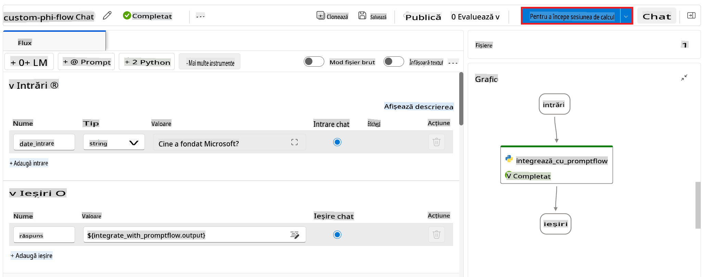

1. Selectați **Validate and parse input** pentru a reînnoi parametrii.

    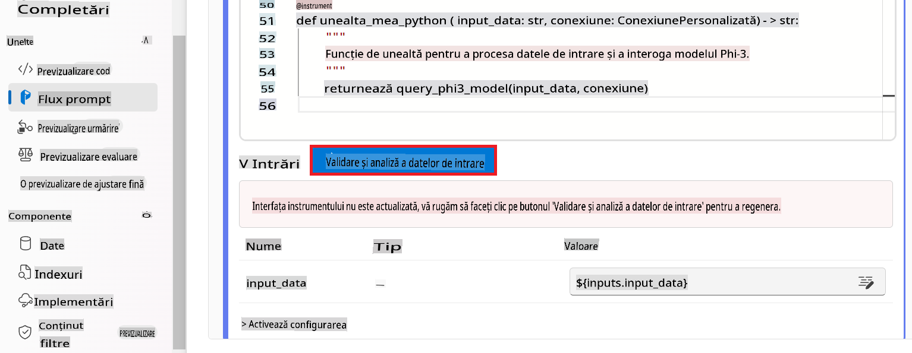

1. Selectați **Value** al **connection** pentru conexiunea personalizată pe care ați creat-o. De exemplu, *connection*.

    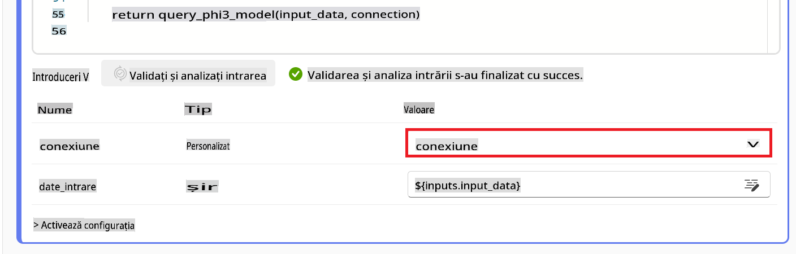

#### Comunicați cu modelul dvs. personalizat

1. Selectați **Chat**.

    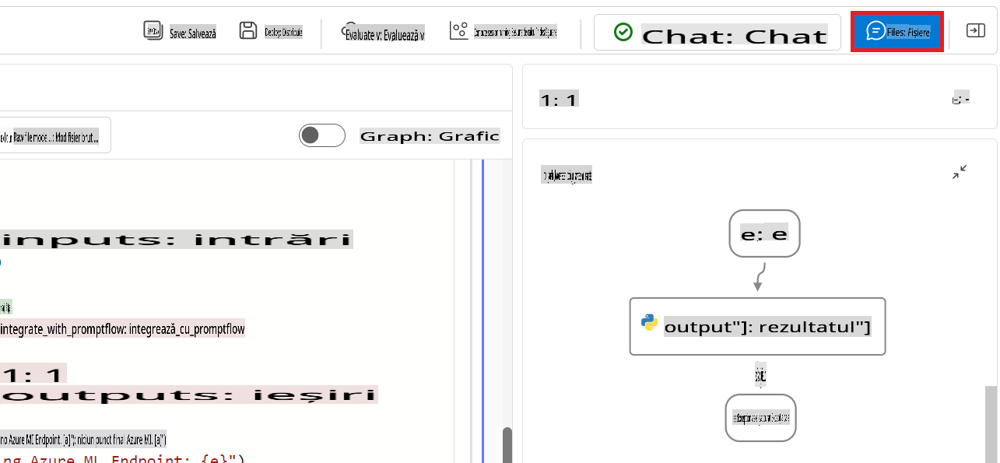

1. Iată un exemplu de rezultate: Acum puteți comunica cu modelul dvs. personalizat Phi-3. Este recomandat să puneți întrebări bazate pe datele utilizate pentru ajustare.

    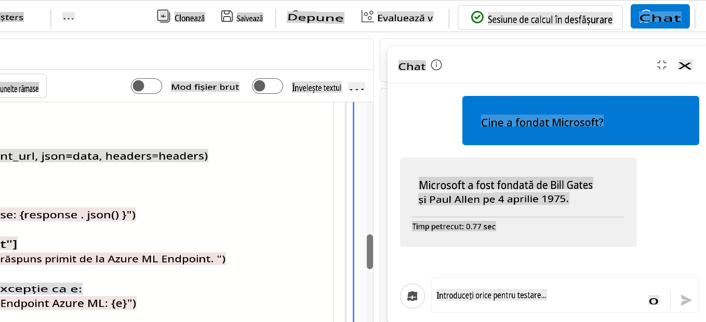

**Declinare de responsabilitate**:  
Acest document a fost tradus folosind servicii de traducere bazate pe inteligență artificială. Deși depunem eforturi pentru a asigura acuratețea, vă rugăm să rețineți că traducerile automate pot conține erori sau inexactități. Documentul original, în limba sa nativă, trebuie considerat sursa de autoritate. Pentru informații critice, se recomandă traducerea profesională realizată de un specialist. Nu ne asumăm răspunderea pentru eventualele neînțelegeri sau interpretări greșite care pot apărea din utilizarea acestei traduceri.