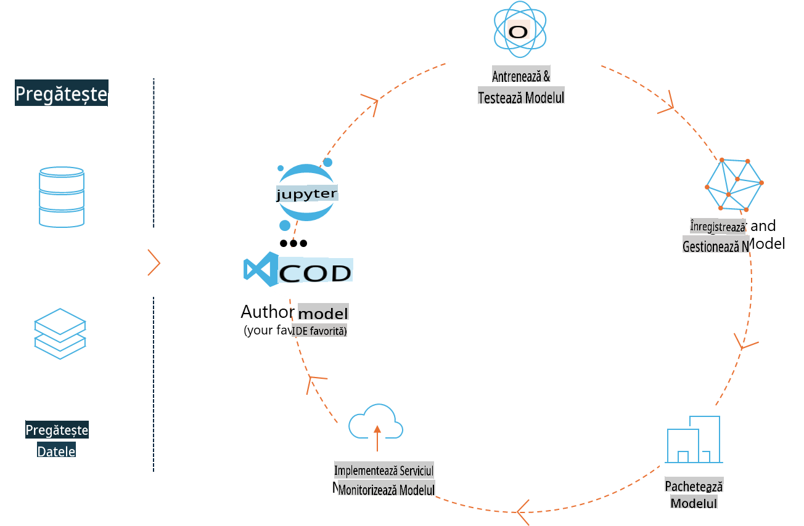
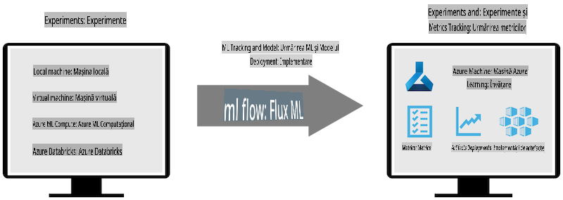
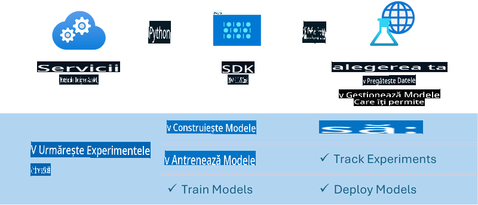

# MLflow

[MLflow](https://mlflow.org/) este o platformă open-source creată pentru a gestiona întregul ciclu de viață al proceselor de învățare automată.



MLFlow este utilizat pentru a gestiona ciclul de viață al ML, inclusiv experimentarea, reproducibilitatea, implementarea și un registru centralizat de modele. În prezent, MLFlow oferă patru componente:

- **MLflow Tracking:** Înregistrează și interoghează experimente, cod, configurații de date și rezultate.
- **MLflow Projects:** Ambalează codul științific de date într-un format care permite reproducerea execuțiilor pe orice platformă.
- **MLflow Models:** Permite implementarea modelelor de învățare automată în medii diverse de servire.
- **Model Registry:** Stochează, adnotează și gestionează modelele într-un depozit centralizat.

Include funcționalități pentru urmărirea experimentelor, ambalarea codului în execuții reproductibile și partajarea și implementarea modelelor. MLFlow este integrat în Databricks și suportă o varietate de biblioteci ML, ceea ce îl face independent de librărie. Poate fi utilizat cu orice bibliotecă de învățare automată și în orice limbaj de programare, deoarece oferă o API REST și o interfață CLI pentru comoditate.



Caracteristicile cheie ale MLFlow includ:

- **Urmărirea Experimentelor:** Înregistrează și compară parametrii și rezultatele.
- **Managementul Modelelor:** Implementează modele pe diverse platforme de servire și inferență.
- **Registrul de Modele:** Gestionează colaborativ ciclul de viață al modelelor MLFlow, inclusiv versiuni și adnotări.
- **Proiecte:** Ambalează codul ML pentru partajare sau utilizare în producție.

MLFlow sprijină, de asemenea, bucla MLOps, care include pregătirea datelor, înregistrarea și gestionarea modelelor, ambalarea modelelor pentru execuție, implementarea serviciilor și monitorizarea modelelor. Scopul său este să simplifice procesul de tranziție de la un prototip la un flux de lucru de producție, în special în medii cloud și edge.

## Scenariu E2E - Construirea unui wrapper și utilizarea Phi-3 ca model MLFlow

În acest exemplu E2E, vom demonstra două abordări diferite pentru construirea unui wrapper în jurul modelului lingvistic mic Phi-3 (SLM) și rularea acestuia ca model MLFlow fie local, fie în cloud, de exemplu, în spațiul de lucru Azure Machine Learning.



| Proiect | Descriere | Locație |
| ------------ | ----------- | -------- |
| Transformer Pipeline | Transformer Pipeline este cea mai simplă opțiune pentru a construi un wrapper dacă dorești să utilizezi un model HuggingFace cu funcționalitatea experimentală pentru transformeri a MLFlow. | [**TransformerPipeline.ipynb**](../../../../../../code/06.E2E/E2E_Phi-3-MLflow_TransformerPipeline.ipynb) |
| Custom Python Wrapper | La momentul redactării, pipeline-ul transformer nu suporta generarea unui wrapper MLFlow pentru modelele HuggingFace în format ONNX, chiar și cu pachetul experimental optimum pentru Python. Pentru astfel de cazuri, poți construi un wrapper Python personalizat pentru modul MLFlow. | [**CustomPythonWrapper.ipynb**](../../../../../../code/06.E2E/E2E_Phi-3-MLflow_CustomPythonWrapper.ipynb) |

## Proiect: Transformer Pipeline

1. Ai nevoie de pachetele Python relevante de la MLFlow și HuggingFace:

    ``` Python
    import mlflow
    import transformers
    ```

2. Apoi, ar trebui să inițiezi un pipeline transformer referindu-te la modelul țintă Phi-3 din registrul HuggingFace. După cum se poate vedea din cardul modelului _Phi-3-mini-4k-instruct_, sarcina acestuia este de tipul „Generare Text”:

    ``` Python
    pipeline = transformers.pipeline(
        task = "text-generation",
        model = "microsoft/Phi-3-mini-4k-instruct"
    )
    ```

3. Acum poți salva pipeline-ul transformer al modelului Phi-3 în format MLFlow și să furnizezi detalii suplimentare, cum ar fi calea artefactelor țintă, setările specifice de configurare ale modelului și tipul API-ului de inferență:

    ``` Python
    model_info = mlflow.transformers.log_model(
        transformers_model = pipeline,
        artifact_path = "phi3-mlflow-model",
        model_config = model_config,
        task = "llm/v1/chat"
    )
    ```

## Proiect: Custom Python Wrapper

1. Aici putem utiliza [API-ul generate() al ONNX Runtime de la Microsoft](https://github.com/microsoft/onnxruntime-genai) pentru inferența modelului ONNX și pentru codificarea/decodificarea token-urilor. Trebuie să alegi pachetul _onnxruntime_genai_ pentru sistemul tău de calcul țintă, cu exemplul de mai jos țintind CPU-ul:

    ``` Python
    import mlflow
    from mlflow.models import infer_signature
    import onnxruntime_genai as og
    ```

2. Clasa noastră personalizată implementează două metode: _load_context()_ pentru a inițializa **modelul ONNX** al Phi-3 Mini 4K Instruct, **parametrii generatorului** și **tokenizer-ul**; și _predict()_ pentru a genera token-uri de ieșire pentru promptul furnizat:

    ``` Python
    class Phi3Model(mlflow.pyfunc.PythonModel):
        def load_context(self, context):
            # Retrieving model from the artifacts
            model_path = context.artifacts["phi3-mini-onnx"]
            model_options = {
                 "max_length": 300,
                 "temperature": 0.2,         
            }
        
            # Defining the model
            self.phi3_model = og.Model(model_path)
            self.params = og.GeneratorParams(self.phi3_model)
            self.params.set_search_options(**model_options)
            
            # Defining the tokenizer
            self.tokenizer = og.Tokenizer(self.phi3_model)
    
        def predict(self, context, model_input):
            # Retrieving prompt from the input
            prompt = model_input["prompt"][0]
            self.params.input_ids = self.tokenizer.encode(prompt)
    
            # Generating the model's response
            response = self.phi3_model.generate(self.params)
    
            return self.tokenizer.decode(response[0][len(self.params.input_ids):])
    ```

3. Acum poți folosi funcția _mlflow.pyfunc.log_model()_ pentru a genera un wrapper Python personalizat (în format pickle) pentru modelul Phi-3, împreună cu modelul ONNX original și dependențele necesare:

    ``` Python
    model_info = mlflow.pyfunc.log_model(
        artifact_path = artifact_path,
        python_model = Phi3Model(),
        artifacts = {
            "phi3-mini-onnx": "cpu_and_mobile/cpu-int4-rtn-block-32-acc-level-4",
        },
        input_example = input_example,
        signature = infer_signature(input_example, ["Run"]),
        extra_pip_requirements = ["torch", "onnxruntime_genai", "numpy"],
    )
    ```

## Semnături ale modelelor MLFlow generate

1. În pasul 3 al proiectului Transformer Pipeline de mai sus, am setat sarcina modelului MLFlow la „_llm/v1/chat_”. O astfel de instrucțiune generează un wrapper API al modelului, compatibil cu API-ul Chat al OpenAI, așa cum se arată mai jos:

    ``` Python
    {inputs: 
      ['messages': Array({content: string (required), name: string (optional), role: string (required)}) (required), 'temperature': double (optional), 'max_tokens': long (optional), 'stop': Array(string) (optional), 'n': long (optional), 'stream': boolean (optional)],
    outputs: 
      ['id': string (required), 'object': string (required), 'created': long (required), 'model': string (required), 'choices': Array({finish_reason: string (required), index: long (required), message: {content: string (required), name: string (optional), role: string (required)} (required)}) (required), 'usage': {completion_tokens: long (required), prompt_tokens: long (required), total_tokens: long (required)} (required)],
    params: 
      None}
    ```

2. Drept rezultat, poți trimite promptul tău în următorul format:

    ``` Python
    messages = [{"role": "user", "content": "What is the capital of Spain?"}]
    ```

3. Apoi, folosește post-procesarea compatibilă cu API-ul OpenAI, de exemplu, _response[0][‘choices’][0][‘message’][‘content’]_, pentru a transforma ieșirea într-un format mai lizibil, precum acesta:

    ``` JSON
    Question: What is the capital of Spain?
    
    Answer: The capital of Spain is Madrid. It is the largest city in Spain and serves as the political, economic, and cultural center of the country. Madrid is located in the center of the Iberian Peninsula and is known for its rich history, art, and architecture, including the Royal Palace, the Prado Museum, and the Plaza Mayor.
    
    Usage: {'prompt_tokens': 11, 'completion_tokens': 73, 'total_tokens': 84}
    ```

4. În pasul 3 al proiectului Custom Python Wrapper de mai sus, permitem pachetului MLFlow să genereze semnătura modelului pe baza unui exemplu de intrare dat. Semnătura wrapper-ului MLFlow va arăta astfel:

    ``` Python
    {inputs: 
      ['prompt': string (required)],
    outputs: 
      [string (required)],
    params: 
      None}
    ```

5. Prin urmare, promptul nostru ar trebui să conțină cheia de dicționar „prompt”, similar cu aceasta:

    ``` Python
    {"prompt": "<|system|>You are a stand-up comedian.<|end|><|user|>Tell me a joke about atom<|end|><|assistant|>",}
    ```

6. Ieșirea modelului va fi furnizată apoi în format text:

    ``` JSON
    Alright, here's a little atom-related joke for you!
    
    Why don't electrons ever play hide and seek with protons?
    
    Because good luck finding them when they're always "sharing" their electrons!
    
    Remember, this is all in good fun, and we're just having a little atomic-level humor!
    ```

**Declinarea responsabilității**:  
Acest document a fost tradus folosind servicii de traducere automate bazate pe inteligență artificială. Deși ne străduim să asigurăm acuratețea, vă rugăm să rețineți că traducerile automate pot conține erori sau inexactități. Documentul original, în limba sa maternă, ar trebui considerat sursa autoritară. Pentru informații critice, se recomandă traducerea profesională realizată de un specialist uman. Nu ne asumăm răspunderea pentru neînțelegeri sau interpretări greșite rezultate din utilizarea acestei traduceri.