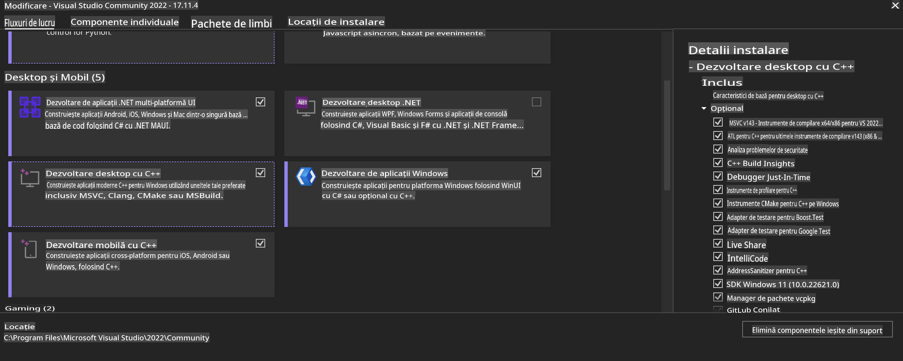
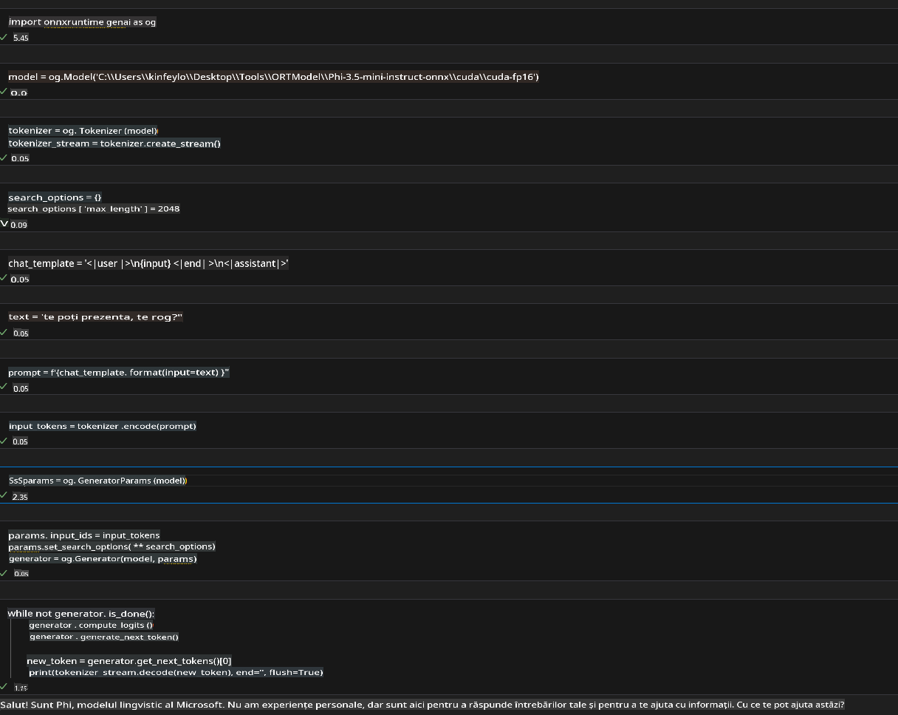
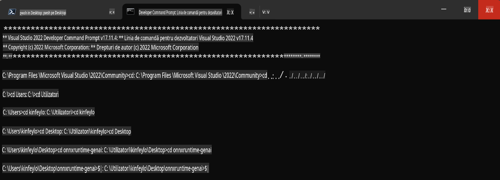

# **Ghid pentru OnnxRuntime GenAI pe GPU Windows**

Acest ghid oferă pașii necesari pentru configurarea și utilizarea ONNX Runtime (ORT) cu GPU-uri pe Windows. Este conceput pentru a vă ajuta să profitați de accelerarea GPU pentru modelele dvs., îmbunătățind performanța și eficiența.

Documentul include îndrumări despre:

- Configurarea mediului: Instrucțiuni pentru instalarea dependențelor necesare, cum ar fi CUDA, cuDNN și ONNX Runtime.
- Configurare: Cum să configurați mediul și ONNX Runtime pentru a utiliza eficient resursele GPU.
- Sfaturi de optimizare: Recomandări pentru ajustarea setărilor GPU pentru performanță optimă.

### **1. Python 3.10.x / 3.11.8**

   ***Notă*** Recomandăm utilizarea [miniforge](https://github.com/conda-forge/miniforge/releases/latest/download/Miniforge3-Windows-x86_64.exe) ca mediu Python.

   ```bash

   conda create -n pydev python==3.11.8

   conda activate pydev

   ```

   ***Atenție*** Dacă ați instalat anterior orice bibliotecă ONNX pentru Python, vă rugăm să o dezinstalați.

### **2. Instalare CMake cu winget**

   ```bash

   winget install -e --id Kitware.CMake

   ```

### **3. Instalare Visual Studio 2022 - Desktop Development with C++**

   ***Notă*** Dacă nu doriți să compilați, puteți sări peste acest pas.



### **4. Instalare driver NVIDIA**

1. **Driver GPU NVIDIA**  [https://www.nvidia.com/en-us/drivers/](https://www.nvidia.com/en-us/drivers/)

2. **NVIDIA CUDA 12.4** [https://developer.nvidia.com/cuda-12-4-0-download-archive](https://developer.nvidia.com/cuda-12-4-0-download-archive)

3. **NVIDIA CUDNN 9.4**  [https://developer.nvidia.com/cudnn-downloads](https://developer.nvidia.com/cudnn-downloads)

***Atenție*** Utilizați setările implicite în timpul instalării.

### **5. Configurare NVIDIA Env**

Copiați fișierele din lib, bin și include ale NVIDIA CUDNN 9.4 în directoarele corespunzătoare din NVIDIA CUDA 12.4.

- copiați fișierele din *'C:\Program Files\NVIDIA\CUDNN\v9.4\bin\12.6'* în *'C:\Program Files\NVIDIA GPU Computing Toolkit\CUDA\v12.4\bin'*

- copiați fișierele din *'C:\Program Files\NVIDIA\CUDNN\v9.4\include\12.6'* în *'C:\Program Files\NVIDIA GPU Computing Toolkit\CUDA\v12.4\include'*

- copiați fișierele din *'C:\Program Files\NVIDIA\CUDNN\v9.4\lib\12.6'* în *'C:\Program Files\NVIDIA GPU Computing Toolkit\CUDA\v12.4\lib\x64'*

### **6. Descărcare Phi-3.5-mini-instruct-onnx**

   ```bash

   winget install -e --id Git.Git

   winget install -e --id GitHub.GitLFS

   git lfs install

   git clone https://huggingface.co/microsoft/Phi-3.5-mini-instruct-onnx

   ```

### **7. Rulare InferencePhi35Instruct.ipynb**

   Deschideți [Notebook-ul](../../../../../../code/09.UpdateSamples/Aug/ortgpu-phi35-instruct.ipynb) și executați-l.



### **8. Compilare ORT GenAI GPU**

   ***Notă*** 
   
   1. Mai întâi, dezinstalați toate bibliotecile legate de onnx, onnxruntime și onnxruntime-genai.

   ```bash

   pip list 
   
   ```

   Apoi dezinstalați toate bibliotecile onnxruntime, de exemplu:

   ```bash

   pip uninstall onnxruntime

   pip uninstall onnxruntime-genai

   pip uninstall onnxruntume-genai-cuda
   
   ```

   2. Verificați suportul pentru extensiile Visual Studio.

   Verificați dacă există folderul *C:\Program Files\NVIDIA GPU Computing Toolkit\CUDA\v12.4\extras\visual_studio_integration*.  
   
   Dacă nu este găsit, verificați alte directoare ale driverului Cuda Toolkit și copiați folderul *visual_studio_integration* și conținutul său în *C:\Program Files\NVIDIA GPU Computing Toolkit\CUDA\v12.4\extras\visual_studio_integration*.

   - Dacă nu doriți să compilați, puteți sări peste acest pas.

   ```bash

   git clone https://github.com/microsoft/onnxruntime-genai

   ```

   - Descărcați [https://github.com/microsoft/onnxruntime/releases/download/v1.19.2/onnxruntime-win-x64-gpu-1.19.2.zip](https://github.com/microsoft/onnxruntime/releases/download/v1.19.2/onnxruntime-win-x64-gpu-1.19.2.zip)

   - Dezarhivați fișierul onnxruntime-win-x64-gpu-1.19.2.zip, redenumiți folderul rezultat în **ort** și copiați folderul **ort** în onnxruntime-genai.

   - Folosind Windows Terminal, accesați Developer Command Prompt for VS 2022 și navigați la onnxruntime-genai.



   - Compilați folosind mediul dvs. Python.

   ```bash

   cd onnxruntime-genai

   python build.py --use_cuda  --cuda_home "C:\Program Files\NVIDIA GPU Computing Toolkit\CUDA\v12.4" --config Release
 

   cd build/Windows/Release/Wheel

   pip install .whl

   ```

**Declinări de responsabilitate**:  
Acest document a fost tradus folosind servicii de traducere bazate pe inteligență artificială. Deși ne străduim să asigurăm acuratețea, vă rugăm să rețineți că traducerile automate pot conține erori sau inexactități. Documentul original în limba sa nativă trebuie considerat sursa autoritară. Pentru informații critice, se recomandă traducerea profesională realizată de un specialist. Nu ne asumăm răspunderea pentru eventualele neînțelegeri sau interpretări greșite care pot apărea din utilizarea acestei traduceri.