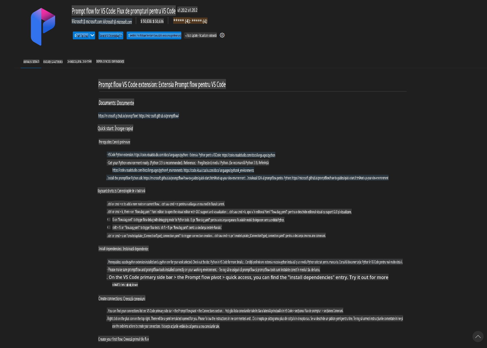
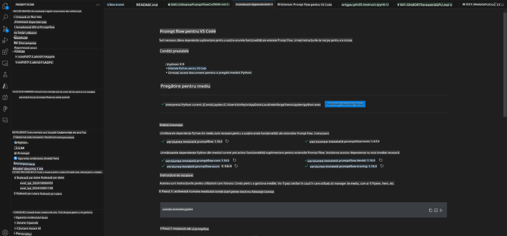
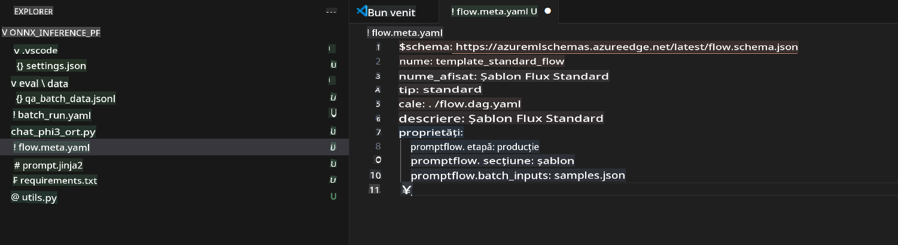
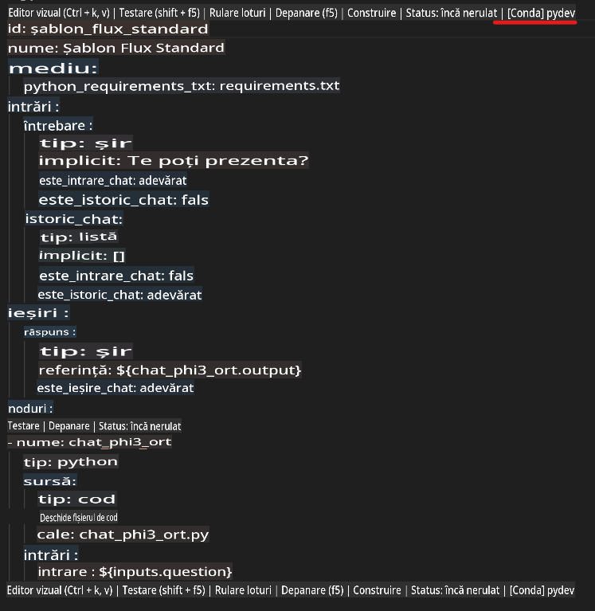
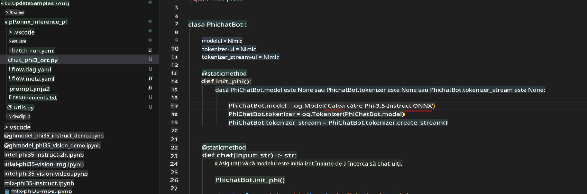
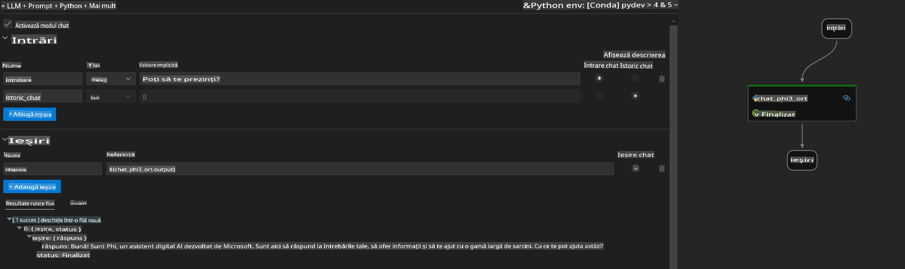
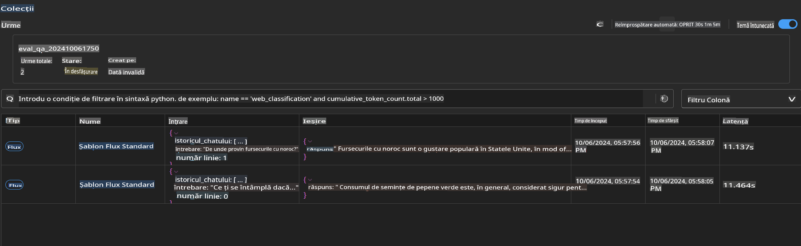

# Utilizarea GPU-ului Windows pentru a crea o soluție Prompt flow cu Phi-3.5-Instruct ONNX

Documentul de mai jos este un exemplu despre cum să folosești PromptFlow cu ONNX (Open Neural Network Exchange) pentru dezvoltarea aplicațiilor AI bazate pe modelele Phi-3.

PromptFlow este o suită de instrumente de dezvoltare concepută pentru a simplifica ciclul complet de dezvoltare al aplicațiilor AI bazate pe LLM (Large Language Model), de la idee și prototipare la testare și evaluare.

Prin integrarea PromptFlow cu ONNX, dezvoltatorii pot:

- **Optimiza performanța modelului**: Folosiți ONNX pentru inferență și implementare eficientă a modelului.
- **Simplifica dezvoltarea**: Utilizați PromptFlow pentru a gestiona fluxul de lucru și a automatiza sarcinile repetitive.
- **Îmbunătăți colaborarea**: Facilitați colaborarea între membrii echipei prin oferirea unui mediu unificat de dezvoltare.

**Prompt flow** este o suită de instrumente de dezvoltare concepută pentru a simplifica ciclul complet de dezvoltare al aplicațiilor AI bazate pe LLM, de la idee, prototipare, testare, evaluare până la implementare în producție și monitorizare. Aceasta face ca ingineria de prompturi să fie mult mai ușoară și vă permite să construiți aplicații LLM de calitate pentru producție.

Prompt flow se poate conecta la OpenAI, Azure OpenAI Service și modele personalizabile (Huggingface, LLM/SLM locale). Sperăm să implementăm modelul ONNX cuantificat al Phi-3.5 în aplicații locale. Prompt flow ne poate ajuta să planificăm mai bine afacerea noastră și să finalizăm soluții locale bazate pe Phi-3.5. În acest exemplu, vom combina Biblioteca GenAI ONNX Runtime pentru a finaliza soluția Prompt flow bazată pe GPU-ul Windows.

## **Instalare**

### **ONNX Runtime GenAI pentru GPU-ul Windows**

Citește acest ghid pentru a configura ONNX Runtime GenAI pentru GPU-ul Windows [click aici](./ORTWindowGPUGuideline.md)

### **Configurarea Prompt flow în VSCode**

1. Instalează extensia Prompt flow pentru VS Code



2. După instalarea extensiei Prompt flow pentru VS Code, dă click pe extensie și alege **Installation dependencies** urmând acest ghid pentru a instala SDK-ul Prompt flow în mediul tău



3. Descarcă [Codul exemplu](../../../../../../code/09.UpdateSamples/Aug/pf/onnx_inference_pf) și folosește VS Code pentru a deschide acest exemplu



4. Deschide **flow.dag.yaml** pentru a alege mediul tău Python



   Deschide **chat_phi3_ort.py** pentru a schimba locația modelului tău Phi-3.5-instruct ONNX



5. Rulează fluxul Prompt flow pentru testare

Deschide **flow.dag.yaml** și dă click pe editorul vizual


după ce dai click aici, rulează-l pentru a testa



1. Poți rula un batch în terminal pentru a verifica mai multe rezultate

```bash

pf run create --file batch_run.yaml --stream --name 'Your eval qa name'    

```

Poți verifica rezultatele în browserul tău implicit



**Declinare de responsabilitate**:  
Acest document a fost tradus folosind servicii de traducere bazate pe inteligență artificială. Deși ne străduim să asigurăm acuratețea, vă rugăm să rețineți că traducerile automate pot conține erori sau inexactități. Documentul original, în limba sa de bază, ar trebui considerat sursa autoritară. Pentru informații critice, se recomandă traducerea profesională realizată de un specialist uman. Nu ne asumăm răspunderea pentru eventualele neînțelegeri sau interpretări greșite care pot apărea în urma utilizării acestei traduceri.