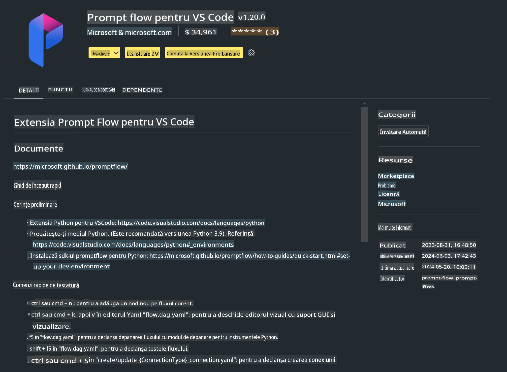

# **Lab 0 - Instalare**

Când intrăm în Lab, trebuie să configurăm mediul relevant:


### **1. Python 3.11+**

Se recomandă utilizarea miniforge pentru configurarea mediului Python.

Pentru a configura miniforge, consultați [https://github.com/conda-forge/miniforge](https://github.com/conda-forge/miniforge)

După configurarea miniforge, rulați următoarea comandă în Power Shell

```bash

conda create -n pyenv python==3.11.8 -y

conda activate pyenv

```


### **2. Instalare Prompt flow SDK**

În Lab 1, folosim Prompt flow, așa că trebuie să configurați Prompt flow SDK.

```bash

pip install promptflow --upgrade

```

Puteți verifica promptflow sdk cu această comandă


```bash

pf --version

```

### **3. Instalare Extensie Prompt flow pentru Visual Studio Code**




### **4. Biblioteca de Accelerație Intel NPU**

Procesoarele de generație nouă de la Intel suportă NPU. Dacă doriți să utilizați NPU pentru a rula LLM-uri / SLM-uri local, puteți folosi ***Biblioteca de Accelerație Intel NPU***. Dacă doriți să aflați mai multe, puteți citi [https://github.com/microsoft/PhiCookBook/blob/main/md/01.Introduction/03/AIPC_Inference.md](https://github.com/microsoft/PhiCookBook/blob/main/md/01.Introduction/03/AIPC_Inference.md).

Instalați Biblioteca de Accelerație Intel NPU în bash


```bash

pip install intel-npu-acceleration-library

```

***Notă***: Vă rugăm să rețineți că această bibliotecă suportă transformers ***4.40.2***, vă rugăm să confirmați versiunea.


### **5. Alte Biblioteci Python**

Creați un fișier requirements.txt și adăugați acest conținut

```txt

notebook
numpy 
scipy 
scikit-learn 
matplotlib 
pandas 
pillow 
graphviz

```


### **6. Instalare NVM**

Instalați nvm în Powershell 


```bash

winget install -e --id CoreyButler.NVMforWindows

```

Instalați nodejs 18.20


```bash

nvm install 18.20.0

nvm use 18.20.0

```

### **7. Instalare Suport pentru Dezvoltare în Visual Studio Code**


```bash

npm install --global yo generator-code

```

Felicitări! Ați configurat cu succes SDK-ul. În continuare, treceți la pașii practici.

**Declinări de responsabilitate**:  
Acest document a fost tradus utilizând servicii de traducere bazate pe inteligență artificială. Deși ne străduim să asigurăm acuratețea, vă rugăm să rețineți că traducerile automate pot conține erori sau inexactități. Documentul original în limba sa natală ar trebui considerat sursa autoritară. Pentru informații critice, se recomandă traducerea umană realizată de profesioniști. Nu ne asumăm răspunderea pentru neînțelegerile sau interpretările greșite care pot apărea din utilizarea acestei traduceri.