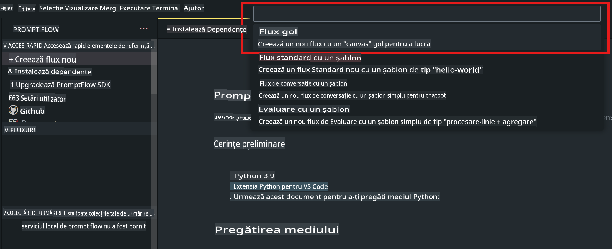
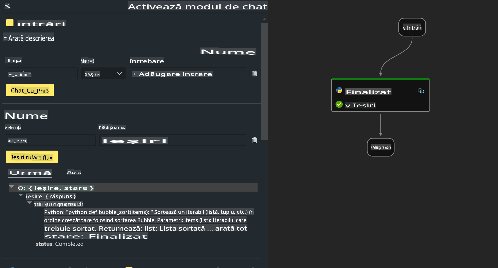

# **Lab 2 - Rulează Prompt flow cu Phi-3-mini în AIPC**

## **Ce este Prompt flow**

Prompt flow este un set de instrumente de dezvoltare conceput pentru a simplifica ciclul complet de dezvoltare al aplicațiilor AI bazate pe LLM, de la idee, prototipare, testare, evaluare, până la implementarea în producție și monitorizare. Face ca ingineria prompturilor să fie mult mai ușoară și îți permite să construiești aplicații LLM de calitate pentru producție.

Cu Prompt flow, vei putea:

- Crea fluxuri care leagă LLM-uri, prompturi, cod Python și alte instrumente într-un flux de lucru executabil.

- Depana și itera fluxurile tale, în special interacțiunea cu LLM-urile, cu ușurință.

- Evalua fluxurile tale, calcula metrici de calitate și performanță folosind seturi de date mai mari.

- Integra testarea și evaluarea în sistemul tău CI/CD pentru a asigura calitatea fluxului.

- Implementa fluxurile pe platforma de servire aleasă sau le poți integra cu ușurință în baza de cod a aplicației tale.

- (Opțional, dar recomandat) Colabora cu echipa ta utilizând versiunea cloud a Prompt flow din Azure AI.

## **Ce este AIPC**

Un PC AI are un CPU, un GPU și un NPU, fiecare având capabilități specifice de accelerare AI. Un NPU, sau unitate de procesare neurală, este un accelerator specializat care gestionează sarcini de inteligență artificială (AI) și învățare automată (ML) direct pe PC-ul tău, în loc să trimită datele pentru a fi procesate în cloud. GPU-ul și CPU-ul pot procesa, de asemenea, aceste sarcini, dar NPU-ul este deosebit de eficient pentru calculele AI care necesită un consum redus de energie. PC-ul AI reprezintă o schimbare fundamentală în modul în care funcționează computerele noastre. Nu este o soluție pentru o problemă care nu exista înainte, ci promite să fie o îmbunătățire semnificativă pentru utilizarea zilnică a PC-urilor.

Cum funcționează? Comparativ cu AI generativă și modelele mari de limbaj (LLM) antrenate pe cantități uriașe de date publice, AI-ul care va rula pe PC-ul tău este mult mai accesibil la aproape toate nivelurile. Conceptul este mai ușor de înțeles, iar pentru că este antrenat pe datele tale, fără a avea nevoie de acces la cloud, beneficiile sunt mai atractive imediat pentru un public mai larg.

Pe termen scurt, lumea PC-urilor AI implică asistenți personali și modele AI mai mici care rulează direct pe PC-ul tău, folosind datele tale pentru a oferi îmbunătățiri AI personale, private, mai sigure pentru activitățile pe care le faci deja zilnic – luarea notițelor de la întâlniri, organizarea unei ligi de fotbal fantastic, automatizarea îmbunătățirilor pentru editarea foto și video sau planificarea unui itinerar perfect pentru o reuniune de familie pe baza orelor de sosire și plecare ale fiecăruia.

## **Construirea fluxurilor de generare a codului pe AIPC**

***Note***: Dacă nu ai finalizat instalarea mediului, te rugăm să vizitezi [Lab 0 - Instalări](./01.Installations.md)

1. Deschide extensia Prompt flow în Visual Studio Code și creează un proiect de flux gol.



2. Adaugă parametrii de Intrare și Ieșire și Adaugă Cod Python ca un nou flux.



Poți consulta această structură (flow.dag.yaml) pentru a-ți construi fluxul.

```yaml

inputs:
  question:
    type: string
    default: how to write Bubble Algorithm
outputs:
  answer:
    type: string
    reference: ${Chat_With_Phi3.output}
nodes:
- name: Chat_With_Phi3
  type: python
  source:
    type: code
    path: Chat_With_Phi3.py
  inputs:
    question: ${inputs.question}


```

3. Adaugă cod în ***Chat_With_Phi3.py***.

```python


from promptflow.core import tool

# import torch
from transformers import AutoTokenizer, pipeline,TextStreamer
import intel_npu_acceleration_library as npu_lib

import warnings

import asyncio
import platform

class Phi3CodeAgent:
    
    model = None
    tokenizer = None
    text_streamer = None
    
    model_id = "microsoft/Phi-3-mini-4k-instruct"

    @staticmethod
    def init_phi3():
        
        if Phi3CodeAgent.model is None or Phi3CodeAgent.tokenizer is None or Phi3CodeAgent.text_streamer is None:
            Phi3CodeAgent.model = npu_lib.NPUModelForCausalLM.from_pretrained(
                                    Phi3CodeAgent.model_id,
                                    torch_dtype="auto",
                                    dtype=npu_lib.int4,
                                    trust_remote_code=True
                                )
            Phi3CodeAgent.tokenizer = AutoTokenizer.from_pretrained(Phi3CodeAgent.model_id)
            Phi3CodeAgent.text_streamer = TextStreamer(Phi3CodeAgent.tokenizer, skip_prompt=True)

    

    @staticmethod
    def chat_with_phi3(prompt):
        
        Phi3CodeAgent.init_phi3()

        messages = "<|system|>You are a AI Python coding assistant. Please help me to generate code in Python.The answer only genertated Python code, but any comments and instructions do not need to be generated<|end|><|user|>" + prompt +"<|end|><|assistant|>"


        generation_args = {
            "max_new_tokens": 1024,
            "return_full_text": False,
            "temperature": 0.3,
            "do_sample": False,
            "streamer": Phi3CodeAgent.text_streamer,
        }

        pipe = pipeline(
            "text-generation",
            model=Phi3CodeAgent.model,
            tokenizer=Phi3CodeAgent.tokenizer,
            # **generation_args
        )

        result = ''

        with warnings.catch_warnings():
            warnings.simplefilter("ignore")
            response = pipe(messages, **generation_args)
            result =response[0]['generated_text']
            return result


@tool
def my_python_tool(question: str) -> str:
    if platform.system() == 'Windows':
        asyncio.set_event_loop_policy(asyncio.WindowsSelectorEventLoopPolicy())
    return Phi3CodeAgent.chat_with_phi3(question)


```

4. Poți testa fluxul din Debug sau Run pentru a verifica dacă generarea codului funcționează corect.


5. Rulează fluxul ca API de dezvoltare în terminal.

```

pf flow serve --source ./ --port 8080 --host localhost   

```

Îl poți testa în Postman / Thunder Client.

### **Notă**

1. Prima rulare durează mult timp. Se recomandă descărcarea modelului phi-3 de la Hugging Face CLI.

2. Având în vedere puterea de calcul limitată a Intel NPU, se recomandă utilizarea Phi-3-mini-4k-instruct.

3. Folosim Accelerația Intel NPU pentru a cuantifica conversia INT4, dar dacă re-rulezi serviciul, trebuie să ștergi folderele cache și nc_workshop.

## **Resurse**

1. Învață Promptflow [https://microsoft.github.io/promptflow/](https://microsoft.github.io/promptflow/)

2. Învață Accelerația Intel NPU [https://github.com/intel/intel-npu-acceleration-library](https://github.com/intel/intel-npu-acceleration-library)

3. Cod exemplu, descarcă [Cod Exemplu Local NPU Agent](../../../../../../../../../code/07.Lab/01/AIPC)

**Declinarea responsabilității**:  
Acest document a fost tradus folosind servicii de traducere bazate pe inteligență artificială. Deși ne străduim să asigurăm acuratețea, vă rugăm să aveți în vedere că traducerile automate pot conține erori sau inexactități. Documentul original în limba sa nativă ar trebui considerat sursa autoritară. Pentru informații critice, se recomandă traducerea umană realizată de profesioniști. Nu ne asumăm răspunderea pentru eventualele neînțelegeri sau interpretări greșite care pot apărea din utilizarea acestei traduceri.