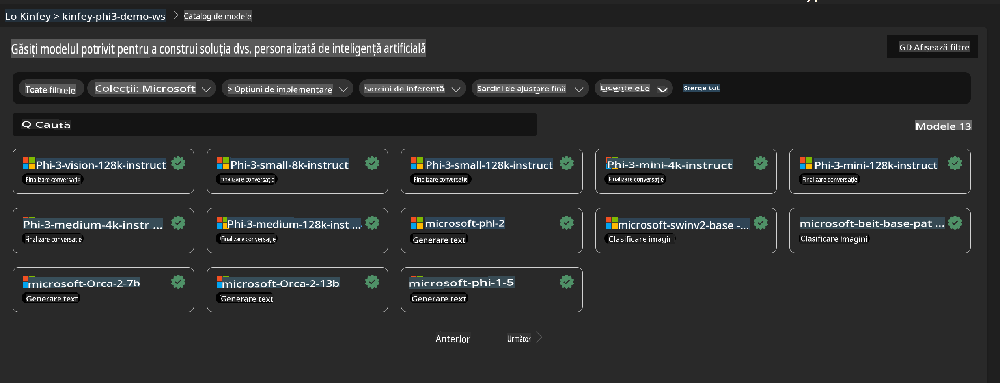
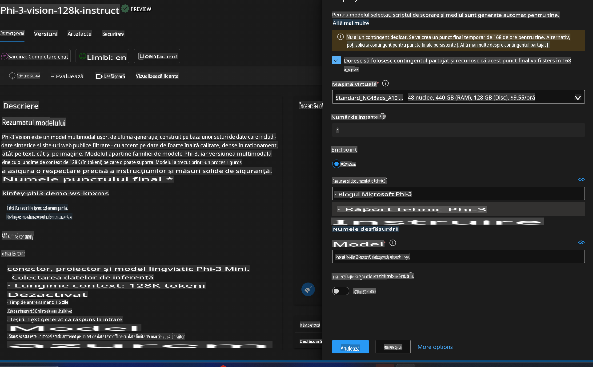
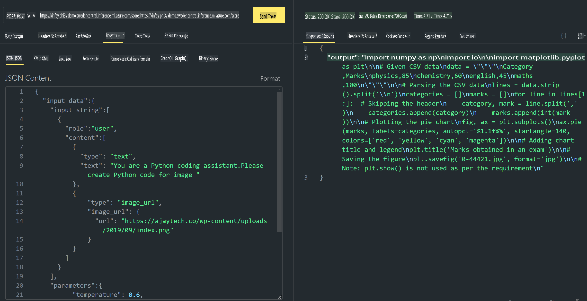

# **Lab 3 - Implementarea Phi-3-Vision pe Azure Machine Learning Service**

Folosim NPU pentru a finaliza implementarea în producție a codului local, iar apoi dorim să introducem capabilitatea PHI-3-VISION pentru a transforma imagini în cod.

În această introducere, vom construi rapid un serviciu Model As Service Phi-3 Vision în Azure Machine Learning Service.

***Notă***: Phi-3 Vision necesită putere de calcul pentru a genera conținut mai rapid. Avem nevoie de resurse de calcul în cloud pentru a realiza acest lucru.

### **1. Crearea Azure Machine Learning Service**

Trebuie să creăm un Azure Machine Learning Service în Azure Portal. Dacă doriți să învățați cum, vă rugăm să vizitați acest link [https://learn.microsoft.com/azure/machine-learning/quickstart-create-resources?view=azureml-api-2](https://learn.microsoft.com/azure/machine-learning/quickstart-create-resources?view=azureml-api-2)

### **2. Selectarea Phi-3 Vision în Azure Machine Learning Service**



### **3. Implementarea Phi-3-Vision în Azure**



### **4. Testarea Endpoint-ului în Postman**



***Notă***

1. Parametrii care trebuie transmiși trebuie să includă Authorization, azureml-model-deployment și Content-Type. Trebuie să verificați informațiile de implementare pentru a obține aceste date.

2. Pentru transmiterea parametrilor, Phi-3-Vision necesită un link către o imagine. Vă rugăm să consultați metoda GPT-4-Vision pentru a înțelege cum să transmiteți parametrii, de exemplu:

```json

{
  "input_data":{
    "input_string":[
      {
        "role":"user",
        "content":[ 
          {
            "type": "text",
            "text": "You are a Python coding assistant.Please create Python code for image "
          },
          {
              "type": "image_url",
              "image_url": {
                "url": "https://ajaytech.co/wp-content/uploads/2019/09/index.png"
              }
          }
        ]
      }
    ],
    "parameters":{
          "temperature": 0.6,
          "top_p": 0.9,
          "do_sample": false,
          "max_new_tokens": 2048
    }
  }
}

```

3. Apelați **/score** utilizând metoda Post.

**Felicitări**! Ați finalizat implementarea rapidă a PHI-3-VISION și ați încercat să utilizați imagini pentru a genera cod. Următorul pas este să construim aplicații prin combinarea NPU-urilor și a resurselor cloud.

**Declinarea responsabilității**:  
Acest document a fost tradus folosind servicii de traducere automate bazate pe inteligență artificială. Deși ne străduim să asigurăm acuratețea, vă rugăm să rețineți că traducerile automate pot conține erori sau inexactități. Documentul original în limba sa natală trebuie considerat sursa de autoritate. Pentru informații critice, se recomandă traducerea profesională realizată de un specialist uman. Nu ne asumăm răspunderea pentru neînțelegerile sau interpretările greșite care pot apărea din utilizarea acestei traduceri.