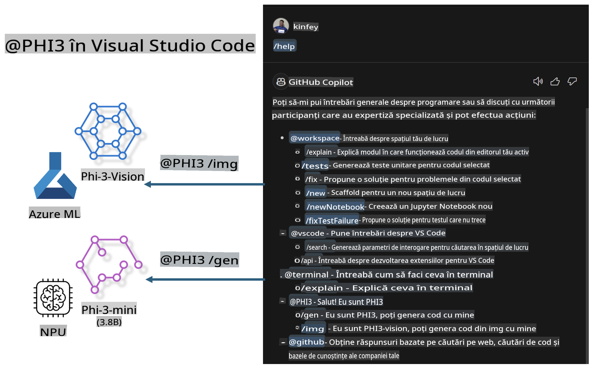

# **Construiește propriul tău GitHub Copilot Chat pentru Visual Studio Code cu Microsoft Phi-3 Family**

Ai folosit agentul workspace în GitHub Copilot Chat? Îți dorești să creezi un agent de cod pentru echipa ta? Acest laborator practic își propune să combine modelul open-source pentru a construi un agent de cod la nivel enterprise.

## **Fundament**

### **De ce să alegi Microsoft Phi-3**

Phi-3 este o serie de modele, incluzând phi-3-mini, phi-3-small și phi-3-medium, bazate pe parametri diferiți pentru generarea de text, completarea dialogurilor și generarea de cod. Există și phi-3-vision, bazat pe Vision. Este potrivit pentru companii sau echipe diferite care doresc să creeze soluții AI generative offline.

Recomandăm să citești acest link [https://github.com/microsoft/PhiCookBook/blob/main/md/01.Introduction/01/01.PhiFamily.md](https://github.com/microsoft/PhiCookBook/blob/main/md/01.Introduction/01/01.PhiFamily.md)

### **Microsoft GitHub Copilot Chat**

Extensia GitHub Copilot Chat îți oferă o interfață de chat care îți permite să interacționezi cu GitHub Copilot și să primești răspunsuri la întrebări legate de cod direct în VS Code, fără a fi nevoie să consulți documentația sau să cauți pe forumuri online.

Copilot Chat poate folosi evidențierea sintaxei, indentarea și alte funcții de formatare pentru a adăuga claritate răspunsurilor generate. În funcție de tipul întrebării utilizatorului, rezultatul poate conține linkuri către contextul folosit de Copilot pentru a genera un răspuns, cum ar fi fișierele sursă sau documentația, sau butoane pentru accesarea funcționalităților din VS Code.

- Copilot Chat se integrează în fluxul de lucru al dezvoltatorului și îți oferă asistență acolo unde ai nevoie:

- Începe o conversație de chat direct din editor sau terminal pentru ajutor în timp ce codezi

- Folosește vizualizarea Chat pentru a avea un asistent AI mereu la îndemână

- Lansează Quick Chat pentru a pune o întrebare rapidă și a reveni la ceea ce făceai

Poți folosi GitHub Copilot Chat în diverse scenarii, precum:

- Răspunsuri la întrebări despre cum să rezolvi cel mai bine o problemă

- Explicarea codului altcuiva și sugestii de îmbunătățire

- Propuneri de corectare a codului

- Generarea de teste unitare

- Crearea documentației pentru cod

Recomandăm să citești acest link [https://code.visualstudio.com/docs/copilot/copilot-chat](https://code.visualstudio.com/docs/copilot/copilot-chat?WT.mc_id=aiml-137032-kinfeylo)

###  **Microsoft GitHub Copilot Chat @workspace**

Referința **@workspace** în Copilot Chat îți permite să pui întrebări despre întregul tău cod. În funcție de întrebare, Copilot recuperează inteligent fișiere și simboluri relevante, pe care le folosește în răspunsurile sale sub formă de linkuri și exemple de cod.

Pentru a răspunde la întrebarea ta, **@workspace** caută prin aceleași surse pe care le-ar folosi un dezvoltator navigând într-un cod în VS Code:

- Toate fișierele din workspace, cu excepția celor ignorate de un fișier .gitignore

- Structura directoarelor cu foldere și fișiere imbricate

- Indexul de căutare al codului GitHub, dacă workspace-ul este un depozit GitHub indexat

- Simboluri și definiții din workspace

- Textul selectat în prezent sau textul vizibil în editorul activ

Notă: Fișierele ignorate de .gitignore sunt accesibile dacă ai un fișier deschis sau ai text selectat în interiorul unui fișier ignorat.

Recomandăm să citești acest link [https://code.visualstudio.com/docs/copilot/workspace-context](https://code.visualstudio.com/docs/copilot/workspace-context?WT.mc_id=aiml-137032-kinfeylo)

## **Mai multe despre acest laborator**

GitHub Copilot a îmbunătățit semnificativ eficiența programării în companii, iar fiecare companie își dorește să personalizeze funcțiile relevante ale GitHub Copilot. Multe companii au creat extensii similare GitHub Copilot, adaptate scenariilor lor de afaceri și modelelor open-source. Pentru companii, extensiile personalizate sunt mai ușor de controlat, dar acest lucru poate afecta experiența utilizatorului. Totuși, GitHub Copilot are funcții mai puternice în gestionarea scenariilor generale și a profesionalismului. Dacă experiența poate rămâne consistentă, ar fi mai bine să se personalizeze propria extensie a companiei. GitHub Copilot Chat oferă API-uri relevante pentru extinderea experienței Chat. Menținerea unei experiențe consistente și adăugarea de funcții personalizate oferă o experiență mai bună utilizatorilor.

Acest laborator utilizează în principal modelul Phi-3 combinat cu NPU local și Azure hybrid pentru a construi un agent personalizat în GitHub Copilot Chat ***@PHI3*** care să asiste dezvoltatorii în generarea de cod ***(@PHI3 /gen)*** și în generarea de cod bazat pe imagini ***(@PHI3 /img)***.

### ***Notă:*** 

Acest laborator este implementat în prezent pe AIPC pentru CPU Intel și Apple Silicon. Vom continua să actualizăm versiunea pentru NPU Qualcomm.

## **Laborator**

| Nume | Descriere | AIPC | Apple |
| ------------ | ----------- | -------- |-------- |
| Lab0 - Instalări(✅) | Configurarea și instalarea mediilor și instrumentelor necesare | [Go](./HOL/AIPC/01.Installations.md) |[Go](./HOL/Apple/01.Installations.md) |
| Lab1 - Rularea Prompt flow cu Phi-3-mini (✅) | Combinat cu AIPC / Apple Silicon, utilizând NPU local pentru a crea generare de cod prin Phi-3-mini | [Go](./HOL/AIPC/02.PromptflowWithNPU.md) |  [Go](./HOL/Apple/02.PromptflowWithMLX.md) |
| Lab2 - Implementarea Phi-3-vision pe Azure Machine Learning Service(✅) | Generare de cod prin implementarea Phi-3-vision din Model Catalog al Azure Machine Learning Service | [Go](./HOL/AIPC/03.DeployPhi3VisionOnAzure.md) |[Go](./HOL/Apple/03.DeployPhi3VisionOnAzure.md) |
| Lab3 - Crearea unui agent @phi-3 în GitHub Copilot Chat(✅)  | Crearea unui agent personalizat Phi-3 în GitHub Copilot Chat pentru generare de cod, generare de cod din imagini, RAG etc. | [Go](./HOL/AIPC/04.CreatePhi3AgentInVSCode.md) | [Go](./HOL/Apple/04.CreatePhi3AgentInVSCode.md) |
| Cod Exemplu (✅)  | Descărcare cod exemplu | [Go](../../../../../../../code/07.Lab/01/AIPC) | [Go](../../../../../../../code/07.Lab/01/Apple) |

## **Resurse**

1. Phi-3 Cookbook [https://github.com/microsoft/Phi-3CookBook](https://github.com/microsoft/Phi-3CookBook)

2. Află mai multe despre GitHub Copilot [https://learn.microsoft.com/training/paths/copilot/](https://learn.microsoft.com/training/paths/copilot/?WT.mc_id=aiml-137032-kinfeylo)

3. Află mai multe despre GitHub Copilot Chat [https://learn.microsoft.com/training/paths/accelerate-app-development-using-github-copilot/](https://learn.microsoft.com/training/paths/accelerate-app-development-using-github-copilot/?WT.mc_id=aiml-137032-kinfeylo)

4. Află mai multe despre API-ul GitHub Copilot Chat [https://code.visualstudio.com/api/extension-guides/chat](https://code.visualstudio.com/api/extension-guides/chat?WT.mc_id=aiml-137032-kinfeylo)

5. Află mai multe despre Azure AI Foundry [https://learn.microsoft.com/training/paths/create-custom-copilots-ai-studio/](https://learn.microsoft.com/training/paths/create-custom-copilots-ai-studio/?WT.mc_id=aiml-137032-kinfeylo)

6. Află mai multe despre Model Catalog din Azure AI Foundry [https://learn.microsoft.com/azure/ai-studio/how-to/model-catalog-overview](https://learn.microsoft.com/azure/ai-studio/how-to/model-catalog-overview)

**Declinarea responsabilității**:  
Acest document a fost tradus folosind servicii de traducere automate bazate pe inteligență artificială. Deși ne străduim să asigurăm acuratețea, vă rugăm să rețineți că traducerile automate pot conține erori sau inexactități. Documentul original, în limba sa de bază, ar trebui considerat sursa autoritară. Pentru informații critice, se recomandă traducerea profesională realizată de un specialist. Nu ne asumăm răspunderea pentru neînțelegerile sau interpretările greșite care pot apărea din utilizarea acestei traduceri.