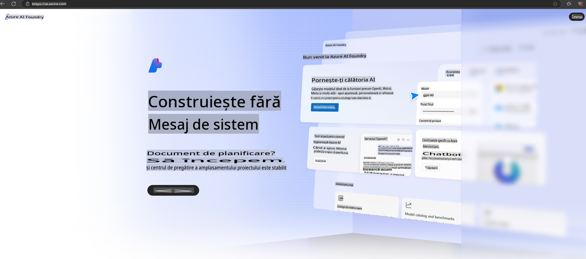

# **Utilizarea Phi-3 în Azure AI Foundry**

Odată cu dezvoltarea AI generativă, ne dorim să utilizăm o platformă unificată pentru a gestiona diferite modele LLM și SLM, integrarea datelor din întreprinderi, operațiunile de ajustare fină/RAG și evaluarea diferitelor procese de afaceri după integrarea LLM și SLM, astfel încât aplicațiile inteligente bazate pe AI generativă să fie implementate mai eficient. [Azure AI Foundry](https://ai.azure.com) este o platformă de aplicații AI generativă la nivel de întreprindere.

Cu Azure AI Foundry, poți evalua răspunsurile modelelor mari de limbaj (LLM) și orchestra componentele aplicațiilor bazate pe prompturi utilizând prompt flow pentru performanțe mai bune. Platforma facilitează scalabilitatea, transformând rapid conceptele inițiale în producție complet funcțională. Monitorizarea continuă și rafinarea sprijină succesul pe termen lung.

Putem implementa rapid modelul Phi-3 pe Azure AI Foundry prin pași simpli, apoi putem utiliza Azure AI Foundry pentru a efectua activități legate de Phi-3, precum Playground/Chat, ajustare fină, evaluare și altele.

## **1. Pregătire**

Dacă ai deja instalat [Azure Developer CLI](https://learn.microsoft.com/azure/developer/azure-developer-cli/overview?WT.mc_id=aiml-138114-kinfeylo) pe mașina ta, utilizarea acestui șablon este la fel de simplă ca rularea acestei comenzi într-un director nou.

## Creare Manuală

Crearea unui proiect și a unui hub Microsoft Azure AI Foundry este o modalitate excelentă de a organiza și gestiona activitățile tale AI. Iată un ghid pas cu pas pentru a începe:

### Crearea unui Proiect în Azure AI Foundry

1. **Accesează Azure AI Foundry**: Conectează-te la portalul Azure AI Foundry.
2. **Creează un Proiect**:
   - Dacă te afli într-un proiect, selectează "Azure AI Foundry" din colțul stânga sus al paginii pentru a accesa pagina principală.
   - Selectează "+ Create project".
   - Introdu un nume pentru proiect.
   - Dacă ai un hub, acesta va fi selectat implicit. Dacă ai acces la mai multe hub-uri, poți selecta unul diferit din meniul dropdown. Dacă dorești să creezi un hub nou, selectează "Create new hub" și introdu un nume.
   - Selectează "Create".

### Crearea unui Hub în Azure AI Foundry

1. **Accesează Azure AI Foundry**: Conectează-te cu contul tău Azure.
2. **Creează un Hub**:
   - Selectează Centrul de management din meniul din stânga.
   - Selectează "All resources", apoi săgeata în jos de lângă "+ New project" și selectează "+ New hub".
   - În dialogul "Create a new hub", introdu un nume pentru hub-ul tău (de exemplu, contoso-hub) și modifică celelalte câmpuri după cum dorești.
   - Selectează "Next", revizuiește informațiile și apoi selectează "Create".

Pentru instrucțiuni mai detaliate, poți consulta [documentația oficială Microsoft](https://learn.microsoft.com/azure/ai-studio/how-to/create-projects).

După crearea cu succes, poți accesa studioul creat prin [ai.azure.com](https://ai.azure.com/)

Pe un singur AI Foundry pot exista mai multe proiecte. Creează un proiect în AI Foundry pentru a te pregăti.

Creează Azure AI Foundry [QuickStarts](https://learn.microsoft.com/azure/ai-studio/quickstarts/get-started-code)

## **2. Implementarea unui model Phi în Azure AI Foundry**

Apasă pe opțiunea Explore a proiectului pentru a accesa Catalogul de Modele și selectează Phi-3.

Selectează Phi-3-mini-4k-instruct.

Apasă 'Deploy' pentru a implementa modelul Phi-3-mini-4k-instruct.

> [!NOTE]
>
> Poți selecta puterea de calcul în timpul implementării.

## **3. Chat în Playground cu Phi în Azure AI Foundry**

Accesează pagina de implementare, selectează Playground și discută cu Phi-3 din Azure AI Foundry.

## **4. Implementarea Modelului din Azure AI Foundry**

Pentru a implementa un model din Catalogul de Modele Azure, urmează acești pași:

- Conectează-te la Azure AI Foundry.
- Alege modelul pe care dorești să-l implementezi din catalogul de modele Azure AI Foundry.
- Pe pagina Detalii a modelului, selectează Deploy și apoi selectează Serverless API cu Azure AI Content Safety.
- Selectează proiectul în care dorești să implementezi modelele tale. Pentru a utiliza oferta Serverless API, spațiul de lucru trebuie să aparțină regiunii East US 2 sau Sweden Central. Poți personaliza numele implementării.
- În asistentul de implementare, selectează Pricing and terms pentru a afla despre prețuri și termenii de utilizare.
- Selectează Deploy. Așteaptă până când implementarea este gata și ești redirecționat la pagina Deployments.
- Selectează Open in playground pentru a începe să interacționezi cu modelul.
- Poți reveni la pagina Deployments, selecta implementarea și nota URL-ul țintă al endpoint-ului și Cheia Secretă, pe care le poți utiliza pentru a apela implementarea și a genera completări.
- Poți găsi întotdeauna detaliile endpoint-ului, URL-ul și cheile de acces navigând la fila Build și selectând Deployments din secțiunea Components.

> [!NOTE]
> Reține că contul tău trebuie să aibă permisiuni de rol Azure AI Developer pe Grupul de Resurse pentru a efectua acești pași.

## **5. Utilizarea API-ului Phi în Azure AI Foundry**

Poți accesa https://{Your project name}.region.inference.ml.azure.com/swagger.json printr-un GET în Postman și combina cu Key pentru a afla despre interfețele disponibile.

Poți obține foarte ușor parametrii cererii, precum și parametrii răspunsului.

**Declinări de responsabilitate**:  
Acest document a fost tradus folosind servicii de traducere bazate pe inteligență artificială. Deși ne străduim să asigurăm acuratețea, vă rugăm să rețineți că traducerile automate pot conține erori sau inexactități. Documentul original, în limba sa maternă, ar trebui considerat sursa autoritară. Pentru informații critice, se recomandă o traducere umană realizată de un profesionist. Nu ne asumăm răspunderea pentru eventualele neînțelegeri sau interpretări greșite care pot apărea din utilizarea acestei traduceri.